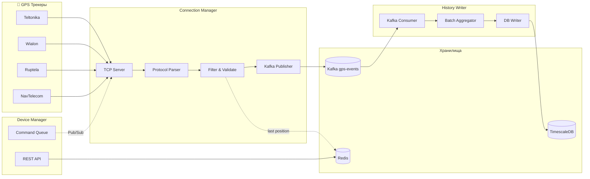
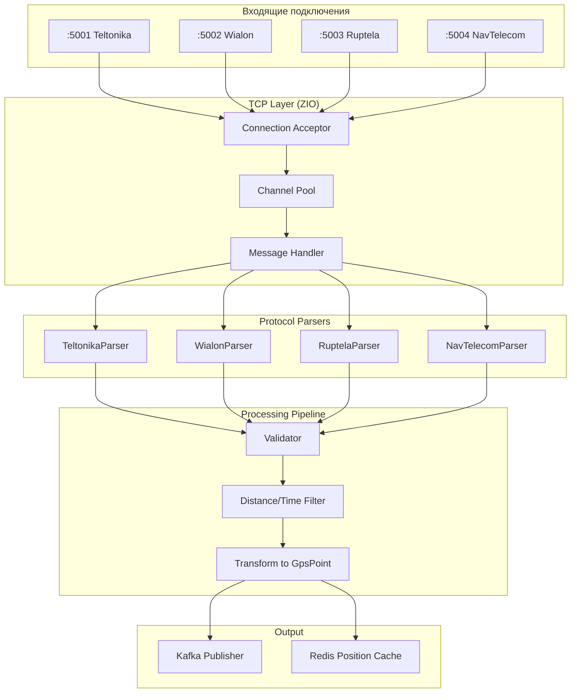
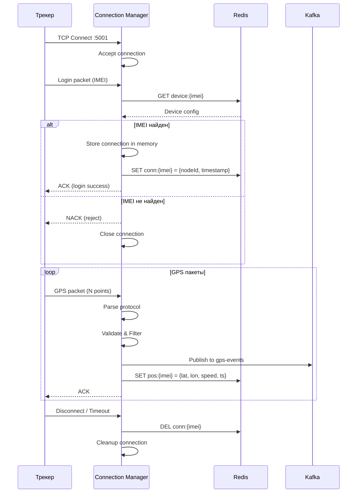
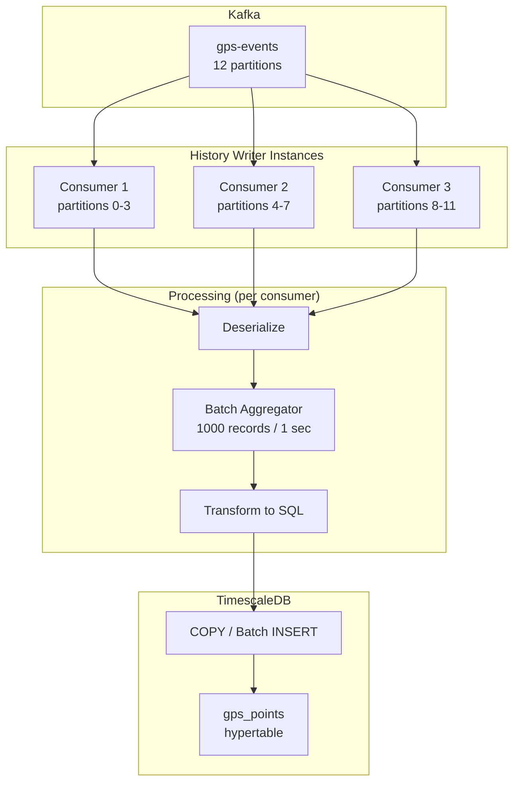
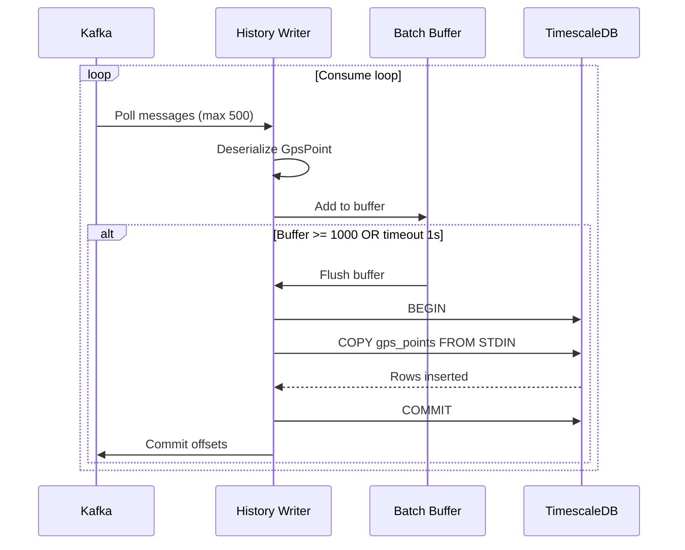
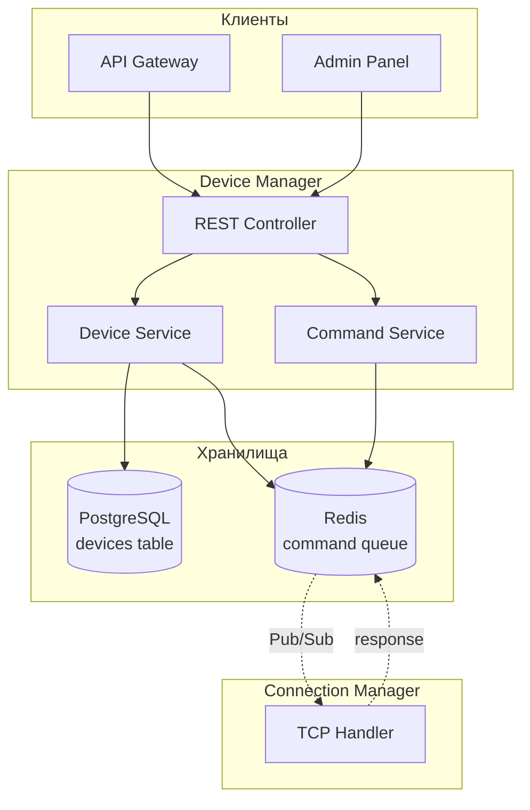
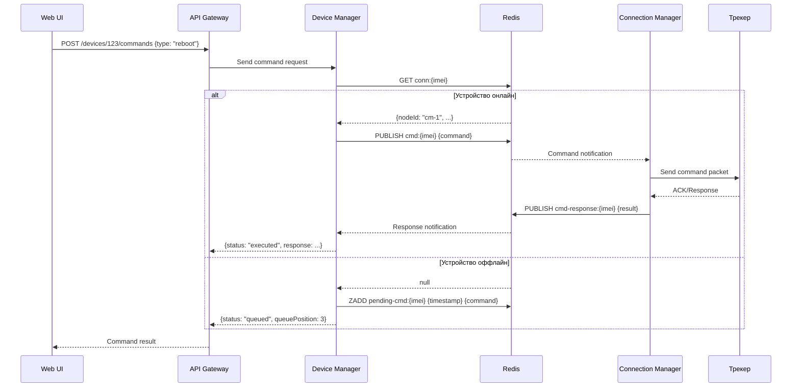
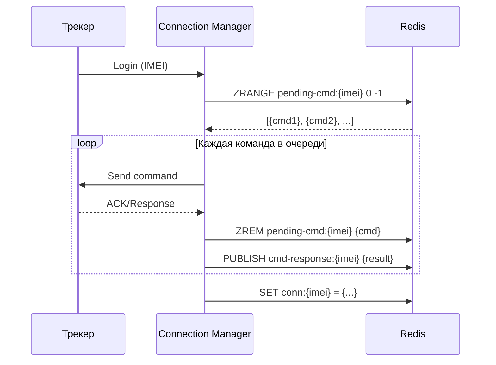
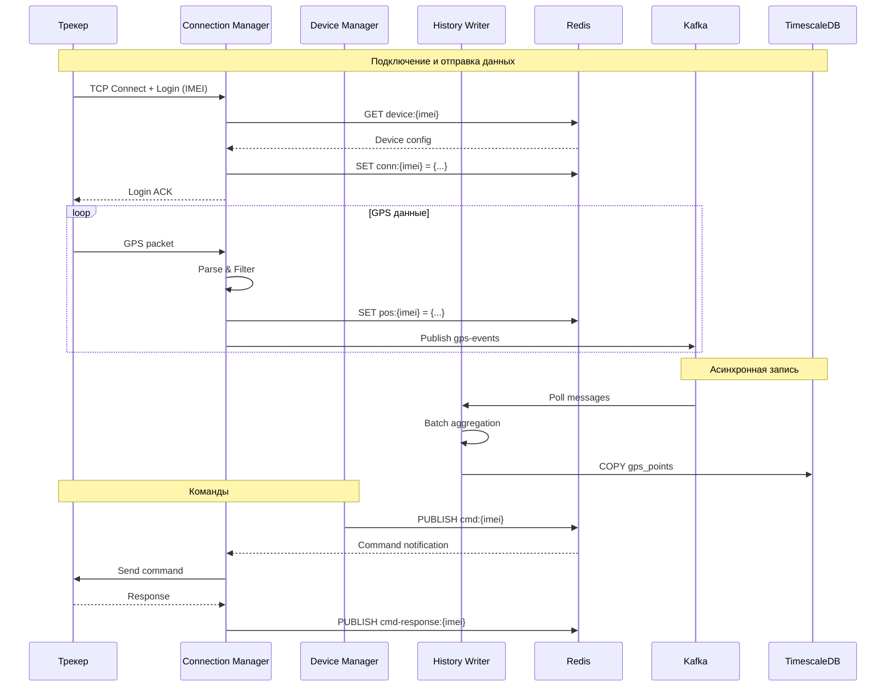

# 🔌 Block 1: Сбор и обработка данных

> **Ответственность:** Приём GPS данных, парсинг, фильтрация, запись в хранилище  
> **Сервисы:** Connection Manager, History Writer, Device Manager

---

## 📋 Обзор блока

```
┌─────────────────────────────────────────────────────────────────────────────┐
│                         BLOCK 1: DATA COLLECTION                            │
├─────────────────────────────────────────────────────────────────────────────┤
│                                                                             │
│  ┌───────────────┐        ┌───────────────┐        ┌───────────────┐       │
│  │     GPS       │  TCP   │  Connection   │ Kafka  │   History     │       │
│  │   Трекеры     │───────▶│   Manager     │───────▶│   Writer      │       │
│  │               │        │               │        │               │       │
│  └───────────────┘        └───────┬───────┘        └───────┬───────┘       │
│                                   │                        │               │
│                                   │ Redis                  │ Batch         │
│                                   ▼                        ▼               │
│                           ┌───────────────┐        ┌───────────────┐       │
│                           │     Redis     │        │  TimescaleDB  │       │
│                           │  • positions  │        │  • gps_points │       │
│                           │  • connections│        │               │       │
│                           └───────────────┘        └───────────────┘       │
│                                   ▲                                        │
│                                   │ CRUD, Commands                         │
│                           ┌───────┴───────┐                                │
│                           │    Device     │                                │
│                           │   Manager     │                                │
│                           │               │                                │
│                           └───────────────┘                                │
│                                                                             │
└─────────────────────────────────────────────────────────────────────────────┘
```

---

## 🔄 Потоки данных Block 1



---

## 🖥️ Connection Manager

### Обзор

**Ответственность:** Приём TCP подключений, парсинг протоколов, фильтрация, публикация в Kafka

**Порты:**
| Порт | Протокол |
|------|----------|
| 5001 | Teltonika FM |
| 5002 | Wialon IPS/NIS |
| 5003 | Ruptela |
| 5004 | NavTelecom |

### Архитектура сервиса



### Ключевые компоненты

#### 1. TCP Server (ZIO)

```scala
// Упрощённая структура
trait ConnectionManager:
  def start: Task[Unit]
  def shutdown: Task[Unit]
  def metrics: Task[ConnectionMetrics]

case class ConnectionMetrics(
  activeConnections: Map[Protocol, Int],
  totalReceived: Long,
  totalErrors: Long
)
```

#### 2. Protocol Parser (Trait)

```scala
trait ProtocolParser[F[_]]:
  def parse(bytes: Chunk[Byte]): F[ParseResult]
  def buildAck(result: ParseResult): Chunk[Byte]
  def protocolName: String

sealed trait ParseResult
case class GpsPacket(
  imei: String,
  points: List[RawGpsPoint],
  ioData: Map[Int, Long]
) extends ParseResult
case class LoginRequest(imei: String) extends ParseResult
case class ParseError(reason: String) extends ParseResult
```

#### 3. Filter (Фильтрация точек)

```scala
// Правила фильтрации
case class FilterConfig(
  minDistanceMeters: Double = 5.0,    // игнорировать если < 5м
  minTimeSecs: Int = 5,               // игнорировать если < 5 сек
  maxSpeed: Double = 300.0,           // отбросить если > 300 км/ч (GPS глюк)
  invalidCoords: Boolean = true       // отбросить 0,0 координаты
)
```

### Sequence Diagram: Подключение трекера



### Redis структуры

```
# Последняя позиция устройства (для фильтрации и API)
pos:{imei}
  lat: 55.7558
  lon: 37.6173
  speed: 45.5
  course: 180
  timestamp: 1706270400
  TTL: 86400 (1 день)

# Активное подключение
conn:{imei}
  nodeId: "cm-node-1"
  connectedAt: 1706270000
  protocol: "teltonika"
  TTL: 300 (5 минут, обновляется)

# IMEI whitelist (для быстрой проверки)
imei:valid:{imei}
  deviceId: 123
  orgId: 456
  TTL: 3600 (1 час, обновляется Device Manager)
```

### Prometheus метрики

```
# Активные подключения по протоколам
gps_connections_active{protocol="teltonika"} 3500
gps_connections_active{protocol="wialon"} 2100

# Полученные пакеты
gps_packets_received_total{protocol="teltonika", status="success"} 1000000
gps_packets_received_total{protocol="teltonika", status="parse_error"} 150
gps_packets_received_total{protocol="teltonika", status="filtered"} 25000

# Latency
gps_parse_duration_ms{protocol="teltonika", quantile="0.5"} 0.8
gps_parse_duration_ms{protocol="teltonika", quantile="0.99"} 5.2

# Kafka publish
kafka_publish_duration_ms{topic="gps-events", quantile="0.5"} 1.2
kafka_publish_duration_ms{topic="gps-events", quantile="0.99"} 8.5
```

---

## 📝 History Writer

### Обзор

**Ответственность:** Consume из Kafka, батчирование, запись в TimescaleDB

**Особенности:**
- Kafka Consumer Group (масштабируется по партициям)
- Batch insert (1000 записей или 1 секунда)
- Idempotent writes (по IMEI + timestamp)

### Архитектура сервиса



### Sequence Diagram: Запись батча



### Ключевые компоненты

#### 1. Batch Aggregator

```scala
trait BatchAggregator[A]:
  def add(item: A): Task[Option[Chunk[A]]]  // возвращает batch если готов
  def flush: Task[Chunk[A]]                  // принудительный flush
  
case class BatchConfig(
  maxSize: Int = 1000,
  maxWait: Duration = 1.second
)
```

#### 2. DB Writer

```scala
trait GpsPointWriter:
  def writeBatch(points: Chunk[GpsPoint]): Task[Int]  // returns rows written

// Использует COPY для максимальной производительности
// INSERT ... ON CONFLICT DO NOTHING для idempotency
```

### TimescaleDB схема

```sql
-- Hypertable для GPS точек
CREATE TABLE gps_points (
    id BIGSERIAL,
    device_id INTEGER NOT NULL,
    imei VARCHAR(20) NOT NULL,
    timestamp TIMESTAMPTZ NOT NULL,
    lat DOUBLE PRECISION NOT NULL,
    lon DOUBLE PRECISION NOT NULL,
    altitude SMALLINT,
    speed SMALLINT,            -- км/ч * 10 (для экономии места)
    course SMALLINT,           -- градусы
    satellites SMALLINT,
    hdop SMALLINT,             -- * 10
    valid BOOLEAN DEFAULT true,
    io_data JSONB,             -- дополнительные датчики
    created_at TIMESTAMPTZ DEFAULT NOW(),
    
    PRIMARY KEY (timestamp, device_id)
);

-- Превращаем в hypertable (партиции по времени)
SELECT create_hypertable('gps_points', 'timestamp',
    chunk_time_interval => INTERVAL '1 day'
);

-- Индексы
CREATE INDEX idx_gps_points_device_time 
    ON gps_points (device_id, timestamp DESC);
    
CREATE INDEX idx_gps_points_imei 
    ON gps_points (imei, timestamp DESC);

-- Сжатие для старых данных
ALTER TABLE gps_points SET (
    timescaledb.compress,
    timescaledb.compress_segmentby = 'device_id',
    timescaledb.compress_orderby = 'timestamp DESC'
);

-- Политика сжатия (данные старше 7 дней)
SELECT add_compression_policy('gps_points', INTERVAL '7 days');

-- Политика удаления (данные старше 90 дней)
SELECT add_retention_policy('gps_points', INTERVAL '90 days');
```

### Prometheus метрики

```
# Batch размеры
history_writer_batch_size{quantile="0.5"} 850
history_writer_batch_size{quantile="0.99"} 1000

# Latency записи
history_writer_write_duration_ms{quantile="0.5"} 45
history_writer_write_duration_ms{quantile="0.99"} 150

# Throughput
history_writer_points_written_total 50000000
history_writer_batches_written_total 52000

# Consumer lag
kafka_consumer_lag{topic="gps-events", partition="0"} 150
```

---

## 📱 Device Manager

### Обзор

**Ответственность:** CRUD устройств, отправка команд, синхронизация конфигураций

**Функции:**
- Управление устройствами (CRUD)
- Отправка команд на трекеры
- Очередь команд для offline устройств
- Синхронизация конфигов в Redis

### Архитектура сервиса



### Sequence Diagram: Отправка команды



### Sequence Diagram: Обработка очереди при подключении



### PostgreSQL схема

```sql
-- Устройства
CREATE TABLE devices (
    id SERIAL PRIMARY KEY,
    imei VARCHAR(20) UNIQUE NOT NULL,
    name VARCHAR(100),
    organization_id INTEGER REFERENCES organizations(id),
    device_type_id INTEGER REFERENCES device_types(id),
    protocol VARCHAR(20) NOT NULL,
    phone VARCHAR(20),
    vin VARCHAR(20),
    plate_number VARCHAR(20),
    icon VARCHAR(50) DEFAULT 'car',
    created_at TIMESTAMPTZ DEFAULT NOW(),
    updated_at TIMESTAMPTZ DEFAULT NOW(),
    deleted_at TIMESTAMPTZ           -- soft delete
);

-- Типы устройств (модели трекеров)
CREATE TABLE device_types (
    id SERIAL PRIMARY KEY,
    name VARCHAR(50) NOT NULL,       -- "Teltonika FMB920"
    protocol VARCHAR(20) NOT NULL,   -- "teltonika"
    commands JSONB,                  -- supported commands
    io_elements JSONB                -- IO element mapping
);

-- Журнал команд
CREATE TABLE command_log (
    id BIGSERIAL PRIMARY KEY,
    device_id INTEGER REFERENCES devices(id),
    command_type VARCHAR(50) NOT NULL,
    payload JSONB,
    status VARCHAR(20) NOT NULL,     -- pending, sent, executed, failed, timeout
    response JSONB,
    created_at TIMESTAMPTZ DEFAULT NOW(),
    sent_at TIMESTAMPTZ,
    completed_at TIMESTAMPTZ,
    created_by INTEGER REFERENCES users(id)
);

CREATE INDEX idx_command_log_device ON command_log (device_id, created_at DESC);
CREATE INDEX idx_command_log_status ON command_log (status) WHERE status IN ('pending', 'sent');
```

### Redis структуры

```
# Очередь команд для offline устройств (ZSET по timestamp)
pending-cmd:{imei}
  score: timestamp
  member: {"id": 123, "type": "reboot", "payload": {...}}

# Pub/Sub каналы
cmd:{imei}           # команды к устройству
cmd-response:{imei}  # ответы от устройства

# Кеш конфигурации устройства
device:{imei}
  id: 123
  protocol: "teltonika"
  orgId: 456
  config: {...}
  TTL: 3600
```

### REST API

```yaml
# Device CRUD
GET    /api/v1/devices              # список устройств
GET    /api/v1/devices/{id}         # одно устройство
POST   /api/v1/devices              # создать
PUT    /api/v1/devices/{id}         # обновить
DELETE /api/v1/devices/{id}         # удалить (soft)

# Device position
GET    /api/v1/devices/{id}/position      # последняя позиция
GET    /api/v1/devices/{id}/track         # трек за период

# Commands
POST   /api/v1/devices/{id}/commands      # отправить команду
GET    /api/v1/devices/{id}/commands      # история команд
GET    /api/v1/commands/{id}              # статус команды

# Bulk operations
POST   /api/v1/devices/import             # массовый импорт
POST   /api/v1/devices/export             # экспорт в CSV
```

### Prometheus метрики

```
# Device operations
device_manager_operations_total{operation="create"} 150
device_manager_operations_total{operation="update"} 2400
device_manager_operations_total{operation="delete"} 45

# Commands
device_manager_commands_sent_total{type="reboot", status="success"} 1200
device_manager_commands_sent_total{type="reboot", status="queued"} 350
device_manager_commands_sent_total{type="reboot", status="timeout"} 23

# Pending queue
device_manager_pending_commands_total 156

# Cache
device_manager_cache_hits_total 450000
device_manager_cache_misses_total 1200
```

---

## 🔗 Взаимодействие сервисов Block 1



---

## 📊 Сводная таблица Block 1

| Параметр | Connection Manager | History Writer | Device Manager |
|----------|-------------------|----------------|----------------|
| **Тип** | TCP Server | Kafka Consumer | REST API |
| **Масштабирование** | Горизонтальное | Kafka partitions | Горизонтальное |
| **State** | Redis | Stateless | PostgreSQL |
| **Порты** | 5001-5004 | - | 8082 (internal) |
| **Критичность** | Высокая | Высокая | Средняя |
| **Latency target** | < 50ms | < 200ms | < 100ms |

---

## 🚀 Развёртывание

### Docker Compose (dev)

```yaml
services:
  connection-manager:
    build: ./services/connection-manager
    ports:
      - "5001:5001"
      - "5002:5002"
      - "5003:5003"
      - "5004:5004"
    environment:
      - KAFKA_BROKERS=kafka:9092
      - REDIS_URL=redis://redis:6379
    depends_on:
      - kafka
      - redis

  history-writer:
    build: ./services/history-writer
    environment:
      - KAFKA_BROKERS=kafka:9092
      - DATABASE_URL=postgresql://postgres:5432/tracker
    depends_on:
      - kafka
      - timescaledb

  device-manager:
    build: ./services/device-manager
    ports:
      - "8082:8082"
    environment:
      - DATABASE_URL=postgresql://postgres:5432/tracker
      - REDIS_URL=redis://redis:6379
    depends_on:
      - postgres
      - redis
```

---

**Дата:** 26 января 2026  
**Статус:** Block 1 документация готова ✅

**Следующий шаг:** [ARCHITECTURE_BLOCK2.md](./ARCHITECTURE_BLOCK2.md) — Бизнес-логика
