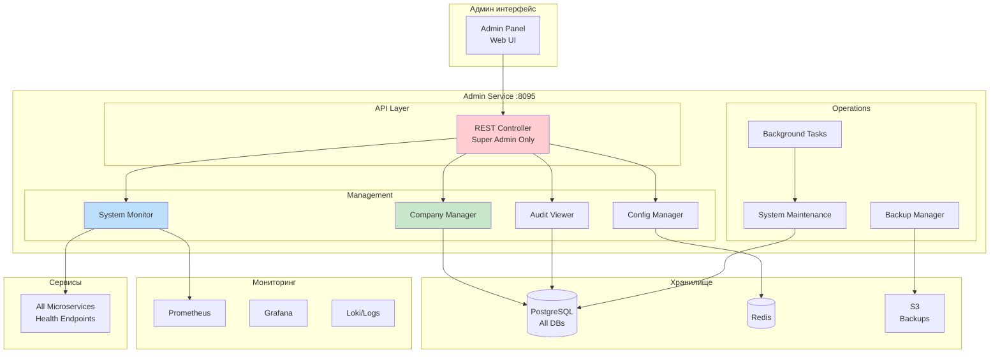

# Admin Service (Сервис администрирования)

> Блок 3 | Презентация | Приоритет: PostMVP

## Обзор

Сервис системного администрирования для суперадминов. Управление компаниями, мониторинг системы, конфигурация, аудит.

## Характеристики

| Параметр | Значение |
|----------|----------|
| Порт | 8095 |
| Язык | Scala 3 + ZIO |
| База данных | PostgreSQL |
| Доступ | Только super_admin |
| API | REST |

---

## 1. Архитектура

### 1.1 Mermaid Диаграмма - Общая архитектура



### 1.2 UML Sequence - System Health Check

```
┌──────────┐  ┌──────────┐  ┌────────────┐  ┌───────────┐  ┌───────────┐
│  Admin   │  │  System  │  │  Services  │  │ Prometheus│  │PostgreSQL │
│   API    │  │ Monitor  │  │  (health)  │  │           │  │           │
└────┬─────┘  └────┬─────┘  └─────┬──────┘  └─────┬─────┘  └─────┬─────┘
     │             │              │               │               │
     │ GET /system/health         │               │               │
     │────────────>│              │               │               │
     │             │              │               │               │
     │             │ parallel health checks       │               │
     │             ├──────────────────────────────────────────────┤
     │             │              │               │               │
     │             │ GET /health (all services)   │               │
     │             │─────────────>│               │               │
     │             │              │               │               │
     │             │ query(up, rate, etc.)        │               │
     │             │──────────────────────────────>│               │
     │             │              │               │               │
     │             │ SELECT pg_stat_*             │               │
     │             │────────────────────────────────────────────>│
     │             │              │               │               │
     │             │ services status              │               │
     │             │<─────────────│               │               │
     │             │              │               │               │
     │             │              │ metrics       │               │
     │             │<──────────────────────────────│               │
     │             │              │               │               │
     │             │              │    db status  │               │
     │             │<────────────────────────────────────────────│
     │             ├──────────────────────────────────────────────┤
     │             │              │               │               │
     │             │ aggregateHealth()            │               │
     │             │──────┐      │               │               │
     │             │      │      │               │               │
     │             │<─────┘      │               │               │
     │             │              │               │               │
     │ SystemHealth│              │               │               │
     │<────────────│              │               │               │
     │             │              │               │               │
```

---

## 2. Модели данных

### 2.1 Scala модели

```scala
package tracker.admin.domain

import java.time.Instant
import java.util.UUID

// ============================================
// Управление компаниями
// ============================================

/** Краткая информация о компании (для списка) */
final case class CompanySummary(
  id: UUID,
  name: String,
  usersCount: Int,
  vehiclesCount: Int,
  subscriptionPlan: String,
  subscriptionExpires: Option[Instant],
  isActive: Boolean,
  createdAt: Instant,
  lastActivity: Option[Instant]
)

/** Детальная информация о компании */
final case class CompanyDetails(
  company: Company,
  users: List[UserSummary],
  vehicles: List[VehicleSummary],
  subscription: SubscriptionDetails,
  usage: UsageStats,
  billingHistory: List[BillingEntry]
)

/** Статистика использования */
final case class UsageStats(
  vehiclesCount: Int,
  usersCount: Int,
  gpsPointsThisMonth: Long,
  storageUsedMb: Long,
  apiCallsThisMonth: Long,
  lastDataReceived: Option[Instant]
)

/** Создание компании суперадмином */
final case class CreateCompanyAdmin(
  name: String,
  inn: Option[String],
  address: Option[String],
  phone: Option[String],
  email: Option[String],
  timezone: String,
  subscriptionPlan: String,
  maxVehicles: Int,
  maxUsers: Int,
  subscriptionExpires: Option[Instant],
  ownerEmail: String,
  ownerFirstName: String,
  ownerLastName: String
)

// ============================================
// Мониторинг системы
// ============================================

/** Общее здоровье системы */
final case class SystemHealth(
  status: HealthStatus,
  services: List[ServiceHealth],
  databases: List[DatabaseHealth],
  messageQueues: List[QueueHealth],
  timestamp: Instant
)

enum HealthStatus:
  case Healthy
  case Degraded
  case Critical

/** Здоровье сервиса */
final case class ServiceHealth(
  name: String,
  status: HealthStatus,
  instances: Int,
  healthyInstances: Int,
  latencyP50: Double,
  latencyP99: Double,
  errorRate: Double,
  lastCheck: Instant
)

/** Здоровье базы данных */
final case class DatabaseHealth(
  name: String,                          // "postgresql", "timescaledb", "redis"
  status: HealthStatus,
  connectionPoolUsed: Int,
  connectionPoolMax: Int,
  replicationLag: Option[Duration],
  diskUsagePercent: Double,
  queryLatencyP99: Double
)

/** Здоровье очереди сообщений */
final case class QueueHealth(
  name: String,                          // "kafka"
  status: HealthStatus,
  brokers: Int,
  healthyBrokers: Int,
  topics: List[TopicHealth]
)

final case class TopicHealth(
  name: String,
  partitions: Int,
  consumerLag: Long,
  messagesPerSecond: Double
)

/** Метрики системы */
final case class SystemMetrics(
  timestamp: Instant,
  totalRequests: Long,
  requestsPerSecond: Double,
  errorRate: Double,
  avgLatencyMs: Double,
  p99LatencyMs: Double,
  activeConnections: Int,
  activeWebSockets: Int,
  kafkaMessagesPerSecond: Double,
  gpsPointsPerSecond: Double
)

// ============================================
// Конфигурация
// ============================================

/** Системная конфигурация */
final case class SystemConfig(
  features: Map[String, FeatureFlag],
  limits: Map[String, Int],
  maintenance: MaintenanceConfig
)

/** Feature flag */
final case class FeatureFlag(
  name: String,
  enabled: Boolean,
  description: String,
  enabledForCompanies: Option[Set[UUID]],
  updatedAt: Instant,
  updatedBy: UUID
)

/** Конфигурация обслуживания */
final case class MaintenanceConfig(
  maintenanceMode: Boolean,
  maintenanceMessage: Option[String],
  scheduledMaintenanceStart: Option[Instant],
  scheduledMaintenanceEnd: Option[Instant],
  allowedIps: List[String]               // IP которым разрешён доступ во время maintenance
)

// ============================================
// Аудит
// ============================================

/** Расширенный аудит для администратора */
final case class AdminAuditEntry(
  id: UUID,
  companyId: Option[UUID],
  companyName: Option[String],
  userId: UUID,
  userEmail: String,
  action: String,
  entityType: String,
  entityId: Option[UUID],
  details: Map[String, String],
  ipAddress: String,
  userAgent: String,
  createdAt: Instant
)

/** Фильтры для аудита */
final case class AuditFilters(
  companyId: Option[UUID],
  userId: Option[UUID],
  action: Option[String],
  entityType: Option[String],
  fromDate: Instant,
  toDate: Instant,
  page: Int,
  pageSize: Int
)

// ============================================
// Фоновые задачи
// ============================================

/** Фоновая задача */
final case class BackgroundTask(
  id: UUID,
  taskType: TaskType,
  status: TaskStatus,
  progress: Int,                         // 0-100
  parameters: Map[String, String],
  result: Option[String],
  error: Option[String],
  startedAt: Instant,
  completedAt: Option[Instant],
  createdBy: UUID
)

enum TaskType:
  case DataExport
  case DataCleanup
  case DatabaseBackup
  case ReindexSearch
  case RecalculateStats
  case BulkOperation

enum TaskStatus:
  case Pending
  case Running
  case Completed
  case Failed
  case Cancelled

// ============================================
// Ошибки
// ============================================

enum AdminError:
  case Forbidden(reason: String)
  case CompanyNotFound(id: UUID)
  case TaskNotFound(id: UUID)
  case InvalidConfiguration(errors: List[String])
  case MaintenanceModeActive
```

---

## 3. REST API

```yaml
# ==========================================
# Управление компаниями
# ==========================================

# Список всех компаний
GET /api/v1/admin/companies
Parameters:
  - page: number (default 1)
  - pageSize: number (default 20)
  - search: string (optional)
  - isActive: boolean (optional)
  - plan: string (optional)
Response: 200 OK
  {
    "total": 150,
    "companies": [CompanySummary]
  }

# Детали компании
GET /api/v1/admin/companies/{companyId}
Response: 200 OK
  CompanyDetails

# Создать компанию
POST /api/v1/admin/companies
Body: CreateCompanyAdmin
Response: 201 Created
  { "companyId": "uuid", "ownerId": "uuid" }

# Обновить компанию
PUT /api/v1/admin/companies/{companyId}
Body: UpdateCompanyAdmin
Response: 200 OK

# Деактивировать компанию
POST /api/v1/admin/companies/{companyId}/deactivate
Body: { "reason": "Non-payment" }
Response: 200 OK

# Активировать компанию
POST /api/v1/admin/companies/{companyId}/activate
Response: 200 OK

# Изменить подписку
PUT /api/v1/admin/companies/{companyId}/subscription
Body: {
  "plan": "pro",
  "maxVehicles": 100,
  "maxUsers": 20,
  "expiresAt": "2026-01-01T00:00:00Z"
}
Response: 200 OK

# ==========================================
# Мониторинг системы
# ==========================================

# Общее здоровье
GET /api/v1/admin/system/health
Response: 200 OK
  SystemHealth

# Метрики в реальном времени
GET /api/v1/admin/system/metrics
Parameters:
  - period: string (1m, 5m, 1h, 24h)
Response: 200 OK
  {
    "current": SystemMetrics,
    "history": [SystemMetrics]
  }

# Статус сервисов
GET /api/v1/admin/system/services
Response: 200 OK
  { "services": [ServiceHealth] }

# Перезапустить сервис (если поддерживается)
POST /api/v1/admin/system/services/{serviceName}/restart
Response: 202 Accepted

# Kafka статус
GET /api/v1/admin/system/kafka
Response: 200 OK
  {
    "brokers": [...],
    "topics": [...],
    "consumerGroups": [...]
  }

# Статус баз данных
GET /api/v1/admin/system/databases
Response: 200 OK
  { "databases": [DatabaseHealth] }

# ==========================================
# Конфигурация
# ==========================================

# Получить конфигурацию
GET /api/v1/admin/config
Response: 200 OK
  SystemConfig

# Обновить feature flag
PUT /api/v1/admin/config/features/{featureName}
Body: {
  "enabled": true,
  "enabledForCompanies": ["uuid1", "uuid2"]
}
Response: 200 OK

# Включить режим обслуживания
POST /api/v1/admin/config/maintenance/enable
Body: {
  "message": "Плановые работы, система будет недоступна",
  "allowedIps": ["192.168.1.0/24"]
}
Response: 200 OK

# Выключить режим обслуживания
POST /api/v1/admin/config/maintenance/disable
Response: 200 OK

# Обновить лимиты
PUT /api/v1/admin/config/limits
Body: {
  "maxConnectionsPerDevice": 10,
  "maxWebSocketsPerUser": 5,
  "defaultRateLimit": 1000
}
Response: 200 OK

# ==========================================
# Аудит
# ==========================================

# Лог аудита (все компании)
GET /api/v1/admin/audit
Parameters: AuditFilters
Response: 200 OK
  {
    "total": 10000,
    "entries": [AdminAuditEntry]
  }

# Экспорт аудита
POST /api/v1/admin/audit/export
Body: AuditFilters
Response: 202 Accepted
  { "taskId": "uuid" }

# ==========================================
# Фоновые задачи
# ==========================================

# Список задач
GET /api/v1/admin/tasks
Parameters:
  - status: string (optional)
  - type: string (optional)
Response: 200 OK
  { "tasks": [BackgroundTask] }

# Статус задачи
GET /api/v1/admin/tasks/{taskId}
Response: 200 OK
  BackgroundTask

# Отменить задачу
POST /api/v1/admin/tasks/{taskId}/cancel
Response: 200 OK

# Запустить очистку данных
POST /api/v1/admin/tasks/cleanup
Body: {
  "type": "expired_sessions",
  "olderThan": "30d"
}
Response: 202 Accepted
  { "taskId": "uuid" }

# Запустить бэкап
POST /api/v1/admin/tasks/backup
Body: {
  "databases": ["users", "devices", "gps"],
  "uploadToS3": true
}
Response: 202 Accepted
  { "taskId": "uuid" }

# Пересчитать статистику
POST /api/v1/admin/tasks/recalculate-stats
Body: {
  "companyIds": ["uuid1", "uuid2"],
  "period": "2025-01"
}
Response: 202 Accepted
  { "taskId": "uuid" }

# ==========================================
# Операции с пользователями (super admin)
# ==========================================

# Найти пользователя по email (глобально)
GET /api/v1/admin/users/search
Parameters:
  - email: string
Response: 200 OK
  {
    "users": [
      {
        "id": "uuid",
        "email": "user@example.com",
        "companyId": "uuid",
        "companyName": "Company Name",
        "roles": ["admin"],
        "isActive": true
      }
    ]
  }

# Сбросить пароль пользователя
POST /api/v1/admin/users/{userId}/reset-password
Response: 200 OK
  { "temporaryPassword": "..." }

# Войти как пользователь (impersonation)
POST /api/v1/admin/users/{userId}/impersonate
Response: 200 OK
  {
    "accessToken": "...",
    "note": "Session logged for audit"
  }

# ==========================================
# Статистика
# ==========================================

# Общая статистика системы
GET /api/v1/admin/stats/overview
Response: 200 OK
  {
    "companies": {
      "total": 150,
      "active": 142,
      "newThisMonth": 8
    },
    "users": {
      "total": 1500,
      "activeToday": 450
    },
    "vehicles": {
      "total": 5000,
      "online": 3200
    },
    "data": {
      "gpsPointsToday": 50000000,
      "storageUsedGb": 450
    }
  }

# Статистика по компаниям
GET /api/v1/admin/stats/companies
Parameters:
  - metric: string (users, vehicles, data, revenue)
  - period: string (day, week, month)
Response: 200 OK
  {
    "data": [
      {
        "companyId": "uuid",
        "companyName": "Company",
        "value": 100
      }
    ]
  }
```

---

## 4. Метрики и мониторинг

```yaml
# Prometheus метрики (собираемые Admin Service)

# Gauge - текущее состояние
admin_companies_total
admin_companies_active
admin_users_total
admin_vehicles_total
admin_vehicles_online
admin_gps_points_today

# Счётчики
admin_api_calls_total{endpoint, status}
admin_background_tasks_total{type, status}

# Гистограммы
admin_api_duration_seconds{endpoint}

# Собственные алерты Admin Service
- alert: CompanySubscriptionExpiring
  expr: admin_company_subscription_days_remaining < 7
  annotations:
    summary: "Подписка компании {{ $labels.company }} истекает через {{ $value }} дней"

- alert: SystemDiskUsageHigh
  expr: admin_storage_used_percent > 85
  annotations:
    summary: "Использование диска превышает 85%"

- alert: ServiceUnhealthy
  expr: admin_service_health == 0
  for: 5m
  annotations:
    summary: "Сервис {{ $labels.service }} недоступен"
```

---

## 5. AI Промпт для реализации сервиса

### Контекст и задача

```markdown
# Задача: Реализовать Admin Service для GPS трекинг системы

## Контекст
Сервис системного администрирования для суперадминов TrackerGPS.
Часть Блока 3 (Презентация). Управление компаниями, мониторинг, конфигурация.

## Технический стек (ОБЯЗАТЕЛЬНО)
- Scala 3.4.0
- ZIO 2.0.20 (эффекты)
- zio-http (REST API)
- Quill (PostgreSQL, read from all DBs)
- zio-redis (feature flags, config)
- zio-json (сериализация)
- sttp (HTTP клиент для health checks)
- zio-config (конфигурация)

## Архитектурные компоненты

### 1. Слой домена (domain/)
```scala
// models.scala - Все case classes из раздела 2.1
// errors.scala - AdminError
```

### 2. Сервисы (service/)
```scala
// CompanyAdminService.scala
trait CompanyAdminService:
  def listCompanies(page: Int, pageSize: Int, filters: CompanyFilters): Task[Page[CompanySummary]]
  def getCompanyDetails(id: UUID): Task[CompanyDetails]
  def createCompany(request: CreateCompanyAdmin): Task[(UUID, UUID)]
  def updateSubscription(companyId: UUID, request: UpdateSubscription): Task[Unit]
  def activateCompany(companyId: UUID): Task[Unit]
  def deactivateCompany(companyId: UUID, reason: String): Task[Unit]

// SystemMonitorService.scala
trait SystemMonitorService:
  def getHealth: Task[SystemHealth]
  def getMetrics(period: Duration): Task[MetricsHistory]
  def getServiceHealth(name: String): Task[ServiceHealth]
  def checkAllServices: Task[List[ServiceHealth]]

// ConfigService.scala
trait ConfigService:
  def getConfig: Task[SystemConfig]
  def updateFeatureFlag(name: String, update: FeatureFlagUpdate): Task[Unit]
  def enableMaintenanceMode(config: MaintenanceConfig): Task[Unit]
  def disableMaintenanceMode: Task[Unit]
  def updateLimits(limits: Map[String, Int]): Task[Unit]

// AuditService.scala
trait AuditService:
  def getAuditLog(filters: AuditFilters): Task[Page[AdminAuditEntry]]
  def exportAudit(filters: AuditFilters): Task[UUID]  // returns taskId

// BackgroundTaskService.scala
trait BackgroundTaskService:
  def listTasks(filters: TaskFilters): Task[List[BackgroundTask]]
  def getTask(id: UUID): Task[BackgroundTask]
  def cancelTask(id: UUID): Task[Unit]
  def scheduleCleanup(params: CleanupParams): Task[UUID]
  def scheduleBackup(params: BackupParams): Task[UUID]
```

### 3. Infrastructure (infra/)
```scala
// HealthChecker.scala - Проверка здоровья сервисов
trait HealthChecker:
  def checkService(url: String): Task[ServiceHealth]
  def checkDatabase(name: String): Task[DatabaseHealth]
  def checkKafka: Task[QueueHealth]

// PrometheusClient.scala - Запросы к Prometheus
trait PrometheusClient:
  def query(promql: String): Task[QueryResult]
  def queryRange(promql: String, start: Instant, end: Instant, step: Duration): Task[RangeResult]

// TaskExecutor.scala - Выполнение фоновых задач
trait TaskExecutor:
  def execute(task: BackgroundTask): Task[Unit]
  def updateProgress(taskId: UUID, progress: Int): Task[Unit]
  def complete(taskId: UUID, result: String): Task[Unit]
  def fail(taskId: UUID, error: String): Task[Unit]
```

### 4. API (api/)
```scala
// AdminRoutes.scala - Все endpoints
// Middleware для проверки super_admin роли
// Аудит всех действий администратора
```

## Требования к реализации

### Функциональные требования
1. CRUD компаний с управлением подпиской
2. Мониторинг всех сервисов системы
3. Управление feature flags
4. Режим обслуживания (maintenance mode)
5. Глобальный аудит
6. Фоновые задачи (backup, cleanup)
7. Impersonation для отладки

### Нефункциональные требования
1. Доступ только для super_admin
2. Все действия логируются в аудит
3. Health checks каждые 10 секунд
4. Graceful degradation (показывать что доступно)

### Критерии приёмки
1. Только super_admin может вызывать API
2. Health endpoint показывает статус всех сервисов
3. Feature flags применяются немедленно
4. Maintenance mode блокирует обычных пользователей
5. Фоновые задачи выполняются и отслеживаются
6. Impersonation логируется с полной информацией

## Структура проекта
```
services/admin-service/
├── src/main/scala/tracker/admin/
│   ├── Main.scala
│   ├── AdminApp.scala
│   ├── domain/
│   │   ├── models.scala
│   │   └── errors.scala
│   ├── service/
│   │   ├── CompanyAdminService.scala
│   │   ├── SystemMonitorService.scala
│   │   ├── ConfigService.scala
│   │   ├── AuditService.scala
│   │   └── BackgroundTaskService.scala
│   ├── infra/
│   │   ├── HealthChecker.scala
│   │   ├── PrometheusClient.scala
│   │   └── TaskExecutor.scala
│   ├── api/
│   │   ├── AdminRoutes.scala
│   │   └── AdminMiddleware.scala
│   └── config/
│       └── AdminConfig.scala
├── src/main/resources/
│   └── application.conf
└── src/test/scala/tracker/admin/
    └── service/
        └── SystemMonitorServiceSpec.scala
```
```

---

## Связанные документы

- [ARCHITECTURE_BLOCK3.md](../ARCHITECTURE_BLOCK3.md) - Обзор блока презентации
- [AUTH_SERVICE.md](./AUTH_SERVICE.md) - Аутентификация (super_admin роль)
- [USER_SERVICE.md](./USER_SERVICE.md) - Управление пользователями
