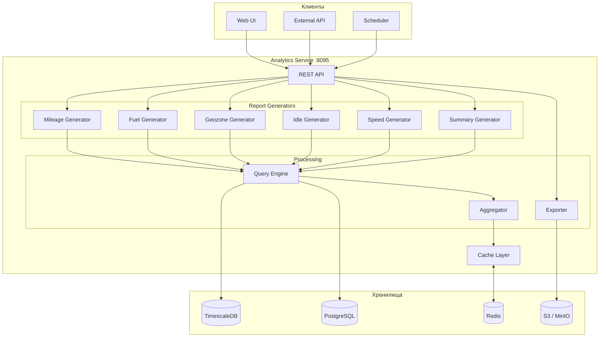
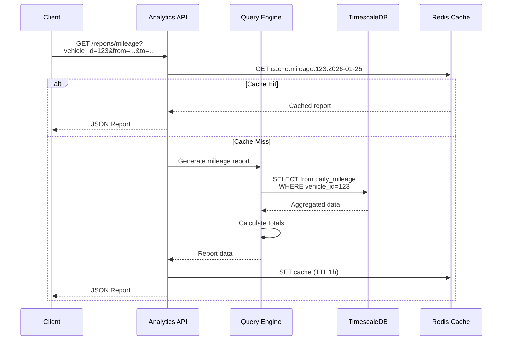

# 📊 Analytics Service — Детальная документация

> **Блок:** 2 (Business Logic)  
> **Порт:** HTTP 8095 (REST API)  
> **Сложность:** Средняя  
> **Статус:** ⏳ MVP частично

---

## 📋 Содержание

1. [Обзор](#обзор)
2. [Архитектура](#архитектура)
3. [Типы отчётов](#типы-отчётов)
4. [Агрегации и расчёты](#агрегации-и-расчёты)
5. [TimescaleDB запросы](#timescaledb-запросы)
6. [PostgreSQL схема](#postgresql-схема)
7. [REST API](#rest-api)
8. [Кеширование](#кеширование)
9. [Экспорт отчётов](#экспорт-отчётов)
10. [Метрики и мониторинг](#метрики-и-мониторинг)
11. [Конфигурация](#конфигурация)

---

## Обзор

**Analytics Service** — сервис генерации отчётов и аналитики на основе GPS-данных и событий. Использует TimescaleDB continuous aggregates для эффективных расчётов.

### Ключевые характеристики

| Параметр | Значение |
|----------|----------|
| **Вход** | TimescaleDB (gps_positions), PostgreSQL (events) |
| **Выход** | JSON отчёты, Excel, PDF |
| **Кеш** | Redis (готовые отчёты) |
| **Фоновые задачи** | Daily aggregation, scheduled reports |

### Основные функции

1. **Отчёты по пробегу** — суточный, месячный, по периоду
2. **Отчёты по топливу** — расход, заправки, сливы
3. **Отчёты по геозонам** — время в зонах, визиты
4. **Отчёты по простою** — стоянки, моточасы
5. **Отчёты по превышениям** — скорость, нарушения
6. **Сводные отчёты** — по организации, группам

---

## Архитектура



---

## Типы отчётов

### 1. Отчёт по пробегу (Mileage Report)



### Структура отчёта по пробегу

```scala
case class MileageReport(
  vehicleId: Long,
  vehicleName: String,
  period: DateRange,
  
  // Итоги
  totalMileage: Double,        // км
  totalEngineHours: Double,    // моточасы
  averageSpeed: Double,        // км/ч
  maxSpeed: Int,               // км/ч
  
  // По дням
  dailyData: List[DailyMileage],
  
  // Детализация поездок
  trips: List[Trip]
)

case class DailyMileage(
  date: LocalDate,
  mileage: Double,
  engineHours: Double,
  tripCount: Int,
  startOdometer: Long,
  endOdometer: Long
)

case class Trip(
  startTime: Instant,
  endTime: Instant,
  startAddress: String,
  endAddress: String,
  mileage: Double,
  duration: Duration,
  maxSpeed: Int,
  avgSpeed: Double
)
```

### 2. Отчёт по топливу (Fuel Report)

```scala
case class FuelReport(
  vehicleId: Long,
  vehicleName: String,
  period: DateRange,
  
  // Итоги
  totalConsumed: Double,       // литры
  totalRefueled: Double,       // литры (заправки)
  totalDrained: Double,        // литры (сливы)
  avgConsumption: Double,      // л/100км
  
  // Заправки
  refuels: List[FuelEvent],
  
  // Сливы
  drains: List[FuelEvent],
  
  // По дням
  dailyConsumption: List[DailyFuel]
)

case class FuelEvent(
  timestamp: Instant,
  location: Coordinates,
  address: String,
  volumeBefore: Double,
  volumeAfter: Double,
  delta: Double,
  eventType: String  // "refuel" | "drain"
)

case class DailyFuel(
  date: LocalDate,
  startLevel: Double,
  endLevel: Double,
  consumed: Double,
  refueled: Double,
  mileage: Double,
  consumption: Double  // л/100км
)
```

### 3. Отчёт по геозонам (Geozone Report)

```scala
case class GeozoneReport(
  vehicleId: Long,
  vehicleName: String,
  period: DateRange,
  
  // По геозонам
  geozones: List[GeozoneStats],
  
  // Все визиты
  visits: List[GeozoneVisit]
)

case class GeozoneStats(
  geozoneId: Long,
  geozoneName: String,
  visitCount: Int,
  totalDuration: Duration,
  avgDuration: Duration,
  firstVisit: Instant,
  lastVisit: Instant
)

case class GeozoneVisit(
  geozoneId: Long,
  geozoneName: String,
  enterTime: Instant,
  leaveTime: Option[Instant],
  duration: Duration,
  enterOdometer: Long,
  leaveOdometer: Option[Long]
)
```

### 4. Отчёт по простою (Idle Report)

```scala
case class IdleReport(
  vehicleId: Long,
  vehicleName: String,
  period: DateRange,
  
  // Итоги
  totalIdleTime: Duration,
  totalIdleEngineOn: Duration,  // Простой с включённым двигателем
  idleCount: Int,
  
  // Стоянки
  parkings: List[Parking]
)

case class Parking(
  startTime: Instant,
  endTime: Instant,
  duration: Duration,
  location: Coordinates,
  address: String,
  engineOn: Boolean,
  fuelConsumed: Option[Double]  // Если двигатель работал
)
```

### 5. Отчёт по превышениям скорости

```scala
case class SpeedViolationsReport(
  vehicleId: Long,
  vehicleName: String,
  period: DateRange,
  
  // Итоги
  totalViolations: Int,
  totalViolationDuration: Duration,
  maxSpeed: Int,
  
  // Нарушения
  violations: List[SpeedViolation]
)

case class SpeedViolation(
  startTime: Instant,
  endTime: Instant,
  duration: Duration,
  maxSpeed: Int,
  avgSpeed: Int,
  speedLimit: Int,          // Лимит (из геозоны или общий)
  geozoneId: Option[Long],
  location: Coordinates,
  address: String
)
```

---

## Агрегации и расчёты

### Расчёт пробега

```scala
object MileageCalculator {
  
  // Метод 1: По одометру (если трекер отдаёт)
  def byOdometer(points: List[GpsPoint]): Double = {
    val first = points.head.odometer
    val last = points.last.odometer
    (last - first) / 1000.0  // метры -> км
  }
  
  // Метод 2: По GPS точкам (Haversine)
  def byGps(points: List[GpsPoint]): Double = {
    points
      .sliding(2)
      .map { case List(p1, p2) => haversineDistance(p1, p2) }
      .sum
  }
  
  // Haversine formula
  private def haversineDistance(p1: GpsPoint, p2: GpsPoint): Double = {
    val R = 6371.0  // Радиус Земли в км
    val dLat = math.toRadians(p2.latitude - p1.latitude)
    val dLon = math.toRadians(p2.longitude - p1.longitude)
    
    val a = math.sin(dLat / 2) * math.sin(dLat / 2) +
            math.cos(math.toRadians(p1.latitude)) * 
            math.cos(math.toRadians(p2.latitude)) *
            math.sin(dLon / 2) * math.sin(dLon / 2)
    
    val c = 2 * math.atan2(math.sqrt(a), math.sqrt(1 - a))
    R * c
  }
}
```

### Расчёт расхода топлива

```scala
object FuelCalculator {
  
  // Расход = (заправки + начальный уровень) - конечный уровень - сливы
  def consumption(
    startLevel: Double,
    endLevel: Double,
    refuels: List[FuelEvent],
    drains: List[FuelEvent]
  ): Double = {
    val totalRefueled = refuels.map(_.delta).sum
    val totalDrained = drains.map(_.delta.abs).sum
    
    startLevel + totalRefueled - endLevel - totalDrained
  }
  
  // л/100км
  def consumptionPer100km(consumed: Double, mileage: Double): Double = {
    if (mileage > 0) (consumed / mileage) * 100 else 0
  }
  
  // Детектирование заправки/слива
  def detectFuelEvent(
    before: Double, 
    after: Double, 
    threshold: Double = 5.0
  ): Option[FuelEventType] = {
    val delta = after - before
    if (delta > threshold) Some(FuelEventType.Refuel)
    else if (delta < -threshold) Some(FuelEventType.Drain)
    else None
  }
}
```

### Детектирование поездок

```scala
object TripDetector {
  
  case class TripConfig(
    minParkingDuration: Duration = 5.minutes,
    minSpeed: Int = 3,  // км/ч — порог движения
    minTripDistance: Double = 0.1  // км
  )
  
  def detectTrips(
    points: List[GpsPoint],
    config: TripConfig
  ): List[Trip] = {
    // Группируем точки по состоянию (движение/стоянка)
    val segments = points
      .sliding(2)
      .foldLeft(List.empty[Segment]) { case (acc, List(p1, p2)) =>
        val isMoving = p2.speed >= config.minSpeed
        acc match {
          case head :: tail if head.isMoving == isMoving =>
            head.copy(points = head.points :+ p2) :: tail
          case _ =>
            Segment(isMoving, List(p1, p2)) :: acc
        }
      }
      .reverse
    
    // Фильтруем короткие стоянки (< minParkingDuration)
    // и объединяем соседние поездки
    mergeShortParkings(segments, config)
      .filter(_.isMoving)
      .map(segmentToTrip)
  }
}
```

---

## TimescaleDB запросы

### Continuous Aggregates

```sql
-- ===================== DAILY MILEAGE AGGREGATE =====================
CREATE MATERIALIZED VIEW daily_vehicle_stats
WITH (timescaledb.continuous) AS
SELECT
  time_bucket('1 day', timestamp) AS day,
  device_id,
  
  -- Пробег
  MAX(odometer) - MIN(odometer) AS mileage_meters,
  
  -- Скорость
  AVG(speed) AS avg_speed,
  MAX(speed) AS max_speed,
  
  -- Точки
  COUNT(*) AS point_count,
  MIN(timestamp) AS first_point,
  MAX(timestamp) AS last_point,
  
  -- Координаты (первая и последняя)
  FIRST(latitude, timestamp) AS start_lat,
  FIRST(longitude, timestamp) AS start_lon,
  LAST(latitude, timestamp) AS end_lat,
  LAST(longitude, timestamp) AS end_lon
  
FROM gps_positions
GROUP BY time_bucket('1 day', timestamp), device_id
WITH NO DATA;

-- Политика обновления
SELECT add_continuous_aggregate_policy('daily_vehicle_stats',
  start_offset => INTERVAL '3 days',
  end_offset => INTERVAL '1 hour',
  schedule_interval => INTERVAL '1 hour'
);

-- ===================== HOURLY FUEL AGGREGATE =====================
CREATE MATERIALIZED VIEW hourly_fuel_stats
WITH (timescaledb.continuous) AS
SELECT
  time_bucket('1 hour', timestamp) AS hour,
  device_id,
  
  FIRST(fuel_level, timestamp) AS start_level,
  LAST(fuel_level, timestamp) AS end_level,
  MIN(fuel_level) AS min_level,
  MAX(fuel_level) AS max_level,
  
  -- Пробег за час
  MAX(odometer) - MIN(odometer) AS mileage_meters
  
FROM gps_positions
WHERE fuel_level IS NOT NULL
GROUP BY time_bucket('1 hour', timestamp), device_id
WITH NO DATA;

-- ===================== ДВИЖЕНИЕ / СТОЯНКА =====================
CREATE MATERIALIZED VIEW daily_motion_stats
WITH (timescaledb.continuous) AS
SELECT
  time_bucket('1 day', timestamp) AS day,
  device_id,
  
  -- Время в движении (speed > 3)
  SUM(CASE WHEN speed > 3 THEN 1 ELSE 0 END) * 
    EXTRACT(EPOCH FROM '10 seconds'::interval) AS moving_seconds,
  
  -- Время на стоянке
  SUM(CASE WHEN speed <= 3 THEN 1 ELSE 0 END) * 
    EXTRACT(EPOCH FROM '10 seconds'::interval) AS idle_seconds,
  
  -- Моточасы (если ignition = true)
  SUM(CASE WHEN ignition = true THEN 1 ELSE 0 END) * 
    EXTRACT(EPOCH FROM '10 seconds'::interval) AS engine_seconds

FROM gps_positions
GROUP BY time_bucket('1 day', timestamp), device_id
WITH NO DATA;
```

### Запросы для отчётов

```sql
-- Пробег за период
SELECT 
  d.id AS vehicle_id,
  d.name AS vehicle_name,
  COALESCE(SUM(s.mileage_meters), 0) / 1000.0 AS total_km,
  COALESCE(AVG(s.avg_speed), 0) AS avg_speed,
  COALESCE(MAX(s.max_speed), 0) AS max_speed
FROM devices d
LEFT JOIN daily_vehicle_stats s ON d.id = s.device_id
  AND s.day BETWEEN '2026-01-01' AND '2026-01-31'
WHERE d.organization_id = 1
GROUP BY d.id, d.name
ORDER BY total_km DESC;

-- Детальные поездки за день
WITH trip_segments AS (
  SELECT 
    timestamp,
    latitude,
    longitude,
    speed,
    odometer,
    -- Определяем начало новой поездки (стоянка > 5 минут)
    CASE 
      WHEN speed <= 3 AND LAG(speed) OVER w <= 3 
           AND timestamp - LAG(timestamp) OVER w > INTERVAL '5 minutes'
      THEN 1 
      ELSE 0 
    END AS trip_start
  FROM gps_positions
  WHERE device_id = 123
    AND timestamp BETWEEN '2026-01-25' AND '2026-01-26'
  WINDOW w AS (ORDER BY timestamp)
)
SELECT 
  SUM(trip_start) OVER (ORDER BY timestamp) AS trip_number,
  *
FROM trip_segments;

-- Топ нарушителей скорости
SELECT 
  d.id,
  d.name,
  d.license_plate,
  COUNT(*) AS violation_count,
  MAX(p.speed) AS max_speed,
  SUM(EXTRACT(EPOCH FROM (
    LEAD(p.timestamp) OVER (PARTITION BY p.device_id ORDER BY p.timestamp) - p.timestamp
  ))) AS violation_seconds
FROM gps_positions p
JOIN devices d ON d.id = p.device_id
WHERE p.speed > 90  -- Общий лимит
  AND p.timestamp BETWEEN '2026-01-01' AND '2026-01-31'
  AND d.organization_id = 1
GROUP BY d.id, d.name, d.license_plate
ORDER BY violation_count DESC
LIMIT 10;
```

---

## PostgreSQL схема

```sql
-- ===================== REPORT TEMPLATES =====================
CREATE TABLE report_templates (
  id BIGSERIAL PRIMARY KEY,
  name VARCHAR(100) NOT NULL,
  organization_id BIGINT REFERENCES organizations(id),
  report_type VARCHAR(50) NOT NULL,
  
  -- Настройки
  config JSONB NOT NULL DEFAULT '{}',
  -- {
  --   "columns": ["date", "mileage", "fuel", "max_speed"],
  --   "groupBy": "day",
  --   "includeTrips": true,
  --   "includeMap": false
  -- }
  
  -- Фильтры по умолчанию
  default_filters JSONB DEFAULT '{}',
  
  created_at TIMESTAMPTZ NOT NULL DEFAULT NOW(),
  created_by BIGINT REFERENCES users(id)
);

-- ===================== SCHEDULED REPORTS =====================
CREATE TABLE scheduled_reports (
  id BIGSERIAL PRIMARY KEY,
  name VARCHAR(100) NOT NULL,
  organization_id BIGINT NOT NULL REFERENCES organizations(id),
  template_id BIGINT REFERENCES report_templates(id),
  
  -- Расписание (cron)
  schedule VARCHAR(50) NOT NULL,  -- "0 8 * * 1" = каждый понедельник в 8:00
  timezone VARCHAR(50) DEFAULT 'Europe/Moscow',
  
  -- Параметры
  report_type VARCHAR(50) NOT NULL,
  vehicle_ids BIGINT[] DEFAULT '{}',
  group_ids BIGINT[] DEFAULT '{}',
  period_type VARCHAR(20) NOT NULL,  -- 'yesterday', 'last_week', 'last_month'
  
  -- Доставка
  delivery_channels VARCHAR(20)[] NOT NULL,  -- ['email', 'telegram']
  recipients JSONB NOT NULL,
  export_format VARCHAR(10) DEFAULT 'xlsx',  -- 'xlsx', 'pdf', 'csv'
  
  enabled BOOLEAN NOT NULL DEFAULT true,
  last_run_at TIMESTAMPTZ,
  next_run_at TIMESTAMPTZ,
  
  created_at TIMESTAMPTZ NOT NULL DEFAULT NOW()
);

CREATE INDEX idx_scheduled_next ON scheduled_reports(next_run_at) 
  WHERE enabled = true;

-- ===================== REPORT HISTORY =====================
CREATE TABLE report_history (
  id BIGSERIAL PRIMARY KEY,
  organization_id BIGINT NOT NULL,
  user_id BIGINT REFERENCES users(id),
  scheduled_id BIGINT REFERENCES scheduled_reports(id),
  
  report_type VARCHAR(50) NOT NULL,
  parameters JSONB NOT NULL,
  
  -- Результат
  status VARCHAR(20) NOT NULL,  -- 'pending', 'processing', 'completed', 'failed'
  file_url VARCHAR(500),
  file_size BIGINT,
  error_message TEXT,
  
  -- Время
  created_at TIMESTAMPTZ NOT NULL DEFAULT NOW(),
  completed_at TIMESTAMPTZ,
  expires_at TIMESTAMPTZ  -- Когда удалить файл
);

-- Партиционирование
SELECT create_hypertable('report_history', 'created_at', if_not_exists => TRUE);
```

---

## REST API

```yaml
openapi: 3.0.0
info:
  title: Analytics Service API
  version: 1.0.0

paths:
  # ==================== ОТЧЁТЫ ====================
  /reports/mileage:
    get:
      summary: Отчёт по пробегу
      parameters:
        - name: organization_id
          in: query
          required: true
          schema: { type: integer }
        - name: vehicle_ids
          in: query
          schema: { type: array, items: { type: integer } }
        - name: group_ids
          in: query
          schema: { type: array, items: { type: integer } }
        - name: from
          in: query
          required: true
          schema: { type: string, format: date-time }
        - name: to
          in: query
          required: true
          schema: { type: string, format: date-time }
        - name: group_by
          in: query
          schema: { type: string, enum: [day, week, month] }
        - name: include_trips
          in: query
          schema: { type: boolean, default: false }
      responses:
        200:
          content:
            application/json:
              schema: { $ref: '#/components/schemas/MileageReport' }

  /reports/fuel:
    get:
      summary: Отчёт по топливу
      parameters:
        - name: organization_id
          in: query
          required: true
        - name: vehicle_ids
          in: query
        - name: from
          in: query
          required: true
        - name: to
          in: query
          required: true
        - name: include_events
          in: query
          schema: { type: boolean, default: true }
      responses:
        200:
          content:
            application/json:
              schema: { $ref: '#/components/schemas/FuelReport' }

  /reports/geozones:
    get:
      summary: Отчёт по геозонам
      parameters:
        - name: organization_id
          in: query
          required: true
        - name: vehicle_ids
          in: query
        - name: geozone_ids
          in: query
        - name: from
          in: query
          required: true
        - name: to
          in: query
          required: true
      responses:
        200:
          content:
            application/json:
              schema: { $ref: '#/components/schemas/GeozoneReport' }

  /reports/idle:
    get:
      summary: Отчёт по простою
      responses:
        200:
          content:
            application/json:
              schema: { $ref: '#/components/schemas/IdleReport' }

  /reports/speed-violations:
    get:
      summary: Отчёт по превышениям скорости
      parameters:
        - name: speed_limit
          in: query
          schema: { type: integer, default: 90 }
      responses:
        200:
          content:
            application/json:
              schema: { $ref: '#/components/schemas/SpeedViolationsReport' }

  /reports/summary:
    get:
      summary: Сводный отчёт по всем машинам
      responses:
        200:
          content:
            application/json:
              schema: { $ref: '#/components/schemas/SummaryReport' }

  # ==================== ЭКСПОРТ ====================
  /reports/export:
    post:
      summary: Экспорт отчёта в файл
      requestBody:
        content:
          application/json:
            schema:
              type: object
              required: [reportType, format]
              properties:
                reportType: { type: string }
                format: { type: string, enum: [xlsx, pdf, csv] }
                parameters: { type: object }
      responses:
        202:
          content:
            application/json:
              schema:
                type: object
                properties:
                  taskId: { type: string }
                  status: { type: string }

  /reports/export/{taskId}:
    get:
      summary: Статус экспорта
      responses:
        200:
          content:
            application/json:
              schema:
                type: object
                properties:
                  status: { type: string, enum: [pending, processing, completed, failed] }
                  progress: { type: integer }
                  downloadUrl: { type: string }

  /reports/export/{taskId}/download:
    get:
      summary: Скачать файл
      responses:
        200:
          content:
            application/octet-stream: {}
        302:
          description: Redirect to S3 presigned URL

  # ==================== ШАБЛОНЫ ====================
  /templates:
    get:
      summary: Список шаблонов отчётов
      responses:
        200:
          content:
            application/json:
              schema:
                type: array
                items: { $ref: '#/components/schemas/ReportTemplate' }

    post:
      summary: Создать шаблон
      responses:
        201:
          content:
            application/json:
              schema: { $ref: '#/components/schemas/ReportTemplate' }

  # ==================== РАСПИСАНИЕ ====================
  /scheduled:
    get:
      summary: Список запланированных отчётов
      responses:
        200:
          content:
            application/json:
              schema:
                type: array
                items: { $ref: '#/components/schemas/ScheduledReport' }

    post:
      summary: Создать расписание
      requestBody:
        content:
          application/json:
            schema: { $ref: '#/components/schemas/CreateScheduledReport' }
      responses:
        201:
          content:
            application/json:
              schema: { $ref: '#/components/schemas/ScheduledReport' }

  /scheduled/{id}/run:
    post:
      summary: Запустить отчёт вручную
      responses:
        202:
          description: Запущено

  # ==================== ИСТОРИЯ ====================
  /history:
    get:
      summary: История отчётов
      parameters:
        - name: organization_id
          in: query
          required: true
        - name: from
          in: query
        - name: to
          in: query
        - name: status
          in: query
      responses:
        200:
          content:
            application/json:
              schema:
                type: array
                items: { $ref: '#/components/schemas/ReportHistoryItem' }

components:
  schemas:
    MileageReport:
      type: object
      properties:
        vehicleId: { type: integer }
        vehicleName: { type: string }
        period: { $ref: '#/components/schemas/DateRange' }
        totalMileage: { type: number }
        totalEngineHours: { type: number }
        averageSpeed: { type: number }
        maxSpeed: { type: integer }
        dailyData: 
          type: array
          items: { $ref: '#/components/schemas/DailyMileage' }
        trips:
          type: array
          items: { $ref: '#/components/schemas/Trip' }

    DailyMileage:
      type: object
      properties:
        date: { type: string, format: date }
        mileage: { type: number }
        engineHours: { type: number }
        tripCount: { type: integer }

    Trip:
      type: object
      properties:
        startTime: { type: string, format: date-time }
        endTime: { type: string, format: date-time }
        startAddress: { type: string }
        endAddress: { type: string }
        mileage: { type: number }
        durationMinutes: { type: integer }
        maxSpeed: { type: integer }

    SummaryReport:
      type: object
      properties:
        period: { $ref: '#/components/schemas/DateRange' }
        totalVehicles: { type: integer }
        totalMileage: { type: number }
        totalFuelConsumed: { type: number }
        avgMileagePerVehicle: { type: number }
        vehicles:
          type: array
          items:
            type: object
            properties:
              vehicleId: { type: integer }
              vehicleName: { type: string }
              licensePlate: { type: string }
              mileage: { type: number }
              fuelConsumed: { type: number }
              violations: { type: integer }
```

---

## Кеширование

### Redis структуры

```
┌─────────────────────────────────────────────────────────────────────┐
│                    REDIS (Analytics Cache)                          │
├─────────────────────────────────────────────────────────────────────┤
│                                                                     │
│  📊 ОТЧЁТЫ (готовые)                                                 │
│  ─────────────────────────────────────────────────────────────────  │
│  Key:     report:{type}:{hash(params)}                             │
│  Type:    STRING (JSON)                                            │
│  TTL:     1 час (вчера), 5 мин (сегодня)                           │
│  Example: report:mileage:a1b2c3d4                                  │
│                                                                     │
├─────────────────────────────────────────────────────────────────────┤
│                                                                     │
│  📈 АГРЕГАТЫ (daily)                                                 │
│  ─────────────────────────────────────────────────────────────────  │
│  Key:     agg:daily:{vehicle_id}:{date}                            │
│  Type:    HASH                                                     │
│  TTL:     7 дней                                                   │
│  Fields:  mileage, fuel, max_speed, trip_count, engine_hours       │
│                                                                     │
├─────────────────────────────────────────────────────────────────────┤
│                                                                     │
│  🔄 ЗАДАЧИ ЭКСПОРТА                                                  │
│  ─────────────────────────────────────────────────────────────────  │
│  Key:     export:{task_id}                                         │
│  Type:    HASH                                                     │
│  TTL:     24 часа                                                  │
│  Fields:  status, progress, file_url, error                        │
│                                                                     │
└─────────────────────────────────────────────────────────────────────┘
```

### Cache реализация

```scala
class ReportCache(redis: RedisClient) {
  
  private def cacheKey(reportType: String, params: ReportParams): String = {
    val hash = md5(params.toJson)
    s"report:$reportType:$hash"
  }
  
  private def ttlFor(params: ReportParams): Duration = {
    val now = LocalDate.now()
    if (params.to.toLocalDate.isBefore(now)) {
      1.hour  // Исторические данные — кешируем дольше
    } else {
      5.minutes  // Текущий день — короткий TTL
    }
  }
  
  def get[T: JsonDecoder](
    reportType: String, 
    params: ReportParams
  ): Task[Option[T]] = {
    val key = cacheKey(reportType, params)
    redis.get(key).map(_.flatMap(_.fromJson[T].toOption))
  }
  
  def set[T: JsonEncoder](
    reportType: String,
    params: ReportParams,
    report: T
  ): Task[Unit] = {
    val key = cacheKey(reportType, params)
    val ttl = ttlFor(params)
    redis.setex(key, ttl.toSeconds, report.toJson)
  }
  
  // Инвалидация при новых данных
  def invalidate(vehicleId: Long, date: LocalDate): Task[Unit] = {
    redis.keys(s"report:*:*$vehicleId*$date*").flatMap { keys =>
      ZIO.foreachDiscard(keys)(redis.del)
    }
  }
}
```

---

## Экспорт отчётов

### Excel генератор

```scala
class ExcelExporter {
  
  def export(report: MileageReport): Task[Array[Byte]] = ZIO.attempt {
    val workbook = new XSSFWorkbook()
    val sheet = workbook.createSheet("Пробег")
    
    // Заголовок
    val headerRow = sheet.createRow(0)
    val headers = List("Дата", "Пробег (км)", "Моточасы", "Поездок", "Макс. скорость")
    headers.zipWithIndex.foreach { case (h, i) =>
      val cell = headerRow.createCell(i)
      cell.setCellValue(h)
      cell.setCellStyle(headerStyle(workbook))
    }
    
    // Данные
    report.dailyData.zipWithIndex.foreach { case (day, rowIdx) =>
      val row = sheet.createRow(rowIdx + 1)
      row.createCell(0).setCellValue(day.date.toString)
      row.createCell(1).setCellValue(day.mileage)
      row.createCell(2).setCellValue(day.engineHours)
      row.createCell(3).setCellValue(day.tripCount)
    }
    
    // Итоги
    val totalRow = sheet.createRow(report.dailyData.size + 2)
    totalRow.createCell(0).setCellValue("ИТОГО")
    totalRow.createCell(1).setCellValue(report.totalMileage)
    totalRow.createCell(2).setCellValue(report.totalEngineHours)
    
    // Auto-size columns
    (0 until 5).foreach(sheet.autoSizeColumn)
    
    val out = new ByteArrayOutputStream()
    workbook.write(out)
    workbook.close()
    out.toByteArray
  }
}
```

### PDF генератор

```scala
class PdfExporter {
  
  def export(report: MileageReport): Task[Array[Byte]] = ZIO.attempt {
    val document = new Document(PageSize.A4.rotate())
    val out = new ByteArrayOutputStream()
    val writer = PdfWriter.getInstance(document, out)
    
    document.open()
    
    // Заголовок
    val title = new Paragraph(
      s"Отчёт по пробегу: ${report.vehicleName}",
      FontFactory.getFont(FontFactory.HELVETICA_BOLD, 16)
    )
    document.add(title)
    document.add(new Paragraph(s"Период: ${report.period}"))
    document.add(Chunk.NEWLINE)
    
    // Таблица
    val table = new PdfPTable(5)
    table.setWidthPercentage(100)
    
    // Headers
    List("Дата", "Пробег", "Моточасы", "Поездок", "Макс. скорость")
      .foreach(h => table.addCell(headerCell(h)))
    
    // Data
    report.dailyData.foreach { day =>
      table.addCell(day.date.toString)
      table.addCell(f"${day.mileage}%.1f км")
      table.addCell(f"${day.engineHours}%.1f ч")
      table.addCell(day.tripCount.toString)
    }
    
    document.add(table)
    document.close()
    
    out.toByteArray
  }
}
```

### Background export

```scala
class ExportService(
  reportService: ReportService,
  exporters: Map[String, Exporter],
  s3Client: S3Client,
  redis: RedisClient
) {
  
  def startExport(request: ExportRequest): Task[String] = {
    val taskId = UUID.randomUUID().toString
    
    for {
      // Сохраняем статус в Redis
      _ <- redis.hset(s"export:$taskId", Map(
        "status" -> "pending",
        "progress" -> "0",
        "createdAt" -> Instant.now().toString
      ))
      
      // Запускаем фоновую задачу
      _ <- doExport(taskId, request).fork
      
    } yield taskId
  }
  
  private def doExport(taskId: String, request: ExportRequest): Task[Unit] = {
    for {
      _ <- updateStatus(taskId, "processing", 10)
      
      // Генерируем отчёт
      report <- reportService.generate(request.reportType, request.params)
      _ <- updateStatus(taskId, "processing", 50)
      
      // Экспортируем в файл
      exporter = exporters(request.format)
      bytes <- exporter.export(report)
      _ <- updateStatus(taskId, "processing", 80)
      
      // Загружаем в S3
      filename = s"reports/$taskId.${request.format}"
      url <- s3Client.upload(filename, bytes)
      
      _ <- updateStatus(taskId, "completed", 100, Some(url))
      
    } yield ()
  }.catchAll { error =>
    updateStatus(taskId, "failed", 0, error = Some(error.getMessage))
  }
}
```

---

## Метрики и мониторинг

### Prometheus метрики

```
# Генерация отчётов
as_reports_generated_total{type="mileage"} 12345
as_reports_generated_total{type="fuel"} 5678
as_report_generation_seconds_bucket{type="mileage",le="1"} 11000
as_report_generation_seconds_bucket{type="mileage",le="5"} 12000

# Кеш
as_cache_hits_total{type="mileage"} 8000
as_cache_misses_total{type="mileage"} 4345
as_cache_hit_ratio 0.65

# Экспорт
as_exports_total{format="xlsx"} 2345
as_exports_total{format="pdf"} 1234
as_export_size_bytes_bucket{le="1048576"} 3000  # < 1MB
as_export_size_bytes_bucket{le="10485760"} 3500 # < 10MB

# Scheduled reports
as_scheduled_runs_total{status="success"} 500
as_scheduled_runs_total{status="failed"} 5

# Запросы к TimescaleDB
as_db_query_seconds_bucket{query="daily_stats",le="0.1"} 9500
as_db_query_seconds_bucket{query="daily_stats",le="1"} 9900
```

---

## Конфигурация

### application.conf

```hocon
analytics-service {
  database {
    timescaledb {
      url = ${TIMESCALE_URL}
      pool.max-size = 30
    }
    postgres {
      url = ${DATABASE_URL}
      pool.max-size = 10
    }
  }
  
  redis {
    host = ${REDIS_HOST}
    port = 6379
  }
  
  s3 {
    endpoint = ${S3_ENDPOINT}
    bucket = "tracker-reports"
    access-key = ${S3_ACCESS_KEY}
    secret-key = ${S3_SECRET_KEY}
    presigned-url-ttl = 24h
  }
  
  cache {
    historical-ttl = 1h
    realtime-ttl = 5m
  }
  
  export {
    max-concurrent = 10
    temp-dir = "/tmp/reports"
    max-file-size = 50MB
    retention = 7d
  }
  
  scheduled {
    enabled = true
    check-interval = 1m
  }
  
  server {
    port = 8095
  }
}
```

### Docker Compose

```yaml
services:
  analytics-service:
    build: ./services/analytics-service
    ports:
      - "8095:8095"
    environment:
      - TIMESCALE_URL=postgresql://timescale:5432/tracker
      - DATABASE_URL=postgresql://postgres:5432/tracker
      - REDIS_HOST=redis
      - S3_ENDPOINT=http://minio:9000
      - S3_ACCESS_KEY=${MINIO_ACCESS_KEY}
      - S3_SECRET_KEY=${MINIO_SECRET_KEY}
    depends_on:
      - timescaledb
      - postgres
      - redis
      - minio
    healthcheck:
      test: ["CMD", "curl", "-f", "http://localhost:8095/health"]
      interval: 10s
```

---

## 📚 Связанные документы

- [ARCHITECTURE_BLOCK2.md](../ARCHITECTURE_BLOCK2.md) — Обзор Block 2
- [NOTIFICATIONS_SERVICE.md](./NOTIFICATIONS_SERVICE.md) — Предыдущий сервис
- [INTEGRATION_SERVICE.md](./INTEGRATION_SERVICE.md) — Следующий сервис
- [DATA_STORES.md](../DATA_STORES.md) — TimescaleDB схемы

---

## 🤖 Промпт для AI-агента

<details>
<summary><b>Развернуть полный промпт для реализации Analytics Service</b></summary>

```markdown
# ЗАДАЧА: Реализовать Analytics Service для TrackerGPS

## КОНТЕКСТ
Ты — senior Scala разработчик. Создай Analytics Service — сервис генерации отчётов и аналитики для системы мониторинга транспорта TrackerGPS.

## ТЕХНИЧЕСКИЙ СТЕК (ОБЯЗАТЕЛЬНО)
- **Язык:** Scala 3.4.0
- **Эффекты:** ZIO 2.0.20
- **HTTP:** zio-http (REST API)
- **TimescaleDB:** Quill или Doobie (для continuous aggregates)
- **PostgreSQL:** Quill или Doobie
- **Redis:** zio-redis (кеш отчётов)
- **S3/MinIO:** zio-s3 или AWS SDK (хранение файлов)
- **Excel:** Apache POI
- **PDF:** iText или OpenPDF
- **Конфигурация:** zio-config + HOCON
- **Сборка:** SBT

## АРХИТЕКТУРА СЕРВИСА

### Основные компоненты:
1. **Report Generators** — генераторы для каждого типа отчёта
2. **Query Engine** — запросы к TimescaleDB (continuous aggregates)
3. **Cache Layer** — Redis кеш готовых отчётов
4. **Export Service** — экспорт в Excel, PDF, CSV
5. **Scheduler** — запланированные отчёты
6. **REST API** — генерация и скачивание отчётов

### Flow:
```
REST Request → Check Cache → Generate Report → Cache → Return
                   ↓              ↓
                 Redis        TimescaleDB
                               (aggregates)

Scheduled → Generate → Export → Upload S3 → Send (email/telegram)
```

## ТРЕБОВАНИЯ К РЕАЛИЗАЦИИ

### 1. Типы отчётов

```scala
enum ReportType:
  case Mileage        // Пробег
  case Fuel           // Топливо
  case Geozones       // Геозоны
  case Idle           // Простой
  case SpeedViolations // Превышения скорости
  case Trips          // Поездки
  case Summary        // Сводный

// Каждый тип имеет свой Generator
trait ReportGenerator[T]:
  def generate(params: ReportParams): Task[T]
```

### 2. Report Models

```scala
case class MileageReport(
  vehicleId: Long,
  vehicleName: String,
  period: DateRange,
  totalMileage: Double,         // км
  totalEngineHours: Double,     // часы
  averageSpeed: Double,         // км/ч
  maxSpeed: Int,                // км/ч
  dailyData: List[DailyMileage],
  trips: Option[List[Trip]]     // Если include_trips=true
)

case class FuelReport(
  vehicleId: Long,
  vehicleName: String,
  period: DateRange,
  totalConsumed: Double,        // литры
  totalRefueled: Double,        // литры
  totalDrained: Double,         // литры (сливы)
  avgConsumption: Double,       // л/100км
  refuels: List[FuelEvent],
  drains: List[FuelEvent],
  dailyConsumption: List[DailyFuel]
)

case class GeozoneReport(
  vehicleId: Long,
  vehicleName: String,
  period: DateRange,
  geozones: List[GeozoneStats],
  visits: List[GeozoneVisit]
)

case class SummaryReport(
  organizationId: Long,
  period: DateRange,
  totalVehicles: Int,
  totalMileage: Double,
  totalFuelConsumed: Double,
  vehicles: List[VehicleSummary]
)
```

### 3. TimescaleDB Continuous Aggregates

```sql
-- КРИТИЧЕСКИ ВАЖНО: использовать готовые агрегаты, не сырые данные!

-- Daily vehicle stats (создать при инициализации)
CREATE MATERIALIZED VIEW daily_vehicle_stats
WITH (timescaledb.continuous) AS
SELECT
  time_bucket('1 day', timestamp) AS day,
  device_id,
  MAX(odometer) - MIN(odometer) AS mileage_meters,
  AVG(speed) AS avg_speed,
  MAX(speed) AS max_speed,
  COUNT(*) AS point_count,
  MIN(timestamp) AS first_point,
  MAX(timestamp) AS last_point
FROM gps_positions
GROUP BY time_bucket('1 day', timestamp), device_id
WITH NO DATA;

-- Refresh policy
SELECT add_continuous_aggregate_policy('daily_vehicle_stats',
  start_offset => INTERVAL '3 days',
  end_offset => INTERVAL '1 hour',
  schedule_interval => INTERVAL '1 hour'
);

-- Hourly fuel stats
CREATE MATERIALIZED VIEW hourly_fuel_stats
WITH (timescaledb.continuous) AS
SELECT
  time_bucket('1 hour', timestamp) AS hour,
  device_id,
  FIRST(fuel_level, timestamp) AS start_level,
  LAST(fuel_level, timestamp) AS end_level,
  MIN(fuel_level) AS min_level,
  MAX(fuel_level) AS max_level
FROM gps_positions
WHERE fuel_level IS NOT NULL
GROUP BY time_bucket('1 hour', timestamp), device_id;
```

### 4. Query Engine

```scala
trait QueryEngine:
  // Пробег за период (из continuous aggregate)
  def getMileage(vehicleId: Long, from: Instant, to: Instant): Task[MileageData]
  
  // Топливо за период
  def getFuelData(vehicleId: Long, from: Instant, to: Instant): Task[FuelData]
  
  // Посещения геозон
  def getGeozoneVisits(vehicleId: Long, from: Instant, to: Instant): Task[List[GeozoneVisit]]
  
  // Детальные точки (для trips, violations)
  def getDetailedPoints(vehicleId: Long, from: Instant, to: Instant): Task[List[GpsPoint]]

// Пример SQL для пробега:
// SELECT 
//   SUM(mileage_meters) / 1000 as total_km,
//   AVG(avg_speed) as avg_speed,
//   MAX(max_speed) as max_speed
// FROM daily_vehicle_stats
// WHERE device_id = ? AND day BETWEEN ? AND ?
```

### 5. Algorithms

```scala
// Расчёт пробега по GPS (если нет одометра)
object MileageCalculator:
  def haversineDistance(p1: GpsPoint, p2: GpsPoint): Double =
    val R = 6371.0  // Радиус Земли в км
    val dLat = math.toRadians(p2.latitude - p1.latitude)
    val dLon = math.toRadians(p2.longitude - p1.longitude)
    val a = math.sin(dLat/2) * math.sin(dLat/2) +
            math.cos(math.toRadians(p1.latitude)) * 
            math.cos(math.toRadians(p2.latitude)) *
            math.sin(dLon/2) * math.sin(dLon/2)
    2 * R * math.atan2(math.sqrt(a), math.sqrt(1-a))

// Детекция поездок
object TripDetector:
  case class TripConfig(
    minParkingDuration: Duration = 5.minutes,
    minSpeed: Int = 3,           // км/ч
    minTripDistance: Double = 0.1 // км
  )
  
  def detectTrips(points: List[GpsPoint], config: TripConfig): List[Trip]

// Детекция событий топлива
object FuelEventDetector:
  def detectEvents(points: List[GpsPoint], threshold: Double = 5.0): List[FuelEvent]
```

### 6. Cache Layer

```scala
trait ReportCache:
  def get[T](key: String): Task[Option[T]]
  def set[T](key: String, report: T, ttl: Duration): Task[Unit]
  def invalidate(pattern: String): Task[Unit]

// Cache key: report:{type}:{hash(params)}
// TTL: 
//   - Historical (to < today): 1 hour
//   - Current day included: 5 minutes

// При новых данных — invalidate vehicle reports
```

### 7. Export Service

```scala
trait ExportService:
  def exportExcel[T](report: T): Task[Array[Byte]]
  def exportPdf[T](report: T): Task[Array[Byte]]
  def exportCsv[T](report: T): Task[Array[Byte]]

// Background export flow:
// 1. POST /reports/export → return taskId
// 2. Background job generates report
// 3. Upload to S3
// 4. GET /reports/export/{taskId} → status + downloadUrl

case class ExportTask(
  id: UUID,
  status: ExportStatus,      // Pending, Processing, Completed, Failed
  progress: Int,             // 0-100
  downloadUrl: Option[String],
  expiresAt: Option[Instant],
  error: Option[String]
)
```

### 8. Scheduled Reports

```scala
case class ScheduledReport(
  id: Long,
  organizationId: Long,
  name: String,
  reportType: ReportType,
  parameters: ReportParams,
  schedule: String,          // Cron: "0 8 * * 1" = каждый понедельник в 8:00
  periodType: PeriodType,    // Yesterday, LastWeek, LastMonth
  exportFormat: ExportFormat,
  deliveryChannels: Set[Channel],
  recipients: Recipients,
  enabled: Boolean
)

// Scheduler checks every minute for due reports
// On trigger: Generate → Export → Upload S3 → Deliver
```

### 9. REST API

```scala
// On-demand reports
GET /api/v1/reports/mileage?organization_id=&vehicle_ids=&from=&to=
GET /api/v1/reports/fuel?...
GET /api/v1/reports/geozones?...
GET /api/v1/reports/idle?...
GET /api/v1/reports/speed-violations?...
GET /api/v1/reports/summary?...

// Export
POST /api/v1/reports/export
// Body: { "reportType": "mileage", "format": "xlsx", "parameters": {...} }
// Response: { "taskId": "uuid" }

GET /api/v1/reports/export/{taskId}
// Response: { "status": "completed", "downloadUrl": "...", "expiresAt": "..." }

GET /api/v1/reports/export/{taskId}/download
// Response: File or redirect to S3

// Scheduled reports CRUD
GET    /api/v1/scheduled
POST   /api/v1/scheduled
PUT    /api/v1/scheduled/{id}
DELETE /api/v1/scheduled/{id}
POST   /api/v1/scheduled/{id}/run  // Manual trigger

// History
GET /api/v1/reports/history?organization_id=&from=&to=
```

### 10. Metrics

```scala
// Counters
as_reports_generated_total{type="mileage"}
as_exports_total{format="xlsx"}
as_scheduled_runs_total{status="success"}

// Histograms
as_report_generation_seconds{type="mileage"}
as_export_size_bytes

// Gauges
as_cache_hit_ratio
as_pending_exports
```

## СТРУКТУРА ПРОЕКТА
```
analytics-service/
├── src/main/scala/
│   └── trackergps/analytics/
│       ├── Main.scala
│       ├── config/
│       │   └── AppConfig.scala
│       ├── api/
│       │   ├── ReportApi.scala
│       │   ├── ExportApi.scala
│       │   └── ScheduledApi.scala
│       ├── generator/
│       │   ├── ReportGenerator.scala
│       │   ├── MileageGenerator.scala
│       │   ├── FuelGenerator.scala
│       │   ├── GeozoneGenerator.scala
│       │   ├── IdleGenerator.scala
│       │   ├── SpeedGenerator.scala
│       │   └── SummaryGenerator.scala
│       ├── query/
│       │   └── QueryEngine.scala
│       ├── algorithm/
│       │   ├── MileageCalculator.scala
│       │   ├── TripDetector.scala
│       │   └── FuelEventDetector.scala
│       ├── cache/
│       │   └── ReportCache.scala
│       ├── export/
│       │   ├── ExportService.scala
│       │   ├── ExcelExporter.scala
│       │   ├── PdfExporter.scala
│       │   └── CsvExporter.scala
│       ├── scheduler/
│       │   └── ReportScheduler.scala
│       ├── repository/
│       │   └── ScheduledReportRepository.scala
│       └── model/
│           ├── Reports.scala
│           └── ExportTask.scala
├── src/main/resources/
│   └── application.conf
└── build.sbt
```

## КРИТЕРИИ ПРИЁМКИ

1. ✅ 6 типов отчётов (Mileage, Fuel, Geozones, Idle, Speed, Summary)
2. ✅ Использование TimescaleDB continuous aggregates
3. ✅ Redis кеширование с правильным TTL
4. ✅ Экспорт в Excel (Apache POI)
5. ✅ Экспорт в PDF
6. ✅ Background export с progress tracking
7. ✅ S3/MinIO для хранения файлов
8. ✅ Scheduled reports (cron)
9. ✅ REST API
10. ✅ Unit тесты для algorithms

## ОПТИМИЗАЦИИ

1. **Parallel generation** — для Summary по машинам параллельно
2. **Streaming export** — для больших отчётов не держать всё в памяти
3. **Batch queries** — группировать запросы к DB
4. **Pre-aggregation** — для частых отчётов (daily summary)
```

</details>

---

**Дата:** 26 января 2026  
**Статус:** Документация готова ✅
