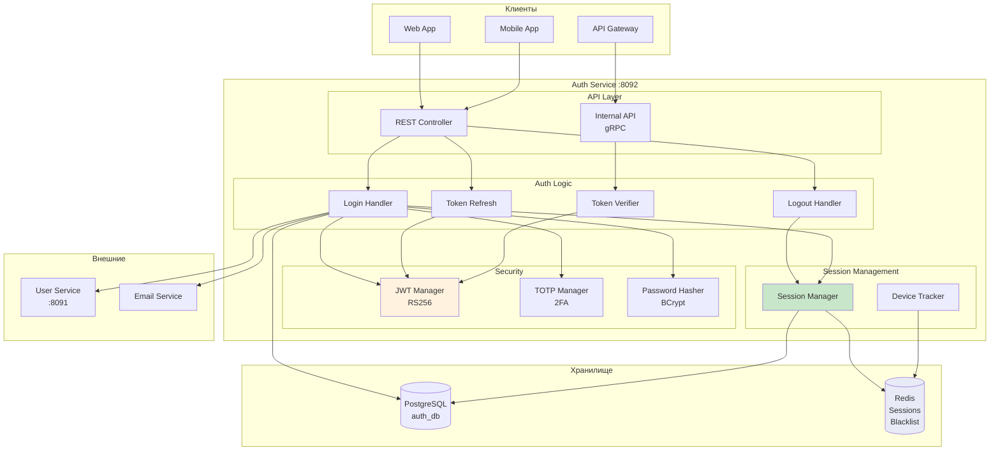

# Auth Service (Сервис аутентификации)

> Блок 3 | Презентация | Приоритет: MVP

## Обзор

Сервис аутентификации и авторизации. JWT токены, refresh токены, управление сессиями, двухфакторная аутентификация (2FA).

## Характеристики

| Параметр | Значение |
|----------|----------|
| Порт | 8092 |
| Язык | Scala 3 + ZIO |
| База данных | PostgreSQL |
| Кэш | Redis (сессии, blacklist) |
| Токены | JWT (RS256) |
| API | REST |

---

## 1. Архитектура

### 1.1 Mermaid Диаграмма - Общая архитектура



### 1.2 UML Sequence - Login Flow

```
┌────────┐  ┌──────────┐  ┌─────────┐  ┌─────────┐  ┌──────────┐  ┌─────────┐  ┌─────────┐
│ Client │  │   Auth   │  │Password │  │   User  │  │  Session │  │   JWT   │  │  Redis  │
│        │  │  Handler │  │ Hasher  │  │ Service │  │  Manager │  │ Manager │  │         │
└───┬────┘  └────┬─────┘  └────┬────┘  └────┬────┘  └────┬─────┘  └────┬────┘  └────┬────┘
    │            │             │            │            │             │            │
    │ POST /login│             │            │            │             │            │
    │ {email, password}        │            │            │             │            │
    │───────────>│             │            │            │             │            │
    │            │             │            │            │             │            │
    │            │ getUser(email)           │            │             │            │
    │            │─────────────────────────>│            │             │            │
    │            │             │            │            │             │            │
    │            │             │   User     │            │             │            │
    │            │<─────────────────────────│            │             │            │
    │            │             │            │            │             │            │
    │            │ verify(password, hash)   │            │             │            │
    │            │────────────>│            │            │             │            │
    │            │             │            │            │             │            │
    │            │  valid      │            │            │             │            │
    │            │<────────────│            │            │             │            │
    │            │             │            │            │             │            │
    │            │             │ check2FAEnabled(userId) │             │            │
    │            │─────────────────────────────────────>│             │            │
    │            │             │            │            │             │            │
    │            │             │   false    │            │             │            │
    │            │<─────────────────────────────────────│             │            │
    │            │             │            │            │             │            │
    │            │ createSession(userId, deviceInfo)    │             │            │
    │            │─────────────────────────────────────>│             │            │
    │            │             │            │            │             │            │
    │            │             │            │  sessionId │             │            │
    │            │<─────────────────────────────────────│             │            │
    │            │             │            │            │             │            │
    │            │ generateTokens(userId, sessionId, permissions)     │            │
    │            │────────────────────────────────────────────────────>│            │
    │            │             │            │            │             │            │
    │            │             │   {accessToken, refreshToken}        │            │
    │            │<────────────────────────────────────────────────────│            │
    │            │             │            │            │             │            │
    │            │ storeSession(sessionId, metadata)    │             │            │
    │            │────────────────────────────────────────────────────────────────>│
    │            │             │            │            │             │            │
    │ {tokens}   │             │            │            │             │            │
    │<───────────│             │            │            │             │            │
    │            │             │            │            │             │            │
```

### 1.3 UML Sequence - Login с 2FA

```
┌────────┐  ┌──────────┐  ┌─────────┐  ┌─────────┐  ┌─────────┐
│ Client │  │   Auth   │  │  TOTP   │  │ Session │  │  Redis  │
│        │  │  Handler │  │ Manager │  │ Manager │  │         │
└───┬────┘  └────┬─────┘  └────┬────┘  └────┬────┘  └────┬────┘
    │            │             │            │            │
    │ POST /login│             │            │            │
    │ {email, password}        │            │            │
    │───────────>│             │            │            │
    │            │             │            │            │
    │            │ ... (пароль верный) ...  │            │
    │            │             │            │            │
    │            │ check2FAEnabled(userId)  │            │
    │            │─────────────────────────>│            │
    │            │             │            │            │
    │            │  true       │            │            │
    │            │<─────────────────────────│            │
    │            │             │            │            │
    │            │ createPendingSession(userId)         │
    │            │─────────────────────────────────────>│
    │            │             │            │            │
    │            │             │ pendingToken            │
    │            │<─────────────────────────────────────│
    │            │             │            │            │
    │ {requires2FA: true,      │            │            │
    │  pendingToken: "xxx"}    │            │            │
    │<───────────│             │            │            │
    │            │             │            │            │
    │ POST /login/2fa          │            │            │
    │ {pendingToken, code: "123456"}        │            │
    │───────────>│             │            │            │
    │            │             │            │            │
    │            │ getPendingSession(pendingToken)      │
    │            │─────────────────────────────────────>│
    │            │             │            │            │
    │            │             │ userId     │            │
    │            │<─────────────────────────────────────│
    │            │             │            │            │
    │            │ verify(userId, code)     │            │
    │            │────────────>│            │            │
    │            │             │            │            │
    │            │  valid      │            │            │
    │            │<────────────│            │            │
    │            │             │            │            │
    │            │ ... (создание сессии и токенов) ...  │
    │            │             │            │            │
    │ {tokens}   │             │            │            │
    │<───────────│             │            │            │
    │            │             │            │            │
```

### 1.4 UML Sequence - Token Refresh

```
┌────────┐  ┌──────────┐  ┌─────────┐  ┌─────────┐  ┌─────────┐
│ Client │  │  Refresh │  │   JWT   │  │ Session │  │  Redis  │
│        │  │  Handler │  │ Manager │  │ Manager │  │         │
└───┬────┘  └────┬─────┘  └────┬────┘  └────┬────┘  └────┬────┘
    │            │             │            │            │
    │ POST /refresh            │            │            │
    │ {refreshToken}           │            │            │
    │───────────>│             │            │            │
    │            │             │            │            │
    │            │ verifyRefreshToken(token)│            │
    │            │────────────>│            │            │
    │            │             │            │            │
    │            │             │ claims     │            │
    │            │<────────────│            │            │
    │            │             │            │            │
    │            │ isBlacklisted(jti)       │            │
    │            │─────────────────────────────────────>│
    │            │             │            │            │
    │            │             │  false     │            │
    │            │<─────────────────────────────────────│
    │            │             │            │            │
    │            │ validateSession(sessionId)           │
    │            │─────────────────────────>│            │
    │            │             │            │            │
    │            │             │  valid     │            │
    │            │<─────────────────────────│            │
    │            │             │            │            │
    │            │ generateNewTokens(userId, sessionId) │
    │            │────────────>│            │            │
    │            │             │            │            │
    │            │ {newAccessToken, newRefreshToken}    │
    │            │<────────────│            │            │
    │            │             │            │            │
    │            │ blacklistOldRefresh(oldJti)          │
    │            │─────────────────────────────────────>│
    │            │             │            │            │
    │            │ updateSession(sessionId)│            │
    │            │─────────────────────────>│            │
    │            │             │            │            │
    │ {tokens}   │             │            │            │
    │<───────────│             │            │            │
    │            │             │            │            │
```

### 1.5 UML Sequence - Token Verification (Internal)

```
┌───────────┐  ┌──────────┐  ┌─────────┐  ┌─────────┐
│   API     │  │  Token   │  │   JWT   │  │  Redis  │
│  Gateway  │  │ Verifier │  │ Manager │  │         │
└─────┬─────┘  └────┬─────┘  └────┬────┘  └────┬────┘
      │             │             │            │
      │ gRPC: verify(accessToken) │            │
      │────────────>│             │            │
      │             │             │            │
      │             │ decode(token)           │
      │             │────────────>│            │
      │             │             │            │
      │             │  claims     │            │
      │             │<────────────│            │
      │             │             │            │
      │             │ isBlacklisted(sessionId) │
      │             │─────────────────────────>│
      │             │             │            │
      │             │  false      │            │
      │             │<─────────────────────────│
      │             │             │            │
      │             │ GET session:{sessionId}  │
      │             │─────────────────────────>│
      │             │             │            │
      │             │  sessionData│            │
      │             │<─────────────────────────│
      │             │             │            │
      │  {valid: true,            │            │
      │   userId, companyId,      │            │
      │   permissions, ...}       │            │
      │<────────────│             │            │
      │             │             │            │
```

---

## 2. Модели данных

### 2.1 Scala модели

```scala
package tracker.auth.domain

import java.time.Instant
import java.util.UUID

// ============================================
// Токены
// ============================================

/** JWT Claims */
final case class TokenClaims(
  sub: UUID,                             // userId
  jti: UUID,                             // token ID
  sid: UUID,                             // sessionId
  cid: UUID,                             // companyId
  roles: List[String],
  permissions: Set[String],
  iat: Instant,                          // issued at
  exp: Instant,                          // expires at
  typ: TokenType                         // access / refresh
)

enum TokenType:
  case Access
  case Refresh

/** Пара токенов */
final case class TokenPair(
  accessToken: String,
  refreshToken: String,
  accessExpiresAt: Instant,
  refreshExpiresAt: Instant,
  tokenType: String = "Bearer"
)

/** Результат верификации */
final case class VerificationResult(
  valid: Boolean,
  userId: Option[UUID],
  companyId: Option[UUID],
  sessionId: Option[UUID],
  roles: List[String],
  permissions: Set[String],
  error: Option[String]
)

// ============================================
// Сессии
// ============================================

/** Сессия пользователя */
final case class Session(
  id: UUID,
  userId: UUID,
  companyId: UUID,
  deviceInfo: DeviceInfo,
  ipAddress: String,
  lastActivity: Instant,
  createdAt: Instant,
  expiresAt: Instant,
  isActive: Boolean
)

/** Информация об устройстве */
final case class DeviceInfo(
  userAgent: String,
  platform: String,                      // "web", "ios", "android"
  deviceName: Option[String],            // "iPhone 15 Pro"
  appVersion: Option[String],
  fingerprint: Option[String]            // device fingerprint
)

/** Pending сессия (для 2FA) */
final case class PendingSession(
  token: String,
  userId: UUID,
  deviceInfo: DeviceInfo,
  ipAddress: String,
  createdAt: Instant,
  expiresAt: Instant                     // 5 минут
)

// ============================================
// 2FA
// ============================================

/** Настройки 2FA пользователя */
final case class TwoFactorSettings(
  userId: UUID,
  isEnabled: Boolean,
  secret: Option[String],                // TOTP secret (encrypted)
  backupCodes: List[String],             // hashed backup codes
  enabledAt: Option[Instant],
  lastUsedAt: Option[Instant]
)

/** Результат проверки 2FA */
enum TwoFactorResult:
  case Valid
  case Invalid
  case BackupCodeUsed(codeIndex: Int)
  case Locked(until: Instant)

// ============================================
// API модели
// ============================================

/** Запрос логина */
final case class LoginRequest(
  email: String,
  password: String,
  deviceInfo: Option[DeviceInfo]
)

/** Ответ логина (успех) */
final case class LoginResponse(
  accessToken: String,
  refreshToken: String,
  expiresIn: Long,                       // секунды
  tokenType: String,
  user: UserInfo
)

/** Ответ логина (требуется 2FA) */
final case class LoginPendingResponse(
  requires2FA: Boolean,
  pendingToken: String,
  expiresIn: Long                        // секунды до истечения pending
)

/** Запрос 2FA верификации */
final case class TwoFactorRequest(
  pendingToken: String,
  code: String                           // 6-значный код или backup code
)

/** Запрос refresh */
final case class RefreshRequest(
  refreshToken: String
)

/** Информация о пользователе в ответе */
final case class UserInfo(
  id: UUID,
  email: String,
  firstName: String,
  lastName: String,
  companyId: UUID,
  companyName: String,
  roles: List[String]
)

/** Запрос регистрации */
final case class RegisterRequest(
  email: String,
  password: String,
  firstName: String,
  lastName: String,
  companyName: String,                   // новая компания
  phone: Option[String]
)

/** Запрос сброса пароля */
final case class ResetPasswordRequest(
  email: String
)

/** Запрос установки нового пароля */
final case class SetPasswordRequest(
  token: String,
  newPassword: String
)

/** Запрос включения 2FA */
final case class Enable2FARequest(
  password: String                       // подтверждение паролем
)

/** Ответ включения 2FA */
final case class Enable2FAResponse(
  secret: String,                        // для QR кода
  qrCodeUrl: String,                     // otpauth:// URL
  backupCodes: List[String]              // одноразовые коды
)

/** Запрос подтверждения 2FA */
final case class Confirm2FARequest(
  code: String                           // TOTP код для подтверждения
)

// ============================================
// Ошибки
// ============================================

enum AuthError:
  case InvalidCredentials
  case UserNotFound(email: String)
  case UserDisabled(userId: UUID)
  case InvalidToken(reason: String)
  case TokenExpired
  case SessionExpired(sessionId: UUID)
  case SessionRevoked(sessionId: UUID)
  case Invalid2FACode
  case TwoFactorRequired
  case TooManyAttempts(retryAfter: Duration)
  case WeakPassword(requirements: List[String])
  case PasswordResetExpired
  case EmailNotVerified
```

---

## 3. Схема базы данных (PostgreSQL)

```sql
-- ============================================
-- Схема: auth
-- ============================================

CREATE SCHEMA IF NOT EXISTS auth;

-- ============================================
-- Таблица: sessions (Сессии)
-- ============================================

CREATE TABLE auth.sessions (
    id              UUID PRIMARY KEY DEFAULT gen_random_uuid(),
    user_id         UUID NOT NULL,                       -- REFERENCES users.users(id)
    company_id      UUID NOT NULL,
    
    -- Устройство
    user_agent      TEXT,
    platform        VARCHAR(20),                         -- web, ios, android
    device_name     VARCHAR(100),
    app_version     VARCHAR(20),
    device_fingerprint VARCHAR(64),
    
    ip_address      INET,
    last_activity   TIMESTAMPTZ NOT NULL DEFAULT NOW(),
    created_at      TIMESTAMPTZ NOT NULL DEFAULT NOW(),
    expires_at      TIMESTAMPTZ NOT NULL,
    is_active       BOOLEAN NOT NULL DEFAULT true,
    revoked_at      TIMESTAMPTZ,
    revoke_reason   VARCHAR(100)
);

CREATE INDEX idx_sessions_user ON auth.sessions(user_id, is_active);
CREATE INDEX idx_sessions_expires ON auth.sessions(expires_at) WHERE is_active = true;
CREATE INDEX idx_sessions_activity ON auth.sessions(last_activity DESC);

-- ============================================
-- Таблица: two_factor_settings (Настройки 2FA)
-- ============================================

CREATE TABLE auth.two_factor_settings (
    user_id         UUID PRIMARY KEY,                    -- REFERENCES users.users(id)
    is_enabled      BOOLEAN NOT NULL DEFAULT false,
    secret_encrypted BYTEA,                              -- AES encrypted TOTP secret
    backup_codes    TEXT[],                              -- hashed codes
    enabled_at      TIMESTAMPTZ,
    last_used_at    TIMESTAMPTZ,
    created_at      TIMESTAMPTZ NOT NULL DEFAULT NOW(),
    updated_at      TIMESTAMPTZ NOT NULL DEFAULT NOW()
);

-- ============================================
-- Таблица: password_reset_tokens
-- ============================================

CREATE TABLE auth.password_reset_tokens (
    id              UUID PRIMARY KEY DEFAULT gen_random_uuid(),
    user_id         UUID NOT NULL,
    token_hash      VARCHAR(64) NOT NULL,                -- SHA-256 hash
    expires_at      TIMESTAMPTZ NOT NULL,
    used_at         TIMESTAMPTZ,
    created_at      TIMESTAMPTZ NOT NULL DEFAULT NOW()
);

CREATE INDEX idx_reset_tokens_user ON auth.password_reset_tokens(user_id);
CREATE INDEX idx_reset_tokens_expires ON auth.password_reset_tokens(expires_at) 
    WHERE used_at IS NULL;

-- ============================================
-- Таблица: email_verification_tokens
-- ============================================

CREATE TABLE auth.email_verification_tokens (
    id              UUID PRIMARY KEY DEFAULT gen_random_uuid(),
    user_id         UUID NOT NULL,
    token_hash      VARCHAR(64) NOT NULL,
    expires_at      TIMESTAMPTZ NOT NULL,
    verified_at     TIMESTAMPTZ,
    created_at      TIMESTAMPTZ NOT NULL DEFAULT NOW()
);

CREATE INDEX idx_email_tokens_user ON auth.email_verification_tokens(user_id);

-- ============================================
-- Таблица: login_attempts (для rate limiting)
-- ============================================

CREATE TABLE auth.login_attempts (
    id              UUID PRIMARY KEY DEFAULT gen_random_uuid(),
    email           VARCHAR(255) NOT NULL,
    ip_address      INET NOT NULL,
    success         BOOLEAN NOT NULL,
    failure_reason  VARCHAR(100),
    user_agent      TEXT,
    created_at      TIMESTAMPTZ NOT NULL DEFAULT NOW()
);

CREATE INDEX idx_login_attempts_email ON auth.login_attempts(email, created_at DESC);
CREATE INDEX idx_login_attempts_ip ON auth.login_attempts(ip_address, created_at DESC);

-- Автоматическая очистка старых записей
CREATE INDEX idx_login_attempts_cleanup ON auth.login_attempts(created_at)
    WHERE created_at < NOW() - INTERVAL '30 days';

-- ============================================
-- Таблица: api_keys
-- ============================================

CREATE TABLE auth.api_keys (
    id              UUID PRIMARY KEY DEFAULT gen_random_uuid(),
    company_id      UUID NOT NULL,
    name            VARCHAR(100) NOT NULL,
    key_hash        VARCHAR(64) NOT NULL UNIQUE,         -- SHA-256 hash
    key_prefix      VARCHAR(8) NOT NULL,                 -- первые 8 символов для идентификации
    permissions     TEXT[] NOT NULL,
    rate_limit      INTEGER NOT NULL DEFAULT 1000,       -- requests per minute
    expires_at      TIMESTAMPTZ,
    last_used_at    TIMESTAMPTZ,
    created_by      UUID NOT NULL,
    created_at      TIMESTAMPTZ NOT NULL DEFAULT NOW(),
    is_active       BOOLEAN NOT NULL DEFAULT true
);

CREATE INDEX idx_api_keys_company ON auth.api_keys(company_id, is_active);
CREATE INDEX idx_api_keys_prefix ON auth.api_keys(key_prefix);

-- ============================================
-- Функции
-- ============================================

-- Очистка неактивных сессий
CREATE OR REPLACE FUNCTION auth.cleanup_expired_sessions()
RETURNS INTEGER AS $$
DECLARE
    deleted_count INTEGER;
BEGIN
    WITH deleted AS (
        DELETE FROM auth.sessions
        WHERE expires_at < NOW() - INTERVAL '7 days'
        OR (is_active = false AND revoked_at < NOW() - INTERVAL '1 day')
        RETURNING id
    )
    SELECT COUNT(*) INTO deleted_count FROM deleted;
    
    RETURN deleted_count;
END;
$$ LANGUAGE plpgsql;

-- Проверка rate limiting
CREATE OR REPLACE FUNCTION auth.check_login_rate_limit(
    p_email VARCHAR(255),
    p_ip INET,
    p_window_minutes INTEGER DEFAULT 15,
    p_max_attempts INTEGER DEFAULT 5
)
RETURNS TABLE (
    is_blocked BOOLEAN,
    attempts_count INTEGER,
    blocked_until TIMESTAMPTZ
) AS $$
DECLARE
    v_email_attempts INTEGER;
    v_ip_attempts INTEGER;
    v_window_start TIMESTAMPTZ;
BEGIN
    v_window_start := NOW() - (p_window_minutes || ' minutes')::INTERVAL;
    
    -- Подсчёт попыток по email
    SELECT COUNT(*) INTO v_email_attempts
    FROM auth.login_attempts
    WHERE email = p_email
    AND created_at > v_window_start
    AND success = false;
    
    -- Подсчёт попыток по IP
    SELECT COUNT(*) INTO v_ip_attempts
    FROM auth.login_attempts
    WHERE ip_address = p_ip
    AND created_at > v_window_start
    AND success = false;
    
    RETURN QUERY SELECT
        (v_email_attempts >= p_max_attempts OR v_ip_attempts >= p_max_attempts * 2),
        GREATEST(v_email_attempts, v_ip_attempts),
        CASE 
            WHEN v_email_attempts >= p_max_attempts THEN v_window_start + (p_window_minutes || ' minutes')::INTERVAL
            ELSE NULL
        END;
END;
$$ LANGUAGE plpgsql;
```

---

## 4. Redis структуры

```yaml
# ==========================================
# Сессии (быстрый доступ)
# ==========================================

# Данные сессии
key: "auth:session:{sessionId}"
value: |
  {
    "userId": "uuid",
    "companyId": "uuid",
    "roles": ["admin"],
    "permissions": ["vehicles:view", "reports:*"],
    "deviceInfo": {
      "platform": "web",
      "userAgent": "..."
    },
    "createdAt": "2025-01-20T08:00:00Z",
    "expiresAt": "2025-01-21T08:00:00Z"
  }
ttl: 86400s  # 24 часа (sync с expiresAt)

# Активные сессии пользователя
key: "auth:user_sessions:{userId}"
value: ["sessionId1", "sessionId2"]
type: SET
ttl: -  # управляется явно

# ==========================================
# Blacklist токенов
# ==========================================

# Отозванные refresh токены
key: "auth:blacklist:refresh:{jti}"
value: "1"
ttl: {до истечения refresh токена}

# Отозванные сессии (при logout all)
key: "auth:blacklist:session:{sessionId}"
value: "1"
ttl: {до истечения access токена}

# ==========================================
# Pending 2FA сессии
# ==========================================

key: "auth:pending_2fa:{pendingToken}"
value: |
  {
    "userId": "uuid",
    "deviceInfo": {...},
    "ipAddress": "192.168.1.100",
    "createdAt": "2025-01-20T10:00:00Z"
  }
ttl: 300s  # 5 минут

# ==========================================
# Rate Limiting
# ==========================================

# Попытки входа по email
key: "auth:rate:login:email:{email}"
value: "count"
ttl: 900s  # 15 минут

# Попытки входа по IP
key: "auth:rate:login:ip:{ip}"
value: "count"
ttl: 900s

# Попытки 2FA
key: "auth:rate:2fa:{userId}"
value: "count"
ttl: 300s  # 5 минут

# Блокировка при превышении
key: "auth:blocked:email:{email}"
value: "1"
ttl: 900s

key: "auth:blocked:ip:{ip}"
value: "1"
ttl: 1800s  # 30 минут (для IP строже)

# ==========================================
# API Keys (кэш)
# ==========================================

key: "auth:apikey:{keyHash}"
value: |
  {
    "keyId": "uuid",
    "companyId": "uuid",
    "permissions": ["devices:read"],
    "rateLimit": 1000
  }
ttl: 3600s

# Rate limiting для API keys
key: "auth:rate:apikey:{keyId}:{minute}"
value: "count"
ttl: 60s
```

---

## 5. JWT структура

### 5.1 Access Token

```json
{
  "header": {
    "alg": "RS256",
    "typ": "JWT",
    "kid": "key-2025-01"
  },
  "payload": {
    "sub": "550e8400-e29b-41d4-a716-446655440000",
    "jti": "123e4567-e89b-12d3-a456-426614174000",
    "sid": "789e4567-e89b-12d3-a456-426614174000",
    "cid": "456e4567-e89b-12d3-a456-426614174000",
    "roles": ["admin", "manager"],
    "permissions": ["vehicles:*", "reports:view"],
    "iat": 1705750800,
    "exp": 1705754400,
    "typ": "access"
  }
}

// Время жизни: 1 час
// Поля:
// - sub: userId
// - jti: уникальный ID токена
// - sid: sessionId
// - cid: companyId
// - roles: роли пользователя
// - permissions: разрешения
// - iat: время выдачи
// - exp: время истечения
// - typ: тип токена
```

### 5.2 Refresh Token

```json
{
  "header": {
    "alg": "RS256",
    "typ": "JWT",
    "kid": "key-2025-01"
  },
  "payload": {
    "sub": "550e8400-e29b-41d4-a716-446655440000",
    "jti": "abc12345-e89b-12d3-a456-426614174000",
    "sid": "789e4567-e89b-12d3-a456-426614174000",
    "iat": 1705750800,
    "exp": 1706355600,
    "typ": "refresh"
  }
}

// Время жизни: 7 дней
// Минимальный набор claims для безопасности
```

---

## 6. REST API

```yaml
# ==========================================
# Аутентификация
# ==========================================

# Логин
POST /api/v1/auth/login
Body: LoginRequest
Response: 200 OK
  LoginResponse | LoginPendingResponse

# 2FA верификация
POST /api/v1/auth/login/2fa
Body: TwoFactorRequest
Response: 200 OK
  LoginResponse

# Refresh токенов
POST /api/v1/auth/refresh
Body: RefreshRequest
Response: 200 OK
  {
    "accessToken": "...",
    "refreshToken": "...",
    "expiresIn": 3600
  }

# Logout текущей сессии
POST /api/v1/auth/logout
Headers: Authorization: Bearer {accessToken}
Response: 204 No Content

# Logout всех сессий
POST /api/v1/auth/logout/all
Headers: Authorization: Bearer {accessToken}
Response: 204 No Content

# ==========================================
# Регистрация
# ==========================================

# Регистрация новой компании
POST /api/v1/auth/register
Body: RegisterRequest
Response: 201 Created
  { "userId": "uuid", "companyId": "uuid", "message": "Verification email sent" }

# Подтверждение email
GET /api/v1/auth/verify-email?token={token}
Response: 200 OK
  { "verified": true }

# ==========================================
# Восстановление пароля
# ==========================================

# Запрос сброса пароля
POST /api/v1/auth/password/reset
Body: ResetPasswordRequest
Response: 202 Accepted
  { "message": "If email exists, reset link sent" }

# Установка нового пароля
POST /api/v1/auth/password/set
Body: SetPasswordRequest
Response: 200 OK
  { "message": "Password updated" }

# ==========================================
# 2FA управление
# ==========================================

# Начать включение 2FA
POST /api/v1/auth/2fa/enable
Headers: Authorization: Bearer {accessToken}
Body: Enable2FARequest
Response: 200 OK
  Enable2FAResponse

# Подтвердить включение 2FA
POST /api/v1/auth/2fa/confirm
Headers: Authorization: Bearer {accessToken}
Body: Confirm2FARequest
Response: 200 OK
  { "enabled": true, "backupCodesRemaining": 10 }

# Отключить 2FA
POST /api/v1/auth/2fa/disable
Headers: Authorization: Bearer {accessToken}
Body: { "password": "...", "code": "123456" }
Response: 200 OK

# Получить новые backup коды
POST /api/v1/auth/2fa/backup-codes
Headers: Authorization: Bearer {accessToken}
Body: { "password": "...", "code": "123456" }
Response: 200 OK
  { "backupCodes": ["AAAA-BBBB", "CCCC-DDDD", ...] }

# ==========================================
# Сессии
# ==========================================

# Список активных сессий
GET /api/v1/auth/sessions
Headers: Authorization: Bearer {accessToken}
Response: 200 OK
  {
    "sessions": [
      {
        "id": "uuid",
        "deviceInfo": {
          "platform": "web",
          "deviceName": "Chrome on Windows"
        },
        "ipAddress": "192.168.1.100",
        "lastActivity": "2025-01-20T10:00:00Z",
        "createdAt": "2025-01-19T08:00:00Z",
        "isCurrent": true
      }
    ]
  }

# Отозвать конкретную сессию
DELETE /api/v1/auth/sessions/{sessionId}
Headers: Authorization: Bearer {accessToken}
Response: 204 No Content

# ==========================================
# API Keys (для интеграций)
# ==========================================

# Список API ключей
GET /api/v1/auth/api-keys
Response: 200 OK
  {
    "apiKeys": [
      {
        "id": "uuid",
        "name": "Integration Key",
        "keyPrefix": "tk_live_",
        "permissions": ["devices:read"],
        "lastUsedAt": "2025-01-20T10:00:00Z",
        "createdAt": "2025-01-01T00:00:00Z"
      }
    ]
  }

# Создать API ключ
POST /api/v1/auth/api-keys
Body: { "name": "My Integration", "permissions": ["devices:read"] }
Response: 201 Created
  {
    "id": "uuid",
    "name": "My Integration",
    "key": "tk_live_abcd1234efgh5678..."  // показывается только один раз!
  }

# Отозвать API ключ
DELETE /api/v1/auth/api-keys/{keyId}
Response: 204 No Content

# ==========================================
# Internal API (gRPC)
# ==========================================

# Верификация токена (вызывается API Gateway)
rpc VerifyToken(VerifyTokenRequest) returns (VerificationResult)

# Получение прав пользователя
rpc GetUserPermissions(GetPermissionsRequest) returns (PermissionsResponse)
```

---

## 7. Конфигурация JWT

```hocon
# application.conf

auth {
  jwt {
    # Алгоритм подписи
    algorithm = "RS256"
    
    # Ключи (путь к файлам или PEM строка)
    private-key-path = ${?JWT_PRIVATE_KEY_PATH}
    public-key-path = ${?JWT_PUBLIC_KEY_PATH}
    
    # Или из переменных окружения
    private-key-pem = ${?JWT_PRIVATE_KEY}
    public-key-pem = ${?JWT_PUBLIC_KEY}
    
    # Key ID для ротации ключей
    key-id = "key-2025-01"
    
    # Issuer
    issuer = "tracker-auth"
    
    # Время жизни токенов
    access-token-ttl = 1 hour
    refresh-token-ttl = 7 days
  }
  
  session {
    # Максимальное количество сессий на пользователя
    max-per-user = 10
    
    # Время жизни сессии
    ttl = 30 days
    
    # Время неактивности до истечения
    inactivity-timeout = 24 hours
  }
  
  rate-limiting {
    login {
      # По email
      max-attempts-per-email = 5
      window = 15 minutes
      
      # По IP
      max-attempts-per-ip = 20
      window = 15 minutes
      
      # Время блокировки
      lockout-duration = 15 minutes
    }
    
    two-factor {
      max-attempts = 5
      window = 5 minutes
    }
  }
  
  password {
    # Требования к паролю
    min-length = 8
    require-uppercase = true
    require-lowercase = true
    require-digit = true
    require-special = false
    
    # BCrypt
    bcrypt-cost = 12
  }
  
  two-factor {
    # TOTP настройки
    issuer = "TrackerGPS"
    digits = 6
    period = 30 seconds
    algorithm = "SHA1"
    
    # Backup коды
    backup-codes-count = 10
  }
}
```

---

## 8. Метрики и мониторинг

```yaml
# Prometheus метрики

# Счётчики
auth_login_attempts_total{result, reason}
auth_token_refresh_total{result}
auth_token_verification_total{result}
auth_2fa_attempts_total{result}
auth_session_created_total
auth_session_revoked_total{reason}

# Гистограммы
auth_login_duration_seconds
auth_token_verification_duration_seconds
auth_password_hash_duration_seconds

# Gauge
auth_active_sessions_count
auth_blocked_ips_count
auth_blocked_emails_count

# Алерты
- alert: HighLoginFailureRate
  expr: rate(auth_login_attempts_total{result="failure"}[5m]) / rate(auth_login_attempts_total[5m]) > 0.3
  for: 5m
  annotations:
    summary: "Высокий процент неудачных логинов (>30%)"

- alert: TooManyBlockedIPs
  expr: auth_blocked_ips_count > 100
  for: 10m
  annotations:
    summary: "Много заблокированных IP адресов"
```

---

## 9. AI Промпт для реализации сервиса

### Контекст и задача

```markdown
# Задача: Реализовать Auth Service для GPS трекинг системы

## Контекст
Сервис аутентификации и авторизации для TrackerGPS системы.
Часть Блока 3 (Презентация). JWT токены (RS256), refresh токены, 2FA (TOTP).

## Технический стек (ОБЯЗАТЕЛЬНО)
- Scala 3.4.0
- ZIO 2.0.20 (эффекты)
- zio-http (REST API)
- Quill (PostgreSQL)
- zio-redis (сессии, blacklist)
- zio-json (сериализация)
- java-jwt (JWT токены)
- BCrypt (пароли)
- commons-codec (TOTP)
- zio-config (конфигурация)

## Архитектурные компоненты

### 1. Слой домена (domain/)
```scala
// models.scala - Все case classes из раздела 2.1
// Включая: TokenClaims, TokenPair, Session, TwoFactorSettings

// errors.scala
enum AuthError:
  case InvalidCredentials
  case TokenExpired
  case TooManyAttempts(retryAfter: Duration)
  // ...
```

### 2. Crypto (crypto/)
```scala
// JwtManager.scala - Генерация и валидация JWT
trait JwtManager:
  def generateAccessToken(claims: TokenClaims): Task[String]
  def generateRefreshToken(claims: TokenClaims): Task[String]
  def verifyToken(token: String): IO[AuthError, TokenClaims]
  def decodeWithoutVerification(token: String): Task[TokenClaims]

// PasswordHasher.scala - BCrypt хэширование
trait PasswordHasher:
  def hash(password: String): Task[String]
  def verify(password: String, hash: String): Task[Boolean]

// TotpManager.scala - TOTP для 2FA
trait TotpManager:
  def generateSecret: Task[String]
  def generateQrUrl(secret: String, email: String): Task[String]
  def verifyCode(secret: String, code: String): Task[Boolean]
  def generateBackupCodes(count: Int): Task[List[String]]
```

### 3. Сервисы (service/)
```scala
// AuthService.scala - Основная логика аутентификации
trait AuthService:
  def login(request: LoginRequest, ipAddress: String): IO[AuthError, LoginResponse | LoginPendingResponse]
  def verify2FA(request: TwoFactorRequest): IO[AuthError, LoginResponse]
  def refresh(request: RefreshRequest): IO[AuthError, TokenPair]
  def logout(sessionId: UUID): Task[Unit]
  def logoutAll(userId: UUID): Task[Unit]

// SessionManager.scala - Управление сессиями
trait SessionManager:
  def createSession(userId: UUID, companyId: UUID, deviceInfo: DeviceInfo, ip: String): Task[Session]
  def getSession(sessionId: UUID): Task[Option[Session]]
  def updateActivity(sessionId: UUID): Task[Unit]
  def revokeSession(sessionId: UUID, reason: String): Task[Unit]
  def revokeAllUserSessions(userId: UUID): Task[Int]
  def getUserSessions(userId: UUID): Task[List[Session]]

// TwoFactorService.scala - Управление 2FA
trait TwoFactorService:
  def enable(userId: UUID, password: String): IO[AuthError, Enable2FAResponse]
  def confirm(userId: UUID, code: String): IO[AuthError, Unit]
  def disable(userId: UUID, password: String, code: String): IO[AuthError, Unit]
  def verify(userId: UUID, code: String): IO[AuthError, TwoFactorResult]
  def regenerateBackupCodes(userId: UUID): Task[List[String]]

// RateLimiter.scala - Rate limiting
trait RateLimiter:
  def checkLogin(email: String, ip: String): IO[AuthError, Unit]
  def recordAttempt(email: String, ip: String, success: Boolean): Task[Unit]
  def check2FA(userId: UUID): IO[AuthError, Unit]
  def record2FAAttempt(userId: UUID, success: Boolean): Task[Unit]

// TokenVerifier.scala - Внутренняя верификация (для gRPC)
trait TokenVerifier:
  def verify(accessToken: String): IO[AuthError, VerificationResult]
```

### 4. Репозитории (repository/)
```scala
// SessionRepository.scala
trait SessionRepository:
  def create(session: Session): Task[UUID]
  def findById(id: UUID): Task[Option[Session]]
  def findByUser(userId: UUID): Task[List[Session]]
  def update(session: Session): Task[Unit]
  def delete(id: UUID): Task[Unit]
  def deleteExpired: Task[Int]

// TwoFactorRepository.scala
trait TwoFactorRepository:
  def getSettings(userId: UUID): Task[Option[TwoFactorSettings]]
  def saveSettings(settings: TwoFactorSettings): Task[Unit]
  def markBackupCodeUsed(userId: UUID, codeIndex: Int): Task[Unit]

// LoginAttemptRepository.scala
trait LoginAttemptRepository:
  def record(attempt: LoginAttempt): Task[Unit]
  def countRecent(email: String, window: Duration): Task[Int]
  def countRecentByIp(ip: String, window: Duration): Task[Int]
```

### 5. Cache (cache/)
```scala
// SessionCache.scala - Redis кэш сессий
trait SessionCache:
  def get(sessionId: UUID): UIO[Option[CachedSession]]
  def set(sessionId: UUID, session: CachedSession, ttl: Duration): UIO[Unit]
  def delete(sessionId: UUID): UIO[Unit]
  def addToUserSessions(userId: UUID, sessionId: UUID): UIO[Unit]
  def removeFromUserSessions(userId: UUID, sessionId: UUID): UIO[Unit]

// BlacklistCache.scala - Blacklist токенов
trait BlacklistCache:
  def addToken(jti: UUID, ttl: Duration): UIO[Unit]
  def isBlacklisted(jti: UUID): UIO[Boolean]
  def addSession(sessionId: UUID, ttl: Duration): UIO[Unit]
  def isSessionBlacklisted(sessionId: UUID): UIO[Boolean]

// RateLimitCache.scala - Rate limiting counters
trait RateLimitCache:
  def incrementLogin(email: String): Task[Int]
  def incrementLoginIp(ip: String): Task[Int]
  def isBlocked(email: String): UIO[Boolean]
  def isIpBlocked(ip: String): UIO[Boolean]
  def block(email: String, duration: Duration): UIO[Unit]
```

### 6. REST API (api/)
```scala
// AuthRoutes.scala - Все endpoints из раздела 6
// Валидация входных данных
// Обработка ошибок с правильными HTTP кодами
```

### 7. Internal API (grpc/)
```scala
// TokenVerifierService.scala - gRPC сервис для API Gateway
// Быстрая верификация токенов
```

## Требования к реализации

### Функциональные требования
1. Login с email/password
2. Опциональная 2FA (TOTP)
3. Refresh токенов с ротацией
4. Управление сессиями (список, отзыв)
5. Rate limiting логинов
6. Blacklist отозванных токенов
7. API Keys для интеграций

### Нефункциональные требования
1. JWT с RS256 (асимметричная подпись)
2. Верификация токена < 5ms (из кэша)
3. Пароли хэшируются BCrypt (cost=12)
4. Refresh токены одноразовые (ротация)
5. Rate limiting в Redis

### Критерии приёмки
1. Login возвращает access + refresh токены
2. При неверном пароле 5 раз - блокировка на 15 минут
3. 2FA работает с Google Authenticator
4. Refresh с использованным токеном отклоняется
5. Logout инвалидирует сессию
6. API Gateway успешно верифицирует токены через gRPC

## Структура проекта
```
services/auth-service/
├── src/main/scala/tracker/auth/
│   ├── Main.scala
│   ├── AuthApp.scala
│   ├── domain/
│   │   ├── models.scala
│   │   └── errors.scala
│   ├── crypto/
│   │   ├── JwtManager.scala
│   │   ├── PasswordHasher.scala
│   │   └── TotpManager.scala
│   ├── service/
│   │   ├── AuthService.scala
│   │   ├── SessionManager.scala
│   │   ├── TwoFactorService.scala
│   │   ├── RateLimiter.scala
│   │   └── TokenVerifier.scala
│   ├── repository/
│   │   ├── SessionRepository.scala
│   │   ├── TwoFactorRepository.scala
│   │   └── LoginAttemptRepository.scala
│   ├── cache/
│   │   ├── SessionCache.scala
│   │   ├── BlacklistCache.scala
│   │   └── RateLimitCache.scala
│   ├── api/
│   │   └── AuthRoutes.scala
│   ├── grpc/
│   │   └── TokenVerifierService.scala
│   └── config/
│       └── AuthConfig.scala
├── src/main/resources/
│   ├── application.conf
│   └── db/migration/
│       └── V1__auth_schema.sql
└── src/test/scala/tracker/auth/
    ├── crypto/
    │   └── JwtManagerSpec.scala
    └── service/
        └── AuthServiceSpec.scala
```

## JWT Keys
Сгенерировать RSA ключи:
```bash
openssl genrsa -out private.pem 2048
openssl rsa -in private.pem -pubout -out public.pem
```
```

---

## Связанные документы

- [ARCHITECTURE_BLOCK3.md](../ARCHITECTURE_BLOCK3.md) - Обзор блока презентации
- [USER_SERVICE.md](./USER_SERVICE.md) - Управление пользователями
- [API_GATEWAY.md](./API_GATEWAY.md) - Точка входа (верификация токенов)
