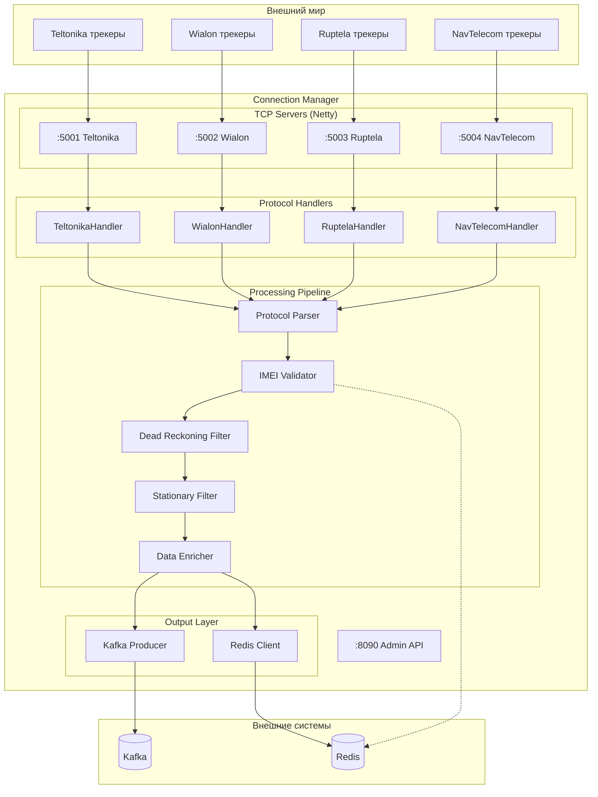
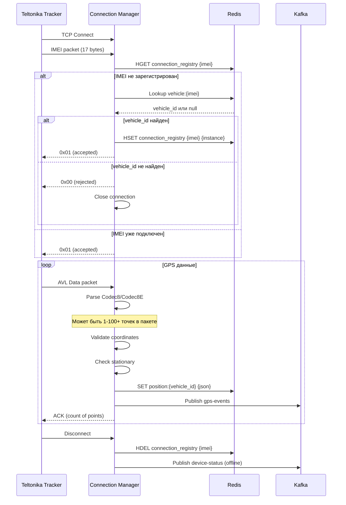
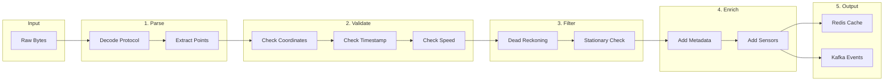
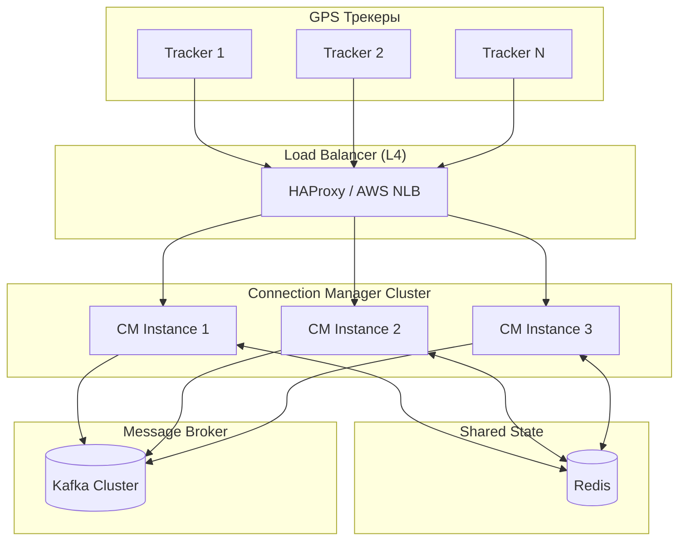

# 🔌 Connection Manager — Детальная документация

> **Блок:** 1 (Data Collection)  
> **Порты:** TCP 5001-5004 (протоколы), HTTP 8090 (admin/metrics)  
> **Сложность:** Высокая  
> **Статус:** 🟡 В разработке

---

## 📋 Содержание

1. [Обзор](#обзор)
2. [Архитектура компонентов](#архитектура-компонентов)
3. [Протоколы трекеров](#протоколы-трекеров)
4. [Обработка данных](#обработка-данных)
5. [Redis интеграция](#redis-интеграция)
6. [Kafka интеграция](#kafka-интеграция)
7. [API endpoints](#api-endpoints)
8. [Масштабирование](#масштабирование)
9. [Метрики и мониторинг](#метрики-и-мониторинг)
10. [Конфигурация](#конфигурация)

---

## Обзор

**Connection Manager** — центральный сервис приёма GPS данных от трекеров. Обрабатывает TCP соединения, парсит протоколы, валидирует координаты и публикует события в Kafka.

### Ключевые характеристики

| Параметр | Значение |
|----------|----------|
| **Протоколы** | Teltonika, Wialon IPS, Ruptela, NavTelecom |
| **Пропускная способность** | 10,000+ точек/сек |
| **Latency** | < 50ms (parse → Kafka) |
| **Concurrent connections** | 10,000+ |
| **Stateless** | Да (state в Redis) |

---

## Архитектура компонентов



### Компоненты

| Компонент | Описание | Технология |
|-----------|----------|------------|
| **TCP Servers** | Приём соединений от трекеров | Netty NIO |
| **Protocol Handlers** | Codec для каждого протокола | ZIO + Netty |
| **Parser** | Парсинг бинарных пакетов → GpsPoint | Pure Scala |
| **IMEI Validator** | Проверка IMEI в Redis/PostgreSQL | ZIO + Redis |
| **Dead Reckoning Filter** | Валидация координат | Pure Scala |
| **Stationary Filter** | Определение движение/стоянка | Pure Scala |
| **Data Enricher** | Добавление метаданных | Pure Scala |
| **Kafka Producer** | Публикация в топики | zio-kafka |
| **Redis Client** | Кеш позиций, registry | zio-redis |

---

## Протоколы трекеров

### Teltonika (порт 5001)



#### Teltonika Codec8 Extended

```
┌────────────────────────────────────────────────────────────────────┐
│                      AVL Data Packet                               │
├──────────┬──────────┬──────────────────────────────────────────────┤
│ Preamble │ Data Len │              AVL Data                        │
│ 4 bytes  │ 4 bytes  │              Variable                        │
│ 00000000 │          │                                              │
├──────────┴──────────┼──────────────────────────────────────────────┤
│                     │  ┌─────────────────────────────────────────┐ │
│                     │  │ Codec ID: 0x8E (Codec8 Extended)        │ │
│                     │  │ Number of Data 1: count                 │ │
│                     │  │ AVL Data[]:                             │ │
│                     │  │   - Timestamp (8 bytes)                 │ │
│                     │  │   - Priority (1 byte)                   │ │
│                     │  │   - GPS Element:                        │ │
│                     │  │     - Longitude (4 bytes, int * 10^-7)  │ │
│                     │  │     - Latitude (4 bytes, int * 10^-7)   │ │
│                     │  │     - Altitude (2 bytes)                │ │
│                     │  │     - Angle (2 bytes)                   │ │
│                     │  │     - Satellites (1 byte)               │ │
│                     │  │     - Speed (2 bytes)                   │ │
│                     │  │   - IO Element (variable)               │ │
│                     │  │ Number of Data 2: count                 │ │
│                     │  │ CRC-16 (4 bytes)                        │ │
│                     │  └─────────────────────────────────────────┘ │
└─────────────────────┴──────────────────────────────────────────────┘
```

### Wialon IPS (порт 5002)

```
Формат: текстовый, разделитель ";"

Login:    #L#imei;password\r\n
Response: #AL#1\r\n (success) или #AL#0\r\n (fail)

Data:     #D#date;time;lat1;lat2;lon1;lon2;speed;course;alt;sats;hdop;inputs;outputs;adc;ibutton;params\r\n
Response: #AD#1\r\n

Short:    #SD#date;time;lat1;lat2;lon1;lon2;speed;course;alt;sats\r\n
Response: #ASD#1\r\n

Ping:     #P#\r\n
Response: #AP#\r\n
```

### Ruptela (порт 5003)

```
Бинарный протокол, структура пакета:
- Length (2 bytes, big-endian)
- IMEI (8 bytes, BCD)
- Command ID (1 byte)
- Payload (variable)
- CRC-16 (2 bytes)

Command IDs:
- 0x01: Records
- 0x02: Extended Records
- 0x41: SMS from server
- 0x42: SMS response
```

### NavTelecom (порт 5004)

```
Бинарный протокол FLEX:
- Signature: "@NTC"
- Receiver ID (4 bytes)
- Sender ID (4 bytes)
- Packet Length (2 bytes)
- Packet Flags (1 byte)
- Header CRC (1 byte)
- Service ID (1 byte)
- Packet Type (1 byte)
- Payload
- Data CRC (1 byte)
```

---

## Обработка данных

### Pipeline обработки



### GpsPoint структура

```scala
case class GpsPoint(
  // Идентификация
  vehicleId: Long,
  imei: String,
  
  // Координаты
  latitude: Double,
  longitude: Double,
  altitude: Option[Int],
  speed: Int,
  course: Int,
  satellites: Option[Int],
  
  // Время
  deviceTime: Instant,      // Время на трекере
  serverTime: Instant,      // Время получения сервером
  
  // Метаданные
  protocol: Protocol,       // TELTONIKA, WIALON, etc.
  protocolVersion: String,  // "codec8e", "ips2.0"
  instanceId: String,       // "cm-instance-1"
  
  // Флаги валидации
  isValid: Boolean,         // Прошёл Dead Reckoning
  validationError: Option[String], // "TELEPORT", "INVALID_COORDS"
  isMoving: Boolean,        // Едет или стоит
  
  // Датчики (опционально)
  sensors: Option[SensorData]
)

case class SensorData(
  ignition: Option[Boolean],
  fuel: Option[Double],
  temperature: Option[Double],
  battery: Option[Double],
  externalPower: Option[Boolean],
  doors: Option[Boolean],
  raw: JsonObject              // Все остальные IO параметры
)
```

### Dead Reckoning Filter

```scala
object DeadReckoningFilter {
  
  case class ValidationResult(
    isValid: Boolean,
    error: Option[String]
  )
  
  def validate(
    current: GpsPoint,
    previous: Option[GpsPoint]
  ): ValidationResult = {
    
    // 1. Проверка границ координат
    if (current.latitude < -90 || current.latitude > 90 ||
        current.longitude < -180 || current.longitude > 180) {
      return ValidationResult(false, Some("INVALID_COORDS"))
    }
    
    // 2. Проверка нулевых координат (GPS потерял фиксацию)
    if (current.latitude == 0.0 && current.longitude == 0.0) {
      return ValidationResult(false, Some("NULL_ISLAND"))
    }
    
    // 3. Проверка телепортации (если есть предыдущая точка)
    previous.foreach { prev =>
      val distance = haversineDistance(
        prev.latitude, prev.longitude,
        current.latitude, current.longitude
      )
      val timeDiff = Duration.between(prev.deviceTime, current.deviceTime)
      val speed = distance / timeDiff.getSeconds  // м/с
      
      // Максимум 300 км/ч = 83 м/с
      if (speed > 83 && timeDiff.getSeconds < 60) {
        return ValidationResult(false, Some("TELEPORT"))
      }
    }
    
    // 4. Проверка скорости (самолёт?)
    if (current.speed > 300) {
      return ValidationResult(false, Some("IMPOSSIBLE_SPEED"))
    }
    
    ValidationResult(true, None)
  }
  
  private def haversineDistance(
    lat1: Double, lon1: Double,
    lat2: Double, lon2: Double
  ): Double = {
    val R = 6371000 // радиус Земли в метрах
    val dLat = Math.toRadians(lat2 - lat1)
    val dLon = Math.toRadians(lon2 - lon1)
    val a = Math.sin(dLat/2) * Math.sin(dLat/2) +
            Math.cos(Math.toRadians(lat1)) * Math.cos(Math.toRadians(lat2)) *
            Math.sin(dLon/2) * Math.sin(dLon/2)
    val c = 2 * Math.atan2(Math.sqrt(a), Math.sqrt(1-a))
    R * c
  }
}
```

### Stationary Filter

```scala
object StationaryFilter {
  
  case class StationaryResult(
    isMoving: Boolean,
    parkingStartTime: Option[Instant]
  )
  
  // Параметры
  val SPEED_THRESHOLD = 3        // км/ч — меньше = стоим
  val DISTANCE_THRESHOLD = 50    // метров — радиус "стоянки"
  val MIN_PARKING_DURATION = 60  // секунд — минимум для стоянки
  
  def check(
    current: GpsPoint,
    previous: Option[GpsPoint],
    parkingState: Option[ParkingState]
  ): (StationaryResult, Option[ParkingState]) = {
    
    // Простая проверка по скорости
    if (current.speed <= SPEED_THRESHOLD) {
      // Возможно стоим
      parkingState match {
        case Some(state) =>
          // Уже в режиме стоянки — проверяем расстояние
          val dist = haversineDistance(
            state.anchorLat, state.anchorLon,
            current.latitude, current.longitude
          )
          if (dist < DISTANCE_THRESHOLD) {
            // Всё ещё стоим
            (StationaryResult(isMoving = false, Some(state.startTime)), Some(state))
          } else {
            // Сдвинулись — обновляем anchor
            val newState = ParkingState(current.latitude, current.longitude, current.deviceTime)
            (StationaryResult(isMoving = false, Some(newState.startTime)), Some(newState))
          }
        case None =>
          // Начинаем стоянку
          val newState = ParkingState(current.latitude, current.longitude, current.deviceTime)
          (StationaryResult(isMoving = false, Some(newState.startTime)), Some(newState))
      }
    } else {
      // Едем
      (StationaryResult(isMoving = true, None), None)
    }
  }
  
  case class ParkingState(
    anchorLat: Double,
    anchorLon: Double,
    startTime: Instant
  )
}
```

---

## Redis интеграция

### Структуры данных

```
┌─────────────────────────────────────────────────────────────────────┐
│                    REDIS (Connection Manager)                        │
├─────────────────────────────────────────────────────────────────────┤
│                                                                     │
│  📍 ПОСЛЕДНИЕ ПОЗИЦИИ                                                │
│  ─────────────────────────────────────────────────────────────────  │
│  Key:     position:{vehicle_id}                                     │
│  Type:    STRING (JSON)                                             │
│  TTL:     3600 секунд (1 час)                                       │
│  Example: position:12345                                            │
│  Value:   {                                                         │
│             "lat": 55.751244,                                       │
│             "lon": 37.618423,                                       │
│             "speed": 45,                                            │
│             "course": 180,                                          │
│             "time": "2026-01-26T12:30:00Z",                         │
│             "isMoving": true,                                       │
│             "sensors": {"fuel": 45.5, "ignition": true}            │
│           }                                                         │
│                                                                     │
├─────────────────────────────────────────────────────────────────────┤
│                                                                     │
│  🔗 IMEI → VEHICLE_ID МАППИНГ                                        │
│  ─────────────────────────────────────────────────────────────────  │
│  Key:     vehicle:{imei}                                            │
│  Type:    STRING                                                    │
│  TTL:     3600 секунд (1 час)                                       │
│  Example: vehicle:860719020025346                                   │
│  Value:   "12345"                                                   │
│                                                                     │
├─────────────────────────────────────────────────────────────────────┤
│                                                                     │
│  🔌 РЕЕСТР ПОДКЛЮЧЕНИЙ                                               │
│  ─────────────────────────────────────────────────────────────────  │
│  Key:     connection_registry                                       │
│  Type:    HASH                                                      │
│  TTL:     нет (cleanup при disconnect)                             │
│  Example: HSET connection_registry 860719020025346 cm-instance-1   │
│  Fields:  {imei} → {instance_id}                                   │
│                                                                     │
├─────────────────────────────────────────────────────────────────────┤
│                                                                     │
│  📊 СТАТИСТИКА ИНСТАНСА                                             │
│  ─────────────────────────────────────────────────────────────────  │
│  Key:     cm:stats:{instance_id}                                    │
│  Type:    HASH                                                      │
│  TTL:     60 секунд (heartbeat)                                    │
│  Fields:  connections, points_per_sec, uptime, last_heartbeat      │
│                                                                     │
├─────────────────────────────────────────────────────────────────────┤
│                                                                     │
│  📨 PUB/SUB: КОМАНДЫ ДЛЯ ТРЕКЕРОВ                                    │
│  ─────────────────────────────────────────────────────────────────  │
│  Channel: commands:{instance_id}                                    │
│  Message: {                                                         │
│             "imei": "860719020025346",                              │
│             "command": "setdigout",                                 │
│             "params": {"output": 1, "value": 1},                   │
│             "requestId": "uuid"                                     │
│           }                                                         │
│                                                                     │
└─────────────────────────────────────────────────────────────────────┘
```

### Redis операции

```scala
trait ConnectionManagerRedis {
  
  // Позиции
  def setPosition(vehicleId: Long, position: PositionJson): Task[Unit]
  def getPosition(vehicleId: Long): Task[Option[PositionJson]]
  
  // IMEI маппинг
  def getVehicleId(imei: String): Task[Option[Long]]
  def setVehicleId(imei: String, vehicleId: Long): Task[Unit]
  
  // Connection registry
  def registerConnection(imei: String, instanceId: String): Task[Unit]
  def unregisterConnection(imei: String): Task[Unit]
  def getConnectionInstance(imei: String): Task[Option[String]]
  def getAllConnections(instanceId: String): Task[List[String]]
  
  // Commands Pub/Sub
  def subscribeToCommands(instanceId: String): ZStream[Any, Throwable, Command]
  def publishCommandResponse(response: CommandResponse): Task[Unit]
  
  // Stats
  def updateStats(instanceId: String, stats: InstanceStats): Task[Unit]
}
```

---

## Kafka интеграция

### Топики

| Топик | Партиции | Retention | Producer | Описание |
|-------|----------|-----------|----------|----------|
| `gps-events` | 12 | 7 дней | CM | ВСЕ GPS точки |
| `gps-events-moving` | 6 | 1 день | CM | Только движение |
| `device-status` | 3 | 30 дней | CM | Online/Offline |
| `command-responses` | 3 | 7 дней | CM | Ответы на команды |

### Формат сообщений

```scala
// gps-events / gps-events-moving
case class GpsEventMessage(
  vehicleId: Long,
  imei: String,
  latitude: Double,
  longitude: Double,
  altitude: Option[Int],
  speed: Int,
  course: Int,
  satellites: Option[Int],
  deviceTime: Instant,
  serverTime: Instant,
  protocol: String,
  isValid: Boolean,
  validationError: Option[String],
  isMoving: Boolean,
  sensors: Option[JsonObject]
)

// Partitioning key: vehicleId.toString
// Гарантирует что все точки одной машины идут в одну партицию (ordering)

// device-status
case class DeviceStatusMessage(
  vehicleId: Long,
  imei: String,
  status: String,         // "online" | "offline"
  timestamp: Instant,
  instanceId: String,
  connectionDuration: Option[Long],  // секунд (для offline)
  disconnectReason: Option[String]   // "timeout", "error", "normal"
)

// command-responses
case class CommandResponseMessage(
  requestId: String,
  vehicleId: Long,
  imei: String,
  command: String,
  status: String,         // "success" | "error" | "timeout"
  response: Option[String],
  errorMessage: Option[String],
  timestamp: Instant
)
```

### Producer конфигурация

```scala
val producerSettings = ProducerSettings(List("kafka:9092"))
  .withClientId("connection-manager")
  .withProperty("acks", "1")              // Баланс надёжности и скорости
  .withProperty("batch.size", "16384")    // 16KB батчи
  .withProperty("linger.ms", "5")         // Ждём 5мс для батчинга
  .withProperty("compression.type", "lz4") // Сжатие
  .withProperty("retries", "3")
```

---

## API endpoints

### Admin API (порт 8090)

```yaml
openapi: 3.0.0
info:
  title: Connection Manager Admin API
  version: 1.0.0

paths:
  /health:
    get:
      summary: Health check
      responses:
        200:
          description: Service is healthy
          content:
            application/json:
              schema:
                type: object
                properties:
                  status: { type: string, example: "healthy" }
                  uptime: { type: integer, example: 3600 }
                  connections: { type: integer, example: 1500 }

  /metrics:
    get:
      summary: Prometheus metrics
      responses:
        200:
          description: Prometheus format metrics
          content:
            text/plain:
              example: |
                cm_connections_total{protocol="teltonika"} 1234
                cm_points_received_total 5678900
                cm_parse_errors_total{protocol="wialon"} 12

  /admin/connections:
    get:
      summary: List active connections
      parameters:
        - name: protocol
          in: query
          schema: { type: string }
        - name: limit
          in: query
          schema: { type: integer, default: 100 }
      responses:
        200:
          content:
            application/json:
              schema:
                type: array
                items:
                  type: object
                  properties:
                    imei: { type: string }
                    vehicleId: { type: integer }
                    protocol: { type: string }
                    connectedAt: { type: string, format: date-time }
                    lastActivity: { type: string, format: date-time }
                    pointsReceived: { type: integer }

  /admin/connections/{imei}:
    get:
      summary: Get connection details
      responses:
        200:
          content:
            application/json:
              schema:
                $ref: '#/components/schemas/ConnectionDetails'
    delete:
      summary: Force disconnect tracker
      responses:
        204:
          description: Disconnected

  /admin/reload-config:
    post:
      summary: Reload configuration without restart
      responses:
        200:
          description: Config reloaded
```

---

## Масштабирование

### Архитектура с Load Balancer



### Стратегия масштабирования

| Метрика | Порог | Действие |
|---------|-------|----------|
| CPU > 70% | 5 минут | Scale up +1 instance |
| CPU < 30% | 10 минут | Scale down -1 instance |
| Connections > 3000 | per instance | Scale up |
| Memory > 80% | 3 минуты | Scale up |

### Session Affinity

```yaml
# HAProxy config
frontend tcp_trackers
    bind *:5001-5004
    mode tcp
    default_backend cm_servers

backend cm_servers
    mode tcp
    balance source  # Sticky по IP трекера
    option tcp-check
    server cm1 cm-1:5001 check
    server cm2 cm-2:5001 check
    server cm3 cm-3:5001 check
```

**Важно:** Трекер должен переподключаться к тому же инстансу (session affinity), но если инстанс упал — Redis registry позволяет другому инстансу принять соединение.

---

## Метрики и мониторинг

### Prometheus метрики

```
# Соединения
cm_connections_active{protocol="teltonika",instance="cm-1"} 1234
cm_connections_total{protocol="teltonika"} 5678
cm_connection_duration_seconds_bucket{le="60"} 100
cm_connection_duration_seconds_bucket{le="300"} 500

# Точки
cm_points_received_total{protocol="teltonika"} 12345678
cm_points_per_second{protocol="teltonika"} 450
cm_points_invalid_total{reason="teleport"} 123

# Парсинг
cm_parse_duration_seconds_bucket{protocol="teltonika",le="0.001"} 9999
cm_parse_errors_total{protocol="wialon",error="checksum"} 45

# Kafka
cm_kafka_publish_duration_seconds_bucket{le="0.01"} 9990
cm_kafka_publish_errors_total 12

# Redis
cm_redis_operations_total{operation="setPosition"} 123456
cm_redis_latency_seconds_bucket{operation="setPosition",le="0.001"} 9999
```

### Grafana Dashboard

```
┌─────────────────────────────────────────────────────────────────────┐
│                    Connection Manager Dashboard                      │
├───────────────────────┬───────────────────────┬─────────────────────┤
│  Active Connections   │   Points/sec          │   Parse Errors      │
│       [4,523]         │      [8,456]          │      [12]           │
├───────────────────────┴───────────────────────┴─────────────────────┤
│                                                                     │
│  Connections by Protocol (graph)                                    │
│  ████████████████████ Teltonika (3,200)                            │
│  ██████████ Wialon (1,100)                                         │
│  ████ Ruptela (200)                                                │
│  █ NavTelecom (23)                                                 │
│                                                                     │
├─────────────────────────────────────────────────────────────────────┤
│                                                                     │
│  Points/sec over time (line chart)                                 │
│   10K ┤                    ╭─╮                                      │
│    8K ┤               ╭────╯ ╰────╮                                │
│    6K ┤          ╭────╯          ╰────                             │
│    4K ┤     ╭────╯                                                 │
│    2K ┤╭────╯                                                      │
│     0 ┼────────────────────────────────────────                    │
│       00:00  04:00  08:00  12:00  16:00  20:00                     │
│                                                                     │
├───────────────────────┬───────────────────────┬─────────────────────┤
│  Kafka Latency p99    │   Redis Latency p99   │   Instance Count    │
│      [5.2 ms]         │      [0.8 ms]         │      [3]            │
└───────────────────────┴───────────────────────┴─────────────────────┘
```

### Алерты

```yaml
groups:
  - name: connection-manager
    rules:
      - alert: CMHighParseErrors
        expr: rate(cm_parse_errors_total[5m]) > 10
        for: 5m
        labels:
          severity: warning
        annotations:
          summary: "High parse error rate"

      - alert: CMConnectionsDrop
        expr: cm_connections_active < 1000
        for: 5m
        labels:
          severity: critical
        annotations:
          summary: "Connections dropped significantly"

      - alert: CMKafkaLatency
        expr: histogram_quantile(0.99, cm_kafka_publish_duration_seconds_bucket) > 0.1
        for: 5m
        labels:
          severity: warning
        annotations:
          summary: "Kafka publish latency > 100ms"
```

---

## Конфигурация

### application.conf

```hocon
connection-manager {
  instance-id = ${?HOSTNAME}
  instance-id = ${?CM_INSTANCE_ID}
  
  tcp {
    # Порты протоколов
    teltonika.port = 5001
    wialon.port = 5002
    ruptela.port = 5003
    navtelecom.port = 5004
    
    # Netty настройки
    backlog = 1024
    receive-buffer-size = 65536
    send-buffer-size = 65536
    keep-alive = true
    tcp-no-delay = true
    
    # Таймауты
    connection-timeout = 30s
    idle-timeout = 300s  # Отключаем неактивных
  }
  
  admin {
    port = 8090
    enabled = true
  }
  
  validation {
    dead-reckoning {
      enabled = true
      max-speed-kmh = 300
      max-teleport-meters = 5000
    }
    
    stationary {
      enabled = true
      speed-threshold-kmh = 3
      distance-threshold-meters = 50
    }
  }
  
  redis {
    host = ${REDIS_HOST}
    port = 6379
    database = 0
    
    position-ttl = 1h
    vehicle-mapping-ttl = 1h
    
    pool {
      max-total = 50
      max-idle = 10
    }
  }
  
  kafka {
    bootstrap-servers = ${KAFKA_BROKERS}
    
    topics {
      gps-events = "gps-events"
      gps-events-moving = "gps-events-moving"
      device-status = "device-status"
      command-responses = "command-responses"
    }
    
    producer {
      acks = "1"
      batch-size = 16384
      linger-ms = 5
      compression = "lz4"
    }
  }
}
```

### Environment variables

```bash
# Обязательные
REDIS_HOST=redis
KAFKA_BROKERS=kafka:9092

# Опциональные
CM_INSTANCE_ID=cm-instance-1
CM_ADMIN_PORT=8090
CM_TELTONIKA_PORT=5001
CM_WIALON_PORT=5002

# Logging
LOG_LEVEL=INFO
LOG_FORMAT=json
```

### Docker Compose

```yaml
services:
  connection-manager:
    build: ./services/connection-manager
    ports:
      - "5001:5001"  # Teltonika
      - "5002:5002"  # Wialon
      - "5003:5003"  # Ruptela
      - "5004:5004"  # NavTelecom
      - "8090:8090"  # Admin API
    environment:
      - REDIS_HOST=redis
      - KAFKA_BROKERS=kafka:9092
      - CM_INSTANCE_ID=cm-1
    depends_on:
      - redis
      - kafka
    deploy:
      resources:
        limits:
          cpus: '2'
          memory: 2G
        reservations:
          cpus: '1'
          memory: 1G
    healthcheck:
      test: ["CMD", "curl", "-f", "http://localhost:8090/health"]
      interval: 10s
      timeout: 5s
      retries: 3
```

---

## 📚 Связанные документы

- [ARCHITECTURE_BLOCK1.md](./ARCHITECTURE_BLOCK1.md) — Обзор Block 1
- [DATA_STORES.md](./DATA_STORES.md) — Схемы хранилищ
- [HISTORY_WRITER.md](./services/HISTORY_WRITER.md) — Следующий сервис

---

## 🤖 Промпт для AI-агента

<details>
<summary><b>Развернуть полный промпт для реализации Connection Manager</b></summary>

```markdown
# ЗАДАЧА: Реализовать Connection Manager для TrackerGPS

## КОНТЕКСТ
Ты — senior Scala разработчик. Создай Connection Manager — сервис приёма GPS данных от трекеров для системы мониторинга транспорта TrackerGPS.

## ТЕХНИЧЕСКИЙ СТЕК (ОБЯЗАТЕЛЬНО)
- **Язык:** Scala 3.4.0
- **Эффекты:** ZIO 2.0.20
- **Сеть:** zio-http (для HTTP API), Netty 4 (для TCP)
- **Kafka:** zio-kafka
- **Redis:** zio-redis  
- **Конфигурация:** zio-config + HOCON
- **Метрики:** zio-metrics + Prometheus
- **Логирование:** zio-logging + SLF4J
- **Сборка:** SBT

## АРХИТЕКТУРА СЕРВИСА

### Основные компоненты:
1. **TCP Server (Netty)** — слушает порты 5001-5004 для разных протоколов
2. **Protocol Router** — определяет протокол по первым байтам
3. **Protocol Parsers** — парсеры для Teltonika, Wialon IPS, Ruptela, NavTelecom
4. **Validator** — проверка координат, IMEI, timestamp
5. **Kafka Producer** — публикация в топик `gps-events`
6. **Redis Client** — регистрация устройств, команды
7. **HTTP API** — health, metrics, admin endpoints

### Flow обработки:
```
TCP Connection → Read bytes → Detect protocol → Parse → Validate → Enrich → Kafka
                                                                      ↓
                                                              Redis (register device)
```

## ТРЕБОВАНИЯ К РЕАЛИЗАЦИИ

### 1. TCP Server
```scala
// Конфигурация портов
trait TcpServerConfig:
  def ports: Map[Protocol, Int]  // Teltonika -> 5001, Wialon -> 5002, etc.
  def maxConnections: Int        // 10000
  def idleTimeout: Duration      // 5 minutes
  def readBufferSize: Int        // 4096 bytes

// Обработчик соединений
trait ConnectionHandler:
  def handle(channel: Channel): ZIO[Any, Throwable, Unit]
```

### 2. Protocol Parsers (trait + implementations)
```scala
trait ProtocolParser:
  def protocol: Protocol
  def canParse(bytes: Chunk[Byte]): Boolean  // Проверка magic bytes
  def parse(bytes: Chunk[Byte]): IO[ParseError, List[GpsPoint]]

// Каждый парсер должен:
// - Извлекать IMEI устройства
// - Парсить координаты (lat, lon)
// - Парсить timestamp (Unix epoch)
// - Извлекать скорость, курс, высоту
// - Парсить I/O данные (ignition, fuel level, etc.)
// - Формировать ACK ответ для трекера
```

### 3. Модели данных
```scala
case class GpsPoint(
  deviceId: String,           // IMEI
  timestamp: Instant,
  latitude: Double,
  longitude: Double,
  altitude: Option[Int],
  speed: Option[Int],         // км/ч
  course: Option[Int],        // 0-359 градусов
  satellites: Option[Int],
  hdop: Option[Double],
  ignition: Option[Boolean],
  fuelLevel: Option[Double],
  ioData: Map[String, String],
  protocol: Protocol,
  rawData: Option[Chunk[Byte]]
)

enum Protocol:
  case Teltonika, WialonIPS, Ruptela, NavTelecom, Unknown
```

### 4. Валидация
```scala
object GpsValidator:
  // Координаты в допустимом диапазоне
  def validateCoordinates(lat: Double, lon: Double): Boolean =
    lat >= -90 && lat <= 90 && lon >= -180 && lon <= 180
  
  // Timestamp не в будущем и не слишком старый
  def validateTimestamp(ts: Instant): Boolean =
    val now = Instant.now()
    ts.isBefore(now.plusMinutes(5)) && ts.isAfter(now.minusDays(7))
  
  // IMEI валидный (15 цифр)
  def validateImei(imei: String): Boolean =
    imei.matches("^\\d{15}$")
```

### 5. Redis операции
```scala
trait DeviceRegistry:
  // При получении данных — обновляем last_seen
  def registerActivity(deviceId: String, protocol: Protocol): UIO[Unit]
  
  // Проверяем очередь команд для устройства
  def getCommand(deviceId: String): UIO[Option[DeviceCommand]]
  
  // Подтверждаем выполнение команды
  def ackCommand(deviceId: String, commandId: String): UIO[Unit]

// Redis ключи:
// device:{imei}:last_seen = timestamp
// device:{imei}:protocol = "teltonika"
// device:{imei}:commands = List[Command] (очередь)
```

### 6. Kafka Producer
```scala
trait GpsEventProducer:
  def publish(points: List[GpsPoint]): Task[Unit]

// Топик: gps-events (12 партиций)
// Ключ: device_id (IMEI) — для ordering по устройству
// Формат: JSON или Avro
```

### 7. HTTP API (zio-http)
```scala
// GET /health — liveness probe
// GET /ready — readiness probe (Kafka + Redis connected)
// GET /metrics — Prometheus метрики
// GET /connections — список активных соединений
// POST /disconnect/{imei} — отключить устройство
```

### 8. Метрики (Prometheus)
```scala
// Counters
cm_connections_total{protocol="teltonika"}
cm_points_received_total{protocol="teltonika"}
cm_points_published_total
cm_parse_errors_total{protocol="teltonika", error="invalid_checksum"}

// Gauges
cm_active_connections{protocol="teltonika"}

// Histograms
cm_parse_duration_seconds{protocol="teltonika"}
cm_publish_duration_seconds
```

## СТРУКТУРА ПРОЕКТА
```
connection-manager/
├── src/main/scala/
│   └── trackergps/connectionmanager/
│       ├── Main.scala              # Entry point
│       ├── config/
│       │   └── AppConfig.scala     # HOCON config
│       ├── tcp/
│       │   ├── TcpServer.scala     # Netty server
│       │   └── ConnectionHandler.scala
│       ├── protocol/
│       │   ├── Protocol.scala      # Enum
│       │   ├── ProtocolParser.scala # Trait
│       │   ├── TeltonikaParser.scala
│       │   ├── WialonIpsParser.scala
│       │   ├── RuptelaParser.scala
│       │   └── NavTelecomParser.scala
│       ├── model/
│       │   ├── GpsPoint.scala
│       │   └── DeviceCommand.scala
│       ├── validation/
│       │   └── GpsValidator.scala
│       ├── kafka/
│       │   └── GpsEventProducer.scala
│       ├── redis/
│       │   └── DeviceRegistry.scala
│       ├── http/
│       │   └── AdminApi.scala
│       └── metrics/
│           └── Metrics.scala
├── src/main/resources/
│   └── application.conf
├── src/test/scala/
│   └── ... (unit tests)
└── build.sbt
```

## ПРИМЕР КОДА (стиль)

```scala
// Main.scala
object Main extends ZIOAppDefault:
  
  override def run: ZIO[Any, Any, Any] =
    (for
      config <- ZIO.service[AppConfig]
      _      <- ZIO.logInfo(s"Starting Connection Manager on ports ${config.tcp.ports}")
      
      // Запускаем TCP серверы для каждого протокола
      tcpFibers <- ZIO.foreach(config.tcp.ports.toList) { case (protocol, port) =>
        TcpServer.start(port, protocol).fork
      }
      
      // Запускаем HTTP API
      httpFiber <- AdminApi.serve(config.http.port).fork
      
      // Ждём завершения
      _ <- ZIO.never
      
    yield ())
      .provide(
        AppConfig.live,
        TcpServer.live,
        ProtocolRouter.live,
        TeltonikaParser.live,
        WialonIpsParser.live,
        GpsEventProducer.live,
        DeviceRegistry.live,
        Metrics.live,
        ZLayer.succeed(Scope.global)
      )
```

## КРИТЕРИИ ПРИЁМКИ

1. ✅ Сервис запускается и слушает TCP порты
2. ✅ Парсит минимум 2 протокола (Teltonika + Wialon IPS)
3. ✅ Публикует точки в Kafka
4. ✅ Регистрирует устройства в Redis
5. ✅ Отдаёт метрики в Prometheus формате
6. ✅ Graceful shutdown
7. ✅ Unit тесты для парсеров
8. ✅ Docker-ready (Dockerfile)

## ССЫЛКИ НА ДОКУМЕНТАЦИЮ ПРОТОКОЛОВ
- Teltonika: https://wiki.teltonika-gps.com/view/Codec
- Wialon IPS: https://extapi.wialon.com/hw/cfg/Wialon%20IPS_v2.0.pdf
```

</details>

---

**Дата:** 26 января 2026  
**Статус:** Документация готова ✅
