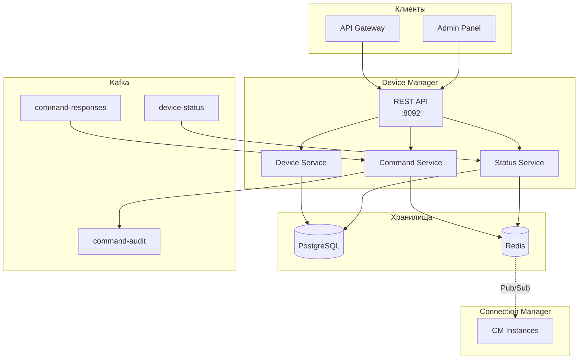
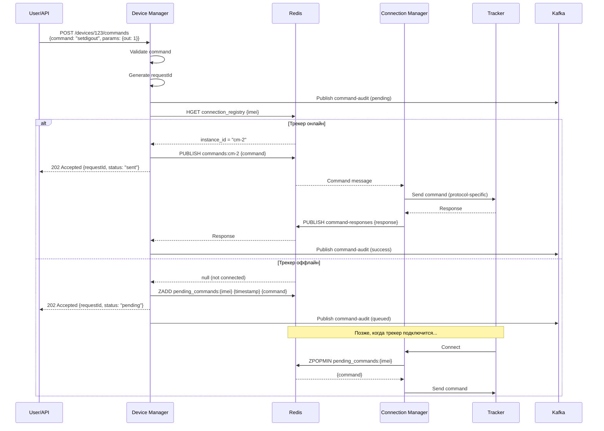

# 📱 Device Manager — Детальная документация

> **Блок:** 1 (Data Collection)  
> **Порт:** HTTP 8092 (REST API)  
> **Сложность:** Средняя  
> **Статус:** 🟡 В разработке

---

## 📋 Содержание

1. [Обзор](#обзор)
2. [Архитектура](#архитектура)
3. [REST API](#rest-api)
4. [Управление командами](#управление-командами)
5. [PostgreSQL схема](#postgresql-схема)
6. [Redis интеграция](#redis-интеграция)
7. [Kafka интеграция](#kafka-интеграция)
8. [Метрики и мониторинг](#метрики-и-мониторинг)
9. [Конфигурация](#конфигурация)

---

## Обзор

**Device Manager** — сервис управления устройствами (трекерами). Отвечает за CRUD операции с устройствами, отправку команд на трекеры и отслеживание их статуса.

### Ключевые характеристики

| Параметр | Значение |
|----------|----------|
| **Вход** | REST API, Kafka (device-status) |
| **Выход** | Redis (commands), Kafka (command-audit) |
| **База данных** | PostgreSQL |
| **Кеш** | Redis |
| **Роль** | CRUD устройств, отправка команд |

### Основные функции

1. **CRUD устройств** — создание, чтение, обновление, удаление
2. **Отправка команд** — блокировка двигателя, запрос позиции, настройки
3. **Статус устройств** — online/offline, последняя активность
4. **Группировка** — организация устройств по группам
5. **Привязка к организациям** — multi-tenant архитектура

---

## Архитектура



### Компоненты

| Компонент | Описание | Технология |
|-----------|----------|------------|
| **REST API** | HTTP endpoints | ZIO HTTP |
| **Device Service** | CRUD операции | Doobie |
| **Command Service** | Отправка команд | Redis Pub/Sub |
| **Status Service** | Online/Offline статус | Kafka Consumer |

---

## REST API

### OpenAPI Specification

```yaml
openapi: 3.0.0
info:
  title: Device Manager API
  version: 1.0.0
  description: API для управления GPS трекерами

servers:
  - url: http://localhost:8092/api/v1

paths:
  # ==================== DEVICES ====================
  /devices:
    get:
      summary: Список устройств
      tags: [Devices]
      parameters:
        - name: organization_id
          in: query
          required: true
          schema: { type: integer }
        - name: group_id
          in: query
          schema: { type: integer }
        - name: status
          in: query
          schema: { type: string, enum: [online, offline, all] }
        - name: page
          in: query
          schema: { type: integer, default: 1 }
        - name: limit
          in: query
          schema: { type: integer, default: 50 }
      responses:
        200:
          description: Список устройств
          content:
            application/json:
              schema:
                type: object
                properties:
                  data:
                    type: array
                    items: { $ref: '#/components/schemas/Device' }
                  pagination:
                    $ref: '#/components/schemas/Pagination'

    post:
      summary: Создать устройство
      tags: [Devices]
      requestBody:
        required: true
        content:
          application/json:
            schema: { $ref: '#/components/schemas/CreateDevice' }
      responses:
        201:
          description: Устройство создано
          content:
            application/json:
              schema: { $ref: '#/components/schemas/Device' }
        400:
          description: Невалидные данные
        409:
          description: IMEI уже существует

  /devices/{id}:
    get:
      summary: Получить устройство
      tags: [Devices]
      parameters:
        - name: id
          in: path
          required: true
          schema: { type: integer }
      responses:
        200:
          content:
            application/json:
              schema: { $ref: '#/components/schemas/DeviceDetails' }
        404:
          description: Устройство не найдено

    put:
      summary: Обновить устройство
      tags: [Devices]
      parameters:
        - name: id
          in: path
          required: true
          schema: { type: integer }
      requestBody:
        required: true
        content:
          application/json:
            schema: { $ref: '#/components/schemas/UpdateDevice' }
      responses:
        200:
          content:
            application/json:
              schema: { $ref: '#/components/schemas/Device' }

    delete:
      summary: Удалить устройство
      tags: [Devices]
      parameters:
        - name: id
          in: path
          required: true
          schema: { type: integer }
      responses:
        204:
          description: Устройство удалено

  /devices/{id}/position:
    get:
      summary: Текущая позиция
      tags: [Devices]
      parameters:
        - name: id
          in: path
          required: true
          schema: { type: integer }
      responses:
        200:
          content:
            application/json:
              schema: { $ref: '#/components/schemas/Position' }

  # ==================== COMMANDS ====================
  /devices/{id}/commands:
    post:
      summary: Отправить команду
      tags: [Commands]
      parameters:
        - name: id
          in: path
          required: true
          schema: { type: integer }
      requestBody:
        required: true
        content:
          application/json:
            schema: { $ref: '#/components/schemas/SendCommand' }
      responses:
        202:
          description: Команда принята
          content:
            application/json:
              schema: { $ref: '#/components/schemas/CommandStatus' }
        400:
          description: Неподдерживаемая команда
        404:
          description: Устройство не найдено

    get:
      summary: История команд
      tags: [Commands]
      parameters:
        - name: id
          in: path
          required: true
          schema: { type: integer }
        - name: from
          in: query
          schema: { type: string, format: date-time }
        - name: to
          in: query
          schema: { type: string, format: date-time }
      responses:
        200:
          content:
            application/json:
              schema:
                type: array
                items: { $ref: '#/components/schemas/CommandHistory' }

  /commands/{requestId}:
    get:
      summary: Статус команды
      tags: [Commands]
      parameters:
        - name: requestId
          in: path
          required: true
          schema: { type: string, format: uuid }
      responses:
        200:
          content:
            application/json:
              schema: { $ref: '#/components/schemas/CommandStatus' }

  # ==================== GROUPS ====================
  /groups:
    get:
      summary: Список групп
      tags: [Groups]
      parameters:
        - name: organization_id
          in: query
          required: true
          schema: { type: integer }
      responses:
        200:
          content:
            application/json:
              schema:
                type: array
                items: { $ref: '#/components/schemas/Group' }

    post:
      summary: Создать группу
      tags: [Groups]
      requestBody:
        required: true
        content:
          application/json:
            schema: { $ref: '#/components/schemas/CreateGroup' }
      responses:
        201:
          content:
            application/json:
              schema: { $ref: '#/components/schemas/Group' }

components:
  schemas:
    Device:
      type: object
      properties:
        id: { type: integer }
        imei: { type: string }
        name: { type: string }
        protocol: { type: string, enum: [teltonika, wialon, ruptela, navtelecom] }
        status: { type: string, enum: [online, offline] }
        organizationId: { type: integer }
        groupId: { type: integer, nullable: true }
        lastActivity: { type: string, format: date-time, nullable: true }
        createdAt: { type: string, format: date-time }

    DeviceDetails:
      allOf:
        - $ref: '#/components/schemas/Device'
        - type: object
          properties:
            simNumber: { type: string }
            model: { type: string }
            firmware: { type: string }
            lastPosition: { $ref: '#/components/schemas/Position' }
            config: { type: object }

    CreateDevice:
      type: object
      required: [imei, name, protocol, organizationId]
      properties:
        imei: { type: string, pattern: '^\d{15}$' }
        name: { type: string, minLength: 1, maxLength: 100 }
        protocol: { type: string, enum: [teltonika, wialon, ruptela, navtelecom] }
        organizationId: { type: integer }
        groupId: { type: integer }
        simNumber: { type: string }
        model: { type: string }

    UpdateDevice:
      type: object
      properties:
        name: { type: string }
        groupId: { type: integer, nullable: true }
        simNumber: { type: string }
        model: { type: string }
        enabled: { type: boolean }

    Position:
      type: object
      properties:
        latitude: { type: number }
        longitude: { type: number }
        speed: { type: integer }
        course: { type: integer }
        altitude: { type: integer }
        time: { type: string, format: date-time }
        isMoving: { type: boolean }
        sensors: { type: object }

    SendCommand:
      type: object
      required: [command]
      properties:
        command:
          type: string
          enum: [setdigout, getgps, reboot, setinterval, setparam, getver]
        params:
          type: object
          description: Параметры команды (зависят от типа)
        timeout:
          type: integer
          default: 30
          description: Таймаут ожидания ответа (секунды)

    CommandStatus:
      type: object
      properties:
        requestId: { type: string, format: uuid }
        deviceId: { type: integer }
        command: { type: string }
        status: { type: string, enum: [pending, sent, success, error, timeout] }
        response: { type: string, nullable: true }
        error: { type: string, nullable: true }
        createdAt: { type: string, format: date-time }
        completedAt: { type: string, format: date-time, nullable: true }

    CommandHistory:
      allOf:
        - $ref: '#/components/schemas/CommandStatus'
        - type: object
          properties:
            userId: { type: integer }
            userName: { type: string }

    Group:
      type: object
      properties:
        id: { type: integer }
        name: { type: string }
        organizationId: { type: integer }
        deviceCount: { type: integer }
        parentId: { type: integer, nullable: true }

    CreateGroup:
      type: object
      required: [name, organizationId]
      properties:
        name: { type: string }
        organizationId: { type: integer }
        parentId: { type: integer }

    Pagination:
      type: object
      properties:
        page: { type: integer }
        limit: { type: integer }
        total: { type: integer }
        pages: { type: integer }
```

---

## Управление командами

### Поток отправки команды



### Поддерживаемые команды

| Команда | Описание | Параметры | Teltonika | Wialon |
|---------|----------|-----------|-----------|--------|
| `setdigout` | Управление выходом | `{output: 1, value: 0/1}` | ✅ | ✅ |
| `getgps` | Запрос позиции | — | ✅ | ✅ |
| `reboot` | Перезагрузка | — | ✅ | ⚠️ |
| `setinterval` | Интервал отправки | `{interval: 30}` | ✅ | ✅ |
| `setparam` | Установка параметра | `{param: "X", value: "Y"}` | ✅ | ✅ |
| `getver` | Версия прошивки | — | ✅ | ✅ |

### Command Service

```scala
trait CommandService {
  def sendCommand(
    deviceId: Long,
    command: CommandType,
    params: Option[JsonObject],
    userId: Long,
    timeout: Duration = 30.seconds
  ): Task[CommandStatus]
  
  def getCommandStatus(requestId: UUID): Task[Option[CommandStatus]]
  
  def getCommandHistory(
    deviceId: Long,
    from: Option[Instant],
    to: Option[Instant]
  ): Task[List[CommandHistory]]
  
  def cancelCommand(requestId: UUID): Task[Boolean]
}

class CommandServiceImpl(
  redis: RedisClient,
  kafka: KafkaProducer,
  deviceRepo: DeviceRepository
) extends CommandService {
  
  def sendCommand(
    deviceId: Long,
    command: CommandType,
    params: Option[JsonObject],
    userId: Long,
    timeout: Duration
  ): Task[CommandStatus] = for {
    // 1. Получить устройство
    device <- deviceRepo.findById(deviceId)
      .someOrFail(DeviceNotFound(deviceId))
    
    // 2. Проверить поддержку команды
    _ <- ZIO.when(!device.protocol.supports(command)) {
      ZIO.fail(UnsupportedCommand(command, device.protocol))
    }
    
    // 3. Сгенерировать requestId
    requestId <- Random.nextUUID
    
    // 4. Создать сообщение команды
    cmdMsg = CommandMessage(
      requestId = requestId,
      imei = device.imei,
      command = command,
      params = params,
      timeout = timeout,
      createdAt = Instant.now()
    )
    
    // 5. Записать в audit log
    _ <- kafka.publish("command-audit", cmdMsg.toAuditEvent("pending"))
    
    // 6. Проверить онлайн ли устройство
    instanceOpt <- redis.hget("connection_registry", device.imei)
    
    status <- instanceOpt match {
      case Some(instanceId) =>
        // Устройство онлайн — отправляем команду
        for {
          _ <- redis.publish(s"commands:$instanceId", cmdMsg.toJson)
          _ <- kafka.publish("command-audit", cmdMsg.toAuditEvent("sent"))
        } yield CommandStatus(requestId, deviceId, command, "sent")
        
      case None =>
        // Устройство оффлайн — в очередь
        for {
          _ <- redis.zadd(
            s"pending_commands:${device.imei}",
            System.currentTimeMillis().toDouble,
            cmdMsg.toJson
          )
          _ <- kafka.publish("command-audit", cmdMsg.toAuditEvent("queued"))
        } yield CommandStatus(requestId, deviceId, command, "pending")
    }
  } yield status
}
```

---

## PostgreSQL схема

```sql
-- ===================== DEVICES =====================
CREATE TABLE devices (
  id BIGSERIAL PRIMARY KEY,
  imei VARCHAR(20) NOT NULL UNIQUE,
  name VARCHAR(100) NOT NULL,
  protocol VARCHAR(20) NOT NULL,
  
  -- Связи
  organization_id BIGINT NOT NULL REFERENCES organizations(id),
  group_id BIGINT REFERENCES device_groups(id),
  
  -- Метаданные
  sim_number VARCHAR(20),
  model VARCHAR(50),
  firmware VARCHAR(50),
  
  -- Статус
  enabled BOOLEAN NOT NULL DEFAULT true,
  status VARCHAR(20) NOT NULL DEFAULT 'offline',
  last_activity TIMESTAMPTZ,
  
  -- Конфигурация устройства
  config JSONB DEFAULT '{}',
  
  -- Аудит
  created_at TIMESTAMPTZ NOT NULL DEFAULT NOW(),
  updated_at TIMESTAMPTZ NOT NULL DEFAULT NOW(),
  created_by BIGINT REFERENCES users(id),
  
  -- Индексы
  CONSTRAINT valid_protocol CHECK (
    protocol IN ('teltonika', 'wialon', 'ruptela', 'navtelecom')
  ),
  CONSTRAINT valid_status CHECK (
    status IN ('online', 'offline')
  )
);

CREATE INDEX idx_devices_organization ON devices(organization_id);
CREATE INDEX idx_devices_group ON devices(group_id);
CREATE INDEX idx_devices_imei ON devices(imei);
CREATE INDEX idx_devices_status ON devices(status) WHERE enabled = true;

-- ===================== DEVICE GROUPS =====================
CREATE TABLE device_groups (
  id BIGSERIAL PRIMARY KEY,
  name VARCHAR(100) NOT NULL,
  organization_id BIGINT NOT NULL REFERENCES organizations(id),
  parent_id BIGINT REFERENCES device_groups(id),
  
  created_at TIMESTAMPTZ NOT NULL DEFAULT NOW(),
  updated_at TIMESTAMPTZ NOT NULL DEFAULT NOW(),
  
  UNIQUE(organization_id, name, parent_id)
);

CREATE INDEX idx_device_groups_org ON device_groups(organization_id);
CREATE INDEX idx_device_groups_parent ON device_groups(parent_id);

-- ===================== COMMANDS =====================
CREATE TABLE device_commands (
  id BIGSERIAL PRIMARY KEY,
  request_id UUID NOT NULL UNIQUE,
  device_id BIGINT NOT NULL REFERENCES devices(id),
  
  -- Команда
  command VARCHAR(50) NOT NULL,
  params JSONB,
  
  -- Статус
  status VARCHAR(20) NOT NULL DEFAULT 'pending',
  response TEXT,
  error TEXT,
  
  -- Таймаут
  timeout_seconds INTEGER NOT NULL DEFAULT 30,
  expires_at TIMESTAMPTZ NOT NULL,
  
  -- Аудит
  created_at TIMESTAMPTZ NOT NULL DEFAULT NOW(),
  completed_at TIMESTAMPTZ,
  created_by BIGINT REFERENCES users(id),
  
  CONSTRAINT valid_command_status CHECK (
    status IN ('pending', 'sent', 'success', 'error', 'timeout', 'cancelled')
  )
);

CREATE INDEX idx_commands_device ON device_commands(device_id);
CREATE INDEX idx_commands_request ON device_commands(request_id);
CREATE INDEX idx_commands_status ON device_commands(status) 
  WHERE status IN ('pending', 'sent');
CREATE INDEX idx_commands_expires ON device_commands(expires_at) 
  WHERE status IN ('pending', 'sent');

-- ===================== TRIGGERS =====================

-- Автообновление updated_at
CREATE OR REPLACE FUNCTION update_updated_at()
RETURNS TRIGGER AS $$
BEGIN
  NEW.updated_at = NOW();
  RETURN NEW;
END;
$$ LANGUAGE plpgsql;

CREATE TRIGGER tr_devices_updated_at
  BEFORE UPDATE ON devices
  FOR EACH ROW EXECUTE FUNCTION update_updated_at();

CREATE TRIGGER tr_device_groups_updated_at
  BEFORE UPDATE ON device_groups
  FOR EACH ROW EXECUTE FUNCTION update_updated_at();

-- ===================== VIEWS =====================

-- Устройства с количеством в группах
CREATE VIEW v_device_groups_with_count AS
SELECT 
  g.*,
  COUNT(d.id) as device_count
FROM device_groups g
LEFT JOIN devices d ON d.group_id = g.id AND d.enabled = true
GROUP BY g.id;

-- Онлайн устройства по организациям
CREATE VIEW v_organization_device_stats AS
SELECT 
  organization_id,
  COUNT(*) as total_devices,
  COUNT(*) FILTER (WHERE status = 'online') as online_devices,
  COUNT(*) FILTER (WHERE status = 'offline') as offline_devices,
  COUNT(*) FILTER (WHERE last_activity > NOW() - INTERVAL '1 hour') as active_last_hour
FROM devices
WHERE enabled = true
GROUP BY organization_id;
```

---

## Redis интеграция

### Структуры данных

```
┌─────────────────────────────────────────────────────────────────────┐
│                    REDIS (Device Manager)                            │
├─────────────────────────────────────────────────────────────────────┤
│                                                                     │
│  � ДАННЫЕ УСТРОЙСТВА (HASH)                                         │
│  ─────────────────────────────────────────────────────────────────  │
│  Key:     device:{imei}                                             │
│  Type:    HASH                                                      │
│  TTL:     Без TTL (персистентный)                                   │
│                                                                     │
│  CONTEXT поля (Device Manager пишет):                               │
│    vehicleId        — ID транспортного средства                     │
│    organizationId   — ID организации (multi-tenant)                 │
│    name             — Название устройства                           │
│    speedLimit       — Лимит скорости км/ч (опционально)             │
│    hasGeozones      — Флаг: есть геозоны для проверки               │
│    hasSpeedRules    — Флаг: есть правила скорости                   │
│    fuelTankVolume   — Объём бака (литры)                            │
│                                                                     │
│  POSITION поля (Connection Manager пишет):                          │
│    lat, lon, speed, course, altitude, satellites                   │
│    time, isMoving, lastActivity                                    │
│                                                                     │
│  CONNECTION поля (Connection Manager пишет):                        │
│    instanceId, protocol, connectedAt, remoteAddress                │
│                                                                     │
├─────────────────────────────────────────────────────────────────────┤
│                                                                     │
│  📨 ОЧЕРЕДЬ КОМАНД ДЛЯ ОФФЛАЙН УСТРОЙСТВ                             │
│  ─────────────────────────────────────────────────────────────────  │
│  Key:     pending_commands:{imei}                                   │
│  Type:    ZSET (sorted set)                                         │
│  Score:   timestamp (для FIFO)                                      │
│  TTL:     24 часа                                                   │
│  Value:   JSON команды                                              │
│  Example: ZADD pending_commands:860719020025346 1706270400 '{...}'  │
│                                                                     │
├─────────────────────────────────────────────────────────────────────┤
│                                                                     │
│  🔄 СТАТУС КОМАНД (для polling)                                      │
│  ─────────────────────────────────────────────────────────────────  │
│  Key:     command_status:{requestId}                                │
│  Type:    HASH                                                      │
│  TTL:     1 час                                                     │
│  Fields:  status, response, error, completedAt                     │
│                                                                     │
├─────────────────────────────────────────────────────────────────────┤
│                                                                     │
│  📢 PUB/SUB: ОТВЕТЫ НА КОМАНДЫ                                       │
│  ─────────────────────────────────────────────────────────────────  │
│  Channel: command-responses                                         │
│  Subscriber: Device Manager                                         │
│  Publisher: Connection Manager                                      │
│  Message:  {requestId, status, response, error}                    │
│                                                                     │
└─────────────────────────────────────────────────────────────────────┘
```

### Device Manager → Redis: Запись контекста

При CRUD операциях Device Manager обновляет **только CONTEXT поля** в HASH `device:{imei}`:

```scala
// При создании/обновлении устройства
def syncDeviceToRedis(device: Device): Task[Unit] =
  redis.hmset(s"device:${device.imei}", Map(
    "vehicleId"       -> device.id.toString,
    "organizationId"  -> device.organizationId.toString,
    "name"            -> device.name,
    "speedLimit"      -> device.speedLimit.map(_.toString).getOrElse(""),
    "hasGeozones"     -> device.hasGeozones.toString,
    "hasSpeedRules"   -> device.hasSpeedRules.toString,
    "fuelTankVolume"  -> device.fuelTankVolume.map(_.toString).getOrElse("")
  ))

// При удалении устройства
def removeDeviceFromRedis(imei: String): Task[Unit] =
  redis.del(s"device:$imei")
```

### Daily Sync Job: Redis ↔ PostgreSQL

Ежедневная синхронизация для обеспечения консистентности:

```scala
/**
 * Daily Sync Job
 * 
 * Запускается раз в сутки (например, 03:00 UTC)
 * Гарантирует консистентность Redis ↔ PostgreSQL
 */
def dailySyncJob: Task[SyncReport] = for {
  // 1. Получаем все device:* ключи из Redis
  redisKeys <- redis.keys("device:*")
  redisImeis = redisKeys.map(_.stripPrefix("device:")).toSet
  
  // 2. Получаем все IMEI из PostgreSQL
  dbDevices <- deviceRepository.findAllEnabled()
  dbImeis = dbDevices.map(_.imei).toSet
  
  // 3. Находим расхождения
  orphanedInRedis = redisImeis -- dbImeis    // Есть в Redis, нет в БД
  missingInRedis = dbImeis -- redisImeis     // Есть в БД, нет в Redis
  
  // 4. Удаляем orphaned записи из Redis
  _ <- ZIO.foreachDiscard(orphanedInRedis) { imei =>
    redis.del(s"device:$imei") *>
    ZIO.logWarning(s"[SYNC] Удалён orphaned ключ device:$imei")
  }
  
  // 5. Добавляем недостающие записи в Redis
  _ <- ZIO.foreachDiscard(missingInRedis) { imei =>
    deviceRepository.findByImei(imei).flatMap {
      case Some(device) => syncDeviceToRedis(device)
      case None => ZIO.unit
    } *>
    ZIO.logInfo(s"[SYNC] Добавлен ключ device:$imei")
  }
  
  // 6. Проверяем drift (расхождение данных) для существующих
  driftCount <- ZIO.foldLeft(dbImeis.intersect(redisImeis))(0) { (count, imei) =>
    for {
      redisData <- redis.hgetall(s"device:$imei")
      dbDevice <- deviceRepository.findByImei(imei)
      hasDrift = dbDevice.exists { d =>
        redisData.get("organizationId") != Some(d.organizationId.toString) ||
        redisData.get("hasGeozones") != Some(d.hasGeozones.toString) ||
        redisData.get("hasSpeedRules") != Some(d.hasSpeedRules.toString)
      }
      _ <- ZIO.when(hasDrift)(
        dbDevice.traverse(syncDeviceToRedis) *>
        ZIO.logWarning(s"[SYNC] Исправлен drift для device:$imei")
      )
    } yield if (hasDrift) count + 1 else count
  }
  
  report = SyncReport(
    orphanedDeleted = orphanedInRedis.size,
    missingAdded = missingInRedis.size,
    driftFixed = driftCount,
    totalDevices = dbDevices.size
  )
  
  _ <- ZIO.logInfo(s"[SYNC] Завершено: $report")
} yield report

case class SyncReport(
  orphanedDeleted: Int,
  missingAdded: Int,
  driftFixed: Int,
  totalDevices: Int
)
```

### Обработка ответов на команды

```scala
object CommandResponseHandler {
  
  def run(
    redis: RedisClient,
    commandRepo: CommandRepository,
    kafka: KafkaProducer
  ): ZIO[Any, Throwable, Unit] = {
    
    redis
      .subscribe("command-responses")
      .mapZIO { message =>
        for {
          response <- ZIO.fromEither(message.as[CommandResponse])
          
          // Обновить статус в Redis (для быстрого polling)
          _ <- redis.hset(
            s"command_status:${response.requestId}",
            Map(
              "status" -> response.status,
              "response" -> response.response.getOrElse(""),
              "error" -> response.error.getOrElse(""),
              "completedAt" -> Instant.now().toString
            )
          )
          _ <- redis.expire(s"command_status:${response.requestId}", 1.hour)
          
          // Обновить в PostgreSQL
          _ <- commandRepo.updateStatus(
            response.requestId,
            response.status,
            response.response,
            response.error
          )
          
          // Записать в audit log
          _ <- kafka.publish("command-audit", response.toAuditEvent)
          
        } yield ()
      }
      .runDrain
  }
}
```

---

## Kafka интеграция

### Топики

| Топик | Роль | Описание |
|-------|------|----------|
| `device-status` | Consumer | Online/offline события от CM |
| `command-audit` | Producer | Лог всех команд |
| `command-responses` | — | Через Redis Pub/Sub |

### Device Status Consumer

```scala
object DeviceStatusConsumer {
  
  def run(
    deviceRepo: DeviceRepository,
    redis: RedisClient
  ): ZStream[Consumer, Throwable, Unit] = {
    
    Consumer
      .subscribeAnd(Subscription.topics("device-status"))
      .plainStream(Serde.string, DeviceStatusSerde)
      .mapZIO { record =>
        val event = record.value
        
        for {
          // Обновить статус в PostgreSQL
          _ <- deviceRepo.updateStatus(
            imei = event.imei,
            status = event.status,
            lastActivity = Some(event.timestamp)
          )
          
          // Обновить кеш
          _ <- redis.hset(s"device:imei:${event.imei}", "status", event.status)
          
          // Если устройство подключилось — отправить pending команды
          _ <- ZIO.when(event.status == "online") {
            processPendingCommands(event.imei, redis)
          }
          
          _ <- record.offset.commit
        } yield ()
      }
  }
  
  private def processPendingCommands(
    imei: String,
    redis: RedisClient
  ): Task[Unit] = for {
    // Получить все pending команды
    commands <- redis.zrangeByScore(
      s"pending_commands:$imei",
      0,
      System.currentTimeMillis().toDouble
    )
    
    // Получить instance, на котором подключено устройство
    instanceOpt <- redis.hget("connection_registry", imei)
    
    _ <- instanceOpt match {
      case Some(instanceId) =>
        ZIO.foreachDiscard(commands) { cmdJson =>
          for {
            _ <- redis.publish(s"commands:$instanceId", cmdJson)
            _ <- redis.zrem(s"pending_commands:$imei", cmdJson)
          } yield ()
        }
      case None =>
        ZIO.logWarning(s"Device $imei went offline before pending commands sent")
    }
  } yield ()
}
```

### Command Audit Event

```scala
case class CommandAuditEvent(
  requestId: UUID,
  deviceId: Long,
  imei: String,
  command: String,
  params: Option[JsonObject],
  status: String,
  response: Option[String],
  error: Option[String],
  userId: Long,
  timestamp: Instant
)

// Kafka message key: deviceId
// Partition: по deviceId для ordering команд одного устройства
```

---

## Метрики и мониторинг

### Prometheus метрики

```
# API
dm_api_requests_total{method="GET",path="/devices",status="200"} 12345
dm_api_latency_seconds_bucket{method="POST",path="/commands",le="0.1"} 9900

# Устройства
dm_devices_total{organization="1",status="online"} 450
dm_devices_total{organization="1",status="offline"} 50

# Команды
dm_commands_total{command="setdigout",status="success"} 1234
dm_commands_total{command="setdigout",status="error"} 12
dm_commands_total{command="setdigout",status="timeout"} 5
dm_command_duration_seconds_bucket{command="getgps",le="5"} 900
dm_pending_commands_total 23

# База данных
dm_db_queries_total{query="findDevice"} 56789
dm_db_latency_seconds_bucket{query="findDevice",le="0.01"} 56000
```

### Алерты

```yaml
groups:
  - name: device-manager
    rules:
      - alert: DMCommandTimeouts
        expr: rate(dm_commands_total{status="timeout"}[5m]) > 5
        for: 5m
        labels:
          severity: warning
        annotations:
          summary: "High command timeout rate"

      - alert: DMPendingCommandsHigh
        expr: dm_pending_commands_total > 100
        for: 10m
        labels:
          severity: warning
        annotations:
          summary: "Many pending commands (devices offline)"

      - alert: DMAPILatencyHigh
        expr: histogram_quantile(0.99, dm_api_latency_seconds_bucket) > 1
        for: 5m
        labels:
          severity: warning
        annotations:
          summary: "API latency > 1s"
```

---

## Конфигурация

### application.conf

```hocon
device-manager {
  server {
    host = "0.0.0.0"
    port = 8092
  }
  
  database {
    url = ${DATABASE_URL}
    driver = "org.postgresql.Driver"
    pool {
      max-size = 20
      min-idle = 5
    }
  }
  
  redis {
    host = ${REDIS_HOST}
    port = 6379
    
    pending-commands-ttl = 24h
    device-cache-ttl = 1h
    command-status-ttl = 1h
  }
  
  kafka {
    bootstrap-servers = ${KAFKA_BROKERS}
    
    consumer {
      group-id = "device-manager-group"
      topics = ["device-status"]
    }
    
    producer {
      topic = "command-audit"
    }
  }
  
  commands {
    default-timeout = 30s
    max-timeout = 300s
    max-pending-per-device = 10
  }
}
```

### Docker Compose

```yaml
services:
  device-manager:
    build: ./services/device-manager
    ports:
      - "8092:8092"
    environment:
      - DATABASE_URL=postgresql://postgres:5432/tracker
      - REDIS_HOST=redis
      - KAFKA_BROKERS=kafka:9092
    depends_on:
      - postgres
      - redis
      - kafka
    healthcheck:
      test: ["CMD", "curl", "-f", "http://localhost:8092/health"]
      interval: 10s
      timeout: 5s
      retries: 3
```

---

## 📊 Сравнение сервисов Block 1

| Параметр | Connection Manager | History Writer | Device Manager |
|----------|-------------------|----------------|----------------|
| **Вход** | TCP (трекеры) | Kafka | REST API |
| **Выход** | Kafka + Redis | TimescaleDB | Redis + Kafka |
| **State** | Stateless | Stateless | PostgreSQL |
| **Роль** | Приём данных | Хранение истории | CRUD + команды |
| **Критичность** | Высокая | Средняя | Средняя |

---

## 📚 Связанные документы

- [ARCHITECTURE_BLOCK1.md](../ARCHITECTURE_BLOCK1.md) — Обзор Block 1
- [CONNECTION_MANAGER.md](./CONNECTION_MANAGER.md) — Connection Manager
- [HISTORY_WRITER.md](./HISTORY_WRITER.md) — History Writer
- [GEOZONES_SERVICE.md](./GEOZONES_SERVICE.md) — Следующий сервис (Block 2)

---

## 🤖 Промпт для AI-агента

<details>
<summary><b>Развернуть полный промпт для реализации Device Manager</b></summary>

```markdown
# ЗАДАЧА: Реализовать Device Manager для TrackerGPS

## КОНТЕКСТ
Ты — senior Scala разработчик. Создай Device Manager — сервис управления устройствами (трекерами) для системы мониторинга транспорта TrackerGPS.

## ТЕХНИЧЕСКИЙ СТЕК (ОБЯЗАТЕЛЬНО)
- **Язык:** Scala 3.4.0
- **Эффекты:** ZIO 2.0.20
- **HTTP:** zio-http (REST API)
- **PostgreSQL:** Quill или Doobie
- **Redis:** zio-redis
- **Kafka:** zio-kafka (producer)
- **JSON:** zio-json
- **Конфигурация:** zio-config + HOCON
- **Метрики:** zio-metrics + Prometheus
- **Сборка:** SBT

## АРХИТЕКТУРА СЕРВИСА

### Основные компоненты:
1. **REST API** — CRUD для устройств, групп, команд
2. **Device Repository** — PostgreSQL операции
3. **Redis Client** — кеш, статусы, очередь команд
4. **Kafka Producer** — audit log команд
5. **Command Queue** — очередь команд для устройств

### Flow управления командами:
```
REST API → Validate → Save to Redis Queue → Kafka Audit
                              ↓
Connection Manager reads queue → Send to device → ACK → Update status
```

## ТРЕБОВАНИЯ К РЕАЛИЗАЦИИ

### 1. REST API Endpoints

```scala
// Devices CRUD
GET    /api/v1/devices                    // Список устройств (с пагинацией)
GET    /api/v1/devices/{id}               // Одно устройство
POST   /api/v1/devices                    // Создать
PUT    /api/v1/devices/{id}               // Обновить
DELETE /api/v1/devices/{id}               // Удалить
GET    /api/v1/devices/{id}/status        // Онлайн-статус из Redis

// Groups
GET    /api/v1/groups
POST   /api/v1/groups
PUT    /api/v1/groups/{id}
DELETE /api/v1/groups/{id}
POST   /api/v1/groups/{id}/devices        // Добавить устройства в группу

// Commands
POST   /api/v1/devices/{id}/commands      // Отправить команду
GET    /api/v1/devices/{id}/commands      // История команд
GET    /api/v1/commands/{commandId}       // Статус команды

// Bulk operations
POST   /api/v1/devices/bulk/commands      // Команда нескольким устройствам
```

### 2. Модели данных

```scala
// Device
case class Device(
  id: Long,
  organizationId: Long,
  imei: String,
  name: String,
  licensePlate: Option[String],
  vehicleType: VehicleType,
  groupId: Option[Long],
  protocol: Protocol,
  phoneNumber: Option[String],
  description: Option[String],
  icon: Option[String],
  enabled: Boolean,
  createdAt: Instant,
  updatedAt: Instant
)

enum VehicleType:
  case Car, Truck, Bus, Motorcycle, Trailer, Other

// Device Status (из Redis)
case class DeviceStatus(
  deviceId: Long,
  imei: String,
  online: Boolean,
  lastSeen: Instant,
  protocol: Protocol,
  connectionId: Option[String]
)

// Command
case class DeviceCommand(
  id: UUID,
  deviceId: Long,
  commandType: CommandType,
  payload: Option[JsonObject],
  status: CommandStatus,
  createdAt: Instant,
  sentAt: Option[Instant],
  acknowledgedAt: Option[Instant],
  result: Option[String],
  error: Option[String]
)

enum CommandType:
  case EngineBlock, EngineUnblock, RequestPosition, 
       SetInterval, Reboot, Custom

enum CommandStatus:
  case Pending, Sent, Acknowledged, Failed, Expired
```

### 3. PostgreSQL Schema

```sql
CREATE TABLE devices (
  id BIGSERIAL PRIMARY KEY,
  organization_id BIGINT NOT NULL REFERENCES organizations(id),
  imei VARCHAR(20) NOT NULL UNIQUE,
  name VARCHAR(100) NOT NULL,
  license_plate VARCHAR(20),
  vehicle_type VARCHAR(20) NOT NULL DEFAULT 'car',
  group_id BIGINT REFERENCES device_groups(id),
  protocol VARCHAR(20) NOT NULL,
  phone_number VARCHAR(20),
  description TEXT,
  icon VARCHAR(50),
  enabled BOOLEAN NOT NULL DEFAULT true,
  created_at TIMESTAMPTZ NOT NULL DEFAULT NOW(),
  updated_at TIMESTAMPTZ NOT NULL DEFAULT NOW()
);

CREATE TABLE device_groups (
  id BIGSERIAL PRIMARY KEY,
  organization_id BIGINT NOT NULL REFERENCES organizations(id),
  name VARCHAR(100) NOT NULL,
  parent_id BIGINT REFERENCES device_groups(id),
  created_at TIMESTAMPTZ NOT NULL DEFAULT NOW()
);

CREATE TABLE device_commands (
  id UUID PRIMARY KEY DEFAULT gen_random_uuid(),
  device_id BIGINT NOT NULL REFERENCES devices(id),
  command_type VARCHAR(50) NOT NULL,
  payload JSONB,
  status VARCHAR(20) NOT NULL DEFAULT 'pending',
  created_at TIMESTAMPTZ NOT NULL DEFAULT NOW(),
  sent_at TIMESTAMPTZ,
  acknowledged_at TIMESTAMPTZ,
  result TEXT,
  error TEXT
);
```

### 4. Redis Operations

```scala
trait DeviceCache:
  // Кеш устройства
  def getDevice(id: Long): UIO[Option[Device]]
  def setDevice(device: Device, ttl: Duration): UIO[Unit]
  def invalidate(id: Long): UIO[Unit]
  
trait DeviceStatusStore:
  // Статус (пишет Connection Manager)
  def getStatus(deviceId: Long): UIO[Option[DeviceStatus]]
  def isOnline(deviceId: Long): UIO[Boolean]
  
trait CommandQueue:
  // Очередь команд для устройства
  def enqueue(imei: String, command: DeviceCommand): Task[Unit]
  def dequeue(imei: String): UIO[Option[DeviceCommand]]
  def acknowledge(imei: String, commandId: UUID, result: String): Task[Unit]

// Redis keys:
// device:{id} = JSON (cache, TTL 5 min)
// device:imei:{imei} = device_id (lookup)
// device:{id}:status = JSON (DeviceStatus)
// device:{imei}:commands = List (queue)
```

### 5. Kafka Audit

```scala
// При каждой команде — публикуем в Kafka для аудита
trait CommandAuditProducer:
  def publish(event: CommandAuditEvent): Task[Unit]

case class CommandAuditEvent(
  commandId: UUID,
  deviceId: Long,
  organizationId: Long,
  userId: Long,
  commandType: String,
  status: String,
  timestamp: Instant
)

// Topic: command-audit
```

### 6. Service Layer

```scala
trait DeviceService:
  def list(orgId: Long, filter: DeviceFilter, page: Page): Task[PagedResult[Device]]
  def getById(id: Long): Task[Option[Device]]
  def getByImei(imei: String): Task[Option[Device]]
  def create(request: CreateDeviceRequest): Task[Device]
  def update(id: Long, request: UpdateDeviceRequest): Task[Device]
  def delete(id: Long): Task[Unit]
  def getStatus(id: Long): Task[DeviceStatus]

trait CommandService:
  def send(deviceId: Long, command: SendCommandRequest): Task[DeviceCommand]
  def sendBulk(deviceIds: List[Long], command: SendCommandRequest): Task[List[DeviceCommand]]
  def getStatus(commandId: UUID): Task[DeviceCommand]
  def getHistory(deviceId: Long, page: Page): Task[PagedResult[DeviceCommand]]
```

### 7. Validation

```scala
object DeviceValidation:
  def validateImei(imei: String): Either[String, String] =
    if imei.matches("^\\d{15}$") then Right(imei)
    else Left("IMEI must be 15 digits")
  
  def validateLicensePlate(plate: Option[String]): Either[String, Option[String]] =
    plate match
      case Some(p) if p.length > 20 => Left("License plate too long")
      case _ => Right(plate)
```

## СТРУКТУРА ПРОЕКТА
```
device-manager/
├── src/main/scala/
│   └── trackergps/devicemanager/
│       ├── Main.scala
│       ├── config/
│       │   └── AppConfig.scala
│       ├── api/
│       │   ├── DeviceApi.scala
│       │   ├── GroupApi.scala
│       │   ├── CommandApi.scala
│       │   └── dto/
│       │       ├── DeviceDto.scala
│       │       └── CommandDto.scala
│       ├── service/
│       │   ├── DeviceService.scala
│       │   ├── GroupService.scala
│       │   └── CommandService.scala
│       ├── repository/
│       │   ├── DeviceRepository.scala
│       │   ├── GroupRepository.scala
│       │   └── CommandRepository.scala
│       ├── redis/
│       │   ├── DeviceCache.scala
│       │   ├── DeviceStatusStore.scala
│       │   └── CommandQueue.scala
│       ├── kafka/
│       │   └── CommandAuditProducer.scala
│       └── validation/
│           └── DeviceValidation.scala
├── src/main/resources/
│   └── application.conf
└── build.sbt
```

## ПРИМЕР КОДА

```scala
// DeviceApi.scala
object DeviceApi:
  def routes: Routes[DeviceService & AuthContext, Response] =
    Routes(
      Method.GET / "api" / "v1" / "devices" -> handler { (req: Request) =>
        for
          auth   <- ZIO.service[AuthContext]
          filter <- req.queryParams.decode[DeviceFilter]
          page   <- req.queryParams.decode[Page]
          result <- ZIO.serviceWithZIO[DeviceService](_.list(auth.orgId, filter, page))
        yield Response.json(result.toJson)
      },
      
      Method.POST / "api" / "v1" / "devices" / long("id") / "commands" -> 
        handler { (id: Long, req: Request) =>
          for
            auth    <- ZIO.service[AuthContext]
            body    <- req.body.asJson[SendCommandRequest]
            command <- ZIO.serviceWithZIO[CommandService](_.send(id, body))
          yield Response.json(command.toJson).status(Status.Created)
        }
    )
```

## КРИТЕРИИ ПРИЁМКИ

1. ✅ CRUD для устройств с валидацией
2. ✅ Группировка устройств (иерархическая)
3. ✅ Очередь команд в Redis
4. ✅ Статус online/offline из Redis
5. ✅ Kafka audit для команд
6. ✅ Пагинация, фильтрация, сортировка
7. ✅ Multi-tenant (organization_id)
8. ✅ Unit тесты для service layer
9. ✅ OpenAPI спецификация

## ЗАВИСИМОСТИ ОТ ДРУГИХ СЕРВИСОВ
- **Connection Manager** — пишет статус в Redis, читает команды
- **Auth Service** — валидация JWT токенов
```

</details>

---

**Дата:** 26 января 2026  
**Статус:** Документация готова ✅
