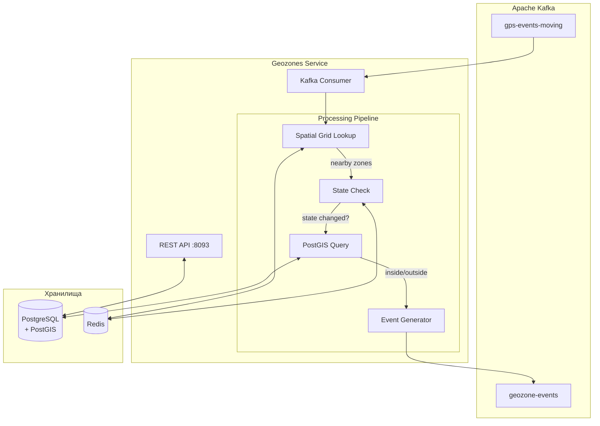
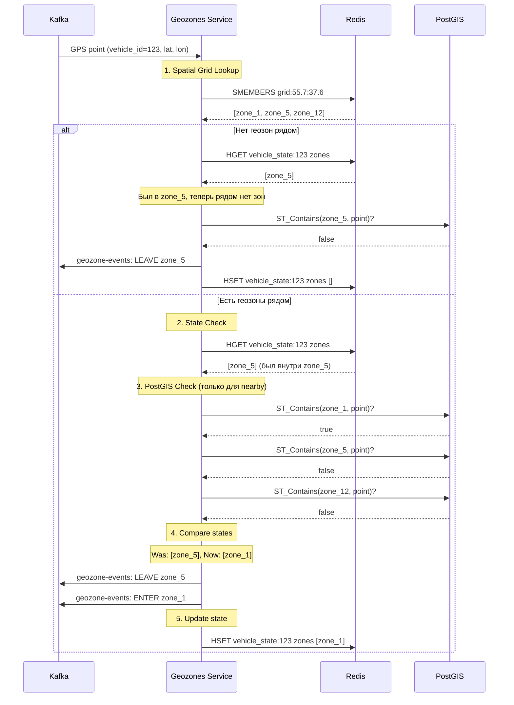

# 🗺️ Geozones Service — Детальная документация

> **Блок:** 2 (Business Logic)  
> **Порт:** HTTP 8093 (REST API + Admin)  
> **Сложность:** Высокая  
> **Статус:** 📋 Спроектирован

---

## 📋 Содержание

1. [Обзор](#обзор)
2. [Архитектура](#архитектура)
3. [Алгоритм проверки геозон](#алгоритм-проверки-геозон)
4. [Spatial Grid оптимизация](#spatial-grid-оптимизация)
5. [PostgreSQL + PostGIS схема](#postgresql--postgis-схема)
6. [Redis интеграция](#redis-интеграция)
7. [Kafka интеграция](#kafka-интеграция)
8. [REST API](#rest-api)
9. [Метрики и мониторинг](#метрики-и-мониторинг)
10. [Конфигурация](#конфигурация)

---

## Обзор

**Geozones Service** — сервис проверки вхождения GPS координат в геозоны. Генерирует события входа/выхода для уведомлений и аналитики.

### Ключевые характеристики

| Параметр | Значение |
|----------|----------|
| **Вход** | Kafka `gps-events-moving` |
| **Выход** | Kafka `geozone-events` |
| **БД** | PostgreSQL + PostGIS |
| **Кеш** | Redis (Spatial Grid + State) |
| **Пропускная способность** | 10,000+ точек/сек |

### Типы геозон

| Тип | Описание | PostGIS |
|-----|----------|---------|
| **Круг** | Центр + радиус | `ST_Buffer(point, radius)` |
| **Полигон** | Произвольная форма | `POLYGON((...))` |
| **Коридор** | Маршрут + ширина | `ST_Buffer(LINESTRING, width)` |

---

## Архитектура



### Компоненты

| Компонент | Описание |
|-----------|----------|
| **Kafka Consumer** | Читает GPS точки (только движущиеся!) |
| **Spatial Grid Lookup** | O(1) поиск геозон рядом с точкой |
| **State Check** | Проверка "уже внутри или снаружи?" |
| **PostGIS Query** | Точная проверка ST_Contains |
| **Event Generator** | Генерация enter/leave событий |
| **REST API** | CRUD геозон |

---

## Алгоритм проверки геозон

### Почему только движущиеся машины?

```
Стоящая машина НЕ может выехать из геозоны!
→ Нет смысла проверять 7000 точек/сек со стоянок
→ Проверяем только ~3000 точек/сек (движение)
→ Экономия 70% ресурсов
```

### Поток обработки



### Scala реализация

```scala
case class GpsPoint(
  vehicleId: Long,
  latitude: Double,
  longitude: Double,
  time: Instant
)

case class GeozoneEvent(
  vehicleId: Long,
  geozoneId: Long,
  eventType: EventType, // ENTER | LEAVE
  latitude: Double,
  longitude: Double,
  time: Instant
)

class GeozoneChecker(
  redis: RedisClient,
  postgis: PostGISRepository,
  config: GeozoneConfig
) {
  
  def checkPoint(point: GpsPoint): Task[List[GeozoneEvent]] = for {
    // 1. Spatial Grid: какие зоны рядом?
    nearbyZones <- getNearbyZones(point.latitude, point.longitude)
    
    // 2. Текущее состояние машины
    currentState <- redis.hget(s"vehicle_state:${point.vehicleId}", "zones")
      .map(_.map(parseZoneIds).getOrElse(Set.empty))
    
    // 3. PostGIS: точная проверка для nearby зон
    insideZones <- if (nearbyZones.isEmpty && currentState.isEmpty) {
      ZIO.succeed(Set.empty[Long])
    } else {
      val zonesToCheck = nearbyZones ++ currentState
      postgis.findContainingZones(point.latitude, point.longitude, zonesToCheck)
    }
    
    // 4. Сравнение: какие события генерировать?
    entered = insideZones -- currentState
    left = currentState -- insideZones
    
    events = 
      entered.map(zid => GeozoneEvent(point.vehicleId, zid, ENTER, point.latitude, point.longitude, point.time)).toList ++
      left.map(zid => GeozoneEvent(point.vehicleId, zid, LEAVE, point.latitude, point.longitude, point.time)).toList
    
    // 5. Обновить состояние
    _ <- redis.hset(s"vehicle_state:${point.vehicleId}", "zones", insideZones.mkString(","))
    
  } yield events
  
  private def getNearbyZones(lat: Double, lon: Double): Task[Set[Long]] = {
    // Grid cell size: 0.1° ≈ 11 км
    val gridLat = (lat * 10).toInt / 10.0
    val gridLon = (lon * 10).toInt / 10.0
    val gridKey = s"grid:$gridLat:$gridLon"
    
    redis.smembers(gridKey).map(_.map(_.toLong).toSet)
  }
}
```

---

## Spatial Grid оптимизация

### Концепция

```
┌─────────────────────────────────────────────────────────────────────┐
│                        SPATIAL GRID                                  │
│                                                                     │
│  Разбиваем карту на ячейки ~11×11 км (0.1° × 0.1°)                  │
│  В каждой ячейке храним ID геозон, которые её пересекают           │
│                                                                     │
│  ┌──────┬──────┬──────┬──────┬──────┐                               │
│  │      │ Z1   │ Z1   │      │      │  Z1 = Геозона "Склад"        │
│  │      │ Z2   │ Z2   │ Z2   │      │  Z2 = Геозона "Москва"       │
│  ├──────┼──────┼──────┼──────┼──────┤  Z3 = Геозона "Офис"         │
│  │      │ Z2   │Z1,Z2 │ Z2   │      │                               │
│  │      │ Z3   │ Z3   │      │      │                               │
│  ├──────┼──────┼──────┼──────┼──────┤                               │
│  │      │ Z2   │ Z2   │ Z2   │      │                               │
│  │      │      │      │      │      │                               │
│  └──────┴──────┴──────┴──────┴──────┘                               │
│                                                                     │
│  Точка (55.75, 37.62) → grid:55.7:37.6 → [Z1, Z2, Z3]              │
│  Вместо проверки 1000 зон, проверяем только 3!                     │
│                                                                     │
└─────────────────────────────────────────────────────────────────────┘
```

### Построение Spatial Grid

```scala
object SpatialGridBuilder {
  
  val GRID_SIZE = 0.1  // ~11 км
  
  def buildGrid(geozones: List[Geozone]): Map[String, Set[Long]] = {
    geozones.flatMap { zone =>
      // Получить bounding box геозоны
      val bbox = zone.geometry.getEnvelopeInternal
      
      // Найти все ячейки, которые пересекает bbox
      val cells = for {
        lat <- (bbox.getMinY / GRID_SIZE).toInt to (bbox.getMaxY / GRID_SIZE).toInt
        lon <- (bbox.getMinX / GRID_SIZE).toInt to (bbox.getMaxX / GRID_SIZE).toInt
      } yield s"grid:${lat * GRID_SIZE}:${lon * GRID_SIZE}"
      
      cells.map(_ -> zone.id)
    }
    .groupBy(_._1)
    .map { case (cell, zones) => cell -> zones.map(_._2).toSet }
  }
  
  def updateGridInRedis(
    redis: RedisClient,
    grid: Map[String, Set[Long]]
  ): Task[Unit] = {
    ZIO.foreachDiscard(grid) { case (cell, zoneIds) =>
      redis.sadd(cell, zoneIds.map(_.toString).toSeq: _*)
    }
  }
  
  // При создании/обновлении геозоны
  def addZoneToGrid(
    redis: RedisClient,
    zone: Geozone
  ): Task[Unit] = {
    val cells = getCellsForGeometry(zone.geometry)
    ZIO.foreachDiscard(cells) { cell =>
      redis.sadd(cell, zone.id.toString)
    }
  }
  
  // При удалении геозоны
  def removeZoneFromGrid(
    redis: RedisClient,
    zone: Geozone
  ): Task[Unit] = {
    val cells = getCellsForGeometry(zone.geometry)
    ZIO.foreachDiscard(cells) { cell =>
      redis.srem(cell, zone.id.toString)
    }
  }
}
```

### Производительность

| Подход | 10K точек/сек × 1000 зон | Проверок/сек |
|--------|--------------------------|--------------|
| **Наивный** | Каждую точку × каждую зону | 10,000,000 |
| **Spatial Grid** | Каждую точку × 2-5 зон | 20,000-50,000 |
| **+ State Cache** | Только изменения | ~5,000 |

**Ускорение: 200-2000x!**

---

## PostgreSQL + PostGIS схема

```sql
-- Расширение PostGIS
CREATE EXTENSION IF NOT EXISTS postgis;

-- ===================== GEOZONES =====================
CREATE TABLE geozones (
  id BIGSERIAL PRIMARY KEY,
  name VARCHAR(100) NOT NULL,
  description TEXT,
  
  -- Геометрия (PostGIS)
  geometry GEOMETRY(Geometry, 4326) NOT NULL,
  geometry_type VARCHAR(20) NOT NULL, -- 'circle', 'polygon', 'corridor'
  
  -- Для кругов (удобство)
  center_lat DOUBLE PRECISION,
  center_lon DOUBLE PRECISION,
  radius_meters INTEGER,
  
  -- Связи
  organization_id BIGINT NOT NULL REFERENCES organizations(id),
  
  -- Фильтрация (каким машинам применяется)
  apply_to_all BOOLEAN NOT NULL DEFAULT true,
  vehicle_ids BIGINT[] DEFAULT '{}',
  group_ids BIGINT[] DEFAULT '{}',
  
  -- Настройки
  color VARCHAR(7) DEFAULT '#FF0000',
  enabled BOOLEAN NOT NULL DEFAULT true,
  
  -- Аудит
  created_at TIMESTAMPTZ NOT NULL DEFAULT NOW(),
  updated_at TIMESTAMPTZ NOT NULL DEFAULT NOW(),
  created_by BIGINT REFERENCES users(id),
  
  CONSTRAINT valid_geometry_type CHECK (
    geometry_type IN ('circle', 'polygon', 'corridor')
  )
);

-- Пространственный индекс (КРИТИЧНО для производительности!)
CREATE INDEX idx_geozones_geometry ON geozones USING GIST (geometry);
CREATE INDEX idx_geozones_org ON geozones(organization_id);
CREATE INDEX idx_geozones_enabled ON geozones(enabled) WHERE enabled = true;

-- ===================== GEOZONE EVENTS (история) =====================
CREATE TABLE geozone_events (
  time TIMESTAMPTZ NOT NULL,
  vehicle_id BIGINT NOT NULL,
  geozone_id BIGINT NOT NULL REFERENCES geozones(id),
  event_type VARCHAR(10) NOT NULL, -- 'enter', 'leave'
  
  latitude DOUBLE PRECISION NOT NULL,
  longitude DOUBLE PRECISION NOT NULL,
  
  -- Дополнительная информация
  duration_inside INTEGER, -- секунд (для leave событий)
  
  PRIMARY KEY (time, vehicle_id, geozone_id)
);

-- Hypertable для TimescaleDB
SELECT create_hypertable('geozone_events', 'time', if_not_exists => TRUE);

CREATE INDEX idx_geozone_events_vehicle ON geozone_events(vehicle_id, time DESC);
CREATE INDEX idx_geozone_events_zone ON geozone_events(geozone_id, time DESC);

-- ===================== FUNCTIONS =====================

-- Проверка вхождения точки в геозоны
CREATE OR REPLACE FUNCTION find_containing_zones(
  p_lat DOUBLE PRECISION,
  p_lon DOUBLE PRECISION,
  p_zone_ids BIGINT[]
)
RETURNS TABLE(zone_id BIGINT) AS $$
BEGIN
  RETURN QUERY
  SELECT g.id
  FROM geozones g
  WHERE g.id = ANY(p_zone_ids)
    AND g.enabled = true
    AND ST_Contains(g.geometry, ST_SetSRID(ST_MakePoint(p_lon, p_lat), 4326));
END;
$$ LANGUAGE plpgsql;

-- Создание круговой геозоны
CREATE OR REPLACE FUNCTION create_circle_geozone(
  p_lat DOUBLE PRECISION,
  p_lon DOUBLE PRECISION,
  p_radius_meters INTEGER
)
RETURNS GEOMETRY AS $$
BEGIN
  RETURN ST_Buffer(
    ST_SetSRID(ST_MakePoint(p_lon, p_lat), 4326)::geography,
    p_radius_meters
  )::geometry;
END;
$$ LANGUAGE plpgsql;

-- Создание геозоны-коридора
CREATE OR REPLACE FUNCTION create_corridor_geozone(
  p_linestring GEOMETRY,
  p_width_meters INTEGER
)
RETURNS GEOMETRY AS $$
BEGIN
  RETURN ST_Buffer(
    p_linestring::geography,
    p_width_meters / 2
  )::geometry;
END;
$$ LANGUAGE plpgsql;
```

### PostGIS запросы

```scala
class PostGISRepository(xa: Transactor[Task]) {
  
  // Найти все геозоны, содержащие точку
  def findContainingZones(
    lat: Double,
    lon: Double,
    zoneIds: Set[Long]
  ): Task[Set[Long]] = {
    if (zoneIds.isEmpty) ZIO.succeed(Set.empty)
    else {
      sql"""
        SELECT id FROM geozones
        WHERE id = ANY(${zoneIds.toArray})
          AND enabled = true
          AND ST_Contains(
            geometry,
            ST_SetSRID(ST_MakePoint($lon, $lat), 4326)
          )
      """.query[Long]
        .to[Set]
        .transact(xa)
    }
  }
  
  // Создать круговую геозону
  def createCircleGeozone(
    name: String,
    orgId: Long,
    lat: Double,
    lon: Double,
    radiusMeters: Int
  ): Task[Geozone] = {
    sql"""
      INSERT INTO geozones (
        name, organization_id, geometry_type,
        center_lat, center_lon, radius_meters,
        geometry
      ) VALUES (
        $name, $orgId, 'circle',
        $lat, $lon, $radiusMeters,
        create_circle_geozone($lat, $lon, $radiusMeters)
      )
      RETURNING *
    """.query[Geozone]
      .unique
      .transact(xa)
  }
  
  // Создать полигональную геозону
  def createPolygonGeozone(
    name: String,
    orgId: Long,
    coordinates: List[(Double, Double)] // [(lat, lon), ...]
  ): Task[Geozone] = {
    val wkt = coordinates
      .map { case (lat, lon) => s"$lon $lat" }
      .mkString("POLYGON((", ",", "))")
    
    sql"""
      INSERT INTO geozones (
        name, organization_id, geometry_type,
        geometry
      ) VALUES (
        $name, $orgId, 'polygon',
        ST_SetSRID(ST_GeomFromText($wkt), 4326)
      )
      RETURNING *
    """.query[Geozone]
      .unique
      .transact(xa)
  }
}
```

---

## Redis интеграция

### Структуры данных

```
┌─────────────────────────────────────────────────────────────────────┐
│                    REDIS (Geozones Service)                          │
├─────────────────────────────────────────────────────────────────────┤
│                                                                     │
│  🗺️ SPATIAL GRID                                                     │
│  ─────────────────────────────────────────────────────────────────  │
│  Key:     grid:{lat}:{lon}                                          │
│  Type:    SET                                                       │
│  TTL:     нет (обновляется при изменении геозон)                   │
│  Value:   IDs геозон, пересекающих ячейку                          │
│  Example: grid:55.7:37.6 → {1, 5, 12, 45}                          │
│                                                                     │
├─────────────────────────────────────────────────────────────────────┤
│                                                                     │
│  📍 СОСТОЯНИЕ МАШИН (в каких зонах находится)                        │
│  ─────────────────────────────────────────────────────────────────  │
│  Key:     vehicle_state:{vehicle_id}                                │
│  Type:    HASH                                                      │
│  TTL:     24 часа                                                   │
│  Fields:  zones, last_check, entered_at:{zone_id}                  │
│  Example:                                                           │
│    HSET vehicle_state:123 zones "1,5"                              │
│    HSET vehicle_state:123 entered_at:1 "2026-01-26T10:00:00Z"      │
│    HSET vehicle_state:123 entered_at:5 "2026-01-26T09:30:00Z"      │
│                                                                     │
├─────────────────────────────────────────────────────────────────────┤
│                                                                     │
│  📊 КЕШ ГЕОЗОН (метаданные)                                          │
│  ─────────────────────────────────────────────────────────────────  │
│  Key:     geozone:{id}                                              │
│  Type:    HASH                                                      │
│  TTL:     1 час                                                     │
│  Fields:  name, organization_id, vehicle_ids, group_ids            │
│                                                                     │
├─────────────────────────────────────────────────────────────────────┤
│                                                                     │
│  📈 СТАТИСТИКА                                                       │
│  ─────────────────────────────────────────────────────────────────  │
│  Key:     geozone_stats:{zone_id}:daily:{date}                     │
│  Type:    HASH                                                      │
│  TTL:     7 дней                                                    │
│  Fields:  enter_count, leave_count, unique_vehicles               │
│                                                                     │
└─────────────────────────────────────────────────────────────────────┘
```

---

## Kafka интеграция

### Топики

| Топик | Роль | Партиции | Retention |
|-------|------|----------|-----------|
| `gps-events-moving` | Consumer | 6 | 1 день |
| `geozone-events` | Producer | 6 | 30 дней |

### Формат сообщений

```scala
// Входящее сообщение (gps-events-moving)
case class GpsEventMoving(
  vehicleId: Long,
  latitude: Double,
  longitude: Double,
  speed: Int,
  time: Instant
)

// Исходящее сообщение (geozone-events)
case class GeozoneEventMessage(
  vehicleId: Long,
  geozoneId: Long,
  geozoneName: String,
  organizationId: Long,
  eventType: String,      // "enter" | "leave"
  latitude: Double,
  longitude: Double,
  time: Instant,
  durationInside: Option[Long]  // секунд (только для leave)
)

// Partition key: vehicleId.toString
// Гарантирует ordering событий для одной машины
```

### Consumer Group

```scala
val consumerSettings = ConsumerSettings(List("kafka:9092"))
  .withGroupId("geozones-service-group")
  .withProperty("max.poll.records", "500")
  .withProperty("fetch.max.wait.ms", "100")  // Низкая latency
```

---

## REST API

```yaml
openapi: 3.0.0
info:
  title: Geozones Service API
  version: 1.0.0

paths:
  /geozones:
    get:
      summary: Список геозон
      parameters:
        - name: organization_id
          in: query
          required: true
          schema: { type: integer }
      responses:
        200:
          content:
            application/json:
              schema:
                type: array
                items: { $ref: '#/components/schemas/Geozone' }

    post:
      summary: Создать геозону
      requestBody:
        required: true
        content:
          application/json:
            schema: { $ref: '#/components/schemas/CreateGeozone' }
      responses:
        201:
          content:
            application/json:
              schema: { $ref: '#/components/schemas/Geozone' }

  /geozones/{id}:
    get:
      summary: Получить геозону
      responses:
        200:
          content:
            application/json:
              schema: { $ref: '#/components/schemas/Geozone' }

    put:
      summary: Обновить геозону
      requestBody:
        content:
          application/json:
            schema: { $ref: '#/components/schemas/UpdateGeozone' }
      responses:
        200:
          content:
            application/json:
              schema: { $ref: '#/components/schemas/Geozone' }

    delete:
      summary: Удалить геозону
      responses:
        204:
          description: Удалено

  /geozones/{id}/events:
    get:
      summary: События геозоны
      parameters:
        - name: from
          in: query
          schema: { type: string, format: date-time }
        - name: to
          in: query
          schema: { type: string, format: date-time }
        - name: vehicle_id
          in: query
          schema: { type: integer }
      responses:
        200:
          content:
            application/json:
              schema:
                type: array
                items: { $ref: '#/components/schemas/GeozoneEvent' }

  /geozones/check:
    post:
      summary: Проверить точку (для отладки)
      requestBody:
        content:
          application/json:
            schema:
              type: object
              properties:
                latitude: { type: number }
                longitude: { type: number }
                organization_id: { type: integer }
      responses:
        200:
          content:
            application/json:
              schema:
                type: object
                properties:
                  inside_zones:
                    type: array
                    items: { $ref: '#/components/schemas/Geozone' }

components:
  schemas:
    Geozone:
      type: object
      properties:
        id: { type: integer }
        name: { type: string }
        description: { type: string }
        geometryType: { type: string, enum: [circle, polygon, corridor] }
        # Для circle
        centerLat: { type: number }
        centerLon: { type: number }
        radiusMeters: { type: integer }
        # Для polygon
        coordinates: 
          type: array
          items:
            type: array
            items: { type: number }
        color: { type: string }
        enabled: { type: boolean }
        organizationId: { type: integer }

    CreateGeozone:
      type: object
      required: [name, organizationId, geometryType]
      properties:
        name: { type: string }
        organizationId: { type: integer }
        geometryType: { type: string, enum: [circle, polygon, corridor] }
        # Для circle
        centerLat: { type: number }
        centerLon: { type: number }
        radiusMeters: { type: integer }
        # Для polygon
        coordinates:
          type: array
          items:
            type: array
            items: { type: number }
        color: { type: string }
        applyToAll: { type: boolean, default: true }
        vehicleIds: { type: array, items: { type: integer } }
        groupIds: { type: array, items: { type: integer } }

    GeozoneEvent:
      type: object
      properties:
        time: { type: string, format: date-time }
        vehicleId: { type: integer }
        vehicleName: { type: string }
        geozoneId: { type: integer }
        geozoneName: { type: string }
        eventType: { type: string, enum: [enter, leave] }
        latitude: { type: number }
        longitude: { type: number }
        durationInside: { type: integer, description: "секунд (только для leave)" }
```

---

## Метрики и мониторинг

### Prometheus метрики

```
# Обработка
gz_points_processed_total 12345678
gz_points_per_second 8500
gz_events_generated_total{type="enter"} 45678
gz_events_generated_total{type="leave"} 43210

# Производительность
gz_check_duration_seconds_bucket{le="0.001"} 9900
gz_check_duration_seconds_bucket{le="0.01"} 9990
gz_postgis_queries_total 234567
gz_postgis_latency_seconds_bucket{le="0.01"} 230000

# Spatial Grid
gz_grid_hits_total 1234567
gz_grid_misses_total 1234
gz_nearby_zones_avg 2.3

# State
gz_vehicles_tracked 4500
gz_vehicles_inside_zones 1200
```

### Алерты

```yaml
groups:
  - name: geozones-service
    rules:
      - alert: GZProcessingLag
        expr: rate(gz_points_processed_total[1m]) < 5000
        for: 5m
        labels:
          severity: warning
        annotations:
          summary: "Geozones processing slow"

      - alert: GZPostGISLatency
        expr: histogram_quantile(0.99, gz_postgis_latency_seconds_bucket) > 0.1
        for: 5m
        labels:
          severity: warning
        annotations:
          summary: "PostGIS latency high"
```

---

## Конфигурация

### application.conf

```hocon
geozones-service {
  kafka {
    bootstrap-servers = ${KAFKA_BROKERS}
    consumer {
      group-id = "geozones-service-group"
      topic = "gps-events-moving"
    }
    producer {
      topic = "geozone-events"
    }
  }
  
  database {
    url = ${DATABASE_URL}
    pool.max-size = 20
  }
  
  redis {
    host = ${REDIS_HOST}
    port = 6379
    
    grid-prefix = "grid"
    state-prefix = "vehicle_state"
    state-ttl = 24h
  }
  
  spatial-grid {
    cell-size = 0.1  # градусов (~11 км)
  }
  
  server {
    port = 8093
  }
}
```

### Docker Compose

```yaml
services:
  geozones-service:
    build: ./services/geozones-service
    ports:
      - "8093:8093"
    environment:
      - KAFKA_BROKERS=kafka:9092
      - DATABASE_URL=postgresql://postgres:5432/tracker
      - REDIS_HOST=redis
    depends_on:
      - kafka
      - postgres
      - redis
    healthcheck:
      test: ["CMD", "curl", "-f", "http://localhost:8093/health"]
      interval: 10s
```

---

## 📚 Связанные документы

- [ARCHITECTURE_BLOCK2.md](../ARCHITECTURE_BLOCK2.md) — Обзор Block 2
- [DEVICE_MANAGER.md](./DEVICE_MANAGER.md) — Предыдущий сервис
- [NOTIFICATIONS_SERVICE.md](./NOTIFICATIONS_SERVICE.md) — Следующий сервис
- [GEOZONES_DETAILED_FAQ.md](../GEOZONES_DETAILED_FAQ.md) — FAQ по геозонам

---

## 🤖 Промпт для AI-агента

<details>
<summary><b>Развернуть полный промпт для реализации Geozones Service</b></summary>

```markdown
# ЗАДАЧА: Реализовать Geozones Service для TrackerGPS

## КОНТЕКСТ
Ты — senior Scala разработчик. Создай Geozones Service — сервис проверки вхождения GPS точек в геозоны для системы мониторинга транспорта TrackerGPS.

## ТЕХНИЧЕСКИЙ СТЕК (ОБЯЗАТЕЛЬНО)
- **Язык:** Scala 3.4.0
- **Эффекты:** ZIO 2.0.20
- **HTTP:** zio-http (REST API)
- **PostgreSQL:** Quill + PostGIS
- **Redis:** zio-redis (Spatial Grid cache)
- **Kafka:** zio-kafka (consumer + producer)
- **Конфигурация:** zio-config + HOCON
- **Метрики:** zio-metrics + Prometheus
- **Сборка:** SBT

## АРХИТЕКТУРА СЕРВИСА

### Основные компоненты:
1. **Kafka Consumer** — читает `gps-events-moving` (только движущиеся)
2. **Spatial Grid** — Redis-based пространственный индекс
3. **PostGIS Checker** — точная проверка через ST_Contains
4. **State Machine** — отслеживание состояния enter/leave
5. **Kafka Producer** — публикация `geozone-events`
6. **REST API** — CRUD геозон

### Flow проверки (двухуровневый):
```
GPS Point → Spatial Grid (Redis) → Candidate geozones → PostGIS ST_Contains → State change → Kafka
              O(1) lookup            ~5 zones                  Точная проверка      enter/leave
```

## ТРЕБОВАНИЯ К РЕАЛИЗАЦИИ

### 1. Spatial Grid (КРИТИЧЕСКИ ВАЖНО для производительности)

```scala
// Мир разбит на ячейки 0.1° × 0.1° (~11km × 11km)
object SpatialGrid:
  val CELL_SIZE = 0.1  // градусы
  
  def cellKey(lat: Double, lon: Double): String =
    val latCell = (lat / CELL_SIZE).toInt
    val lonCell = (lon / CELL_SIZE).toInt
    s"geo:cell:$latCell:$lonCell"
  
  // При создании геозоны — добавляем во все ячейки, которые она пересекает
  def getCellsForBbox(minLat: Double, minLon: Double, maxLat: Double, maxLon: Double): Set[String]

trait SpatialIndex:
  // Получить ID геозон в ячейке
  def getGeozonesInCell(cellKey: String): UIO[Set[Long]]
  
  // Добавить геозону в ячейки
  def addGeozone(geozoneId: Long, bbox: BoundingBox): Task[Unit]
  
  // Удалить геозону из ячеек
  def removeGeozone(geozoneId: Long, bbox: BoundingBox): Task[Unit]

// Redis: SADD geo:cell:55:37 geozone_id
```

### 2. PostGIS проверка

```scala
trait GeozoneChecker:
  // Точная проверка через PostGIS
  def checkPoint(
    lat: Double, 
    lon: Double, 
    candidateIds: Set[Long]
  ): Task[Set[Long]]  // Возвращает ID геозон, содержащих точку

// SQL:
// SELECT id FROM geozones 
// WHERE id = ANY($1) 
// AND ST_Contains(geometry, ST_SetSRID(ST_MakePoint($2, $3), 4326))
```

### 3. State Machine (Enter/Leave)

```scala
trait VehicleGeozoneState:
  // Получить текущие геозоны машины
  def getCurrentGeozones(vehicleId: Long): UIO[Set[Long]]
  
  // Обновить состояние и получить события
  def updateState(
    vehicleId: Long, 
    newGeozones: Set[Long]
  ): UIO[List[GeozoneEvent]]  // Enter/Leave events

case class GeozoneEvent(
  eventType: EventType,  // Enter | Leave
  vehicleId: Long,
  geozoneId: Long,
  geozoneName: String,
  timestamp: Instant,
  latitude: Double,
  longitude: Double,
  odometer: Option[Long]
)

// Redis: SMEMBERS vehicle:{id}:geozones → Set[geozone_id]
```

### 4. Модели данных

```scala
case class Geozone(
  id: Long,
  organizationId: Long,
  name: String,
  description: Option[String],
  geozoneType: GeozoneType,
  geometry: Geometry,          // PostGIS
  color: String,
  speedLimit: Option[Int],     // Для проверки превышений
  isActive: Boolean,
  createdAt: Instant,
  updatedAt: Instant
)

enum GeozoneType:
  case Polygon, Circle, Corridor

// Для Circle: geometry = ST_Buffer(ST_MakePoint(lon, lat), radius_meters)
// Для Corridor: geometry = ST_Buffer(ST_MakeLine(points), width_meters)
```

### 5. PostgreSQL + PostGIS Schema

```sql
CREATE EXTENSION IF NOT EXISTS postgis;

CREATE TABLE geozones (
  id BIGSERIAL PRIMARY KEY,
  organization_id BIGINT NOT NULL REFERENCES organizations(id),
  name VARCHAR(100) NOT NULL,
  description TEXT,
  geozone_type VARCHAR(20) NOT NULL,
  geometry GEOMETRY(Geometry, 4326) NOT NULL,
  color VARCHAR(7) DEFAULT '#3388ff',
  speed_limit INTEGER,
  is_active BOOLEAN NOT NULL DEFAULT true,
  created_at TIMESTAMPTZ NOT NULL DEFAULT NOW(),
  updated_at TIMESTAMPTZ NOT NULL DEFAULT NOW()
);

-- Пространственный индекс
CREATE INDEX idx_geozones_geometry ON geozones USING GIST (geometry);
CREATE INDEX idx_geozones_org ON geozones(organization_id);

-- Bounding box (для Spatial Grid)
CREATE TABLE geozone_bboxes (
  geozone_id BIGINT PRIMARY KEY REFERENCES geozones(id) ON DELETE CASCADE,
  min_lat DOUBLE PRECISION NOT NULL,
  min_lon DOUBLE PRECISION NOT NULL,
  max_lat DOUBLE PRECISION NOT NULL,
  max_lon DOUBLE PRECISION NOT NULL
);

-- Автоматическое обновление bbox
CREATE OR REPLACE FUNCTION update_geozone_bbox()
RETURNS TRIGGER AS $$
BEGIN
  INSERT INTO geozone_bboxes (geozone_id, min_lat, min_lon, max_lat, max_lon)
  VALUES (
    NEW.id,
    ST_YMin(NEW.geometry),
    ST_XMin(NEW.geometry),
    ST_YMax(NEW.geometry),
    ST_XMax(NEW.geometry)
  )
  ON CONFLICT (geozone_id) DO UPDATE SET
    min_lat = ST_YMin(NEW.geometry),
    min_lon = ST_XMin(NEW.geometry),
    max_lat = ST_YMax(NEW.geometry),
    max_lon = ST_XMax(NEW.geometry);
  RETURN NEW;
END;
$$ LANGUAGE plpgsql;

CREATE TRIGGER trg_geozone_bbox
AFTER INSERT OR UPDATE ON geozones
FOR EACH ROW EXECUTE FUNCTION update_geozone_bbox();
```

### 6. Kafka Integration

```scala
// Consumer: gps-events-moving (фильтруем только движущиеся машины)
// Producer: geozone-events

case class GeozoneKafkaEvent(
  eventType: String,      // "enter" | "leave"
  vehicleId: Long,
  vehicleName: String,
  geozoneId: Long,
  geozoneName: String,
  organizationId: Long,
  timestamp: Instant,
  latitude: Double,
  longitude: Double,
  address: Option[String]  // Reverse geocoding (опционально)
)
```

### 7. REST API

```scala
// CRUD
GET    /api/v1/geozones                   // Список (с bbox фильтром)
GET    /api/v1/geozones/{id}              // Одна геозона
POST   /api/v1/geozones                   // Создать
PUT    /api/v1/geozones/{id}              // Обновить
DELETE /api/v1/geozones/{id}              // Удалить

// GeoJSON import/export
POST   /api/v1/geozones/import            // Импорт из GeoJSON
GET    /api/v1/geozones/export            // Экспорт в GeoJSON

// Проверка (для отладки)
GET    /api/v1/geozones/check?lat=&lon=   // Какие геозоны содержат точку

// Vehicles in geozone
GET    /api/v1/geozones/{id}/vehicles     // Какие машины сейчас внутри
```

### 8. Метрики

```scala
// Counters
gs_points_checked_total
gs_geozone_events_total{type="enter"}
gs_geozone_events_total{type="leave"}

// Histograms
gs_check_duration_seconds  // Время проверки одной точки
gs_candidates_per_check    // Сколько геозон-кандидатов

// Gauges
gs_active_geozones_total
gs_vehicles_in_geozones    // Сколько машин сейчас внутри геозон
```

## СТРУКТУРА ПРОЕКТА
```
geozones-service/
├── src/main/scala/
│   └── trackergps/geozones/
│       ├── Main.scala
│       ├── config/
│       │   └── AppConfig.scala
│       ├── api/
│       │   └── GeozoneApi.scala
│       ├── service/
│       │   └── GeozoneService.scala
│       ├── spatial/
│       │   ├── SpatialGrid.scala
│       │   └── SpatialIndex.scala
│       ├── checker/
│       │   ├── GeozoneChecker.scala
│       │   └── PostGISChecker.scala
│       ├── state/
│       │   └── VehicleGeozoneState.scala
│       ├── kafka/
│       │   ├── GpsEventConsumer.scala
│       │   └── GeozoneEventProducer.scala
│       ├── repository/
│       │   └── GeozoneRepository.scala
│       └── model/
│           ├── Geozone.scala
│           └── GeozoneEvent.scala
├── src/main/resources/
│   └── application.conf
└── build.sbt
```

## ПРИМЕР ОСНОВНОГО FLOW

```scala
def processGpsPoint(point: GpsPoint): ZIO[Env, Throwable, Unit] =
  for
    // 1. Spatial Grid — O(1) получаем кандидатов
    cellKey    <- ZIO.succeed(SpatialGrid.cellKey(point.latitude, point.longitude))
    candidates <- spatialIndex.getGeozonesInCell(cellKey)
    
    _ <- ZIO.when(candidates.nonEmpty) {
      for
        // 2. PostGIS — точная проверка кандидатов
        actualGeozones <- geozoneChecker.checkPoint(
          point.latitude, 
          point.longitude, 
          candidates
        )
        
        // 3. State Machine — определяем enter/leave
        events <- vehicleState.updateState(point.vehicleId, actualGeozones)
        
        // 4. Публикуем события в Kafka
        _ <- ZIO.foreach(events)(geozoneEventProducer.publish)
        
      yield ()
    }
  yield ()
```

## КРИТЕРИИ ПРИЁМКИ

1. ✅ Spatial Grid в Redis (O(1) lookup)
2. ✅ PostGIS проверка ST_Contains
3. ✅ State machine enter/leave без дубликатов
4. ✅ Kafka consumer + producer
5. ✅ CRUD API для геозон
6. ✅ GeoJSON import/export
7. ✅ Поддержка Polygon, Circle, Corridor
8. ✅ Benchmark: < 5ms на точку при 1000 геозон
9. ✅ Unit тесты для Spatial Grid
10. ✅ Integration test с PostGIS

## ОПТИМИЗАЦИИ

1. **Batch processing** — обрабатывать точки пачками по 100
2. **Spatial Grid caching** — TTL 5 минут, invalidate при изменении геозоны
3. **Connection pooling** — отдельный пул для PostGIS запросов
4. **Skip stationary** — не проверять неподвижные машины (speed < 3 км/ч)
```

</details>

---

**Дата:** 26 января 2026  
**Статус:** Документация готова ✅
