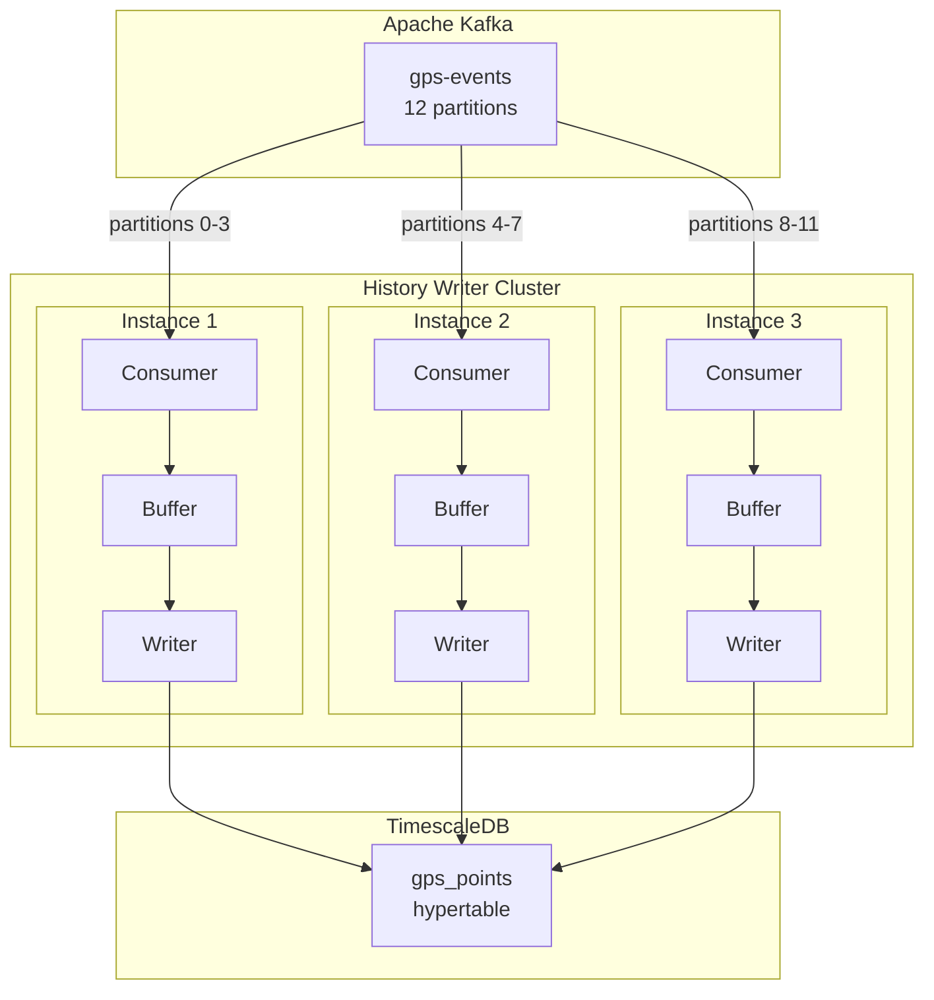
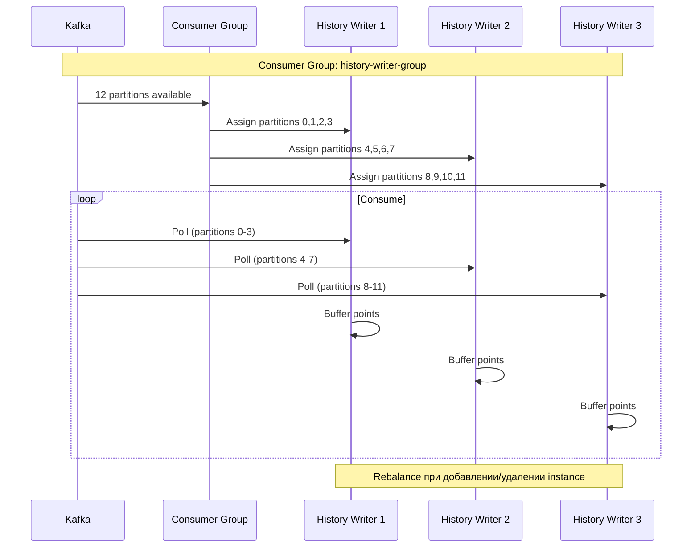
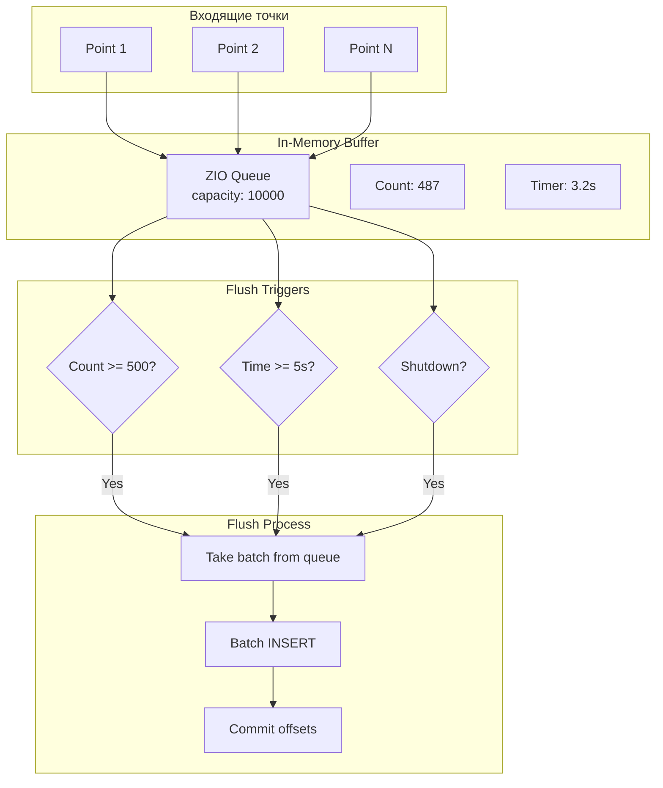
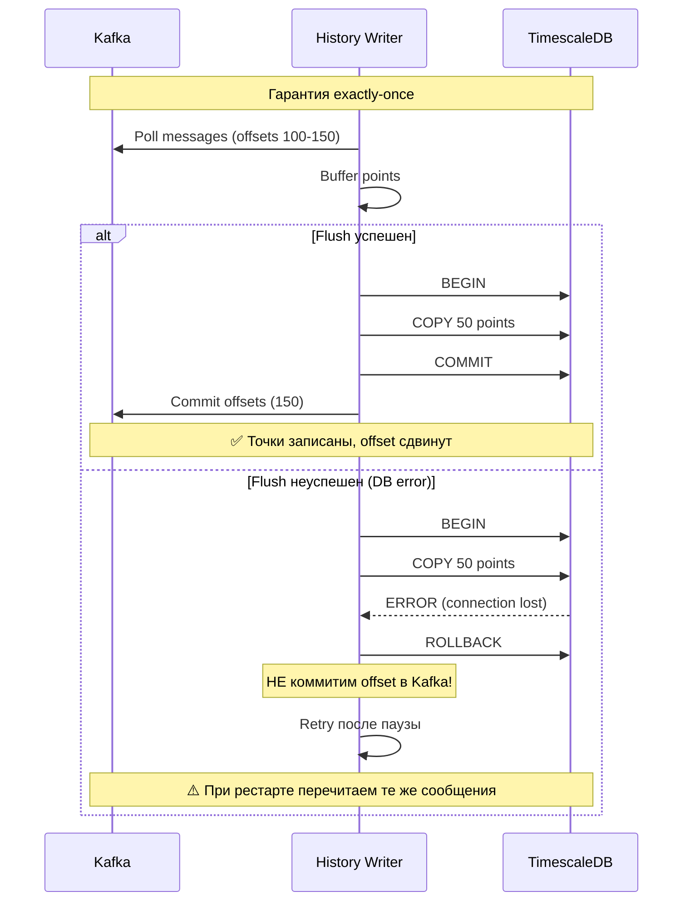

# 📝 History Writer — Детальная документация

> **Блок:** 1 (Data Collection)  
> **Порт:** HTTP 8091 (admin/metrics)  
> **Сложность:** Средняя  
> **Статус:** 🟡 В разработке

---

## 📋 Содержание

1. [Обзор](#обзор)
2. [Архитектура](#архитектура)
3. [Kafka Consumer](#kafka-consumer)
4. [Batch Processing](#batch-processing)
5. [TimescaleDB интеграция](#timescaledb-интеграция)
6. [Отказоустойчивость](#отказоустойчивость)
7. [Масштабирование](#масштабирование)
8. [Метрики и мониторинг](#метрики-и-мониторинг)
9. [Конфигурация](#конфигурация)

---

## Обзор

**History Writer** — сервис записи GPS истории в TimescaleDB. Читает события из Kafka, буферизует их и выполняет batch insert для оптимальной производительности.

### Ключевые характеристики

| Параметр | Значение |
|----------|----------|
| **Вход** | Kafka топик `gps-events` |
| **Выход** | TimescaleDB таблица `gps_points` |
| **Batch size** | 500 точек (настраивается) |
| **Flush interval** | 5 секунд (max) |
| **Пропускная способность** | 10,000+ точек/сек |
| **Latency** | < 10 секунд (Kafka → DB) |

### Принцип работы

```
Kafka (gps-events) → Buffer (in-memory) → Batch Insert → TimescaleDB
                          ↓
                     Flush trigger:
                     - Buffer >= 500 points
                     - Time >= 5 seconds
                     - Shutdown signal
```

---

## Архитектура



### Компоненты

| Компонент | Описание | Технология |
|-----------|----------|------------|
| **Kafka Consumer** | Чтение GPS событий | zio-kafka |
| **Buffer** | In-memory буфер точек | ZIO Queue |
| **Batch Writer** | Batch insert в БД | Doobie + COPY |
| **Flush Controller** | Управление flush | ZIO Schedule |
| **Admin API** | Health, metrics | ZIO HTTP |

---

## Kafka Consumer

### Consumer Group



### Consumer конфигурация

```scala
val consumerSettings = ConsumerSettings(List("kafka:9092"))
  .withGroupId("history-writer-group")
  .withClientId(s"history-writer-${instanceId}")
  .withOffsetRetrieval(OffsetRetrieval.Auto(AutoOffsetStrategy.Earliest))
  .withProperty("enable.auto.commit", "false")  // Manual commit!
  .withProperty("max.poll.records", "1000")
  .withProperty("fetch.min.bytes", "1024")
  .withProperty("fetch.max.wait.ms", "500")
  .withProperty("session.timeout.ms", "30000")
  .withProperty("heartbeat.interval.ms", "10000")
```

### Чтение сообщений

```scala
def consumeGpsEvents: ZStream[Consumer, Throwable, GpsEvent] =
  Consumer
    .subscribeAnd(Subscription.topics("gps-events"))
    .plainStream(Serde.string, GpsEventSerde)
    .tap(record => 
      ZIO.logDebug(s"Received: vehicleId=${record.value.vehicleId}")
    )
    .map(_.value)
```

---

## Batch Processing

### Buffer Strategy



### Реализация буфера

```scala
case class BufferState(
  points: Chunk[GpsEvent],
  offsets: Map[TopicPartition, Long],
  lastFlush: Instant
)

class BatchBuffer(
  queue: Queue[GpsEvent],
  state: Ref[BufferState],
  config: BufferConfig
) {
  
  // Добавление точки в буфер
  def add(event: GpsEvent, offset: CommittableOffset): UIO[Unit] =
    for {
      _ <- queue.offer(event)
      _ <- state.update(s => s.copy(
        offsets = s.offsets + (offset.topicPartition -> offset.offset)
      ))
    } yield ()
  
  // Проверка условий flush
  def shouldFlush: UIO[Boolean] =
    for {
      s <- state.get
      size <- queue.size
      now <- Clock.instant
      timeSinceFlush = Duration.between(s.lastFlush, now)
    } yield size >= config.batchSize || 
            timeSinceFlush >= config.flushInterval
  
  // Извлечение batch для записи
  def takeBatch: UIO[Chunk[GpsEvent]] =
    queue.takeUpTo(config.batchSize)
  
  // Получение offsets для commit
  def getOffsets: UIO[Map[TopicPartition, Long]] =
    state.get.map(_.offsets)
  
  // Очистка после успешного flush
  def clearOffsets: UIO[Unit] =
    state.update(s => s.copy(
      offsets = Map.empty,
      lastFlush = Instant.now()
    ))
}

case class BufferConfig(
  batchSize: Int = 500,
  flushInterval: Duration = 5.seconds,
  maxQueueSize: Int = 10000
)
```

### Flush Controller

```scala
object FlushController {
  
  def run(
    buffer: BatchBuffer,
    writer: BatchWriter,
    consumer: Consumer
  ): ZIO[Any, Throwable, Unit] = {
    
    val flushLoop = for {
      shouldFlush <- buffer.shouldFlush
      _ <- ZIO.when(shouldFlush) {
        for {
          batch <- buffer.takeBatch
          _ <- ZIO.logInfo(s"Flushing ${batch.size} points")
          
          // Запись в БД
          _ <- writer.writeBatch(batch)
            .retry(Schedule.exponential(100.millis) && Schedule.recurs(3))
          
          // Commit offsets в Kafka
          offsets <- buffer.getOffsets
          _ <- consumer.commit(offsets)
          
          // Очистка состояния
          _ <- buffer.clearOffsets
          
          _ <- ZIO.logInfo(s"Flush complete, committed offsets")
        } yield ()
      }
    } yield ()
    
    // Запуск loop каждые 100ms
    flushLoop
      .repeat(Schedule.spaced(100.millis))
      .forever
  }
}
```

---

## TimescaleDB интеграция

### Схема таблицы

```sql
-- Основная таблица GPS точек (hypertable)
CREATE TABLE gps_points (
  -- Идентификация
  time TIMESTAMPTZ NOT NULL,
  vehicle_id BIGINT NOT NULL,
  
  -- Координаты
  latitude DOUBLE PRECISION NOT NULL,
  longitude DOUBLE PRECISION NOT NULL,
  altitude INTEGER,
  speed INTEGER NOT NULL DEFAULT 0,
  course INTEGER,
  satellites INTEGER,
  
  -- Метаданные
  protocol VARCHAR(20) NOT NULL,
  is_valid BOOLEAN NOT NULL DEFAULT true,
  validation_error VARCHAR(50),
  is_moving BOOLEAN NOT NULL DEFAULT true,
  
  -- Датчики (JSONB для гибкости)
  sensors JSONB,
  
  -- Служебные
  received_at TIMESTAMPTZ NOT NULL DEFAULT NOW(),
  instance_id VARCHAR(50),
  
  -- Primary key для TimescaleDB
  PRIMARY KEY (time, vehicle_id)
);

-- Создание hypertable (партиционирование по времени)
SELECT create_hypertable('gps_points', 'time',
  chunk_time_interval => INTERVAL '1 day',
  if_not_exists => TRUE
);

-- Индексы
CREATE INDEX idx_gps_points_vehicle_time 
  ON gps_points (vehicle_id, time DESC);

CREATE INDEX idx_gps_points_sensors 
  ON gps_points USING GIN (sensors);

-- Политика сжатия (после 7 дней)
ALTER TABLE gps_points SET (
  timescaledb.compress,
  timescaledb.compress_segmentby = 'vehicle_id'
);

SELECT add_compression_policy('gps_points', INTERVAL '7 days');

-- Политика удаления (после 1 года)
SELECT add_retention_policy('gps_points', INTERVAL '1 year');
```

### Batch Insert (COPY)

```scala
object BatchWriter {
  
  // Использование COPY для максимальной производительности
  def writeBatch(points: Chunk[GpsEvent]): ZIO[Transactor, Throwable, Int] =
    ZIO.serviceWithZIO[Transactor] { xa =>
      
      val copyIn = 
        """COPY gps_points (
          time, vehicle_id, latitude, longitude, altitude,
          speed, course, satellites, protocol, is_valid,
          validation_error, is_moving, sensors, received_at, instance_id
        ) FROM STDIN WITH (FORMAT csv)"""
      
      // Конвертация в CSV строки
      val csvData = points.map(pointToCsv).mkString("\n")
      
      // Выполнение COPY
      HC.pgGetCopyAPI(PFCM.copyIn(copyIn, new StringReader(csvData)))
        .transact(xa)
    }
  
  private def pointToCsv(p: GpsEvent): String = {
    val sensors = p.sensors.map(_.noSpaces).getOrElse("")
    s"${p.deviceTime},${p.vehicleId},${p.latitude},${p.longitude}," +
    s"${p.altitude.getOrElse("")},${p.speed},${p.course.getOrElse("")}," +
    s"${p.satellites.getOrElse("")},${p.protocol},${p.isValid}," +
    s"${p.validationError.getOrElse("")},${p.isMoving}," +
    s"\"${sensors}\",${p.serverTime},${p.instanceId}"
  }
  
  // Альтернатива: Batch INSERT (медленнее, но проще)
  def writeBatchInsert(points: Chunk[GpsEvent]): ConnectionIO[Int] = {
    val sql = """
      INSERT INTO gps_points (
        time, vehicle_id, latitude, longitude, altitude,
        speed, course, satellites, protocol, is_valid,
        validation_error, is_moving, sensors, received_at, instance_id
      ) VALUES (?, ?, ?, ?, ?, ?, ?, ?, ?, ?, ?, ?, ?::jsonb, ?, ?)
    """
    
    Update[GpsEvent](sql).updateMany(points.toList)
  }
}
```

### Производительность COPY vs INSERT

| Метод | 500 точек | 1000 точек | 5000 точек |
|-------|-----------|------------|------------|
| **COPY** | 5ms | 8ms | 25ms |
| **Batch INSERT** | 15ms | 28ms | 120ms |
| **Single INSERT** | 250ms | 500ms | 2500ms |

---

## Отказоустойчивость

### Exactly-Once Semantics



### Идемпотентность

```sql
-- Уникальный constraint для предотвращения дубликатов
-- (time, vehicle_id) уже является PRIMARY KEY

-- При повторной записи тех же данных:
INSERT INTO gps_points (...) VALUES (...)
ON CONFLICT (time, vehicle_id) DO NOTHING;

-- Или обновление (если нужно):
INSERT INTO gps_points (...) VALUES (...)
ON CONFLICT (time, vehicle_id) DO UPDATE SET
  speed = EXCLUDED.speed,
  sensors = EXCLUDED.sensors;
```

### Graceful Shutdown

```scala
object GracefulShutdown {
  
  def run(
    buffer: BatchBuffer,
    writer: BatchWriter,
    consumer: Consumer
  ): ZIO[Any, Throwable, Unit] = {
    
    val shutdown = for {
      _ <- ZIO.logInfo("Shutdown signal received")
      
      // 1. Остановить чтение новых сообщений
      _ <- consumer.stopConsumption
      
      // 2. Дождаться обработки текущего batch
      _ <- ZIO.sleep(1.second)
      
      // 3. Flush оставшихся данных
      remaining <- buffer.takeBatch
      _ <- ZIO.when(remaining.nonEmpty) {
        for {
          _ <- ZIO.logInfo(s"Final flush: ${remaining.size} points")
          _ <- writer.writeBatch(remaining)
          offsets <- buffer.getOffsets
          _ <- consumer.commit(offsets)
        } yield ()
      }
      
      // 4. Закрыть consumer
      _ <- consumer.close
      _ <- ZIO.logInfo("Shutdown complete")
    } yield ()
    
    shutdown
  }
}
```

---

## Масштабирование

### Партиционирование

```
┌─────────────────────────────────────────────────────────────────────┐
│                    Kafka Topic: gps-events                          │
├──────┬──────┬──────┬──────┬──────┬──────┬──────┬──────┬──────┬──────┤
│  P0  │  P1  │  P2  │  P3  │  P4  │  P5  │  P6  │  P7  │  P8  │ P9-11│
└──┬───┴──┬───┴──┬───┴──┬───┴──┬───┴──┬───┴──┬───┴──┬───┴──┬───┴──┬───┘
   │      │      │      │      │      │      │      │      │      │
   ▼      ▼      ▼      ▼      ▼      ▼      ▼      ▼      ▼      ▼
┌──────────────┐ ┌──────────────┐ ┌──────────────┐ ┌──────────────┐
│  HW-1        │ │  HW-2        │ │  HW-3        │ │  HW-4        │
│  P0, P1, P2  │ │  P3, P4, P5  │ │  P6, P7, P8  │ │  P9, P10, P11│
└──────────────┘ └──────────────┘ └──────────────┘ └──────────────┘
         │              │              │              │
         ▼              ▼              ▼              ▼
┌─────────────────────────────────────────────────────────────────────┐
│                         TimescaleDB                                 │
│                    (все пишут в одну таблицу)                       │
└─────────────────────────────────────────────────────────────────────┘
```

### Правила масштабирования

| Условие | Действие |
|---------|----------|
| Партиций > Consumers | Добавить consumer |
| Consumer lag > 10000 | Scale up |
| CPU < 20% на всех | Scale down |
| DB latency > 100ms | Проверить БД |

### Connection Pool

```scala
// HikariCP для connection pooling
val hikariConfig = new HikariConfig()
hikariConfig.setJdbcUrl("jdbc:postgresql://timescaledb:5432/tracker")
hikariConfig.setUsername("postgres")
hikariConfig.setPassword(sys.env("DB_PASSWORD"))
hikariConfig.setMaximumPoolSize(10)        // На инстанс
hikariConfig.setMinimumIdle(2)
hikariConfig.setConnectionTimeout(30000)
hikariConfig.setIdleTimeout(600000)
hikariConfig.setMaxLifetime(1800000)

// Общий пул на кластер: 10 connections × 4 instances = 40 connections
// TimescaleDB default max_connections = 100
```

---

## Метрики и мониторинг

### Prometheus метрики

```
# Consumer lag
hw_consumer_lag{partition="0"} 150
hw_consumer_lag{partition="1"} 89
hw_consumer_lag_total 1234

# Buffer
hw_buffer_size 487
hw_buffer_capacity 10000
hw_buffer_utilization 0.0487

# Flush operations
hw_flush_total 5678
hw_flush_duration_seconds_bucket{le="0.01"} 5500
hw_flush_duration_seconds_bucket{le="0.1"} 5670
hw_flush_points_total 2839000

# Database
hw_db_insert_duration_seconds_bucket{le="0.01"} 5400
hw_db_insert_errors_total 12
hw_db_connection_pool_active 3
hw_db_connection_pool_idle 7

# Throughput
hw_points_per_second 8500
hw_bytes_per_second 425000
```

### Grafana Dashboard

```
┌─────────────────────────────────────────────────────────────────────┐
│                    History Writer Dashboard                          │
├───────────────────────┬───────────────────────┬─────────────────────┤
│  Points/sec           │   Consumer Lag        │   Buffer Size       │
│       [8,456]         │      [1,234]          │      [487]          │
├───────────────────────┴───────────────────────┴─────────────────────┤
│                                                                     │
│  Throughput over time                                               │
│   12K ┤                    ╭─╮                                      │
│   10K ┤               ╭────╯ ╰────╮                                │
│    8K ┤          ╭────╯          ╰────╮                            │
│    6K ┤     ╭────╯                    ╰────                        │
│    4K ┤╭────╯                                                      │
│     0 ┼────────────────────────────────────────                    │
│       00:00  04:00  08:00  12:00  16:00  20:00                     │
│                                                                     │
├───────────────────────┬───────────────────────┬─────────────────────┤
│  Flush Duration p99   │   DB Latency p99      │   Instance Count    │
│      [8.2 ms]         │      [5.1 ms]         │      [3]            │
├───────────────────────┴───────────────────────┴─────────────────────┤
│                                                                     │
│  Consumer Lag by Partition                                          │
│  P0  ██ 150                                                        │
│  P1  █ 89                                                          │
│  P2  ███ 245                                                       │
│  P3  █ 67                                                          │
│  ... (остальные партиции)                                          │
│                                                                     │
└─────────────────────────────────────────────────────────────────────┘
```

### Алерты

```yaml
groups:
  - name: history-writer
    rules:
      - alert: HWConsumerLagHigh
        expr: sum(hw_consumer_lag) > 50000
        for: 5m
        labels:
          severity: warning
        annotations:
          summary: "Consumer lag is high ({{ $value }})"

      - alert: HWConsumerLagCritical
        expr: sum(hw_consumer_lag) > 200000
        for: 5m
        labels:
          severity: critical
        annotations:
          summary: "Consumer lag is critical!"

      - alert: HWFlushErrors
        expr: rate(hw_flush_errors_total[5m]) > 1
        for: 5m
        labels:
          severity: warning
        annotations:
          summary: "Flush errors detected"

      - alert: HWDBLatencyHigh
        expr: histogram_quantile(0.99, hw_db_insert_duration_seconds_bucket) > 0.1
        for: 5m
        labels:
          severity: warning
        annotations:
          summary: "DB insert latency > 100ms"
```

---

## Конфигурация

### application.conf

```hocon
history-writer {
  instance-id = ${?HOSTNAME}
  instance-id = ${?HW_INSTANCE_ID}
  
  kafka {
    bootstrap-servers = ${KAFKA_BROKERS}
    group-id = "history-writer-group"
    topic = "gps-events"
    
    consumer {
      max-poll-records = 1000
      fetch-min-bytes = 1024
      fetch-max-wait-ms = 500
      session-timeout-ms = 30000
      auto-offset-reset = "earliest"
    }
  }
  
  buffer {
    batch-size = 500
    flush-interval = 5s
    max-queue-size = 10000
  }
  
  database {
    url = ${DATABASE_URL}
    driver = "org.postgresql.Driver"
    
    pool {
      max-size = 10
      min-idle = 2
      connection-timeout = 30s
      idle-timeout = 10m
      max-lifetime = 30m
    }
    
    # Использовать COPY вместо INSERT
    use-copy = true
  }
  
  admin {
    port = 8091
    enabled = true
  }
  
  retry {
    max-attempts = 3
    initial-delay = 100ms
    max-delay = 5s
    multiplier = 2.0
  }
}
```

### Environment variables

```bash
# Обязательные
KAFKA_BROKERS=kafka:9092
DATABASE_URL=jdbc:postgresql://timescaledb:5432/tracker
DB_PASSWORD=secret

# Опциональные
HW_INSTANCE_ID=hw-instance-1
HW_BATCH_SIZE=500
HW_FLUSH_INTERVAL=5s
HW_ADMIN_PORT=8091

# Logging
LOG_LEVEL=INFO
LOG_FORMAT=json
```

### Docker Compose

```yaml
services:
  history-writer:
    build: ./services/history-writer
    ports:
      - "8091:8091"  # Admin API
    environment:
      - KAFKA_BROKERS=kafka:9092
      - DATABASE_URL=jdbc:postgresql://timescaledb:5432/tracker
      - DB_PASSWORD=${DB_PASSWORD}
      - HW_INSTANCE_ID=hw-1
    depends_on:
      - kafka
      - timescaledb
    deploy:
      replicas: 3  # 3 инстанса для 12 партиций
      resources:
        limits:
          cpus: '1'
          memory: 1G
        reservations:
          cpus: '0.5'
          memory: 512M
    healthcheck:
      test: ["CMD", "curl", "-f", "http://localhost:8091/health"]
      interval: 10s
      timeout: 5s
      retries: 3
```

---

## 📊 Сравнение с Connection Manager

| Параметр | Connection Manager | History Writer |
|----------|-------------------|----------------|
| **Вход** | TCP (трекеры) | Kafka |
| **Выход** | Kafka + Redis | TimescaleDB |
| **State** | Stateless | Stateless |
| **Scaling** | По соединениям | По партициям |
| **Критичность** | Высокая (realtime) | Средняя (async) |
| **Latency** | < 50ms | < 10s |

---

## 📚 Связанные документы

- [ARCHITECTURE_BLOCK1.md](../ARCHITECTURE_BLOCK1.md) — Обзор Block 1
- [CONNECTION_MANAGER.md](./CONNECTION_MANAGER.md) — Предыдущий сервис
- [DEVICE_MANAGER.md](./DEVICE_MANAGER.md) — Следующий сервис
- [DATA_STORES.md](../DATA_STORES.md) — Схемы хранилищ

---

## 🤖 Промпт для AI-агента

<details>
<summary><b>Развернуть полный промпт для реализации History Writer</b></summary>

```markdown
# ЗАДАЧА: Реализовать History Writer для TrackerGPS

## КОНТЕКСТ
Ты — senior Scala разработчик. Создай History Writer — сервис записи GPS истории в TimescaleDB для системы мониторинга транспорта TrackerGPS.

## ТЕХНИЧЕСКИЙ СТЕК (ОБЯЗАТЕЛЬНО)
- **Язык:** Scala 3.4.0
- **Эффекты:** ZIO 2.0.20
- **Kafka:** zio-kafka (consumer)
- **PostgreSQL:** Quill + JDBC (для COPY команды)
- **Конфигурация:** zio-config + HOCON
- **Метрики:** zio-metrics + Prometheus
- **Логирование:** zio-logging + SLF4J
- **Сборка:** SBT

## АРХИТЕКТУРА СЕРВИСА

### Основные компоненты:
1. **Kafka Consumer** — читает из топика `gps-events`
2. **Buffer** — in-memory буфер для batch accumulation
3. **Batch Writer** — COPY INSERT в TimescaleDB
4. **Deduplicator** — фильтрация дубликатов (device_id + timestamp)
5. **HTTP API** — health, metrics, lag info

### Flow обработки:
```
Kafka (gps-events) → Deserialize → Deduplicate → Buffer → Batch COPY → TimescaleDB
                                                    ↓
                                              Flush triggers:
                                              - size >= 500
                                              - time >= 5s
                                              - shutdown
```

## ТРЕБОВАНИЯ К РЕАЛИЗАЦИИ

### 1. Kafka Consumer
```scala
trait GpsEventConsumer:
  // Поток событий из Kafka
  def stream: ZStream[Any, Throwable, CommittableRecord[String, GpsEvent]]

// Конфигурация:
// - Topic: gps-events
// - Consumer group: history-writer-group
// - Auto-offset-reset: earliest
// - Enable.auto.commit: false (manual commit после записи в DB)
// - Max.poll.records: 1000
```

### 2. Buffer и Batch Processing
```scala
trait BatchBuffer:
  // Добавить точку в буфер
  def add(point: GpsPoint): UIO[Unit]
  
  // Получить и очистить буфер (атомарно)
  def flush: UIO[Chunk[GpsPoint]]
  
  // Текущий размер буфера
  def size: UIO[Int]

// Реализация через Ref[Chunk[GpsPoint]]
// Flush triggers:
// 1. Buffer size >= batchSize (default 500)
// 2. Time since last flush >= flushInterval (default 5s)
// 3. Shutdown signal
```

### 3. TimescaleDB Writer
```scala
trait HistoryWriter:
  // Batch insert через COPY
  def writeBatch(points: Chunk[GpsPoint]): Task[Int]

// ВАЖНО: Использовать PostgreSQL COPY для максимальной производительности
// Пример:
// COPY gps_positions (device_id, timestamp, latitude, longitude, ...)
// FROM STDIN WITH (FORMAT binary)
```

### 4. Модель данных
```scala
case class GpsPoint(
  deviceId: String,
  timestamp: Instant,
  latitude: Double,
  longitude: Double,
  altitude: Option[Int],
  speed: Option[Int],
  course: Option[Int],
  satellites: Option[Int],
  hdop: Option[Double],
  ignition: Option[Boolean],
  fuelLevel: Option[Double],
  odometer: Option[Long],
  ioData: JsonObject,        // JSONB в PostgreSQL
  receivedAt: Instant        // Время получения сервером
)
```

### 5. Дедупликация
```scala
trait Deduplicator:
  // Проверить, является ли точка дубликатом
  def isDuplicate(deviceId: String, timestamp: Instant): UIO[Boolean]
  
  // Зарегистрировать точку
  def register(deviceId: String, timestamp: Instant): UIO[Unit]

// Реализация: Bloom filter или LRU cache
// Ключ: (device_id, timestamp)
// TTL: 1 час (точки старше не приходят)
```

### 6. Graceful Shutdown
```scala
// При shutdown:
// 1. Остановить consumer (перестать читать)
// 2. Дождаться обработки текущего batch
// 3. Flush оставшийся буфер
// 4. Commit offsets
// 5. Закрыть соединения
```

### 7. HTTP API
```scala
// GET /health — liveness
// GET /ready — readiness (Kafka + DB connected)
// GET /metrics — Prometheus
// GET /lag — текущий consumer lag
// GET /stats — статистика (points/sec, batch sizes, etc.)
```

### 8. Метрики
```scala
// Counters
hw_events_received_total
hw_events_written_total
hw_events_deduplicated_total
hw_batches_written_total

// Gauges
hw_buffer_size
hw_consumer_lag

// Histograms
hw_batch_size_bucket{le="100"}
hw_batch_size_bucket{le="500"}
hw_write_duration_seconds_bucket{le="0.1"}
hw_write_duration_seconds_bucket{le="1.0"}
```

## СТРУКТУРА ПРОЕКТА
```
history-writer/
├── src/main/scala/
│   └── trackergps/historywriter/
│       ├── Main.scala
│       ├── config/
│       │   └── AppConfig.scala
│       ├── kafka/
│       │   └── GpsEventConsumer.scala
│       ├── buffer/
│       │   └── BatchBuffer.scala
│       ├── db/
│       │   ├── HistoryWriter.scala
│       │   └── CopyWriter.scala     # PostgreSQL COPY
│       ├── dedup/
│       │   └── Deduplicator.scala
│       ├── http/
│       │   └── HealthApi.scala
│       └── metrics/
│           └── Metrics.scala
├── src/main/resources/
│   └── application.conf
└── build.sbt
```

## ПРИМЕР КОДА

```scala
// Main processing loop
def processStream: ZIO[GpsEventConsumer & BatchBuffer & HistoryWriter, Throwable, Unit] =
  for
    consumer <- ZIO.service[GpsEventConsumer]
    buffer   <- ZIO.service[BatchBuffer]
    writer   <- ZIO.service[HistoryWriter]
    
    // Фоновый flush по таймеру
    _ <- (ZIO.sleep(5.seconds) *> flushBuffer).forever.fork
    
    // Основной поток обработки
    _ <- consumer.stream
          .mapZIO { record =>
            for
              point <- ZIO.fromEither(record.value.toGpsPoint)
              _     <- buffer.add(point)
              size  <- buffer.size
              _     <- ZIO.when(size >= 500)(flushBuffer)
              _     <- record.offset.commit
            yield ()
          }
          .runDrain
  yield ()

def flushBuffer: ZIO[BatchBuffer & HistoryWriter, Throwable, Unit] =
  for
    buffer <- ZIO.service[BatchBuffer]
    writer <- ZIO.service[HistoryWriter]
    points <- buffer.flush
    _      <- ZIO.when(points.nonEmpty) {
                writer.writeBatch(points)
                  .tap(n => ZIO.logInfo(s"Written $n points"))
              }
  yield ()
```

## PostgreSQL COPY Implementation

```scala
// Использовать CopyManager из PostgreSQL JDBC
def writeBatchCopy(points: Chunk[GpsPoint]): Task[Int] = ZIO.attempt {
  val conn = dataSource.getConnection()
  try {
    val copyManager = new CopyManager(conn.unwrap(classOf[BaseConnection]))
    
    val sql = """
      COPY gps_positions (device_id, timestamp, latitude, longitude, altitude, 
                          speed, course, satellites, ignition, fuel_level, io_data)
      FROM STDIN WITH (FORMAT csv, NULL 'NULL')
    """
    
    val reader = new StringReader(points.map(toCsvLine).mkString("\n"))
    copyManager.copyIn(sql, reader).toInt
  } finally {
    conn.close()
  }
}
```

## КРИТЕРИИ ПРИЁМКИ

1. ✅ Consumer читает из Kafka с manual commit
2. ✅ Batch accumulation работает по size и time
3. ✅ COPY INSERT в TimescaleDB (не обычный INSERT)
4. ✅ Дедупликация по (device_id, timestamp)
5. ✅ Graceful shutdown без потери данных
6. ✅ Consumer lag в метриках
7. ✅ Unit тесты для buffer и dedup
8. ✅ Integration test с embedded Kafka + PostgreSQL
```

</details>

---

**Дата:** 26 января 2026  
**Статус:** Документация готова ✅
