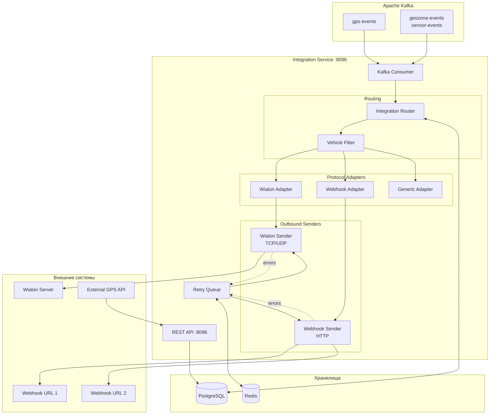
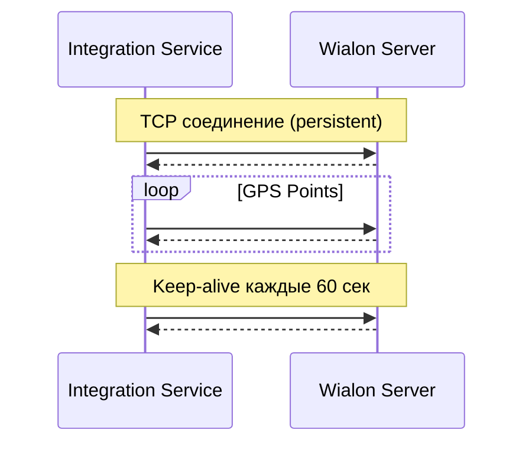

# 🔗 Integration Service — Детальная документация

> **Блок:** 2 (Business Logic)  
> **Порт:** HTTP 8096 (REST API)  
> **Сложность:** Средняя  
> **Статус:** ✅ MVP

---

## 📋 Содержание

1. [Обзор](#обзор)
2. [Архитектура](#архитектура)
3. [Wialon Retranslation](#wialon-retranslation)
4. [Webhook Outbound](#webhook-outbound)
5. [API Inbound](#api-inbound)
6. [PostgreSQL схема](#postgresql-схема)
7. [Kafka интеграция](#kafka-интеграция)
8. [REST API](#rest-api)
9. [Retry и Error Handling](#retry-и-error-handling)
10. [Метрики и мониторинг](#метрики-и-мониторинг)
11. [Конфигурация](#конфигурация)

---

## Обзор

**Integration Service** — сервис интеграций с внешними системами. Ретранслирует GPS данные в Wialon и другие платформы, отправляет webhooks, принимает данные через API.

### Ключевые характеристики

| Параметр | Значение |
|----------|----------|
| **Вход** | Kafka (gps-events), REST API (inbound) |
| **Выход** | Wialon, webhooks, external APIs |
| **БД** | PostgreSQL (конфигурации) |
| **Кеш** | Redis (rate limiting, retry state) |

### Основные функции

1. **Wialon Retranslation** — отправка GPS в Wialon IPS
2. **Webhook Outbound** — отправка событий на внешние URL
3. **API Inbound** — приём данных от внешних систем
4. **Protocol Adapters** — конвертация форматов
5. **Retry Queue** — повторные попытки при ошибках

---

## Архитектура



---

## Wialon Retranslation

### Протокол Wialon IPS



### Wialon IPS формат

```scala
object WialonIpsProtocol:
  // Login packet
  def loginPacket(imei: String, password: String): String =
    s"#L#$imei;$password\r\n"
  
  // Data packet (short)
  def dataPacketShort(point: GpsPoint): String =
    val date = formatDate(point.timestamp)  // DDMMYY
    val time = formatTime(point.timestamp)  // HHMMSS
    val lat = formatLat(point.latitude)     // DDMM.MMMM;N/S
    val lon = formatLon(point.longitude)    // DDDMM.MMMM;E/W
    s"#SD#$date;$time;$lat;$lon;${point.speed.getOrElse(0)};${point.course.getOrElse(0)};${point.altitude.getOrElse(0)};${point.satellites.getOrElse(0)}\r\n"
  
  // Data packet (extended with I/O)
  def dataPacketExtended(point: GpsPoint): String =
    val short = dataPacketShort(point).dropRight(2)  // Remove \r\n
    val io = formatIoData(point.ioData)
    s"$short;$io\r\n"
  
  // Format: DDMM.MMMM;N
  private def formatLat(lat: Double): String =
    val deg = lat.abs.toInt
    val min = (lat.abs - deg) * 60
    val dir = if lat >= 0 then "N" else "S"
    f"$deg%02d${min}%.4f;$dir"
```

### Wialon Sender

```scala
class WialonSender(
  config: WialonConfig,
  connectionPool: WialonConnectionPool
) {
  
  def send(point: GpsPoint, integration: WialonIntegration): Task[SendResult] = {
    for {
      // Получить или создать соединение
      conn <- connectionPool.getConnection(integration.id)
      
      // Отправить данные
      packet = WialonIpsProtocol.dataPacketExtended(point)
      result <- conn.send(packet)
        .timeout(5.seconds)
        .retry(Schedule.recurs(3) && Schedule.exponential(100.millis))
      
      // Проверить ответ
      _ <- ZIO.when(result != "#AD#1") {
        ZIO.fail(WialonError(s"Unexpected response: $result"))
      }
      
    } yield SendResult.success(integration.id)
  }
}

// Connection Pool — держим persistent TCP соединения
class WialonConnectionPool {
  private val connections: Ref[Map[Long, WialonConnection]]
  
  def getConnection(integrationId: Long): Task[WialonConnection] = {
    for {
      conns <- connections.get
      conn <- conns.get(integrationId) match {
        case Some(c) if c.isAlive => ZIO.succeed(c)
        case _ => createConnection(integrationId)
      }
    } yield conn
  }
}
```

### Конфигурация Wialon интеграции

```scala
case class WialonIntegration(
  id: Long,
  organizationId: Long,
  name: String,
  enabled: Boolean,
  
  // Wialon server
  host: String,
  port: Int,
  protocol: String,          // "tcp" | "udp"
  
  // Credentials
  password: String,
  
  // Фильтрация
  vehicleIds: Set[Long],     // Пустой = все
  groupIds: Set[Long],
  
  // Mapping IMEI → Wialon unit ID
  imeiMapping: Map[String, String],
  
  // Настройки
  sendInterval: Duration,     // Минимальный интервал между точками
  sendIoData: Boolean,
  
  createdAt: Instant,
  updatedAt: Instant
)
```

---

## Webhook Outbound

### Типы событий для webhooks

| Событие | Описание |
|---------|----------|
| `position.update` | Новая GPS позиция |
| `geozone.enter` | Въезд в геозону |
| `geozone.leave` | Выезд из геозоны |
| `sensor.alert` | Срабатывание датчика |
| `device.online` | Устройство онлайн |
| `device.offline` | Устройство оффлайн |

### Webhook Payload

```scala
case class WebhookPayload(
  eventId: UUID,
  eventType: String,
  timestamp: Instant,
  organizationId: Long,
  
  // Vehicle info
  vehicleId: Long,
  vehicleName: String,
  imei: String,
  
  // Position (if applicable)
  position: Option[Position],
  
  // Event-specific data
  data: JsonObject,
  
  // Signature for verification
  signature: String
)

case class Position(
  latitude: Double,
  longitude: Double,
  altitude: Option[Int],
  speed: Option[Int],
  course: Option[Int],
  address: Option[String],
  timestamp: Instant
)

// Signature: HMAC-SHA256(payload_json, secret_key)
```

### Webhook Sender

```scala
class WebhookSender(
  httpClient: Client,
  retryQueue: RetryQueue
) {
  
  def send(
    payload: WebhookPayload, 
    webhook: WebhookConfig
  ): Task[SendResult] = {
    for {
      // Подписываем payload
      signature <- sign(payload, webhook.secretKey)
      signedPayload = payload.copy(signature = signature)
      
      // HTTP запрос
      request = Request
        .post(webhook.url, Body.json(signedPayload.toJson))
        .addHeader("Content-Type", "application/json")
        .addHeader("X-Webhook-Signature", signature)
        .addHeader("X-Event-Type", payload.eventType)
      
      result <- httpClient
        .request(request)
        .timeout(webhook.timeout)
        .flatMap { response =>
          if (response.status.isSuccess) ZIO.succeed(SendResult.success(webhook.id))
          else ZIO.fail(WebhookError(s"HTTP ${response.status}"))
        }
        .catchAll { error =>
          // В очередь повторов
          retryQueue.enqueue(RetryTask(webhook.id, payload, error.getMessage))
            .as(SendResult.queued(webhook.id))
        }
        
    } yield result
  }
  
  private def sign(payload: WebhookPayload, secret: String): Task[String] = 
    ZIO.attempt {
      val mac = Mac.getInstance("HmacSHA256")
      mac.init(new SecretKeySpec(secret.getBytes, "HmacSHA256"))
      mac.doFinal(payload.toJson.getBytes).map("%02x".format(_)).mkString
    }
}
```

### Webhook конфигурация

```scala
case class WebhookConfig(
  id: Long,
  organizationId: Long,
  name: String,
  enabled: Boolean,
  
  // URL
  url: String,
  
  // Events to send
  eventTypes: Set[String],
  
  // Фильтрация
  vehicleIds: Set[Long],
  groupIds: Set[Long],
  
  // Security
  secretKey: String,
  
  // Settings
  timeout: Duration,
  maxRetries: Int,
  
  createdAt: Instant
)
```

---

## API Inbound

### Приём данных от внешних систем

```scala
// POST /api/v1/inbound/gps
// Для приёма GPS от сторонних систем (ERP, другие трекеры)

case class InboundGpsRequest(
  apiKey: String,
  points: List[InboundGpsPoint]
)

case class InboundGpsPoint(
  deviceId: String,        // Внешний ID или IMEI
  timestamp: Instant,
  latitude: Double,
  longitude: Double,
  speed: Option[Int],
  course: Option[Int],
  attributes: Option[Map[String, String]]
)

// Flow:
// 1. Validate API key
// 2. Map external device ID → internal vehicle ID
// 3. Validate coordinates
// 4. Publish to Kafka (gps-events)
```

### API Key Management

```scala
case class ApiKey(
  id: Long,
  organizationId: Long,
  name: String,
  keyHash: String,          // bcrypt hash
  permissions: Set[String], // "inbound:gps", "inbound:events"
  rateLimit: Int,           // requests per minute
  enabled: Boolean,
  expiresAt: Option[Instant],
  createdAt: Instant,
  lastUsedAt: Option[Instant]
)

// Redis rate limiting
// Key: api_rate:{key_id}:{minute}
// Value: counter
// TTL: 60 seconds
```

---

## PostgreSQL схема

```sql
-- ===================== WIALON INTEGRATIONS =====================
CREATE TABLE wialon_integrations (
  id BIGSERIAL PRIMARY KEY,
  organization_id BIGINT NOT NULL REFERENCES organizations(id),
  name VARCHAR(100) NOT NULL,
  enabled BOOLEAN NOT NULL DEFAULT true,
  
  -- Server
  host VARCHAR(200) NOT NULL,
  port INTEGER NOT NULL DEFAULT 20332,
  protocol VARCHAR(10) NOT NULL DEFAULT 'tcp',
  
  -- Auth
  password VARCHAR(100) NOT NULL,
  
  -- Filtering
  vehicle_ids BIGINT[] DEFAULT '{}',
  group_ids BIGINT[] DEFAULT '{}',
  
  -- IMEI mapping (our IMEI → Wialon unit ID)
  imei_mapping JSONB DEFAULT '{}',
  
  -- Settings
  send_interval_seconds INTEGER DEFAULT 0,
  send_io_data BOOLEAN DEFAULT true,
  
  -- Stats
  last_sent_at TIMESTAMPTZ,
  points_sent_total BIGINT DEFAULT 0,
  errors_total BIGINT DEFAULT 0,
  
  created_at TIMESTAMPTZ NOT NULL DEFAULT NOW(),
  updated_at TIMESTAMPTZ NOT NULL DEFAULT NOW()
);

CREATE INDEX idx_wialon_org ON wialon_integrations(organization_id);

-- ===================== WEBHOOK CONFIGS =====================
CREATE TABLE webhook_configs (
  id BIGSERIAL PRIMARY KEY,
  organization_id BIGINT NOT NULL REFERENCES organizations(id),
  name VARCHAR(100) NOT NULL,
  enabled BOOLEAN NOT NULL DEFAULT true,
  
  url VARCHAR(500) NOT NULL,
  event_types VARCHAR(50)[] NOT NULL,
  
  -- Filtering
  vehicle_ids BIGINT[] DEFAULT '{}',
  group_ids BIGINT[] DEFAULT '{}',
  
  -- Security
  secret_key VARCHAR(100) NOT NULL,
  
  -- Settings
  timeout_ms INTEGER DEFAULT 10000,
  max_retries INTEGER DEFAULT 3,
  
  -- Stats
  last_sent_at TIMESTAMPTZ,
  success_count BIGINT DEFAULT 0,
  failure_count BIGINT DEFAULT 0,
  
  created_at TIMESTAMPTZ NOT NULL DEFAULT NOW(),
  updated_at TIMESTAMPTZ NOT NULL DEFAULT NOW()
);

CREATE INDEX idx_webhook_org ON webhook_configs(organization_id);

-- ===================== API KEYS =====================
CREATE TABLE api_keys (
  id BIGSERIAL PRIMARY KEY,
  organization_id BIGINT NOT NULL REFERENCES organizations(id),
  name VARCHAR(100) NOT NULL,
  key_prefix VARCHAR(10) NOT NULL,  -- First 10 chars for lookup
  key_hash VARCHAR(200) NOT NULL,    -- bcrypt
  permissions VARCHAR(50)[] NOT NULL,
  rate_limit INTEGER DEFAULT 60,
  enabled BOOLEAN NOT NULL DEFAULT true,
  expires_at TIMESTAMPTZ,
  created_at TIMESTAMPTZ NOT NULL DEFAULT NOW(),
  last_used_at TIMESTAMPTZ
);

CREATE UNIQUE INDEX idx_api_key_prefix ON api_keys(key_prefix);

-- ===================== DEVICE MAPPING =====================
CREATE TABLE device_mappings (
  id BIGSERIAL PRIMARY KEY,
  organization_id BIGINT NOT NULL REFERENCES organizations(id),
  external_id VARCHAR(100) NOT NULL,
  internal_device_id BIGINT NOT NULL REFERENCES devices(id),
  source VARCHAR(50) NOT NULL,  -- "api", "import", etc.
  created_at TIMESTAMPTZ NOT NULL DEFAULT NOW(),
  
  UNIQUE(organization_id, external_id, source)
);

-- ===================== INTEGRATION LOGS =====================
CREATE TABLE integration_logs (
  id BIGSERIAL PRIMARY KEY,
  integration_type VARCHAR(20) NOT NULL,  -- "wialon", "webhook", "api"
  integration_id BIGINT NOT NULL,
  direction VARCHAR(10) NOT NULL,         -- "outbound", "inbound"
  status VARCHAR(20) NOT NULL,            -- "success", "failed", "retry"
  request_data JSONB,
  response_data JSONB,
  error_message TEXT,
  duration_ms INTEGER,
  created_at TIMESTAMPTZ NOT NULL DEFAULT NOW()
);

-- Партиционирование по времени
SELECT create_hypertable('integration_logs', 'created_at', if_not_exists => TRUE);

-- Retention: 7 дней
SELECT add_retention_policy('integration_logs', INTERVAL '7 days');
```

---

## Kafka интеграция

### Consumer

```scala
object IntegrationEventConsumer {
  
  val topics = List(
    "gps-events",       // Для Wialon retranslation
    "geozone-events",   // Для webhooks
    "sensor-events",    // Для webhooks
    "device-status"     // Для webhooks
  )
  
  def run(
    integrationRouter: IntegrationRouter
  ): ZStream[Consumer, Throwable, Unit] = {
    Consumer
      .subscribeAnd(Subscription.topics(topics: _*))
      .plainStream(Serde.string, EventSerde)
      .mapZIOPar(32) { record =>
        for {
          event <- ZIO.fromEither(record.value)
          
          // Роутинг на нужные интеграции
          _ <- integrationRouter.route(event)
          
          _ <- record.offset.commit
        } yield ()
      }
  }
}
```

### Integration Router

```scala
class IntegrationRouter(
  wialonService: WialonService,
  webhookService: WebhookService,
  configCache: IntegrationConfigCache
) {
  
  def route(event: IntegrationEvent): Task[Unit] = {
    for {
      // Получаем конфигурации для организации
      configs <- configCache.getConfigs(event.organizationId)
      
      // Wialon (только для GPS)
      _ <- ZIO.when(event.isGpsEvent) {
        ZIO.foreachParDiscard(configs.wialonIntegrations.filter(_.matches(event))) { wialon =>
          wialonService.send(event.asGpsPoint, wialon)
        }
      }
      
      // Webhooks (для всех событий)
      matchingWebhooks = configs.webhooks.filter(_.matches(event))
      _ <- ZIO.foreachParDiscard(matchingWebhooks) { webhook =>
        webhookService.send(event.toWebhookPayload, webhook)
      }
      
    } yield ()
  }
}
```

---

## REST API

```yaml
openapi: 3.0.0
info:
  title: Integration Service API
  version: 1.0.0

paths:
  # ==================== WIALON ====================
  /wialon:
    get:
      summary: Список Wialon интеграций
      responses:
        200:
          content:
            application/json:
              schema:
                type: array
                items: { $ref: '#/components/schemas/WialonIntegration' }

    post:
      summary: Создать Wialon интеграцию
      requestBody:
        content:
          application/json:
            schema: { $ref: '#/components/schemas/CreateWialon' }
      responses:
        201:
          content:
            application/json:
              schema: { $ref: '#/components/schemas/WialonIntegration' }

  /wialon/{id}:
    get:
      summary: Получить интеграцию
    put:
      summary: Обновить
    delete:
      summary: Удалить

  /wialon/{id}/test:
    post:
      summary: Тест соединения с Wialon
      responses:
        200:
          content:
            application/json:
              schema:
                type: object
                properties:
                  success: { type: boolean }
                  latency_ms: { type: integer }
                  error: { type: string }

  /wialon/{id}/stats:
    get:
      summary: Статистика интеграции
      responses:
        200:
          content:
            application/json:
              schema:
                type: object
                properties:
                  pointsSent: { type: integer }
                  errorsTotal: { type: integer }
                  lastSentAt: { type: string, format: date-time }
                  connectionStatus: { type: string }

  # ==================== WEBHOOKS ====================
  /webhooks:
    get:
      summary: Список webhooks
    post:
      summary: Создать webhook

  /webhooks/{id}:
    get:
      summary: Получить webhook
    put:
      summary: Обновить
    delete:
      summary: Удалить

  /webhooks/{id}/test:
    post:
      summary: Тестовый вызов webhook
      requestBody:
        content:
          application/json:
            schema:
              type: object
              properties:
                eventType: { type: string }
      responses:
        200:
          content:
            application/json:
              schema:
                type: object
                properties:
                  success: { type: boolean }
                  statusCode: { type: integer }
                  latency_ms: { type: integer }

  /webhooks/{id}/logs:
    get:
      summary: Логи отправок
      parameters:
        - name: from
          in: query
          schema: { type: string, format: date-time }
        - name: to
          in: query
          schema: { type: string, format: date-time }
        - name: status
          in: query
          schema: { type: string, enum: [success, failed, retry] }

  # ==================== INBOUND API ====================
  /inbound/gps:
    post:
      summary: Приём GPS данных
      security:
        - ApiKeyAuth: []
      requestBody:
        content:
          application/json:
            schema:
              type: object
              required: [points]
              properties:
                points:
                  type: array
                  items: { $ref: '#/components/schemas/InboundGpsPoint' }
      responses:
        200:
          content:
            application/json:
              schema:
                type: object
                properties:
                  accepted: { type: integer }
                  rejected: { type: integer }
                  errors: { type: array }

  # ==================== API KEYS ====================
  /api-keys:
    get:
      summary: Список API ключей
    post:
      summary: Создать API ключ
      responses:
        201:
          content:
            application/json:
              schema:
                type: object
                properties:
                  id: { type: integer }
                  key: { type: string }  # Показывается только при создании!
                  name: { type: string }

  /api-keys/{id}:
    delete:
      summary: Отозвать ключ

  # ==================== DEVICE MAPPING ====================
  /mappings:
    get:
      summary: Список маппингов устройств
    post:
      summary: Создать маппинг

components:
  schemas:
    WialonIntegration:
      type: object
      properties:
        id: { type: integer }
        name: { type: string }
        enabled: { type: boolean }
        host: { type: string }
        port: { type: integer }
        protocol: { type: string }
        vehicleIds: { type: array, items: { type: integer } }
        sendInterval: { type: integer }
        lastSentAt: { type: string, format: date-time }

    InboundGpsPoint:
      type: object
      required: [deviceId, timestamp, latitude, longitude]
      properties:
        deviceId: { type: string }
        timestamp: { type: string, format: date-time }
        latitude: { type: number }
        longitude: { type: number }
        speed: { type: integer }
        course: { type: integer }
        attributes: { type: object }

  securitySchemes:
    ApiKeyAuth:
      type: apiKey
      in: header
      name: X-API-Key
```

---

## Retry и Error Handling

### Retry Queue (Redis)

```
┌─────────────────────────────────────────────────────────────────────┐
│                    REDIS (Integration Retry)                        │
├─────────────────────────────────────────────────────────────────────┤
│                                                                     │
│  📤 RETRY QUEUE                                                      │
│  ─────────────────────────────────────────────────────────────────  │
│  Key:     retry:queue                                              │
│  Type:    SORTED SET (score = next_retry_time)                     │
│  Value:   JSON { taskId, type, integrationId, payload, attempts }  │
│                                                                     │
├─────────────────────────────────────────────────────────────────────┤
│                                                                     │
│  🔄 RETRY STATE                                                      │
│  ─────────────────────────────────────────────────────────────────  │
│  Key:     retry:task:{task_id}                                     │
│  Type:    HASH                                                     │
│  Fields:  attempts, lastError, nextRetry, payload                  │
│  TTL:     24 часа                                                  │
│                                                                     │
├─────────────────────────────────────────────────────────────────────┤
│                                                                     │
│  📊 CIRCUIT BREAKER                                                  │
│  ─────────────────────────────────────────────────────────────────  │
│  Key:     circuit:{integration_id}                                 │
│  Type:    HASH                                                     │
│  Fields:  state (closed/open/half-open), failures, lastFailure     │
│  TTL:     5 минут (auto-reset)                                     │
│                                                                     │
└─────────────────────────────────────────────────────────────────────┘
```

### Retry Service

```scala
class RetryService(redis: RedisClient) {
  
  // Exponential backoff: 1s, 2s, 4s, 8s, 16s (max 5 attempts)
  private def nextRetryDelay(attempts: Int): Duration =
    math.min(math.pow(2, attempts).toInt, 16).seconds
  
  def enqueue(task: RetryTask): Task[Unit] = {
    val nextRetry = Instant.now().plus(nextRetryDelay(task.attempts))
    redis.zadd("retry:queue", (nextRetry.toEpochMilli.toDouble, task.toJson))
  }
  
  def processRetries: ZStream[Any, Throwable, RetryTask] = {
    ZStream
      .repeatZIOWithSchedule(
        // Получить задачи, готовые к повтору
        redis.zrangebyscore("retry:queue", 0, Instant.now().toEpochMilli)
          .flatMap { tasks =>
            ZIO.foreach(tasks) { json =>
              val task = json.fromJson[RetryTask]
              redis.zrem("retry:queue", json).as(task)
            }
          },
        Schedule.fixed(1.second)
      )
      .flatMap(ZStream.fromIterable)
  }
}
```

### Circuit Breaker

```scala
class CircuitBreaker(redis: RedisClient) {
  private val failureThreshold = 5
  private val resetTimeout = 30.seconds
  
  def execute[A](
    integrationId: Long,
    action: Task[A]
  ): Task[A] = {
    for {
      state <- getState(integrationId)
      
      result <- state match {
        case CircuitState.Open =>
          ZIO.fail(CircuitOpenException(integrationId))
          
        case CircuitState.HalfOpen =>
          action
            .tap(_ => reset(integrationId))
            .tapError(_ => trip(integrationId))
            
        case CircuitState.Closed =>
          action.tapError(_ => recordFailure(integrationId))
      }
    } yield result
  }
  
  private def recordFailure(id: Long): Task[Unit] = {
    for {
      failures <- redis.hincrby(s"circuit:$id", "failures", 1)
      _ <- ZIO.when(failures >= failureThreshold)(trip(id))
    } yield ()
  }
  
  private def trip(id: Long): Task[Unit] = {
    redis.hset(s"circuit:$id", Map(
      "state" -> "open",
      "trippedAt" -> Instant.now().toString
    )) *> redis.expire(s"circuit:$id", resetTimeout.toSeconds.toInt)
  }
}
```

---

## Метрики и мониторинг

### Prometheus метрики

```
# Wialon
is_wialon_points_sent_total{integration_id="1"} 12345
is_wialon_errors_total{integration_id="1", error="timeout"} 5
is_wialon_connection_status{integration_id="1"} 1  # 1=connected, 0=disconnected
is_wialon_send_duration_seconds_bucket{le="0.1"} 12000

# Webhooks
is_webhook_calls_total{webhook_id="1", status="success"} 5000
is_webhook_calls_total{webhook_id="1", status="failed"} 10
is_webhook_latency_seconds_bucket{webhook_id="1", le="1"} 4900

# Inbound API
is_inbound_requests_total{status="success"} 1000
is_inbound_points_total 50000
is_inbound_rejected_total{reason="invalid_coords"} 50

# Retry queue
is_retry_queue_size 15
is_retry_attempts_total 150
is_circuit_breaker_trips_total{integration_id="1"} 2
```

---

## Конфигурация

### application.conf

```hocon
integration-service {
  kafka {
    bootstrap-servers = ${KAFKA_BROKERS}
    consumer {
      group-id = "integration-service-group"
      topics = ["gps-events", "geozone-events", "sensor-events", "device-status"]
    }
  }
  
  database {
    url = ${DATABASE_URL}
    pool.max-size = 20
  }
  
  redis {
    host = ${REDIS_HOST}
    port = 6379
  }
  
  wialon {
    connection-pool-size = 100
    connect-timeout = 10s
    read-timeout = 5s
    keep-alive-interval = 60s
  }
  
  webhook {
    default-timeout = 10s
    max-retries = 5
    retry-backoff-base = 1s
  }
  
  inbound {
    rate-limit-per-minute = 1000
    max-batch-size = 1000
  }
  
  circuit-breaker {
    failure-threshold = 5
    reset-timeout = 30s
  }
  
  server {
    port = 8096
  }
}
```

### Docker Compose

```yaml
services:
  integration-service:
    build: ./services/integration-service
    ports:
      - "8096:8096"
    environment:
      - KAFKA_BROKERS=kafka:9092
      - DATABASE_URL=postgresql://postgres:5432/tracker
      - REDIS_HOST=redis
    depends_on:
      - kafka
      - postgres
      - redis
    healthcheck:
      test: ["CMD", "curl", "-f", "http://localhost:8096/health"]
      interval: 10s
```

---

## 📚 Связанные документы

- [ARCHITECTURE_BLOCK2.md](../ARCHITECTURE_BLOCK2.md) — Обзор Block 2
- [ANALYTICS_SERVICE.md](./ANALYTICS_SERVICE.md) — Предыдущий сервис
- [SENSORS_SERVICE.md](./SENSORS_SERVICE.md) — Следующий сервис

---

## 🤖 Промпт для AI-агента

<details>
<summary><b>Развернуть полный промпт для реализации Integration Service</b></summary>

```markdown
# ЗАДАЧА: Реализовать Integration Service для TrackerGPS

## КОНТЕКСТ
Ты — senior Scala разработчик. Создай Integration Service — сервис интеграций с внешними системами для системы мониторинга транспорта TrackerGPS.

## ТЕХНИЧЕСКИЙ СТЕК (ОБЯЗАТЕЛЬНО)
- **Язык:** Scala 3.4.0
- **Эффекты:** ZIO 2.0.20
- **HTTP:** zio-http (REST API + HTTP client)
- **TCP:** Netty или java.nio (для Wialon)
- **PostgreSQL:** Quill или Doobie
- **Redis:** zio-redis (retry queue, circuit breaker)
- **Kafka:** zio-kafka (consumer)
- **Конфигурация:** zio-config + HOCON
- **Метрики:** zio-metrics + Prometheus
- **Сборка:** SBT

## АРХИТЕКТУРА СЕРВИСА

### Основные компоненты:
1. **Kafka Consumer** — читает gps-events и другие события
2. **Integration Router** — маршрутизирует на нужные интеграции
3. **Wialon Sender** — TCP клиент для Wialon IPS
4. **Webhook Sender** — HTTP клиент для webhooks
5. **Retry Queue** — очередь повторов в Redis
6. **Circuit Breaker** — защита от перегрузки
7. **Inbound API** — приём данных от внешних систем

### Flow:
```
Kafka (gps-events) → Router → Filter → Adapter → Sender → External System
                                                    ↓ (error)
                                              Retry Queue → Sender (retry)
```

## ТРЕБОВАНИЯ К РЕАЛИЗАЦИИ

### 1. Wialon IPS Protocol

```scala
// Wialon IPS v2.0 packets
object WialonIpsProtocol:
  // Login: #L#imei;password\r\n → #AL#1\r\n (ok) or #AL#0\r\n (fail)
  def loginPacket(imei: String, password: String): String
  
  // Short data: #SD#date;time;lat;lon;speed;course;alt;sats\r\n
  def shortDataPacket(point: GpsPoint): String
  
  // Extended data with I/O
  def extendedDataPacket(point: GpsPoint): String
  
  // Ping: #P#\r\n → #AP#\r\n
  def pingPacket: String = "#P#\r\n"
  
  // Parse response
  def parseResponse(data: String): WialonResponse

// Координаты в формате Wialon: DDMM.MMMM;N/S
// Дата: DDMMYY, Время: HHMMSS
```

### 2. Wialon Connection Pool

```scala
trait WialonConnectionPool:
  // Получить или создать соединение для интеграции
  def getConnection(integrationId: Long): Task[WialonConnection]
  
  // Закрыть соединение
  def closeConnection(integrationId: Long): Task[Unit]
  
  // Статус всех соединений
  def getStatus: UIO[Map[Long, ConnectionStatus]]

// Persistent TCP connections
// Keep-alive пинги каждые 60 секунд
// Auto-reconnect при обрыве
```

### 3. Webhook Sender с подписью

```scala
trait WebhookSender:
  def send(payload: WebhookPayload, config: WebhookConfig): Task[SendResult]

// Подпись: HMAC-SHA256(payload_json, secret_key)
// Headers:
//   Content-Type: application/json
//   X-Webhook-Signature: <signature>
//   X-Event-Type: <event_type>
//   X-Timestamp: <unix_timestamp>
```

### 4. Retry Queue

```scala
trait RetryQueue:
  // Добавить в очередь с exponential backoff
  def enqueue(task: RetryTask): Task[Unit]
  
  // Получить задачи, готовые к повтору
  def getReadyTasks: Task[List[RetryTask]]
  
  // Отметить успех (удалить из очереди)
  def markSuccess(taskId: String): Task[Unit]
  
  // Отметить финальную ошибку (после max retries)
  def markFailed(taskId: String, error: String): Task[Unit]

case class RetryTask(
  id: String,
  integrationType: String,  // "wialon" | "webhook"
  integrationId: Long,
  payload: JsonObject,
  attempts: Int,
  nextRetry: Instant,
  lastError: String
)

// Backoff: 1s, 2s, 4s, 8s, 16s (max 5 attempts)
// Redis Sorted Set: score = next_retry_timestamp
```

### 5. Circuit Breaker

```scala
trait CircuitBreaker:
  def execute[A](integrationId: Long, action: Task[A]): Task[A]
  def getState(integrationId: Long): UIO[CircuitState]

enum CircuitState:
  case Closed     // Normal operation
  case Open       // Failing, reject calls
  case HalfOpen   // Testing if recovered

// Config:
// - Failure threshold: 5
// - Reset timeout: 30 seconds
// - Half-open allows 1 test call
```

### 6. Inbound API

```scala
// POST /api/v1/inbound/gps
// Header: X-API-Key: <key>

case class InboundRequest(
  points: List[InboundPoint]
)

case class InboundPoint(
  deviceId: String,      // External ID
  timestamp: Instant,
  latitude: Double,
  longitude: Double,
  speed: Option[Int],
  course: Option[Int],
  attributes: Option[Map[String, String]]
)

// Flow:
// 1. Validate API key
// 2. Check rate limit (Redis counter)
// 3. Map external device ID → internal (via device_mappings table)
// 4. Validate coordinates
// 5. Publish to Kafka gps-events
```

### 7. PostgreSQL Schema

```sql
CREATE TABLE wialon_integrations (
  id BIGSERIAL PRIMARY KEY,
  organization_id BIGINT NOT NULL,
  name VARCHAR(100) NOT NULL,
  enabled BOOLEAN DEFAULT true,
  host VARCHAR(200) NOT NULL,
  port INTEGER DEFAULT 20332,
  protocol VARCHAR(10) DEFAULT 'tcp',
  password VARCHAR(100) NOT NULL,
  vehicle_ids BIGINT[] DEFAULT '{}',
  imei_mapping JSONB DEFAULT '{}',
  send_interval_seconds INTEGER DEFAULT 0,
  created_at TIMESTAMPTZ DEFAULT NOW()
);

CREATE TABLE webhook_configs (
  id BIGSERIAL PRIMARY KEY,
  organization_id BIGINT NOT NULL,
  name VARCHAR(100) NOT NULL,
  enabled BOOLEAN DEFAULT true,
  url VARCHAR(500) NOT NULL,
  event_types VARCHAR(50)[] NOT NULL,
  vehicle_ids BIGINT[] DEFAULT '{}',
  secret_key VARCHAR(100) NOT NULL,
  timeout_ms INTEGER DEFAULT 10000,
  max_retries INTEGER DEFAULT 3,
  created_at TIMESTAMPTZ DEFAULT NOW()
);

CREATE TABLE api_keys (
  id BIGSERIAL PRIMARY KEY,
  organization_id BIGINT NOT NULL,
  name VARCHAR(100) NOT NULL,
  key_prefix VARCHAR(10) NOT NULL,
  key_hash VARCHAR(200) NOT NULL,
  permissions VARCHAR(50)[] NOT NULL,
  rate_limit INTEGER DEFAULT 60,
  enabled BOOLEAN DEFAULT true,
  created_at TIMESTAMPTZ DEFAULT NOW()
);

CREATE TABLE integration_logs (
  id BIGSERIAL PRIMARY KEY,
  integration_type VARCHAR(20) NOT NULL,
  integration_id BIGINT NOT NULL,
  direction VARCHAR(10) NOT NULL,
  status VARCHAR(20) NOT NULL,
  error_message TEXT,
  duration_ms INTEGER,
  created_at TIMESTAMPTZ DEFAULT NOW()
);
```

### 8. Metrics

```scala
// Counters
is_wialon_points_sent_total{integration_id}
is_wialon_errors_total{integration_id, error_type}
is_webhook_calls_total{webhook_id, status}
is_inbound_requests_total{status}
is_circuit_trips_total{integration_id}
is_retry_attempts_total

// Gauges
is_wialon_connections_active
is_retry_queue_size

// Histograms
is_wialon_send_duration_seconds
is_webhook_latency_seconds
```

## СТРУКТУРА ПРОЕКТА
```
integration-service/
├── src/main/scala/
│   └── trackergps/integration/
│       ├── Main.scala
│       ├── config/
│       │   └── AppConfig.scala
│       ├── api/
│       │   ├── WialonApi.scala
│       │   ├── WebhookApi.scala
│       │   ├── InboundApi.scala
│       │   └── ApiKeyApi.scala
│       ├── kafka/
│       │   └── EventConsumer.scala
│       ├── router/
│       │   └── IntegrationRouter.scala
│       ├── wialon/
│       │   ├── WialonIpsProtocol.scala
│       │   ├── WialonSender.scala
│       │   └── WialonConnectionPool.scala
│       ├── webhook/
│       │   └── WebhookSender.scala
│       ├── inbound/
│       │   ├── InboundService.scala
│       │   └── ApiKeyValidator.scala
│       ├── retry/
│       │   ├── RetryQueue.scala
│       │   └── RetryProcessor.scala
│       ├── circuit/
│       │   └── CircuitBreaker.scala
│       ├── repository/
│       │   ├── WialonRepository.scala
│       │   ├── WebhookRepository.scala
│       │   └── ApiKeyRepository.scala
│       └── model/
│           ├── Integration.scala
│           └── RetryTask.scala
├── src/main/resources/
│   └── application.conf
└── build.sbt
```

## ПРИМЕР ОСНОВНОГО FLOW

```scala
def processEvent(event: IntegrationEvent): ZIO[Env, Throwable, Unit] =
  for
    // Получить конфигурации
    configs <- configCache.getConfigs(event.organizationId)
    
    // Wialon (только GPS)
    _ <- ZIO.when(event.isGpsEvent) {
      ZIO.foreachParDiscard(configs.wialon.filter(_.matches(event))) { wialon =>
        circuitBreaker.execute(wialon.id,
          wialonSender.send(event.asGpsPoint, wialon)
        ).catchAll { error =>
          retryQueue.enqueue(RetryTask.forWialon(wialon.id, event, error))
        }
      }
    }
    
    // Webhooks
    _ <- ZIO.foreachParDiscard(configs.webhooks.filter(_.matches(event))) { webhook =>
      circuitBreaker.execute(webhook.id,
        webhookSender.send(event.toPayload, webhook)
      ).catchAll { error =>
        retryQueue.enqueue(RetryTask.forWebhook(webhook.id, event, error))
      }
    }
  yield ()
```

## КРИТЕРИИ ПРИЁМКИ

1. ✅ Wialon IPS protocol implementation (login, data, ping)
2. ✅ Persistent TCP connection pool
3. ✅ Webhook sender с HMAC подписью
4. ✅ Retry queue с exponential backoff
5. ✅ Circuit breaker
6. ✅ Inbound API с API key auth
7. ✅ Rate limiting (Redis)
8. ✅ REST API для CRUD интеграций
9. ✅ Integration logs
10. ✅ Unit тесты для protocol и circuit breaker

## ВАЖНО

- Wialon соединения должны быть persistent (не создавать на каждую точку!)
- Webhook timeout по умолчанию 10 секунд
- Circuit breaker защищает от cascade failures
- Логировать все ошибки интеграций для отладки
```

</details>

---

**Дата:** 26 января 2026  
**Статус:** Документация готова ✅
