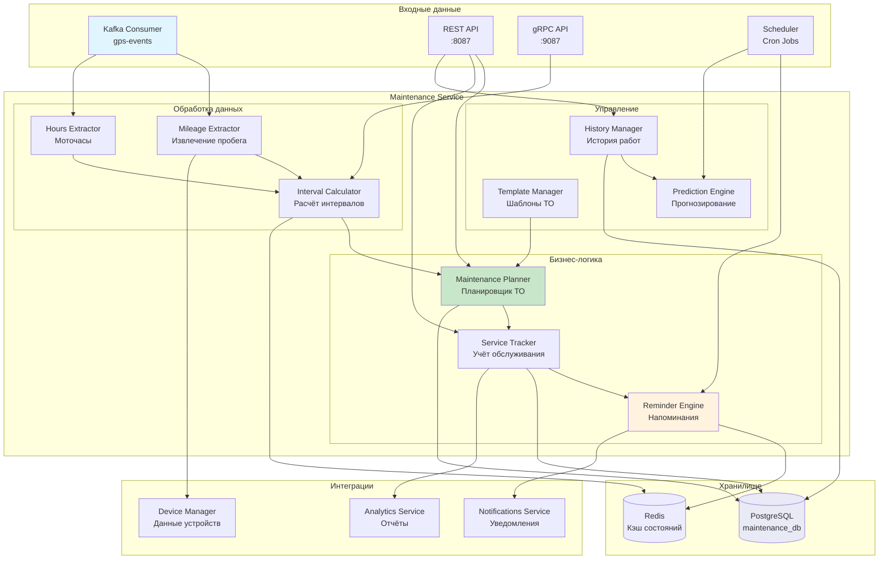

# Maintenance Service (Сервис ТО)

> Блок 2 | Бизнес-логика | Приоритет: MVP

## Обзор

Сервис управления техническим обслуживанием транспортных средств - планирование ТО, учёт пробега/моточасов, напоминания о сервисных интервалах.

## Характеристики

| Параметр | Значение |
|----------|----------|
| Порт | 8087 |
| Язык | Scala 3 + ZIO |
| База данных | PostgreSQL (бизнес-данные) |
| Кэш | Redis |
| События | Kafka Consumer/Producer |
| API | REST + gRPC |

---

## 1. Архитектура

### 1.1 Mermaid Диаграмма - Общая архитектура



### 1.2 UML Sequence - Планирование ТО

```
┌─────────┐   ┌─────────┐   ┌──────────┐   ┌─────────┐   ┌──────────┐   ┌───────────┐
│  API    │   │ Planner │   │ Template │   │ Tracker │   │PostgreSQL│   │   Redis   │
└────┬────┘   └────┬────┘   └────┬─────┘   └────┬────┘   └────┬─────┘   └─────┬─────┘
     │             │             │              │              │               │
     │ createSchedule(vehicleId) │              │              │               │
     │────────────>│             │              │              │               │
     │             │             │              │              │               │
     │             │ getTemplate(templateId)    │              │               │
     │             │────────────>│              │              │               │
     │             │             │              │              │               │
     │             │  template   │              │              │               │
     │             │<────────────│              │              │               │
     │             │             │              │              │               │
     │             │ getCurrentMileage(vehicleId)              │               │
     │             │───────────────────────────>│              │               │
     │             │             │              │              │               │
     │             │             │   mileageData│              │               │
     │             │<───────────────────────────│              │               │
     │             │             │              │              │               │
     │             │             │ calculateNextService()      │               │
     │             │─────────────────────────────────────────>│               │
     │             │             │              │              │               │
     │             │             │              │   nextDate   │               │
     │             │<─────────────────────────────────────────│               │
     │             │             │              │              │               │
     │             │             │   INSERT maintenance_schedule               │
     │             │───────────────────────────────────────────────────────────────>│
     │             │             │              │              │               │
     │             │             │   scheduleId │              │               │
     │             │<───────────────────────────────────────────────────────────────│
     │             │             │              │              │               │
     │             │             │ cacheSchedule(vehicleId, schedule)          │
     │             │────────────────────────────────────────────────────────────────>│
     │             │             │              │              │               │
     │  schedule   │             │              │              │               │
     │<────────────│             │              │              │               │
     │             │             │              │              │               │
```

### 1.3 UML Sequence - Обработка пробега и напоминания

```
┌───────────┐   ┌──────────┐   ┌──────────┐   ┌─────────┐   ┌──────────┐   ┌────────────┐
│   Kafka   │   │ Mileage  │   │ Interval │   │Reminder │   │PostgreSQL│   │Notification│
│ Consumer  │   │Extractor │   │Calculator│   │ Engine  │   │          │   │  Service   │
└─────┬─────┘   └────┬─────┘   └────┬─────┘   └────┬────┘   └────┬─────┘   └──────┬─────┘
      │              │              │              │              │                │
      │ GPSEvent     │              │              │              │                │
      │─────────────>│              │              │              │                │
      │              │              │              │              │                │
      │              │ extractMileage()            │              │                │
      │              │──────┐      │              │              │                │
      │              │      │      │              │              │                │
      │              │<─────┘      │              │              │                │
      │              │              │              │              │                │
      │              │ checkThresholds(mileage)   │              │                │
      │              │─────────────>│              │              │                │
      │              │              │              │              │                │
      │              │              │ getActiveSchedules()       │                │
      │              │              │─────────────────────────────>│                │
      │              │              │              │              │                │
      │              │              │   schedules  │              │                │
      │              │              │<─────────────────────────────│                │
      │              │              │              │              │                │
      │              │              │ calculateRemaining()        │                │
      │              │              │──────┐      │              │                │
      │              │              │      │      │              │                │
      │              │              │<─────┘      │              │                │
      │              │              │              │              │                │
      │              │ thresholdReached: [500km, 100km]          │                │
      │              │<────────────│              │              │                │
      │              │              │              │              │                │
      │              │ triggerReminder(threshold) │              │                │
      │              │──────────────────────────>│              │                │
      │              │              │              │              │                │
      │              │              │              │ checkNotSent(scheduleId)     │
      │              │              │              │─────────────>│                │
      │              │              │              │              │                │
      │              │              │              │ sendReminder(vehicleId, type)│
      │              │              │              │────────────────────────────────>│
      │              │              │              │              │                │
      │              │              │              │ markSent(scheduleId, threshold)│
      │              │              │              │─────────────>│                │
      │              │              │              │              │                │
```

### 1.4 UML Sequence - Регистрация выполненного ТО

```
┌─────────┐   ┌──────────┐   ┌─────────┐   ┌──────────┐   ┌───────────┐   ┌──────────┐
│  API    │   │ Service  │   │ History │   │ Planner  │   │ PostgreSQL│   │  Kafka   │
│         │   │ Tracker  │   │ Manager │   │          │   │           │   │          │
└────┬────┘   └────┬─────┘   └────┬────┘   └────┬─────┘   └─────┬─────┘   └────┬─────┘
     │             │              │              │               │              │
     │ recordService(record)      │              │               │              │
     │────────────>│              │              │               │              │
     │             │              │              │               │              │
     │             │ validateRecord()            │               │              │
     │             │──────┐      │              │               │              │
     │             │      │      │              │               │              │
     │             │<─────┘      │              │               │              │
     │             │              │              │               │              │
     │             │ INSERT service_records      │               │              │
     │             │──────────────────────────────────────────────>│              │
     │             │              │              │               │              │
     │             │              │ archiveRecord(record)        │              │
     │             │──────────────>│              │               │              │
     │             │              │              │               │              │
     │             │              │ INSERT service_history       │              │
     │             │              │───────────────────────────────>│              │
     │             │              │              │               │              │
     │             │ updateSchedule(nextDue)     │               │              │
     │             │───────────────────────────>│               │              │
     │             │              │              │               │              │
     │             │              │              │ calculateNext(template, mileage)
     │             │              │              │──────┐       │              │
     │             │              │              │      │       │              │
     │             │              │              │<─────┘       │              │
     │             │              │              │               │              │
     │             │              │              │ UPDATE maintenance_schedule  │
     │             │              │              │───────────────>│              │
     │             │              │              │               │              │
     │             │ publishEvent(SERVICE_COMPLETED)             │              │
     │             │──────────────────────────────────────────────────────────────>│
     │             │              │              │               │              │
     │  recordId   │              │              │               │              │
     │<────────────│              │              │               │              │
     │             │              │              │               │              │
```

---

## 2. Модели данных

### 2.1 Scala модели

```scala
package tracker.maintenance.domain

import java.time.{Instant, LocalDate}
import java.util.UUID

// ============================================
// Шаблоны ТО
// ============================================

/** Тип интервала обслуживания */
enum IntervalType:
  case Mileage      // По пробегу (км)
  case EngineHours  // По моточасам
  case Calendar     // По календарю (дни)
  case Combined     // Комбинированный (что раньше)

/** Приоритет работы */
enum ServicePriority:
  case Critical    // Критично - безопасность
  case High        // Высокий - надёжность
  case Normal      // Нормальный - плановое ТО
  case Low         // Низкий - рекомендации

/** Статус расписания */
enum ScheduleStatus:
  case Active       // Активно
  case Overdue      // Просрочено
  case Completed    // Выполнено
  case Paused       // Приостановлено

/** Шаблон технического обслуживания */
final case class MaintenanceTemplate(
  id: UUID,
  companyId: UUID,
  name: String,                          // "ТО-1 легковой автомобиль"
  description: Option[String],
  vehicleType: Option[String],           // "car", "truck", "bus"
  intervalType: IntervalType,
  mileageInterval: Option[Int],          // км между ТО (напр. 15000)
  hoursInterval: Option[Int],            // моточасы между ТО
  daysInterval: Option[Int],             // дни между ТО
  priority: ServicePriority,
  estimatedDuration: Int,                // минуты на выполнение
  estimatedCost: Option[BigDecimal],     // примерная стоимость
  items: List[MaintenanceItem],          // список работ
  reminders: List[ReminderConfig],       // настройки напоминаний
  isDefault: Boolean,                    // шаблон по умолчанию
  createdAt: Instant,
  updatedAt: Instant
)

/** Пункт работ в шаблоне */
final case class MaintenanceItem(
  id: UUID,
  name: String,                          // "Замена масла"
  category: String,                      // "oil", "brakes", "tires"
  description: Option[String],
  isRequired: Boolean,                   // обязательный пункт
  partNumbers: List[String],             // артикулы запчастей
  estimatedCost: Option[BigDecimal]
)

/** Настройка напоминания */
final case class ReminderConfig(
  thresholdType: IntervalType,           // по чему напоминать
  thresholdValue: Int,                   // за сколько (км/часов/дней)
  channels: List[String]                 // ["push", "email", "sms"]
)

// ============================================
// Расписание обслуживания
// ============================================

/** Расписание ТО для транспорта */
final case class MaintenanceSchedule(
  id: UUID,
  vehicleId: UUID,
  templateId: UUID,
  companyId: UUID,
  
  // Текущее состояние
  status: ScheduleStatus,
  currentMileage: Long,                  // текущий пробег
  currentHours: Int,                     // текущие моточасы
  
  // Последнее ТО
  lastServiceDate: Option[LocalDate],
  lastServiceMileage: Option[Long],
  lastServiceHours: Option[Int],
  
  // Следующее ТО
  nextDueDate: Option[LocalDate],
  nextDueMileage: Option[Long],
  nextDueHours: Option[Int],
  
  // Оставшееся до ТО
  remainingDays: Option[Int],
  remainingMileage: Option[Long],
  remainingHours: Option[Int],
  
  // Напоминания
  reminder500kmSent: Boolean,
  reminder100kmSent: Boolean,
  reminder7daysSent: Boolean,
  reminder1daySent: Boolean,
  
  notes: Option[String],
  createdAt: Instant,
  updatedAt: Instant
)

// ============================================
// Записи о выполненном ТО
// ============================================

/** Запись о выполненном обслуживании */
final case class ServiceRecord(
  id: UUID,
  vehicleId: UUID,
  scheduleId: Option[UUID],              // связь с расписанием
  companyId: UUID,
  
  // Когда выполнено
  serviceDate: LocalDate,
  mileageAtService: Long,
  hoursAtService: Option[Int],
  
  // Что выполнено
  serviceType: String,                   // "scheduled", "repair", "inspection"
  description: String,
  items: List[ServiceItemRecord],
  
  // Стоимость
  laborCost: Option[BigDecimal],
  partsCost: Option[BigDecimal],
  totalCost: Option[BigDecimal],
  
  // Исполнитель
  performedBy: Option[String],           // имя механика
  serviceCenter: Option[String],         // название СТО
  
  // Документы
  invoiceNumber: Option[String],
  attachments: List[String],             // пути к файлам
  
  notes: Option[String],
  createdBy: UUID,                       // кто внёс запись
  createdAt: Instant
)

/** Пункт выполненных работ */
final case class ServiceItemRecord(
  itemId: Option[UUID],                  // ссылка на MaintenanceItem
  name: String,
  category: String,
  partNumber: Option[String],
  quantity: Int,
  unitCost: Option[BigDecimal],
  completed: Boolean
)

// ============================================
// Мониторинг пробега и моточасов
// ============================================

/** Снимок одометра */
final case class OdometerReading(
  id: UUID,
  vehicleId: UUID,
  reading: Long,                         // значение одометра в метрах
  source: String,                        // "gps", "can", "manual"
  recordedAt: Instant,
  gpsEventId: Option[UUID]               // ссылка на GPS событие
)

/** Снимок моточасов */
final case class EngineHoursReading(
  id: UUID,
  vehicleId: UUID,
  reading: Int,                          // моточасы
  source: String,                        // "can", "calculated", "manual"
  recordedAt: Instant
)

/** Суточная статистика пробега */
final case class DailyMileage(
  vehicleId: UUID,
  date: LocalDate,
  startMileage: Long,
  endMileage: Long,
  totalKm: Int,
  tripCount: Int
)

// ============================================
// События и уведомления
// ============================================

/** Событие обслуживания */
enum MaintenanceEvent:
  case ScheduleCreated(scheduleId: UUID, vehicleId: UUID)
  case ServiceDue(scheduleId: UUID, dueType: String, remaining: Int)
  case ServiceOverdue(scheduleId: UUID, overdueBy: Int)
  case ServiceCompleted(recordId: UUID, scheduleId: UUID)
  case ReminderSent(scheduleId: UUID, reminderType: String)

/** Уведомление о ТО */
final case class MaintenanceReminder(
  id: UUID,
  scheduleId: UUID,
  vehicleId: UUID,
  companyId: UUID,
  reminderType: String,                  // "approaching", "due", "overdue"
  thresholdType: String,                 // "mileage", "hours", "calendar"
  thresholdValue: Int,
  message: String,
  sentAt: Instant
)

// ============================================
// API модели
// ============================================

/** Запрос создания шаблона */
final case class CreateTemplateRequest(
  name: String,
  description: Option[String],
  vehicleType: Option[String],
  intervalType: IntervalType,
  mileageInterval: Option[Int],
  hoursInterval: Option[Int],
  daysInterval: Option[Int],
  priority: ServicePriority,
  estimatedDuration: Int,
  items: List[CreateMaintenanceItem],
  reminders: List[ReminderConfig]
)

final case class CreateMaintenanceItem(
  name: String,
  category: String,
  description: Option[String],
  isRequired: Boolean,
  partNumbers: List[String],
  estimatedCost: Option[BigDecimal]
)

/** Запрос создания расписания */
final case class CreateScheduleRequest(
  vehicleId: UUID,
  templateId: UUID,
  startMileage: Option[Long],
  startHours: Option[Int],
  startDate: Option[LocalDate],
  notes: Option[String]
)

/** Запрос регистрации ТО */
final case class RecordServiceRequest(
  vehicleId: UUID,
  scheduleId: Option[UUID],
  serviceDate: LocalDate,
  mileageAtService: Long,
  hoursAtService: Option[Int],
  serviceType: String,
  description: String,
  items: List[ServiceItemRecord],
  laborCost: Option[BigDecimal],
  partsCost: Option[BigDecimal],
  performedBy: Option[String],
  serviceCenter: Option[String],
  invoiceNumber: Option[String],
  notes: Option[String]
)

/** Обзор ТО для транспорта */
final case class VehicleMaintenanceOverview(
  vehicleId: UUID,
  vehicleName: String,
  currentMileage: Long,
  currentHours: Option[Int],
  activeSchedules: List[ScheduleSummary],
  overdueCount: Int,
  upcomingCount: Int,
  lastService: Option[ServiceSummary],
  nextService: Option[ServiceSummary]
)

final case class ScheduleSummary(
  scheduleId: UUID,
  templateName: String,
  status: ScheduleStatus,
  remainingMileage: Option[Long],
  remainingDays: Option[Int],
  nextDueDate: Option[LocalDate]
)

final case class ServiceSummary(
  date: LocalDate,
  description: String,
  mileage: Long,
  totalCost: Option[BigDecimal]
)
```

---

## 3. Схема базы данных (PostgreSQL)

```sql
-- ============================================
-- Схема: maintenance_service
-- ============================================

CREATE SCHEMA IF NOT EXISTS maintenance;

-- Типы перечислений
CREATE TYPE maintenance.interval_type AS ENUM ('mileage', 'engine_hours', 'calendar', 'combined');
CREATE TYPE maintenance.service_priority AS ENUM ('critical', 'high', 'normal', 'low');
CREATE TYPE maintenance.schedule_status AS ENUM ('active', 'overdue', 'completed', 'paused');
CREATE TYPE maintenance.service_type AS ENUM ('scheduled', 'repair', 'inspection', 'emergency');

-- ============================================
-- Таблица: maintenance_templates (Шаблоны ТО)
-- ============================================

CREATE TABLE maintenance.templates (
    id                  UUID PRIMARY KEY DEFAULT gen_random_uuid(),
    company_id          UUID NOT NULL,                       -- REFERENCES users.companies(id)
    name                VARCHAR(255) NOT NULL,
    description         TEXT,
    vehicle_type        VARCHAR(50),                         -- car, truck, bus, special
    interval_type       maintenance.interval_type NOT NULL,
    mileage_interval    INTEGER,                             -- км
    hours_interval      INTEGER,                             -- моточасы
    days_interval       INTEGER,                             -- дни
    priority            maintenance.service_priority NOT NULL DEFAULT 'normal',
    estimated_duration  INTEGER NOT NULL DEFAULT 60,         -- минуты
    estimated_cost      DECIMAL(12,2),
    is_default          BOOLEAN NOT NULL DEFAULT false,
    is_active           BOOLEAN NOT NULL DEFAULT true,
    created_at          TIMESTAMPTZ NOT NULL DEFAULT NOW(),
    updated_at          TIMESTAMPTZ NOT NULL DEFAULT NOW(),
    
    CONSTRAINT valid_interval CHECK (
        mileage_interval IS NOT NULL OR 
        hours_interval IS NOT NULL OR 
        days_interval IS NOT NULL
    )
);

CREATE INDEX idx_templates_company ON maintenance.templates(company_id);
CREATE INDEX idx_templates_vehicle_type ON maintenance.templates(vehicle_type);
CREATE INDEX idx_templates_active ON maintenance.templates(is_active) WHERE is_active = true;

-- ============================================
-- Таблица: template_items (Пункты работ в шаблоне)
-- ============================================

CREATE TABLE maintenance.template_items (
    id                  UUID PRIMARY KEY DEFAULT gen_random_uuid(),
    template_id         UUID NOT NULL REFERENCES maintenance.templates(id) ON DELETE CASCADE,
    name                VARCHAR(255) NOT NULL,
    category            VARCHAR(100) NOT NULL,               -- oil, brakes, tires, etc.
    description         TEXT,
    is_required         BOOLEAN NOT NULL DEFAULT true,
    part_numbers        TEXT[],                              -- артикулы запчастей
    estimated_cost      DECIMAL(12,2),
    sort_order          INTEGER NOT NULL DEFAULT 0,
    created_at          TIMESTAMPTZ NOT NULL DEFAULT NOW()
);

CREATE INDEX idx_template_items_template ON maintenance.template_items(template_id);
CREATE INDEX idx_template_items_category ON maintenance.template_items(category);

-- ============================================
-- Таблица: reminder_configs (Настройки напоминаний)
-- ============================================

CREATE TABLE maintenance.reminder_configs (
    id                  UUID PRIMARY KEY DEFAULT gen_random_uuid(),
    template_id         UUID NOT NULL REFERENCES maintenance.templates(id) ON DELETE CASCADE,
    threshold_type      maintenance.interval_type NOT NULL,
    threshold_value     INTEGER NOT NULL,                    -- за сколько напоминать
    channels            TEXT[] NOT NULL,                     -- push, email, sms
    created_at          TIMESTAMPTZ NOT NULL DEFAULT NOW()
);

CREATE INDEX idx_reminder_configs_template ON maintenance.reminder_configs(template_id);

-- ============================================
-- Таблица: schedules (Расписания ТО)
-- ============================================

CREATE TABLE maintenance.schedules (
    id                  UUID PRIMARY KEY DEFAULT gen_random_uuid(),
    vehicle_id          UUID NOT NULL,                       -- REFERENCES devices.vehicles(id)
    template_id         UUID NOT NULL REFERENCES maintenance.templates(id),
    company_id          UUID NOT NULL,
    
    -- Текущее состояние
    status              maintenance.schedule_status NOT NULL DEFAULT 'active',
    current_mileage     BIGINT NOT NULL DEFAULT 0,           -- метры
    current_hours       INTEGER NOT NULL DEFAULT 0,
    
    -- Последнее ТО
    last_service_date   DATE,
    last_service_mileage BIGINT,
    last_service_hours  INTEGER,
    
    -- Следующее ТО
    next_due_date       DATE,
    next_due_mileage    BIGINT,
    next_due_hours      INTEGER,
    
    -- Оставшееся
    remaining_days      INTEGER,
    remaining_mileage   BIGINT,                              -- метры
    remaining_hours     INTEGER,
    
    -- Флаги отправленных напоминаний
    reminder_500km_sent BOOLEAN NOT NULL DEFAULT false,
    reminder_100km_sent BOOLEAN NOT NULL DEFAULT false,
    reminder_7days_sent BOOLEAN NOT NULL DEFAULT false,
    reminder_1day_sent  BOOLEAN NOT NULL DEFAULT false,
    
    notes               TEXT,
    is_active           BOOLEAN NOT NULL DEFAULT true,
    created_at          TIMESTAMPTZ NOT NULL DEFAULT NOW(),
    updated_at          TIMESTAMPTZ NOT NULL DEFAULT NOW()
);

CREATE INDEX idx_schedules_vehicle ON maintenance.schedules(vehicle_id);
CREATE INDEX idx_schedules_company ON maintenance.schedules(company_id);
CREATE INDEX idx_schedules_status ON maintenance.schedules(status);
CREATE INDEX idx_schedules_next_due ON maintenance.schedules(next_due_date, next_due_mileage);
CREATE INDEX idx_schedules_active ON maintenance.schedules(is_active, status) 
    WHERE is_active = true;

-- ============================================
-- Таблица: service_records (Записи о ТО)
-- ============================================

CREATE TABLE maintenance.service_records (
    id                  UUID PRIMARY KEY DEFAULT gen_random_uuid(),
    vehicle_id          UUID NOT NULL,
    schedule_id         UUID REFERENCES maintenance.schedules(id),
    company_id          UUID NOT NULL,
    
    -- Когда
    service_date        DATE NOT NULL,
    mileage_at_service  BIGINT NOT NULL,                     -- метры
    hours_at_service    INTEGER,
    
    -- Что
    service_type        maintenance.service_type NOT NULL,
    description         TEXT NOT NULL,
    
    -- Стоимость
    labor_cost          DECIMAL(12,2),
    parts_cost          DECIMAL(12,2),
    total_cost          DECIMAL(12,2),
    
    -- Исполнитель
    performed_by        VARCHAR(255),
    service_center      VARCHAR(255),
    
    -- Документы
    invoice_number      VARCHAR(100),
    attachments         TEXT[],
    
    notes               TEXT,
    created_by          UUID NOT NULL,
    created_at          TIMESTAMPTZ NOT NULL DEFAULT NOW()
);

CREATE INDEX idx_service_records_vehicle ON maintenance.service_records(vehicle_id);
CREATE INDEX idx_service_records_company ON maintenance.service_records(company_id);
CREATE INDEX idx_service_records_date ON maintenance.service_records(service_date DESC);
CREATE INDEX idx_service_records_schedule ON maintenance.service_records(schedule_id);

-- ============================================
-- Таблица: service_record_items (Пункты выполненных работ)
-- ============================================

CREATE TABLE maintenance.service_record_items (
    id                  UUID PRIMARY KEY DEFAULT gen_random_uuid(),
    record_id           UUID NOT NULL REFERENCES maintenance.service_records(id) ON DELETE CASCADE,
    template_item_id    UUID REFERENCES maintenance.template_items(id),
    name                VARCHAR(255) NOT NULL,
    category            VARCHAR(100) NOT NULL,
    part_number         VARCHAR(100),
    quantity            INTEGER NOT NULL DEFAULT 1,
    unit_cost           DECIMAL(12,2),
    completed           BOOLEAN NOT NULL DEFAULT true,
    created_at          TIMESTAMPTZ NOT NULL DEFAULT NOW()
);

CREATE INDEX idx_record_items_record ON maintenance.service_record_items(record_id);

-- ============================================
-- Таблица: odometer_readings (Показания одометра)
-- ============================================

CREATE TABLE maintenance.odometer_readings (
    id                  UUID PRIMARY KEY DEFAULT gen_random_uuid(),
    vehicle_id          UUID NOT NULL,
    reading             BIGINT NOT NULL,                     -- метры
    source              VARCHAR(50) NOT NULL,                -- gps, can, manual
    recorded_at         TIMESTAMPTZ NOT NULL,
    gps_event_id        UUID,
    created_at          TIMESTAMPTZ NOT NULL DEFAULT NOW()
);

CREATE INDEX idx_odometer_vehicle_time ON maintenance.odometer_readings(vehicle_id, recorded_at DESC);

-- Партиционирование по времени
CREATE TABLE maintenance.odometer_readings_y2025m01 
    PARTITION OF maintenance.odometer_readings 
    FOR VALUES FROM ('2025-01-01') TO ('2025-02-01');

-- ============================================
-- Таблица: daily_mileage (Суточный пробег)
-- ============================================

CREATE TABLE maintenance.daily_mileage (
    vehicle_id          UUID NOT NULL,
    date                DATE NOT NULL,
    start_mileage       BIGINT NOT NULL,                     -- метры
    end_mileage         BIGINT NOT NULL,
    total_km            INTEGER NOT NULL,
    trip_count          INTEGER NOT NULL DEFAULT 0,
    created_at          TIMESTAMPTZ NOT NULL DEFAULT NOW(),
    
    PRIMARY KEY (vehicle_id, date)
);

CREATE INDEX idx_daily_mileage_date ON maintenance.daily_mileage(date DESC);

-- ============================================
-- Таблица: reminders_log (Лог напоминаний)
-- ============================================

CREATE TABLE maintenance.reminders_log (
    id                  UUID PRIMARY KEY DEFAULT gen_random_uuid(),
    schedule_id         UUID NOT NULL REFERENCES maintenance.schedules(id),
    vehicle_id          UUID NOT NULL,
    company_id          UUID NOT NULL,
    reminder_type       VARCHAR(50) NOT NULL,                -- approaching, due, overdue
    threshold_type      VARCHAR(50) NOT NULL,
    threshold_value     INTEGER NOT NULL,
    message             TEXT NOT NULL,
    channels            TEXT[] NOT NULL,
    sent_at             TIMESTAMPTZ NOT NULL DEFAULT NOW()
);

CREATE INDEX idx_reminders_log_schedule ON maintenance.reminders_log(schedule_id);
CREATE INDEX idx_reminders_log_sent ON maintenance.reminders_log(sent_at DESC);

-- ============================================
-- Представления
-- ============================================

-- Представление: Обзор ТО по транспорту
CREATE VIEW maintenance.vehicle_overview AS
SELECT 
    s.vehicle_id,
    s.company_id,
    COUNT(*) FILTER (WHERE s.status = 'active') as active_schedules,
    COUNT(*) FILTER (WHERE s.status = 'overdue') as overdue_count,
    COUNT(*) FILTER (WHERE s.remaining_mileage < 1000000 OR s.remaining_days < 7) as upcoming_count,
    MIN(s.next_due_date) FILTER (WHERE s.status = 'active') as nearest_due_date,
    MIN(s.remaining_mileage) FILTER (WHERE s.status = 'active') as min_remaining_mileage
FROM maintenance.schedules s
WHERE s.is_active = true
GROUP BY s.vehicle_id, s.company_id;

-- Представление: Статистика по шаблонам
CREATE VIEW maintenance.template_stats AS
SELECT 
    t.id as template_id,
    t.company_id,
    t.name,
    COUNT(DISTINCT s.vehicle_id) as vehicles_using,
    COUNT(sr.id) as total_services,
    AVG(sr.total_cost) as avg_cost,
    AVG(sr.mileage_at_service - LAG(sr.mileage_at_service) OVER (
        PARTITION BY sr.vehicle_id ORDER BY sr.service_date
    )) / 1000 as avg_interval_km
FROM maintenance.templates t
LEFT JOIN maintenance.schedules s ON s.template_id = t.id
LEFT JOIN maintenance.service_records sr ON sr.schedule_id = s.id
GROUP BY t.id, t.company_id, t.name;

-- ============================================
-- Функции
-- ============================================

-- Функция: Обновление оставшегося пробега/времени
CREATE OR REPLACE FUNCTION maintenance.update_schedule_remaining()
RETURNS TRIGGER AS $$
BEGIN
    -- Расчёт оставшегося пробега
    IF NEW.next_due_mileage IS NOT NULL THEN
        NEW.remaining_mileage := GREATEST(0, NEW.next_due_mileage - NEW.current_mileage);
    END IF;
    
    -- Расчёт оставшихся моточасов
    IF NEW.next_due_hours IS NOT NULL THEN
        NEW.remaining_hours := GREATEST(0, NEW.next_due_hours - NEW.current_hours);
    END IF;
    
    -- Расчёт оставшихся дней
    IF NEW.next_due_date IS NOT NULL THEN
        NEW.remaining_days := GREATEST(0, NEW.next_due_date - CURRENT_DATE);
    END IF;
    
    -- Проверка просрочки
    IF (NEW.remaining_mileage IS NOT NULL AND NEW.remaining_mileage <= 0) OR
       (NEW.remaining_hours IS NOT NULL AND NEW.remaining_hours <= 0) OR
       (NEW.remaining_days IS NOT NULL AND NEW.remaining_days <= 0) THEN
        NEW.status := 'overdue';
    END IF;
    
    NEW.updated_at := NOW();
    RETURN NEW;
END;
$$ LANGUAGE plpgsql;

CREATE TRIGGER trg_update_schedule_remaining
    BEFORE UPDATE OF current_mileage, current_hours, next_due_mileage, next_due_hours, next_due_date
    ON maintenance.schedules
    FOR EACH ROW
    EXECUTE FUNCTION maintenance.update_schedule_remaining();

-- Функция: Расчёт следующего ТО после выполнения
CREATE OR REPLACE FUNCTION maintenance.calculate_next_service(
    p_schedule_id UUID,
    p_service_date DATE,
    p_service_mileage BIGINT,
    p_service_hours INTEGER
)
RETURNS VOID AS $$
DECLARE
    v_template maintenance.templates%ROWTYPE;
    v_schedule maintenance.schedules%ROWTYPE;
BEGIN
    SELECT s.*, t.* INTO v_schedule, v_template
    FROM maintenance.schedules s
    JOIN maintenance.templates t ON t.id = s.template_id
    WHERE s.id = p_schedule_id;
    
    -- Обновление расписания
    UPDATE maintenance.schedules SET
        last_service_date = p_service_date,
        last_service_mileage = p_service_mileage,
        last_service_hours = p_service_hours,
        current_mileage = p_service_mileage,
        current_hours = COALESCE(p_service_hours, current_hours),
        next_due_date = CASE 
            WHEN v_template.days_interval IS NOT NULL 
            THEN p_service_date + v_template.days_interval 
            ELSE NULL 
        END,
        next_due_mileage = CASE 
            WHEN v_template.mileage_interval IS NOT NULL 
            THEN p_service_mileage + (v_template.mileage_interval * 1000)
            ELSE NULL 
        END,
        next_due_hours = CASE 
            WHEN v_template.hours_interval IS NOT NULL 
            THEN COALESCE(p_service_hours, 0) + v_template.hours_interval 
            ELSE NULL 
        END,
        -- Сброс флагов напоминаний
        reminder_500km_sent = false,
        reminder_100km_sent = false,
        reminder_7days_sent = false,
        reminder_1day_sent = false,
        status = 'active',
        updated_at = NOW()
    WHERE id = p_schedule_id;
END;
$$ LANGUAGE plpgsql;
```

---

## 4. Kafka интеграция

### 4.1 Входящие топики

```yaml
# Чтение GPS событий для отслеживания пробега
topic: gps-events
consumer_group: maintenance-service-mileage
partitions: 12
```

### 4.2 Исходящие события

```scala
// Топик событий обслуживания
// topic: maintenance-events

sealed trait MaintenanceKafkaEvent

case class ScheduleCreated(
  eventId: UUID,
  timestamp: Instant,
  scheduleId: UUID,
  vehicleId: UUID,
  companyId: UUID,
  templateName: String
) extends MaintenanceKafkaEvent

case class ServiceDueReminder(
  eventId: UUID,
  timestamp: Instant,
  scheduleId: UUID,
  vehicleId: UUID,
  companyId: UUID,
  dueType: String,           // "mileage", "hours", "calendar"
  remainingValue: Int,       // оставшееся значение
  templateName: String
) extends MaintenanceKafkaEvent

case class ServiceOverdue(
  eventId: UUID,
  timestamp: Instant,
  scheduleId: UUID,
  vehicleId: UUID,
  companyId: UUID,
  overdueType: String,
  overdueBy: Int,
  templateName: String
) extends MaintenanceKafkaEvent

case class ServiceCompleted(
  eventId: UUID,
  timestamp: Instant,
  recordId: UUID,
  scheduleId: Option[UUID],
  vehicleId: UUID,
  companyId: UUID,
  serviceType: String,
  mileageAtService: Long,
  totalCost: Option[BigDecimal]
) extends MaintenanceKafkaEvent
```

---

## 5. REST API

### 5.1 Endpoints

```yaml
# ==========================================
# Шаблоны ТО
# ==========================================

# Получить список шаблонов компании
GET /api/v1/maintenance/templates
Parameters:
  - vehicleType: string (optional)
  - priority: string (optional)
Response: 200 OK
  {
    "templates": [
      {
        "id": "uuid",
        "name": "ТО-1 легковой",
        "intervalType": "mileage",
        "mileageInterval": 15000,
        "priority": "normal",
        "itemsCount": 8,
        "vehiclesUsing": 12
      }
    ]
  }

# Создать шаблон
POST /api/v1/maintenance/templates
Body: CreateTemplateRequest
Response: 201 Created
  { "id": "uuid", "name": "..." }

# Получить шаблон
GET /api/v1/maintenance/templates/{templateId}
Response: 200 OK
  MaintenanceTemplate (full with items)

# Обновить шаблон
PUT /api/v1/maintenance/templates/{templateId}
Body: UpdateTemplateRequest
Response: 200 OK

# Удалить шаблон
DELETE /api/v1/maintenance/templates/{templateId}
Response: 204 No Content

# ==========================================
# Расписания ТО
# ==========================================

# Получить расписания для транспорта
GET /api/v1/maintenance/vehicles/{vehicleId}/schedules
Response: 200 OK
  {
    "schedules": [
      {
        "id": "uuid",
        "templateName": "ТО-1",
        "status": "active",
        "remainingMileage": 3500,
        "remainingDays": 45,
        "nextDueDate": "2025-03-15"
      }
    ]
  }

# Создать расписание
POST /api/v1/maintenance/schedules
Body: CreateScheduleRequest
Response: 201 Created

# Обзор ТО по компании
GET /api/v1/maintenance/overview
Parameters:
  - status: string (optional) - active, overdue
Response: 200 OK
  {
    "totalVehicles": 50,
    "overdueCount": 3,
    "upcomingCount": 12,
    "vehicles": [
      {
        "vehicleId": "uuid",
        "vehicleName": "А123BC",
        "overdueSchedules": 1,
        "nearestDue": "2025-02-01"
      }
    ]
  }

# Приостановить/возобновить расписание
PUT /api/v1/maintenance/schedules/{scheduleId}/status
Body: { "status": "paused" | "active" }
Response: 200 OK

# ==========================================
# Записи о ТО
# ==========================================

# Зарегистрировать ТО
POST /api/v1/maintenance/records
Body: RecordServiceRequest
Response: 201 Created
  { "id": "uuid", "scheduleUpdated": true }

# История ТО для транспорта
GET /api/v1/maintenance/vehicles/{vehicleId}/history
Parameters:
  - limit: number (default 20)
  - offset: number (default 0)
  - fromDate: date (optional)
  - toDate: date (optional)
Response: 200 OK
  {
    "total": 25,
    "records": [
      {
        "id": "uuid",
        "serviceDate": "2025-01-15",
        "description": "Замена масла и фильтров",
        "mileageKm": 75000,
        "totalCost": 5500.00,
        "serviceCenter": "АвтоСервис"
      }
    ]
  }

# Получить запись ТО
GET /api/v1/maintenance/records/{recordId}
Response: 200 OK
  ServiceRecord (full)

# ==========================================
# Пробег и моточасы
# ==========================================

# Обновить пробег вручную
POST /api/v1/maintenance/vehicles/{vehicleId}/odometer
Body: { "reading": 75500, "source": "manual" }
Response: 200 OK

# Получить статистику пробега
GET /api/v1/maintenance/vehicles/{vehicleId}/mileage
Parameters:
  - period: string - day, week, month, year
Response: 200 OK
  {
    "currentMileage": 75500,
    "periodMileage": 2500,
    "averageDailyKm": 85,
    "dailyData": [
      { "date": "2025-01-20", "km": 120 }
    ]
  }
```

---

## 6. Redis кэширование

```yaml
# Текущий пробег транспорта (для быстрой проверки)
key: "maint:mileage:{vehicleId}"
value: "75500000"  # метры
ttl: -  # без TTL, обновляется из GPS

# Расписания для быстрой проверки порогов
key: "maint:schedules:{vehicleId}"
value: |
  [
    {
      "scheduleId": "uuid",
      "nextDueMileage": 80000000,
      "nextDueDate": "2025-03-15",
      "reminder500kmSent": false,
      "reminder100kmSent": false
    }
  ]
ttl: 3600s

# Флаги отправленных напоминаний (защита от дублей)
key: "maint:reminder:{scheduleId}:{thresholdType}:{thresholdValue}"
value: "1"
ttl: 86400s  # 24 часа

# Блокировка обработки пробега (предотвращение race condition)
key: "maint:lock:mileage:{vehicleId}"
value: "processing"
ttl: 5s
```

---

## 7. Scheduler Jobs (Cron)

```scala
// Планировщик задач обслуживания

object MaintenanceScheduler:
  
  /** Ежедневная проверка календарных напоминаний (00:05) */
  val checkCalendarReminders: Schedule[Any, Any] = 
    Schedule.cron("0 5 0 * * ?")
  
  /** Обновление статусов просроченных ТО (каждый час) */
  val updateOverdueStatus: Schedule[Any, Any] = 
    Schedule.cron("0 0 * * * ?")
  
  /** Расчёт суточного пробега (23:55) */
  val calculateDailyMileage: Schedule[Any, Any] = 
    Schedule.cron("0 55 23 * * ?")
  
  /** Очистка старых логов напоминаний (раз в месяц) */
  val cleanupOldLogs: Schedule[Any, Any] = 
    Schedule.cron("0 0 3 1 * ?")
```

---

## 8. Примеры запросов

### Создание шаблона ТО

```bash
curl -X POST http://localhost:8087/api/v1/maintenance/templates \
  -H "Content-Type: application/json" \
  -d '{
    "name": "ТО-1 легковой автомобиль",
    "description": "Базовое техническое обслуживание",
    "vehicleType": "car",
    "intervalType": "combined",
    "mileageInterval": 15000,
    "daysInterval": 365,
    "priority": "normal",
    "estimatedDuration": 120,
    "items": [
      {
        "name": "Замена моторного масла",
        "category": "oil",
        "isRequired": true,
        "partNumbers": ["SHELL-5W30-5L"]
      },
      {
        "name": "Замена масляного фильтра",
        "category": "filters",
        "isRequired": true
      },
      {
        "name": "Замена воздушного фильтра",
        "category": "filters",
        "isRequired": true
      },
      {
        "name": "Проверка тормозной системы",
        "category": "brakes",
        "isRequired": true
      }
    ],
    "reminders": [
      { "thresholdType": "mileage", "thresholdValue": 500, "channels": ["push"] },
      { "thresholdType": "mileage", "thresholdValue": 100, "channels": ["push", "email"] },
      { "thresholdType": "calendar", "thresholdValue": 7, "channels": ["push"] },
      { "thresholdType": "calendar", "thresholdValue": 1, "channels": ["push", "sms"] }
    ]
  }'
```

### Создание расписания для транспорта

```bash
curl -X POST http://localhost:8087/api/v1/maintenance/schedules \
  -H "Content-Type: application/json" \
  -d '{
    "vehicleId": "123e4567-e89b-12d3-a456-426614174000",
    "templateId": "789e4567-e89b-12d3-a456-426614174000",
    "startMileage": 60000,
    "startDate": "2025-01-01",
    "notes": "Новый автомобиль, начало отсчёта ТО"
  }'
```

### Регистрация выполненного ТО

```bash
curl -X POST http://localhost:8087/api/v1/maintenance/records \
  -H "Content-Type: application/json" \
  -d '{
    "vehicleId": "123e4567-e89b-12d3-a456-426614174000",
    "scheduleId": "456e4567-e89b-12d3-a456-426614174000",
    "serviceDate": "2025-01-20",
    "mileageAtService": 75000,
    "serviceType": "scheduled",
    "description": "ТО-1: замена масла, фильтров, проверка тормозов",
    "items": [
      { "name": "Замена моторного масла", "category": "oil", "quantity": 1, "unitCost": 3500, "completed": true },
      { "name": "Масляный фильтр", "category": "filters", "partNumber": "MANN-W712", "quantity": 1, "unitCost": 450, "completed": true },
      { "name": "Воздушный фильтр", "category": "filters", "quantity": 1, "unitCost": 600, "completed": true }
    ],
    "laborCost": 2000,
    "partsCost": 4550,
    "performedBy": "Иванов А.А.",
    "serviceCenter": "АвтоТехЦентр",
    "invoiceNumber": "INV-2025-001234"
  }'
```

---

## 9. Метрики и мониторинг

```yaml
# Prometheus метрики

# Счётчики
maintenance_schedules_total{status}        # Всего расписаний по статусам
maintenance_records_total{service_type}    # Записей ТО по типам
maintenance_reminders_sent_total{type}     # Отправленных напоминаний

# Гистограммы
maintenance_service_cost_rub              # Стоимость ТО
maintenance_interval_km                    # Фактические интервалы между ТО
maintenance_overdue_days                   # Дней просрочки

# Gauge
maintenance_overdue_vehicles_count         # Транспорт с просроченным ТО
maintenance_upcoming_services_count        # ТО в ближайшие 7 дней

# Алерты
- alert: HighOverdueRate
  expr: maintenance_overdue_vehicles_count / maintenance_schedules_total{status="active"} > 0.1
  for: 1h
  annotations:
    summary: "Более 10% транспорта с просроченным ТО"
```

---

## 10. AI Промпт для реализации сервиса

### Контекст и задача

```markdown
# Задача: Реализовать Maintenance Service для GPS трекинг системы

## Контекст
Сервис управления техническим обслуживанием транспортных средств для TrackerGPS системы.
Часть Блока 2 (Бизнес-логика). Планирование ТО, учёт пробега/моточасов, напоминания.

## Технический стек (ОБЯЗАТЕЛЬНО)
- Scala 3.4.0
- ZIO 2.0.20 (эффекты, стримы, конкурентность)
- zio-http (REST API)
- zio-kafka (Kafka интеграция)
- zio-redis (кэширование)
- Quill (PostgreSQL доступ)
- zio-json (сериализация)
- zio-config (конфигурация)
- zio-logging (логирование)

## Архитектурные компоненты

### 1. Слой домена (domain/)
```scala
// models.scala - Все case classes из раздела 2.1
// Включая: MaintenanceTemplate, MaintenanceItem, ReminderConfig,
// MaintenanceSchedule, ServiceRecord, OdometerReading, и т.д.

// errors.scala
enum MaintenanceError:
  case TemplateNotFound(id: UUID)
  case ScheduleNotFound(id: UUID)
  case InvalidInterval(message: String)
  case VehicleNotFound(id: UUID)
  case ReminderAlreadySent(scheduleId: UUID, threshold: String)
```

### 2. Слой репозитория (repository/)
```scala
// TemplateRepository.scala
trait TemplateRepository:
  def create(template: MaintenanceTemplate): Task[UUID]
  def findById(id: UUID): Task[Option[MaintenanceTemplate]]
  def findByCompany(companyId: UUID, vehicleType: Option[String]): Task[List[MaintenanceTemplate]]
  def update(template: MaintenanceTemplate): Task[Unit]
  def delete(id: UUID): Task[Unit]

// ScheduleRepository.scala  
trait ScheduleRepository:
  def create(schedule: MaintenanceSchedule): Task[UUID]
  def findById(id: UUID): Task[Option[MaintenanceSchedule]]
  def findByVehicle(vehicleId: UUID): Task[List[MaintenanceSchedule]]
  def findActiveByCompany(companyId: UUID): Task[List[MaintenanceSchedule]]
  def findOverdue(): Task[List[MaintenanceSchedule]]
  def findApproachingThreshold(thresholdKm: Int, thresholdDays: Int): Task[List[MaintenanceSchedule]]
  def updateMileage(vehicleId: UUID, mileage: Long): Task[Unit]
  def updateReminderFlag(scheduleId: UUID, flagName: String): Task[Unit]

// ServiceRecordRepository.scala
trait ServiceRecordRepository:
  def create(record: ServiceRecord): Task[UUID]
  def findByVehicle(vehicleId: UUID, limit: Int, offset: Int): Task[List[ServiceRecord]]
  def findById(id: UUID): Task[Option[ServiceRecord]]
```

### 3. Слой сервисов (service/)
```scala
// MileageTracker.scala - Извлечение и отслеживание пробега из GPS событий
trait MileageTracker:
  def processGpsEvent(event: GpsEvent): Task[Unit]
  def getCurrentMileage(vehicleId: UUID): Task[Long]
  def getDailyMileage(vehicleId: UUID, date: LocalDate): Task[Option[DailyMileage]]

// IntervalCalculator.scala - Расчёт интервалов и оставшегося до ТО
trait IntervalCalculator:
  def calculateNextService(template: MaintenanceTemplate, currentMileage: Long, currentHours: Int, currentDate: LocalDate): Task[NextServiceInfo]
  def calculateRemaining(schedule: MaintenanceSchedule): Task[RemainingInfo]
  def checkThresholds(schedule: MaintenanceSchedule): Task[List[ThresholdReached]]

// MaintenancePlanner.scala - Планирование ТО
trait MaintenancePlanner:
  def createSchedule(request: CreateScheduleRequest): Task[MaintenanceSchedule]
  def updateScheduleAfterService(scheduleId: UUID, serviceRecord: ServiceRecord): Task[Unit]
  def pauseSchedule(scheduleId: UUID): Task[Unit]
  def resumeSchedule(scheduleId: UUID): Task[Unit]

// ReminderEngine.scala - Движок напоминаний
trait ReminderEngine:
  def checkAndSendReminders(schedule: MaintenanceSchedule): Task[List[ReminderSent]]
  def processCalendarReminders(): Task[Int]  // для cron job

// MaintenanceService.scala - Фасад сервиса
trait MaintenanceService:
  // Шаблоны
  def createTemplate(companyId: UUID, request: CreateTemplateRequest): Task[UUID]
  def getTemplate(id: UUID): Task[MaintenanceTemplate]
  def listTemplates(companyId: UUID, vehicleType: Option[String]): Task[List[MaintenanceTemplate]]
  
  // Расписания
  def createSchedule(companyId: UUID, request: CreateScheduleRequest): Task[UUID]
  def getVehicleSchedules(vehicleId: UUID): Task[List[MaintenanceSchedule]]
  def getCompanyOverview(companyId: UUID): Task[CompanyMaintenanceOverview]
  
  // Записи о ТО
  def recordService(userId: UUID, request: RecordServiceRequest): Task[UUID]
  def getServiceHistory(vehicleId: UUID, limit: Int, offset: Int): Task[ServiceHistoryPage]
```

### 4. Kafka интеграция (kafka/)
```scala
// MileageConsumer.scala - Обработка GPS событий для пробега
// - Consumer group: maintenance-service-mileage
// - Topic: gps-events
// - Извлечение поля odometer из GPS события
// - Обновление пробега в schedules
// - Проверка порогов напоминаний

// MaintenanceEventProducer.scala - Публикация событий
// - Topic: maintenance-events
// - События: ScheduleCreated, ServiceDueReminder, ServiceOverdue, ServiceCompleted
```

### 5. REST API (api/)
```scala
// MaintenanceRoutes.scala
// Все endpoints из раздела 5.1
// Использовать zio-http
// JWT авторизация через заголовок
// Валидация запросов
```

### 6. Scheduler (scheduler/)
```scala
// MaintenanceJobs.scala
// Cron задачи из раздела 7:
// - Ежедневная проверка календарных напоминаний
// - Обновление статусов просроченных ТО
// - Расчёт суточного пробега
```

### 7. Кэширование (cache/)
```scala
// MaintenanceCache.scala
trait MaintenanceCache:
  def getMileage(vehicleId: UUID): Task[Option[Long]]
  def setMileage(vehicleId: UUID, mileage: Long): Task[Unit]
  def getSchedules(vehicleId: UUID): Task[Option[List[CachedSchedule]]]
  def setSchedules(vehicleId: UUID, schedules: List[CachedSchedule]): Task[Unit]
  def isReminderSent(scheduleId: UUID, threshold: String): Task[Boolean]
  def markReminderSent(scheduleId: UUID, threshold: String): Task[Unit]
```

## Требования к реализации

### Функциональные требования
1. Шаблоны ТО с настраиваемыми интервалами (пробег/моточасы/дни)
2. Автоматическое отслеживание пробега из GPS событий
3. Расписания ТО для каждого транспорта
4. Многоуровневые напоминания (500км, 100км, 7 дней, 1 день до)
5. Регистрация выполненных ТО с пересчётом следующего срока
6. История обслуживания с деталями работ и стоимостью
7. Обзор ТО по компании (просроченные, предстоящие)

### Нефункциональные требования
1. Обработка GPS событий с минимальной задержкой
2. Идемпотентность напоминаний (не дублировать)
3. Транзакционность записи ТО и обновления расписания
4. Кэширование пробега для быстрой проверки порогов
5. Распределённая блокировка при обработке пробега

### Критерии приёмки
1. Шаблон ТО создаётся с валидацией интервалов
2. Расписание автоматически обновляется при получении GPS с одометром
3. Напоминания отправляются ровно один раз при достижении порога
4. После регистрации ТО расписание пересчитывается корректно
5. Просроченные ТО помечаются автоматически
6. API возвращает корректный обзор с подсчётом статусов
7. Метрики Prometheus экспортируются

## Структура проекта
```
services/maintenance-service/
├── src/main/scala/tracker/maintenance/
│   ├── Main.scala
│   ├── MaintenanceApp.scala
│   ├── domain/
│   │   ├── models.scala
│   │   └── errors.scala
│   ├── repository/
│   │   ├── TemplateRepository.scala
│   │   ├── ScheduleRepository.scala
│   │   ├── ServiceRecordRepository.scala
│   │   └── impl/
│   │       ├── PostgresTemplateRepository.scala
│   │       ├── PostgresScheduleRepository.scala
│   │       └── PostgresServiceRecordRepository.scala
│   ├── service/
│   │   ├── MileageTracker.scala
│   │   ├── IntervalCalculator.scala
│   │   ├── MaintenancePlanner.scala
│   │   ├── ReminderEngine.scala
│   │   └── MaintenanceService.scala
│   ├── kafka/
│   │   ├── MileageConsumer.scala
│   │   └── MaintenanceEventProducer.scala
│   ├── scheduler/
│   │   └── MaintenanceJobs.scala
│   ├── cache/
│   │   └── MaintenanceCache.scala
│   ├── api/
│   │   └── MaintenanceRoutes.scala
│   └── config/
│       └── MaintenanceConfig.scala
├── src/main/resources/
│   ├── application.conf
│   └── db/migration/
│       └── V1__maintenance_schema.sql
└── src/test/scala/tracker/maintenance/
    ├── service/
    │   └── IntervalCalculatorSpec.scala
    └── api/
        └── MaintenanceRoutesSpec.scala
```

## SQL Schema
Использовать схему из раздела 3 документации (maintenance_service).

## Примеры вызовов
Использовать примеры из раздела 8 для тестирования.
```

---

## Связанные документы

- [ARCHITECTURE_BLOCK2.md](../ARCHITECTURE_BLOCK2.md) - Обзор блока бизнес-логики
- [DATA_STORES.md](../DATA_STORES.md) - Схемы хранилищ данных
- [DEVICE_MANAGER.md](./DEVICE_MANAGER.md) - Источник данных о транспорте
- [NOTIFICATIONS_SERVICE.md](./NOTIFICATIONS_SERVICE.md) - Отправка напоминаний
- [SENSORS_SERVICE.md](./SENSORS_SERVICE.md) - Данные о топливе и моточасах
