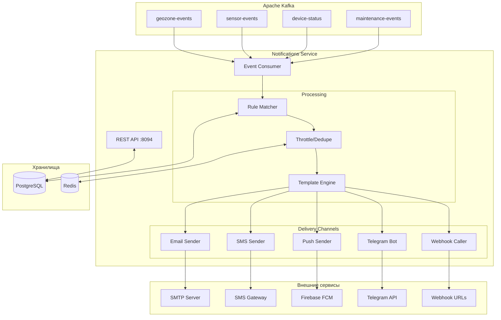
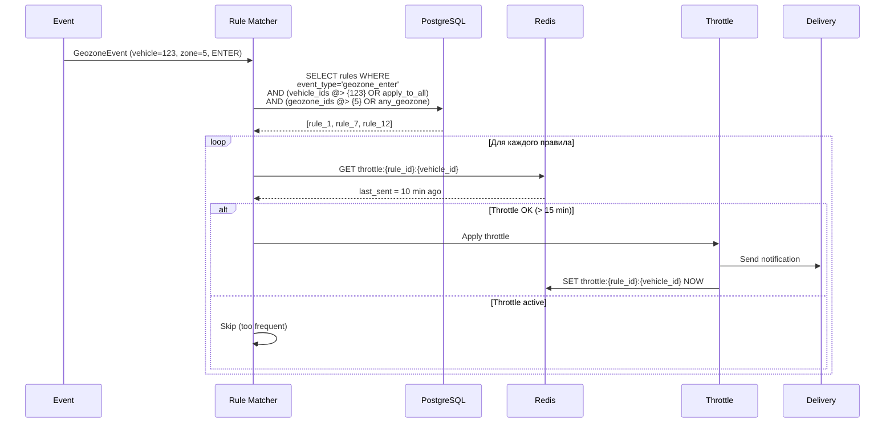

# 🔔 Notifications Service — Детальная документация

> **Блок:** 2 (Business Logic)  
> **Порт:** HTTP 8094 (REST API)  
> **Сложность:** Средняя  
> **Статус:** 📋 Планируется

---

## 📋 Содержание

1. [Обзор](#обзор)
2. [Архитектура](#архитектура)
3. [Типы событий](#типы-событий)
4. [Правила уведомлений](#правила-уведомлений)
5. [Каналы доставки](#каналы-доставки)
6. [PostgreSQL схема](#postgresql-схема)
7. [Kafka интеграция](#kafka-интеграция)
8. [REST API](#rest-api)
9. [Rate Limiting и Throttling](#rate-limiting-и-throttling)
10. [Метрики и мониторинг](#метрики-и-мониторинг)
11. [Конфигурация](#конфигурация)

---

## Обзор

**Notifications Service** — сервис управления правилами уведомлений и их доставки по различным каналам (email, SMS, push, Telegram, webhook).

### Ключевые характеристики

| Параметр | Значение |
|----------|----------|
| **Вход** | Kafka (все события: geozone, sensor, device-status, etc.) |
| **Выход** | Email, SMS, Push, Telegram, Webhook |
| **БД** | PostgreSQL (правила, история) |
| **Кеш** | Redis (rate limiting, deduplication) |

### Основные функции

1. **Правила уведомлений** — настройка условий и получателей
2. **Multi-channel delivery** — email, SMS, push, Telegram, webhook
3. **Rate limiting** — защита от спама (не больше N уведомлений в час)
4. **Throttling** — группировка похожих событий
5. **История** — лог всех отправленных уведомлений
6. **Шаблоны** — кастомизация текста уведомлений

---

## Архитектура



---

## Типы событий

### Входящие события

| Топик | Событие | Пример |
|-------|---------|--------|
| `geozone-events` | Въезд/выезд из геозоны | "Машина ABC въехала в зону Склад" |
| `sensor-events` | Срабатывание датчиков | "Слив топлива 15л", "Температура > 30°" |
| `device-status` | Online/Offline | "Трекер потерял связь" |
| `speed-events` | Превышение скорости | "Скорость 120 км/ч в зоне 60 км/ч" |
| `maintenance-events` | ТО | "Пробег > 10000 км, требуется ТО" |
| `command-events` | Результат команды | "Двигатель заблокирован" |

### Структура события

```scala
// Унифицированный формат события
case class NotificationEvent(
  eventType: EventType,
  organizationId: Long,
  vehicleId: Long,
  vehicleName: String,
  timestamp: Instant,
  
  // Специфичные данные
  payload: EventPayload,
  
  // Контекст
  latitude: Option[Double],
  longitude: Option[Double],
  address: Option[String]  // Reverse geocoding
)

sealed trait EventPayload
case class GeozonePayload(
  geozoneId: Long, 
  geozoneName: String, 
  action: String // "enter" | "leave"
) extends EventPayload

case class SensorPayload(
  sensorType: String,
  value: Double,
  threshold: Double,
  unit: String
) extends EventPayload

case class SpeedPayload(
  speed: Int,
  speedLimit: Int,
  geozoneId: Option[Long]
) extends EventPayload
```

---

## Правила уведомлений

### Rule Matching



### Структура правила

```scala
case class NotificationRule(
  id: Long,
  name: String,
  organizationId: Long,
  enabled: Boolean,
  
  // Условия
  eventType: EventType,
  conditions: RuleConditions,
  
  // Фильтрация
  applyToAll: Boolean,
  vehicleIds: Set[Long],
  groupIds: Set[Long],
  geozoneIds: Option[Set[Long]],  // Для geozone events
  
  // Доставка
  channels: Set[Channel],
  recipients: Recipients,
  
  // Throttling
  throttleMinutes: Int,
  
  // Шаблон
  templateId: Option[Long],
  customMessage: Option[String],
  
  // Расписание
  schedule: Option[Schedule],  // "только в рабочее время"
  
  createdAt: Instant,
  updatedAt: Instant
)

case class RuleConditions(
  // Для speed events
  speedThreshold: Option[Int],
  
  // Для sensor events
  sensorType: Option[String],
  sensorThreshold: Option[Double],
  sensorOperator: Option[String],  // ">", "<", "="
  
  // Для geozone events
  geozoneAction: Option[String]    // "enter", "leave", "both"
)

case class Recipients(
  userIds: Set[Long],
  emails: Set[String],
  phones: Set[String],
  telegramChatIds: Set[String],
  webhookUrls: Set[String]
)

case class Schedule(
  timezone: String,
  workingHoursOnly: Boolean,
  startHour: Int,
  endHour: Int,
  workingDays: Set[Int]  // 1=Mon, 7=Sun
)
```

---

## Каналы доставки

### Email

```scala
class EmailChannel(
  smtpConfig: SmtpConfig,
  templateEngine: TemplateEngine
) extends NotificationChannel {
  
  def send(
    notification: Notification,
    recipients: Set[String]
  ): Task[DeliveryResult] = {
    for {
      // Рендер шаблона
      html <- templateEngine.render(notification.templateId, notification.data)
      subject = s"[TrackerGPS] ${notification.title}"
      
      // Отправка через SMTP
      result <- ZIO.foreach(recipients) { email =>
        sendEmail(email, subject, html)
          .map(DeliveryResult.success)
          .catchAll(e => ZIO.succeed(DeliveryResult.failed(e.getMessage)))
      }
    } yield result.head  // Агрегируем результаты
  }
  
  private def sendEmail(to: String, subject: String, html: String): Task[Unit] = {
    // JavaMail / SendGrid / AWS SES
    ???
  }
}

case class SmtpConfig(
  host: String,
  port: Int,
  username: String,
  password: String,
  fromAddress: String,
  fromName: String,
  useTls: Boolean
)
```

### SMS

```scala
class SmsChannel(
  smsGateway: SmsGateway
) extends NotificationChannel {
  
  def send(
    notification: Notification,
    recipients: Set[String]
  ): Task[DeliveryResult] = {
    // SMS короткие — используем plain text
    val message = notification.shortMessage.take(160)
    
    ZIO.foreach(recipients) { phone =>
      smsGateway.send(phone, message)
    }.map(_ => DeliveryResult.success("sent"))
  }
}

// Интеграции: Twilio, SMS.ru, SMSC.ru
trait SmsGateway {
  def send(phone: String, message: String): Task[String]
}
```

### Push (Firebase FCM)

```scala
class PushChannel(
  fcmClient: FcmClient
) extends NotificationChannel {
  
  def send(
    notification: Notification,
    userIds: Set[Long]
  ): Task[DeliveryResult] = {
    for {
      // Получить FCM tokens пользователей
      tokens <- getUserTokens(userIds)
      
      // Отправить push
      message = FcmMessage(
        title = notification.title,
        body = notification.shortMessage,
        data = Map(
          "eventType" -> notification.eventType,
          "vehicleId" -> notification.vehicleId.toString,
          "deepLink" -> s"trackergps://vehicle/${notification.vehicleId}"
        )
      )
      
      result <- fcmClient.sendMulticast(tokens.toList, message)
    } yield DeliveryResult.success(s"sent to ${result.successCount} devices")
  }
}
```

### Telegram

```scala
class TelegramChannel(
  botToken: String,
  httpClient: Client
) extends NotificationChannel {
  
  private val baseUrl = s"https://api.telegram.org/bot$botToken"
  
  def send(
    notification: Notification,
    chatIds: Set[String]
  ): Task[DeliveryResult] = {
    val message = formatTelegramMessage(notification)
    
    ZIO.foreach(chatIds) { chatId =>
      sendMessage(chatId, message)
    }.map(_ => DeliveryResult.success("sent"))
  }
  
  private def sendMessage(chatId: String, text: String): Task[Unit] = {
    val request = Request.post(
      s"$baseUrl/sendMessage",
      Body.json(s"""{"chat_id":"$chatId","text":"$text","parse_mode":"HTML"}""")
    )
    httpClient.request(request).unit
  }
  
  private def formatTelegramMessage(n: Notification): String = {
    s"""
    |🚗 <b>${n.vehicleName}</b>
    |
    |${n.message}
    |
    |📍 ${n.address.getOrElse("—")}
    |🕐 ${n.timestamp.toString}
    """.stripMargin
  }
}
```

### Webhook

```scala
class WebhookChannel(
  httpClient: Client
) extends NotificationChannel {
  
  def send(
    notification: Notification,
    webhookUrls: Set[String]
  ): Task[DeliveryResult] = {
    val payload = WebhookPayload(
      eventType = notification.eventType,
      timestamp = notification.timestamp,
      organizationId = notification.organizationId,
      vehicleId = notification.vehicleId,
      vehicleName = notification.vehicleName,
      message = notification.message,
      data = notification.data,
      coordinates = notification.coordinates
    )
    
    ZIO.foreach(webhookUrls) { url =>
      httpClient
        .post(url, payload.toJson)
        .timeout(10.seconds)
        .retry(Schedule.recurs(3) && Schedule.exponential(1.second))
        .catchAll(e => ZIO.logError(s"Webhook failed: $url - ${e.getMessage}"))
    }.map(_ => DeliveryResult.success("delivered"))
  }
}

case class WebhookPayload(
  eventType: String,
  timestamp: Instant,
  organizationId: Long,
  vehicleId: Long,
  vehicleName: String,
  message: String,
  data: JsonObject,
  coordinates: Option[Coordinates]
)
```

---

## PostgreSQL схема

```sql
-- ===================== NOTIFICATION RULES =====================
CREATE TABLE notification_rules (
  id BIGSERIAL PRIMARY KEY,
  name VARCHAR(100) NOT NULL,
  organization_id BIGINT NOT NULL REFERENCES organizations(id),
  enabled BOOLEAN NOT NULL DEFAULT true,
  
  -- Тип события
  event_type VARCHAR(50) NOT NULL,
  
  -- Условия (JSONB для гибкости)
  conditions JSONB DEFAULT '{}',
  
  -- Фильтрация по машинам
  apply_to_all BOOLEAN NOT NULL DEFAULT false,
  vehicle_ids BIGINT[] DEFAULT '{}',
  group_ids BIGINT[] DEFAULT '{}',
  geozone_ids BIGINT[] DEFAULT '{}',
  
  -- Каналы доставки
  channels VARCHAR(20)[] NOT NULL DEFAULT '{}',
  
  -- Получатели
  recipients JSONB NOT NULL DEFAULT '{}',
  
  -- Throttling
  throttle_minutes INTEGER NOT NULL DEFAULT 15,
  
  -- Шаблон
  template_id BIGINT REFERENCES notification_templates(id),
  custom_message TEXT,
  
  -- Расписание
  schedule JSONB,
  
  -- Аудит
  created_at TIMESTAMPTZ NOT NULL DEFAULT NOW(),
  updated_at TIMESTAMPTZ NOT NULL DEFAULT NOW(),
  created_by BIGINT REFERENCES users(id),
  
  CONSTRAINT valid_event_type CHECK (
    event_type IN (
      'geozone_enter', 'geozone_leave',
      'speed_violation', 'sensor_alert',
      'device_offline', 'device_online',
      'fuel_drain', 'maintenance_due',
      'sos_button', 'command_result'
    )
  ),
  CONSTRAINT valid_channels CHECK (
    channels <@ ARRAY['email', 'sms', 'push', 'telegram', 'webhook']::varchar[]
  )
);

CREATE INDEX idx_rules_org ON notification_rules(organization_id);
CREATE INDEX idx_rules_event ON notification_rules(event_type) WHERE enabled = true;
CREATE INDEX idx_rules_vehicles ON notification_rules USING GIN (vehicle_ids);

-- ===================== NOTIFICATION TEMPLATES =====================
CREATE TABLE notification_templates (
  id BIGSERIAL PRIMARY KEY,
  name VARCHAR(100) NOT NULL,
  organization_id BIGINT REFERENCES organizations(id), -- NULL = системный
  event_type VARCHAR(50) NOT NULL,
  
  -- Шаблоны для разных каналов
  email_subject VARCHAR(200),
  email_body TEXT,
  sms_body VARCHAR(160),
  push_title VARCHAR(100),
  push_body VARCHAR(200),
  telegram_body TEXT,
  
  -- Переменные: {{vehicle_name}}, {{geozone_name}}, {{speed}}, etc.
  
  created_at TIMESTAMPTZ NOT NULL DEFAULT NOW()
);

-- Системные шаблоны
INSERT INTO notification_templates (name, event_type, email_subject, sms_body, push_title, push_body) VALUES
('Въезд в геозону', 'geozone_enter', 
 '{{vehicle_name}} въехал в {{geozone_name}}',
 '{{vehicle_name}} въехал в {{geozone_name}} в {{time}}',
 'Въезд в геозону',
 '{{vehicle_name}} → {{geozone_name}}'),
 
('Выезд из геозоны', 'geozone_leave',
 '{{vehicle_name}} покинул {{geozone_name}}',
 '{{vehicle_name}} покинул {{geozone_name}}',
 'Выезд из геозоны',
 '{{vehicle_name}} ← {{geozone_name}}'),
 
('Превышение скорости', 'speed_violation',
 '{{vehicle_name}} превысил скорость: {{speed}} км/ч',
 '{{vehicle_name}}: {{speed}} км/ч (лимит {{speed_limit}})',
 'Превышение скорости',
 '{{vehicle_name}}: {{speed}} км/ч');

-- ===================== NOTIFICATION HISTORY =====================
CREATE TABLE notification_history (
  id BIGSERIAL PRIMARY KEY,
  rule_id BIGINT REFERENCES notification_rules(id),
  organization_id BIGINT NOT NULL,
  
  -- Событие
  event_type VARCHAR(50) NOT NULL,
  vehicle_id BIGINT NOT NULL,
  event_data JSONB NOT NULL,
  
  -- Доставка
  channel VARCHAR(20) NOT NULL,
  recipient VARCHAR(200) NOT NULL,
  status VARCHAR(20) NOT NULL, -- 'sent', 'delivered', 'failed', 'throttled'
  error_message TEXT,
  
  -- Контент
  message TEXT NOT NULL,
  
  -- Время
  created_at TIMESTAMPTZ NOT NULL DEFAULT NOW(),
  delivered_at TIMESTAMPTZ
);

-- Партиционирование по времени (TimescaleDB)
SELECT create_hypertable('notification_history', 'created_at', if_not_exists => TRUE);

CREATE INDEX idx_history_org ON notification_history(organization_id, created_at DESC);
CREATE INDEX idx_history_vehicle ON notification_history(vehicle_id, created_at DESC);
CREATE INDEX idx_history_rule ON notification_history(rule_id, created_at DESC);

-- ===================== USER NOTIFICATION SETTINGS =====================
CREATE TABLE user_notification_settings (
  user_id BIGINT PRIMARY KEY REFERENCES users(id),
  
  -- Глобальные настройки
  email_enabled BOOLEAN NOT NULL DEFAULT true,
  sms_enabled BOOLEAN NOT NULL DEFAULT true,
  push_enabled BOOLEAN NOT NULL DEFAULT true,
  telegram_enabled BOOLEAN NOT NULL DEFAULT true,
  
  -- Контакты
  notification_email VARCHAR(200),
  notification_phone VARCHAR(20),
  telegram_chat_id VARCHAR(50),
  
  -- FCM tokens (может быть несколько устройств)
  fcm_tokens TEXT[] DEFAULT '{}',
  
  -- Quiet hours
  quiet_hours_enabled BOOLEAN NOT NULL DEFAULT false,
  quiet_start TIME,
  quiet_end TIME,
  timezone VARCHAR(50) DEFAULT 'Europe/Moscow',
  
  updated_at TIMESTAMPTZ NOT NULL DEFAULT NOW()
);
```

---

## Kafka интеграция

### Consumer

```scala
object NotificationEventConsumer {
  
  val topics = List(
    "geozone-events",
    "sensor-events", 
    "device-status",
    "speed-events",
    "maintenance-events"
  )
  
  def run(
    ruleMatcher: RuleMatcher,
    deliveryService: DeliveryService
  ): ZStream[Consumer, Throwable, Unit] = {
    Consumer
      .subscribeAnd(Subscription.topics(topics: _*))
      .plainStream(Serde.string, NotificationEventSerde)
      .mapZIOPar(16) { record =>  // Параллельная обработка
        for {
          event <- ZIO.fromEither(record.value)
          
          // Найти подходящие правила
          rules <- ruleMatcher.findMatchingRules(event)
          
          // Отправить уведомления
          _ <- ZIO.foreachDiscard(rules) { rule =>
            deliveryService.deliver(event, rule)
          }
          
          _ <- record.offset.commit
        } yield ()
      }
  }
}
```

---

## REST API

```yaml
openapi: 3.0.0
info:
  title: Notifications Service API
  version: 1.0.0

paths:
  /rules:
    get:
      summary: Список правил
      parameters:
        - name: organization_id
          in: query
          required: true
          schema: { type: integer }
        - name: event_type
          in: query
          schema: { type: string }
      responses:
        200:
          content:
            application/json:
              schema:
                type: array
                items: { $ref: '#/components/schemas/NotificationRule' }

    post:
      summary: Создать правило
      requestBody:
        required: true
        content:
          application/json:
            schema: { $ref: '#/components/schemas/CreateRule' }
      responses:
        201:
          content:
            application/json:
              schema: { $ref: '#/components/schemas/NotificationRule' }

  /rules/{id}:
    get:
      summary: Получить правило
      responses:
        200:
          content:
            application/json:
              schema: { $ref: '#/components/schemas/NotificationRule' }

    put:
      summary: Обновить правило
      responses:
        200:
          content:
            application/json:
              schema: { $ref: '#/components/schemas/NotificationRule' }

    delete:
      summary: Удалить правило
      responses:
        204:
          description: Удалено

  /rules/{id}/toggle:
    post:
      summary: Включить/выключить правило
      responses:
        200:
          content:
            application/json:
              schema: { $ref: '#/components/schemas/NotificationRule' }

  /history:
    get:
      summary: История уведомлений
      parameters:
        - name: organization_id
          in: query
          required: true
          schema: { type: integer }
        - name: vehicle_id
          in: query
          schema: { type: integer }
        - name: rule_id
          in: query
          schema: { type: integer }
        - name: from
          in: query
          schema: { type: string, format: date-time }
        - name: to
          in: query
          schema: { type: string, format: date-time }
        - name: status
          in: query
          schema: { type: string, enum: [sent, delivered, failed, throttled] }
      responses:
        200:
          content:
            application/json:
              schema:
                type: array
                items: { $ref: '#/components/schemas/NotificationHistory' }

  /templates:
    get:
      summary: Список шаблонов
      responses:
        200:
          content:
            application/json:
              schema:
                type: array
                items: { $ref: '#/components/schemas/NotificationTemplate' }

  /test:
    post:
      summary: Тестовое уведомление
      requestBody:
        content:
          application/json:
            schema:
              type: object
              properties:
                channel: { type: string }
                recipient: { type: string }
                message: { type: string }
      responses:
        200:
          description: Отправлено

  /users/{userId}/settings:
    get:
      summary: Настройки уведомлений пользователя
      responses:
        200:
          content:
            application/json:
              schema: { $ref: '#/components/schemas/UserNotificationSettings' }

    put:
      summary: Обновить настройки
      responses:
        200:
          content:
            application/json:
              schema: { $ref: '#/components/schemas/UserNotificationSettings' }

components:
  schemas:
    NotificationRule:
      type: object
      properties:
        id: { type: integer }
        name: { type: string }
        organizationId: { type: integer }
        enabled: { type: boolean }
        eventType: { type: string }
        conditions: { type: object }
        applyToAll: { type: boolean }
        vehicleIds: { type: array, items: { type: integer } }
        groupIds: { type: array, items: { type: integer } }
        channels: { type: array, items: { type: string } }
        recipients: { $ref: '#/components/schemas/Recipients' }
        throttleMinutes: { type: integer }
        schedule: { type: object }

    CreateRule:
      type: object
      required: [name, organizationId, eventType, channels]
      properties:
        name: { type: string }
        organizationId: { type: integer }
        eventType: { type: string }
        conditions: { type: object }
        applyToAll: { type: boolean, default: false }
        vehicleIds: { type: array, items: { type: integer } }
        channels: { type: array, items: { type: string } }
        recipients: { $ref: '#/components/schemas/Recipients' }
        throttleMinutes: { type: integer, default: 15 }

    Recipients:
      type: object
      properties:
        userIds: { type: array, items: { type: integer } }
        emails: { type: array, items: { type: string } }
        phones: { type: array, items: { type: string } }
        telegramChatIds: { type: array, items: { type: string } }
        webhookUrls: { type: array, items: { type: string } }

    NotificationHistory:
      type: object
      properties:
        id: { type: integer }
        ruleId: { type: integer }
        ruleName: { type: string }
        eventType: { type: string }
        vehicleId: { type: integer }
        vehicleName: { type: string }
        channel: { type: string }
        recipient: { type: string }
        status: { type: string }
        message: { type: string }
        createdAt: { type: string, format: date-time }
```

---

## Rate Limiting и Throttling

### Redis структуры

```
┌─────────────────────────────────────────────────────────────────────┐
│                    REDIS (Notifications)                             │
├─────────────────────────────────────────────────────────────────────┤
│                                                                     │
│  ⏱️ THROTTLE (дедупликация)                                          │
│  ─────────────────────────────────────────────────────────────────  │
│  Key:     throttle:{rule_id}:{vehicle_id}                          │
│  Type:    STRING                                                    │
│  TTL:     = throttle_minutes правила                               │
│  Value:   timestamp последней отправки                             │
│                                                                     │
├─────────────────────────────────────────────────────────────────────┤
│                                                                     │
│  📊 RATE LIMIT (per user)                                            │
│  ─────────────────────────────────────────────────────────────────  │
│  Key:     rate:{user_id}:{channel}:{hour}                          │
│  Type:    COUNTER                                                  │
│  TTL:     1 час                                                    │
│  Value:   количество отправленных                                  │
│  Limit:   email=100/час, sms=20/час, push=50/час                  │
│                                                                     │
├─────────────────────────────────────────────────────────────────────┤
│                                                                     │
│  🔇 SUPPRESSION (подавление спама)                                   │
│  ─────────────────────────────────────────────────────────────────  │
│  Key:     suppress:{org_id}:{event_hash}                           │
│  Type:    STRING                                                    │
│  TTL:     5 минут                                                  │
│  Value:   count                                                    │
│  Logic:   Если > 10 одинаковых событий за 5 мин — агрегируем      │
│                                                                     │
└─────────────────────────────────────────────────────────────────────┘
```

### Throttle реализация

```scala
class ThrottleService(redis: RedisClient) {
  
  def shouldSend(
    ruleId: Long,
    vehicleId: Long,
    throttleMinutes: Int
  ): Task[Boolean] = {
    val key = s"throttle:$ruleId:$vehicleId"
    
    for {
      exists <- redis.exists(key)
      result <- if (exists) {
        ZIO.succeed(false)  // Throttled
      } else {
        redis.setex(key, throttleMinutes * 60, "1").as(true)
      }
    } yield result
  }
  
  def checkRateLimit(
    userId: Long,
    channel: String,
    limit: Int
  ): Task[Boolean] = {
    val hour = Instant.now().truncatedTo(ChronoUnit.HOURS).toString
    val key = s"rate:$userId:$channel:$hour"
    
    for {
      count <- redis.incr(key)
      _ <- redis.expire(key, 3600)  // 1 час
    } yield count <= limit
  }
}
```

---

## Метрики и мониторинг

### Prometheus метрики

```
# События
ns_events_received_total{type="geozone_enter"} 12345
ns_events_processed_total{type="geozone_enter"} 12340
ns_events_throttled_total{type="geozone_enter"} 5

# Доставка
ns_notifications_sent_total{channel="email",status="success"} 5678
ns_notifications_sent_total{channel="sms",status="success"} 1234
ns_notifications_sent_total{channel="push",status="failed"} 12
ns_delivery_duration_seconds_bucket{channel="email",le="1"} 5600

# Rate limiting
ns_rate_limited_total{channel="sms"} 45
ns_throttled_total 234

# Очередь
ns_queue_size 15
ns_processing_lag_seconds 0.5
```

### Алерты

```yaml
groups:
  - name: notifications-service
    rules:
      - alert: NSDeliveryFailures
        expr: rate(ns_notifications_sent_total{status="failed"}[5m]) > 10
        for: 5m
        labels:
          severity: warning
        annotations:
          summary: "High notification delivery failure rate"

      - alert: NSSmsGatewayDown
        expr: rate(ns_notifications_sent_total{channel="sms",status="success"}[5m]) == 0
        for: 10m
        labels:
          severity: critical
        annotations:
          summary: "SMS gateway not responding"
```

---

## Конфигурация

### application.conf

```hocon
notifications-service {
  kafka {
    bootstrap-servers = ${KAFKA_BROKERS}
    consumer {
      group-id = "notifications-service-group"
      topics = ["geozone-events", "sensor-events", "device-status", "speed-events"]
    }
  }
  
  database {
    url = ${DATABASE_URL}
    pool.max-size = 20
  }
  
  redis {
    host = ${REDIS_HOST}
    port = 6379
  }
  
  channels {
    email {
      enabled = true
      smtp {
        host = ${SMTP_HOST}
        port = 587
        username = ${SMTP_USERNAME}
        password = ${SMTP_PASSWORD}
        from-address = "noreply@trackergps.com"
        from-name = "TrackerGPS"
        use-tls = true
      }
    }
    
    sms {
      enabled = true
      provider = "smsru"  # или "twilio"
      api-key = ${SMS_API_KEY}
    }
    
    push {
      enabled = true
      firebase {
        credentials-file = "/etc/firebase/credentials.json"
      }
    }
    
    telegram {
      enabled = true
      bot-token = ${TELEGRAM_BOT_TOKEN}
    }
    
    webhook {
      enabled = true
      timeout = 10s
      max-retries = 3
    }
  }
  
  rate-limits {
    email = 100  # per hour per user
    sms = 20
    push = 50
    telegram = 30
  }
  
  server {
    port = 8094
  }
}
```

### Docker Compose

```yaml
services:
  notifications-service:
    build: ./services/notifications-service
    ports:
      - "8094:8094"
    environment:
      - KAFKA_BROKERS=kafka:9092
      - DATABASE_URL=postgresql://postgres:5432/tracker
      - REDIS_HOST=redis
      - SMTP_HOST=smtp.gmail.com
      - SMTP_USERNAME=${SMTP_USERNAME}
      - SMTP_PASSWORD=${SMTP_PASSWORD}
      - SMS_API_KEY=${SMS_API_KEY}
      - TELEGRAM_BOT_TOKEN=${TELEGRAM_BOT_TOKEN}
    depends_on:
      - kafka
      - postgres
      - redis
    healthcheck:
      test: ["CMD", "curl", "-f", "http://localhost:8094/health"]
      interval: 10s
```

---

## 📚 Связанные документы

- [ARCHITECTURE_BLOCK2.md](../ARCHITECTURE_BLOCK2.md) — Обзор Block 2
- [GEOZONES_SERVICE.md](./GEOZONES_SERVICE.md) — Предыдущий сервис
- [ANALYTICS_SERVICE.md](./ANALYTICS_SERVICE.md) — Следующий сервис

---

## 🤖 Промпт для AI-агента

<details>
<summary><b>Развернуть полный промпт для реализации Notifications Service</b></summary>

```markdown
# ЗАДАЧА: Реализовать Notifications Service для TrackerGPS

## КОНТЕКСТ
Ты — senior Scala разработчик. Создай Notifications Service — сервис управления правилами уведомлений и их доставки для системы мониторинга транспорта TrackerGPS.

## ТЕХНИЧЕСКИЙ СТЕК (ОБЯЗАТЕЛЬНО)
- **Язык:** Scala 3.4.0
- **Эффекты:** ZIO 2.0.20
- **HTTP:** zio-http (REST API + HTTP клиент для webhooks)
- **PostgreSQL:** Quill или Doobie
- **Redis:** zio-redis (rate limiting, throttling)
- **Kafka:** zio-kafka (consumer)
- **Email:** zio-mailer или JavaMail
- **Конфигурация:** zio-config + HOCON
- **Метрики:** zio-metrics + Prometheus
- **Сборка:** SBT

## АРХИТЕКТУРА СЕРВИСА

### Основные компоненты:
1. **Kafka Consumer** — читает события из разных топиков
2. **Rule Matcher** — находит правила, подходящие под событие
3. **Throttle/Dedup** — rate limiting и дедупликация
4. **Template Engine** — рендеринг сообщений
5. **Delivery Channels** — Email, SMS, Push, Telegram, Webhook
6. **REST API** — CRUD правил, шаблонов, история

### Flow:
```
Kafka (events) → Rule Matcher → Throttle Check → Template Render → Channel Delivery
                     ↓                ↓                                   ↓
                 PostgreSQL        Redis                          External APIs
                 (rules)         (rate limits)                 (SMTP, SMS GW, FCM, TG)
```

## ТРЕБОВАНИЯ К РЕАЛИЗАЦИИ

### 1. Kafka Consumer (Multi-topic)

```scala
trait EventConsumer:
  def stream: ZStream[Any, Throwable, NotificationEvent]

// Топики:
// - geozone-events (enter/leave)
// - sensor-events (fuel drain, temperature, etc.)
// - device-status (online/offline)
// - speed-events (violations)
// - maintenance-events (upcoming maintenance)

// Унифицированный формат события
case class NotificationEvent(
  eventType: EventType,
  organizationId: Long,
  vehicleId: Long,
  vehicleName: String,
  timestamp: Instant,
  payload: JsonObject,  // Специфичные данные события
  latitude: Option[Double],
  longitude: Option[Double]
)

enum EventType:
  case GeozoneEnter, GeozoneLeave
  case FuelDrain, FuelRefuel
  case SpeedViolation
  case DeviceOffline, DeviceOnline
  case SensorAlert
  case MaintenanceDue
```

### 2. Rule Matcher

```scala
trait RuleMatcher:
  def findMatchingRules(event: NotificationEvent): Task[List[NotificationRule]]

case class NotificationRule(
  id: Long,
  organizationId: Long,
  name: String,
  enabled: Boolean,
  eventType: EventType,
  
  // Условия
  conditions: RuleConditions,
  
  // Фильтры
  applyToAll: Boolean,
  vehicleIds: Set[Long],
  groupIds: Set[Long],
  geozoneIds: Option[Set[Long]],
  
  // Доставка
  channels: Set[Channel],
  recipients: Recipients,
  
  // Throttling
  throttleMinutes: Int,
  
  // Шаблон
  templateId: Option[Long],
  customMessage: Option[String],
  
  // Расписание (опционально)
  schedule: Option[Schedule]
)

// SQL для поиска правил:
// SELECT * FROM notification_rules
// WHERE organization_id = ? 
//   AND event_type = ?
//   AND enabled = true
//   AND (apply_to_all = true OR vehicle_ids @> ARRAY[?] OR group_ids && ?)
```

### 3. Throttle / Rate Limiting

```scala
trait ThrottleService:
  // Проверить, можно ли отправить (throttle по правилу)
  def shouldSend(ruleId: Long, vehicleId: Long, throttleMinutes: Int): Task[Boolean]
  
  // Проверить rate limit пользователя
  def checkRateLimit(userId: Long, channel: Channel): Task[Boolean]

// Redis keys:
// throttle:{rule_id}:{vehicle_id} = timestamp (TTL = throttle_minutes)
// rate:{user_id}:{channel}:{hour} = counter (TTL = 1h)

// Rate limits:
// - Email: 100/hour per user
// - SMS: 20/hour per user  
// - Push: 50/hour per user
// - Telegram: 30/hour per user
```

### 4. Template Engine

```scala
trait TemplateEngine:
  def render(templateId: Long, data: Map[String, Any]): Task[RenderedMessage]
  def renderCustom(template: String, data: Map[String, Any]): Task[String]

case class RenderedMessage(
  subject: Option[String],  // Для email
  body: String,
  shortBody: String         // Для SMS (max 160)
)

// Переменные в шаблонах:
// {{vehicle_name}}, {{geozone_name}}, {{speed}}, {{speed_limit}},
// {{timestamp}}, {{address}}, {{fuel_amount}}, etc.

// Шаблоны хранятся в PostgreSQL
// Системные (organization_id = NULL) + кастомные
```

### 5. Delivery Channels

```scala
sealed trait NotificationChannel:
  def send(notification: Notification): Task[DeliveryResult]

class EmailChannel(smtpConfig: SmtpConfig) extends NotificationChannel
class SmsChannel(smsGateway: SmsGateway) extends NotificationChannel
class PushChannel(fcmClient: FcmClient) extends NotificationChannel
class TelegramChannel(botToken: String) extends NotificationChannel
class WebhookChannel(httpClient: Client) extends NotificationChannel

case class DeliveryResult(
  channel: Channel,
  status: DeliveryStatus,
  messageId: Option[String],
  error: Option[String]
)

enum DeliveryStatus:
  case Sent, Delivered, Failed, RateLimited, Throttled
```

### 6. PostgreSQL Schema

```sql
CREATE TABLE notification_rules (
  id BIGSERIAL PRIMARY KEY,
  organization_id BIGINT NOT NULL REFERENCES organizations(id),
  name VARCHAR(100) NOT NULL,
  enabled BOOLEAN NOT NULL DEFAULT true,
  event_type VARCHAR(50) NOT NULL,
  conditions JSONB DEFAULT '{}',
  apply_to_all BOOLEAN NOT NULL DEFAULT false,
  vehicle_ids BIGINT[] DEFAULT '{}',
  group_ids BIGINT[] DEFAULT '{}',
  geozone_ids BIGINT[],
  channels VARCHAR(20)[] NOT NULL,
  recipients JSONB NOT NULL,  -- {userIds, emails, phones, telegramChatIds, webhookUrls}
  throttle_minutes INTEGER NOT NULL DEFAULT 15,
  template_id BIGINT REFERENCES notification_templates(id),
  custom_message TEXT,
  schedule JSONB,  -- {workingHoursOnly, startHour, endHour, workingDays}
  created_at TIMESTAMPTZ NOT NULL DEFAULT NOW()
);

CREATE TABLE notification_templates (
  id BIGSERIAL PRIMARY KEY,
  organization_id BIGINT REFERENCES organizations(id),  -- NULL = system
  name VARCHAR(100) NOT NULL,
  event_type VARCHAR(50) NOT NULL,
  email_subject VARCHAR(200),
  email_body TEXT,
  sms_body VARCHAR(160),
  push_title VARCHAR(100),
  push_body VARCHAR(200),
  telegram_body TEXT,
  created_at TIMESTAMPTZ NOT NULL DEFAULT NOW()
);

CREATE TABLE notification_history (
  id BIGSERIAL PRIMARY KEY,
  rule_id BIGINT REFERENCES notification_rules(id),
  organization_id BIGINT NOT NULL,
  event_type VARCHAR(50) NOT NULL,
  vehicle_id BIGINT NOT NULL,
  channel VARCHAR(20) NOT NULL,
  recipient VARCHAR(200) NOT NULL,
  status VARCHAR(20) NOT NULL,
  message TEXT NOT NULL,
  error_message TEXT,
  created_at TIMESTAMPTZ NOT NULL DEFAULT NOW()
);

-- TimescaleDB для истории
SELECT create_hypertable('notification_history', 'created_at');
```

### 7. REST API

```scala
// Rules CRUD
GET    /api/v1/rules
POST   /api/v1/rules
GET    /api/v1/rules/{id}
PUT    /api/v1/rules/{id}
DELETE /api/v1/rules/{id}
POST   /api/v1/rules/{id}/toggle   // Enable/disable

// Templates
GET    /api/v1/templates
POST   /api/v1/templates
PUT    /api/v1/templates/{id}

// History
GET    /api/v1/history?vehicle_id=&from=&to=

// Test notification
POST   /api/v1/test
// Body: { "channel": "email", "recipient": "test@example.com", "message": "Test" }

// User settings
GET    /api/v1/users/{id}/settings
PUT    /api/v1/users/{id}/settings
```

### 8. Метрики

```scala
// Counters
ns_events_received_total{type="geozone_enter"}
ns_notifications_sent_total{channel="email", status="success"}
ns_throttled_total
ns_rate_limited_total{channel="sms"}

// Histograms  
ns_delivery_duration_seconds{channel="email"}
ns_rule_matching_duration_seconds

// Gauges
ns_active_rules_total
ns_queue_size
```

## СТРУКТУРА ПРОЕКТА
```
notifications-service/
├── src/main/scala/
│   └── trackergps/notifications/
│       ├── Main.scala
│       ├── config/
│       │   └── AppConfig.scala
│       ├── api/
│       │   ├── RuleApi.scala
│       │   ├── TemplateApi.scala
│       │   └── HistoryApi.scala
│       ├── kafka/
│       │   └── EventConsumer.scala
│       ├── service/
│       │   ├── NotificationService.scala
│       │   ├── RuleService.scala
│       │   └── TemplateService.scala
│       ├── matcher/
│       │   └── RuleMatcher.scala
│       ├── throttle/
│       │   └── ThrottleService.scala
│       ├── template/
│       │   └── TemplateEngine.scala
│       ├── channel/
│       │   ├── NotificationChannel.scala
│       │   ├── EmailChannel.scala
│       │   ├── SmsChannel.scala
│       │   ├── PushChannel.scala
│       │   ├── TelegramChannel.scala
│       │   └── WebhookChannel.scala
│       ├── repository/
│       │   ├── RuleRepository.scala
│       │   ├── TemplateRepository.scala
│       │   └── HistoryRepository.scala
│       └── model/
│           ├── NotificationRule.scala
│           ├── NotificationEvent.scala
│           └── DeliveryResult.scala
├── src/main/resources/
│   └── application.conf
└── build.sbt
```

## ПРИМЕР ОСНОВНОГО FLOW

```scala
def processEvent(event: NotificationEvent): ZIO[Env, Throwable, Unit] =
  for
    // 1. Найти подходящие правила
    rules <- ruleMatcher.findMatchingRules(event)
    
    // 2. Для каждого правила
    _ <- ZIO.foreachPar(rules) { rule =>
      for
        // 3. Проверить throttle
        shouldSend <- throttleService.shouldSend(rule.id, event.vehicleId, rule.throttleMinutes)
        
        _ <- ZIO.when(shouldSend) {
          for
            // 4. Рендер шаблона
            message <- templateEngine.render(rule.templateId, event.toTemplateData)
            
            // 5. Отправить по каналам
            results <- ZIO.foreachPar(rule.channels.toList) { channel =>
              for
                // 6. Проверить rate limit
                canSend <- throttleService.checkRateLimit(rule.recipients, channel)
                
                result <- if canSend then
                  getChannel(channel).send(message, rule.recipients)
                else
                  ZIO.succeed(DeliveryResult.rateLimited(channel))
                
                // 7. Сохранить в историю
                _ <- historyRepository.save(event, rule, channel, result)
              yield result
            }
          yield ()
        }
      yield ()
    }
  yield ()
```

## КРИТЕРИИ ПРИЁМКИ

1. ✅ Multi-topic Kafka consumer
2. ✅ Rule matcher с фильтрацией по vehicle/group
3. ✅ Throttle по правилу (Redis)
4. ✅ Rate limiting по каналам
5. ✅ 5 каналов доставки (Email, SMS, Push, Telegram, Webhook)
6. ✅ Template engine с переменными
7. ✅ История уведомлений
8. ✅ REST API для CRUD правил
9. ✅ Тест отправки
10. ✅ Unit тесты для matcher и throttle

## ВНЕШНИЕ ЗАВИСИМОСТИ

- **SMTP Server** — для email (Gmail, SendGrid, AWS SES)
- **SMS Gateway** — SMS.ru, SMSC.ru, Twilio
- **Firebase** — для push notifications
- **Telegram Bot API** — для Telegram
```

</details>

---

**Дата:** 26 января 2026  
**Статус:** Документация готова ✅
