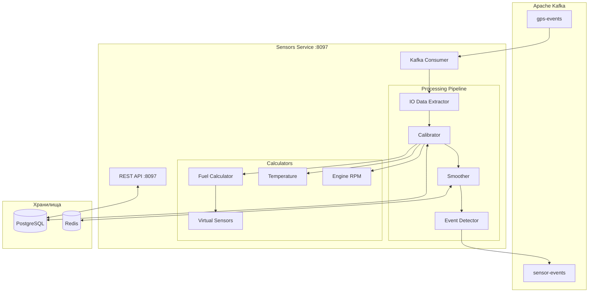
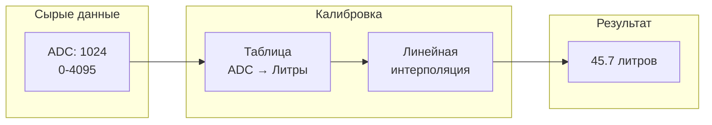
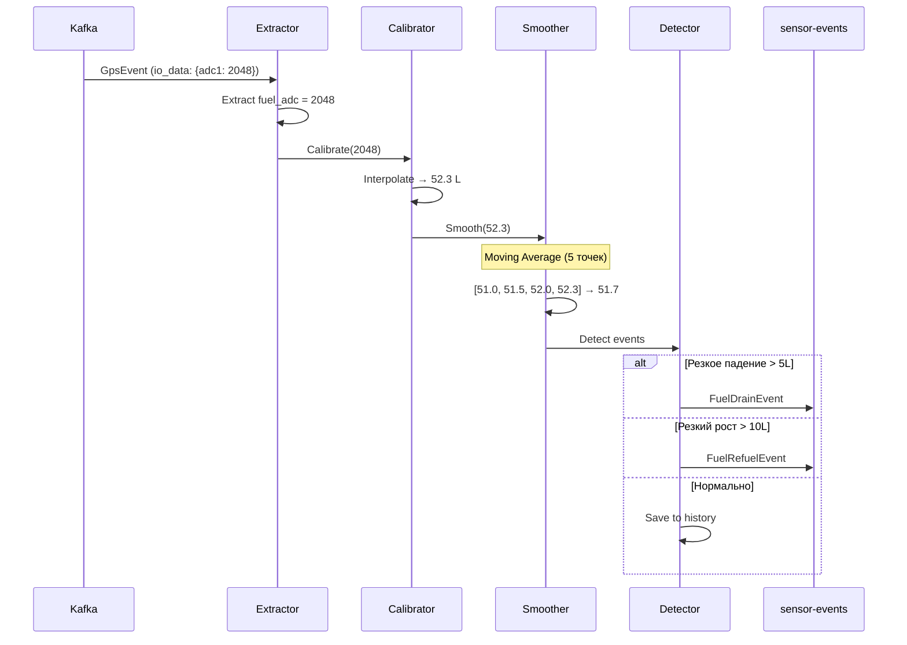

# 🌡️ Sensors Service — Детальная документация

> **Блок:** 2 (Business Logic)  
> **Порт:** HTTP 8097 (REST API)  
> **Сложность:** Средняя  
> **Статус:** ⏳ MVP частично

---

## 📋 Содержание

1. [Обзор](#обзор)
2. [Архитектура](#архитектура)
3. [Типы датчиков](#типы-датчиков)
4. [Калибровка топлива](#калибровка-топлива)
5. [Обработка событий](#обработка-событий)
6. [PostgreSQL схема](#postgresql-схема)
7. [Kafka интеграция](#kafka-интеграция)
8. [REST API](#rest-api)
9. [Метрики и мониторинг](#метрики-и-мониторинг)
10. [Конфигурация](#конфигурация)

---

## Обзор

**Sensors Service** — сервис обработки данных с датчиков: топливо (ДУТ), температура, давление, обороты двигателя. Выполняет калибровку, сглаживание и детекцию событий (слив, заправка).

### Ключевые характеристики

| Параметр | Значение |
|----------|----------|
| **Вход** | Kafka (gps-events с io_data) |
| **Выход** | Kafka (sensor-events), PostgreSQL |
| **БД** | PostgreSQL (калибровки, история) |
| **Кеш** | Redis (последние значения) |

### Основные функции

1. **Калибровка топлива** — таблица литры/вольты для ДУТ
2. **Сглаживание** — фильтрация шума (moving average, median)
3. **Детекция событий** — слив, заправка, резкие изменения
4. **Виртуальные датчики** — расчётные показатели (расход л/100км)
5. **История значений** — для графиков и анализа

---

## Архитектура



---

## Типы датчиков

### Поддерживаемые датчики

| Тип | Параметр I/O | Описание | Единицы |
|-----|--------------|----------|---------|
| `fuel_level` | adc1, fuel | Уровень топлива (ДУТ) | литры |
| `fuel_consumption` | fuel_rate | Мгновенный расход | л/час |
| `temperature` | temp1, temp2 | Температура | °C |
| `rpm` | rpm, engine_rpm | Обороты двигателя | об/мин |
| `voltage` | power, ext_volt | Напряжение АКБ | вольты |
| `mileage` | odometer | Одометр | км |
| `engine_hours` | engine_hours | Моточасы | часы |
| `door` | din1 | Датчик двери | 0/1 |
| `ignition` | ignition | Зажигание | 0/1 |

### Модель датчика

```scala
case class Sensor(
  id: Long,
  vehicleId: Long,
  sensorType: SensorType,
  name: String,
  
  // Источник данных
  ioParameter: String,       // Ключ в io_data
  
  // Калибровка
  calibrationId: Option[Long],
  
  // Обработка
  smoothingType: SmoothingType,
  smoothingWindow: Int,      // Окно сглаживания
  
  // Пороги для событий
  alertThresholds: Option[AlertThresholds],
  
  // Отображение
  unit: String,
  precision: Int,
  minValue: Option[Double],
  maxValue: Option[Double],
  
  enabled: Boolean,
  createdAt: Instant
)

enum SensorType:
  case FuelLevel, FuelConsumption, Temperature, 
       RPM, Voltage, Mileage, EngineHours,
       DigitalInput, Virtual

enum SmoothingType:
  case None, MovingAverage, Median, Kalman
```

---

## Калибровка топлива

### Таблица калибровки ДУТ



### Структура калибровки

```scala
case class FuelCalibration(
  id: Long,
  vehicleId: Long,
  name: String,
  tankCapacity: Double,      // Ёмкость бака в литрах
  
  // Таблица калибровки (ADC → литры)
  calibrationTable: List[CalibrationPoint],
  
  // Настройки
  filterEnabled: Boolean,
  filterThreshold: Double,   // Игнорировать скачки > X литров
  
  createdAt: Instant,
  updatedAt: Instant
)

case class CalibrationPoint(
  adcValue: Int,             // 0-4095
  liters: Double             // Соответствующий объём
)

// Пример таблицы:
// ADC    | Литры
// 0      | 0
// 500    | 10
// 1000   | 22
// 1500   | 35
// 2000   | 48
// 2500   | 62
// 3000   | 75
// 3500   | 88
// 4000   | 100
```

### Калибратор

```scala
class FuelCalibrator(calibrationRepo: CalibrationRepository) {
  
  def calibrate(vehicleId: Long, rawAdc: Int): Task[Double] = {
    for {
      calibration <- calibrationRepo.getByVehicle(vehicleId)
      liters = interpolate(calibration.calibrationTable, rawAdc)
    } yield liters
  }
  
  // Линейная интерполяция между точками
  private def interpolate(table: List[CalibrationPoint], adc: Int): Double = {
    // Найти две ближайшие точки
    val sorted = table.sortBy(_.adcValue)
    
    sorted.sliding(2).find { case List(p1, p2) =>
      adc >= p1.adcValue && adc <= p2.adcValue
    } match {
      case Some(List(p1, p2)) =>
        // Линейная интерполяция
        val ratio = (adc - p1.adcValue).toDouble / (p2.adcValue - p1.adcValue)
        p1.liters + ratio * (p2.liters - p1.liters)
        
      case _ =>
        // Экстраполяция за пределами таблицы
        if (adc <= sorted.head.adcValue) sorted.head.liters
        else sorted.last.liters
    }
  }
}
```

### Автокалибровка

```scala
// Автоматическая калибровка по данным заправок
class AutoCalibrator {
  
  case class RefuelEvent(
    timestamp: Instant,
    adcBefore: Int,
    adcAfter: Int,
    litersAdded: Double      // Из чека АЗС
  )
  
  def buildCalibrationTable(
    events: List[RefuelEvent],
    tankCapacity: Double
  ): List[CalibrationPoint] = {
    // Собираем точки (adc → liters) из заправок
    // Минимум 5-7 заправок для хорошей калибровки
    val points = events.flatMap { e =>
      // После заправки: adc_after соответствует liters_after
      // До заправки: adc_before соответствует liters_before
      List(
        // Это приблизительно, нужно знать текущий уровень
      )
    }
    
    // Аппроксимация или регрессия
    fitCalibrationCurve(points, tankCapacity)
  }
}
```

---

## Обработка событий

### Pipeline обработки



### Сглаживание (Smoothing)

```scala
class FuelSmoother(redis: RedisClient) {
  
  // Moving Average
  def smooth(
    vehicleId: Long,
    sensorId: Long,
    newValue: Double,
    windowSize: Int = 5
  ): Task[Double] = {
    val key = s"sensor:$vehicleId:$sensorId:history"
    
    for {
      // Добавить новое значение в историю
      _ <- redis.rpush(key, newValue.toString)
      
      // Оставить только последние N значений
      _ <- redis.ltrim(key, -windowSize, -1)
      
      // Получить все значения
      values <- redis.lrange(key, 0, -1).map(_.map(_.toDouble))
      
      // Вычислить среднее
      avg = values.sum / values.size
    } yield avg
  }
  
  // Median filter (лучше для выбросов)
  def medianSmooth(
    vehicleId: Long,
    sensorId: Long,
    newValue: Double,
    windowSize: Int = 5
  ): Task[Double] = {
    // Аналогично, но median вместо average
    ???
  }
}
```

### Детектор событий

```scala
class FuelEventDetector(
  redis: RedisClient,
  producer: SensorEventProducer
) {
  
  case class FuelState(
    lastValue: Double,
    lastTimestamp: Instant,
    isMoving: Boolean
  )
  
  def detect(
    vehicleId: Long,
    currentValue: Double,
    timestamp: Instant,
    isMoving: Boolean,
    thresholds: FuelThresholds
  ): Task[Option[SensorEvent]] = {
    val stateKey = s"fuel:state:$vehicleId"
    
    for {
      // Получить предыдущее состояние
      prevState <- redis.hgetall(stateKey).map(parseFuelState)
      
      // Вычислить изменение
      delta = currentValue - prevState.lastValue
      timeDiff = Duration.between(prevState.lastTimestamp, timestamp)
      
      // Определить событие
      event <- detectEvent(delta, timeDiff, isMoving, thresholds)
      
      // Обновить состояние
      _ <- redis.hset(stateKey, Map(
        "value" -> currentValue.toString,
        "timestamp" -> timestamp.toString,
        "isMoving" -> isMoving.toString
      ))
      
    } yield event
  }
  
  private def detectEvent(
    delta: Double,
    timeDiff: Duration,
    isMoving: Boolean,
    t: FuelThresholds
  ): UIO[Option[SensorEvent]] = ZIO.succeed {
    
    // Слив: резкое падение на стоянке
    if (delta < -t.drainThreshold && !isMoving && timeDiff.toMinutes < 30) {
      Some(SensorEvent.FuelDrain(delta.abs))
    }
    // Заправка: резкий рост на стоянке
    else if (delta > t.refuelThreshold && !isMoving) {
      Some(SensorEvent.FuelRefuel(delta))
    }
    // Аномальное потребление
    else if (delta < -t.consumptionAlert && isMoving) {
      // Проверить, не слишком ли высокий расход
      val consumptionPerHour = delta.abs / timeDiff.toHours
      if (consumptionPerHour > t.maxConsumptionPerHour) {
        Some(SensorEvent.AbnormalConsumption(consumptionPerHour))
      } else None
    }
    else None
  }
}

case class FuelThresholds(
  drainThreshold: Double = 5.0,          // литров — порог слива
  refuelThreshold: Double = 10.0,        // литров — порог заправки
  consumptionAlert: Double = 20.0,       // литров — аномальное потребление
  maxConsumptionPerHour: Double = 15.0   // л/час — максимальный расход
)
```

### Типы событий

```scala
sealed trait SensorEvent {
  def vehicleId: Long
  def sensorType: SensorType
  def timestamp: Instant
}

case class FuelDrainEvent(
  vehicleId: Long,
  timestamp: Instant,
  volumeDrained: Double,     // литры
  levelBefore: Double,
  levelAfter: Double,
  latitude: Double,
  longitude: Double,
  address: Option[String]
) extends SensorEvent {
  val sensorType = SensorType.FuelLevel
}

case class FuelRefuelEvent(
  vehicleId: Long,
  timestamp: Instant,
  volumeRefueled: Double,
  levelBefore: Double,
  levelAfter: Double,
  latitude: Double,
  longitude: Double,
  address: Option[String]
) extends SensorEvent {
  val sensorType = SensorType.FuelLevel
}

case class TemperatureAlertEvent(
  vehicleId: Long,
  sensorId: Long,
  timestamp: Instant,
  temperature: Double,
  threshold: Double,
  alertType: String          // "high" | "low"
) extends SensorEvent {
  val sensorType = SensorType.Temperature
}

case class EngineOverRevEvent(
  vehicleId: Long,
  timestamp: Instant,
  rpm: Int,
  threshold: Int,
  duration: Duration
) extends SensorEvent {
  val sensorType = SensorType.RPM
}
```

---

## PostgreSQL схема

```sql
-- ===================== SENSORS =====================
CREATE TABLE sensors (
  id BIGSERIAL PRIMARY KEY,
  vehicle_id BIGINT NOT NULL REFERENCES devices(id),
  sensor_type VARCHAR(30) NOT NULL,
  name VARCHAR(100) NOT NULL,
  
  -- Источник данных
  io_parameter VARCHAR(50) NOT NULL,
  
  -- Калибровка (для топлива)
  calibration_id BIGINT REFERENCES fuel_calibrations(id),
  
  -- Сглаживание
  smoothing_type VARCHAR(20) DEFAULT 'none',
  smoothing_window INTEGER DEFAULT 5,
  
  -- Пороги
  alert_thresholds JSONB,
  
  -- Отображение
  unit VARCHAR(20),
  precision INTEGER DEFAULT 1,
  min_value DOUBLE PRECISION,
  max_value DOUBLE PRECISION,
  
  enabled BOOLEAN NOT NULL DEFAULT true,
  created_at TIMESTAMPTZ NOT NULL DEFAULT NOW(),
  
  UNIQUE(vehicle_id, sensor_type, io_parameter)
);

CREATE INDEX idx_sensors_vehicle ON sensors(vehicle_id);

-- ===================== FUEL CALIBRATIONS =====================
CREATE TABLE fuel_calibrations (
  id BIGSERIAL PRIMARY KEY,
  vehicle_id BIGINT NOT NULL REFERENCES devices(id),
  name VARCHAR(100) NOT NULL,
  tank_capacity DOUBLE PRECISION NOT NULL,
  
  -- Таблица калибровки
  calibration_table JSONB NOT NULL,
  -- [{"adc": 0, "liters": 0}, {"adc": 500, "liters": 10}, ...]
  
  -- Настройки фильтрации
  filter_enabled BOOLEAN DEFAULT true,
  filter_threshold DOUBLE PRECISION DEFAULT 5.0,
  
  is_active BOOLEAN NOT NULL DEFAULT true,
  created_at TIMESTAMPTZ NOT NULL DEFAULT NOW(),
  updated_at TIMESTAMPTZ NOT NULL DEFAULT NOW()
);

CREATE INDEX idx_calibrations_vehicle ON fuel_calibrations(vehicle_id);

-- ===================== SENSOR HISTORY =====================
-- TimescaleDB hypertable для истории значений
CREATE TABLE sensor_values (
  time TIMESTAMPTZ NOT NULL,
  vehicle_id BIGINT NOT NULL,
  sensor_id BIGINT NOT NULL,
  
  raw_value DOUBLE PRECISION,      -- Сырое значение
  calibrated_value DOUBLE PRECISION, -- После калибровки
  smoothed_value DOUBLE PRECISION,   -- После сглаживания
  
  PRIMARY KEY (time, vehicle_id, sensor_id)
);

SELECT create_hypertable('sensor_values', 'time', if_not_exists => TRUE);

CREATE INDEX idx_sensor_values_vehicle ON sensor_values(vehicle_id, time DESC);

-- Политика сжатия (после 7 дней)
ALTER TABLE sensor_values SET (
  timescaledb.compress,
  timescaledb.compress_segmentby = 'vehicle_id, sensor_id'
);
SELECT add_compression_policy('sensor_values', INTERVAL '7 days');

-- Retention: 90 дней детальных данных
SELECT add_retention_policy('sensor_values', INTERVAL '90 days');

-- ===================== SENSOR EVENTS =====================
CREATE TABLE sensor_events (
  id BIGSERIAL PRIMARY KEY,
  vehicle_id BIGINT NOT NULL,
  sensor_id BIGINT REFERENCES sensors(id),
  event_type VARCHAR(50) NOT NULL,
  
  -- Данные события
  timestamp TIMESTAMPTZ NOT NULL,
  value_before DOUBLE PRECISION,
  value_after DOUBLE PRECISION,
  delta DOUBLE PRECISION,
  
  -- Локация
  latitude DOUBLE PRECISION,
  longitude DOUBLE PRECISION,
  address TEXT,
  
  -- Метаданные
  details JSONB,
  
  created_at TIMESTAMPTZ NOT NULL DEFAULT NOW()
);

SELECT create_hypertable('sensor_events', 'created_at', if_not_exists => TRUE);

CREATE INDEX idx_sensor_events_vehicle ON sensor_events(vehicle_id, created_at DESC);
CREATE INDEX idx_sensor_events_type ON sensor_events(event_type, created_at DESC);

-- ===================== CONTINUOUS AGGREGATES =====================
-- Часовые агрегаты топлива
CREATE MATERIALIZED VIEW hourly_fuel_stats
WITH (timescaledb.continuous) AS
SELECT
  time_bucket('1 hour', time) AS hour,
  vehicle_id,
  sensor_id,
  FIRST(smoothed_value, time) AS start_level,
  LAST(smoothed_value, time) AS end_level,
  MIN(smoothed_value) AS min_level,
  MAX(smoothed_value) AS max_level,
  AVG(smoothed_value) AS avg_level
FROM sensor_values
WHERE sensor_id IN (SELECT id FROM sensors WHERE sensor_type = 'fuel_level')
GROUP BY time_bucket('1 hour', time), vehicle_id, sensor_id
WITH NO DATA;

SELECT add_continuous_aggregate_policy('hourly_fuel_stats',
  start_offset => INTERVAL '2 hours',
  end_offset => INTERVAL '1 hour',
  schedule_interval => INTERVAL '1 hour'
);
```

---

## Kafka интеграция

### Consumer

```scala
object SensorEventConsumer {
  
  def run(
    sensorProcessor: SensorProcessor
  ): ZStream[Consumer, Throwable, Unit] = {
    Consumer
      .subscribeAnd(Subscription.topics("gps-events"))
      .plainStream(Serde.string, GpsEventSerde)
      .filter(_.value.ioData.nonEmpty)  // Только с датчиками
      .mapZIOPar(16) { record =>
        for {
          event <- ZIO.fromEither(record.value)
          
          // Обработать все датчики
          _ <- sensorProcessor.process(event)
          
          _ <- record.offset.commit
        } yield ()
      }
  }
}
```

### Producer

```scala
class SensorEventProducer(producer: Producer) {
  
  def publish(event: SensorEvent): Task[Unit] = {
    val record = new ProducerRecord(
      "sensor-events",
      event.vehicleId.toString,  // Key для партиционирования
      event.toJson
    )
    
    producer.produce(record, Serde.string, SensorEventSerde)
      .tap(_ => ZIO.logInfo(s"Published ${event.getClass.getSimpleName} for vehicle ${event.vehicleId}"))
  }
}
```

---

## REST API

```yaml
openapi: 3.0.0
info:
  title: Sensors Service API
  version: 1.0.0

paths:
  # ==================== SENSORS ====================
  /sensors:
    get:
      summary: Список датчиков
      parameters:
        - name: vehicle_id
          in: query
          required: true
          schema: { type: integer }
      responses:
        200:
          content:
            application/json:
              schema:
                type: array
                items: { $ref: '#/components/schemas/Sensor' }

    post:
      summary: Создать датчик
      requestBody:
        content:
          application/json:
            schema: { $ref: '#/components/schemas/CreateSensor' }
      responses:
        201:
          content:
            application/json:
              schema: { $ref: '#/components/schemas/Sensor' }

  /sensors/{id}:
    get:
      summary: Получить датчик
    put:
      summary: Обновить датчик
    delete:
      summary: Удалить датчик

  /sensors/{id}/values:
    get:
      summary: История значений датчика
      parameters:
        - name: from
          in: query
          required: true
          schema: { type: string, format: date-time }
        - name: to
          in: query
          required: true
          schema: { type: string, format: date-time }
        - name: aggregation
          in: query
          schema: { type: string, enum: [raw, minute, hour, day] }
      responses:
        200:
          content:
            application/json:
              schema:
                type: array
                items: { $ref: '#/components/schemas/SensorValue' }

  /sensors/{id}/current:
    get:
      summary: Текущее значение датчика (из Redis)
      responses:
        200:
          content:
            application/json:
              schema: { $ref: '#/components/schemas/CurrentValue' }

  # ==================== CALIBRATIONS ====================
  /calibrations:
    get:
      summary: Список калибровок
      parameters:
        - name: vehicle_id
          in: query
          required: true
    post:
      summary: Создать калибровку

  /calibrations/{id}:
    get:
      summary: Получить калибровку
    put:
      summary: Обновить калибровку
    delete:
      summary: Удалить калибровку

  /calibrations/{id}/test:
    post:
      summary: Тестировать калибровку
      requestBody:
        content:
          application/json:
            schema:
              type: object
              properties:
                adcValue: { type: integer }
      responses:
        200:
          content:
            application/json:
              schema:
                type: object
                properties:
                  adcValue: { type: integer }
                  liters: { type: number }

  /calibrations/import:
    post:
      summary: Импорт калибровки из CSV
      requestBody:
        content:
          multipart/form-data:
            schema:
              type: object
              properties:
                vehicleId: { type: integer }
                file: { type: string, format: binary }

  # ==================== EVENTS ====================
  /events:
    get:
      summary: События датчиков
      parameters:
        - name: vehicle_id
          in: query
        - name: event_type
          in: query
          schema: { type: string, enum: [fuel_drain, fuel_refuel, temperature_alert, rpm_alert] }
        - name: from
          in: query
          schema: { type: string, format: date-time }
        - name: to
          in: query
          schema: { type: string, format: date-time }
      responses:
        200:
          content:
            application/json:
              schema:
                type: array
                items: { $ref: '#/components/schemas/SensorEvent' }

  # ==================== THRESHOLDS ====================
  /thresholds:
    get:
      summary: Настройки порогов (организация)
    put:
      summary: Обновить пороги

components:
  schemas:
    Sensor:
      type: object
      properties:
        id: { type: integer }
        vehicleId: { type: integer }
        sensorType: { type: string }
        name: { type: string }
        ioParameter: { type: string }
        calibrationId: { type: integer }
        smoothingType: { type: string }
        unit: { type: string }
        enabled: { type: boolean }

    CreateSensor:
      type: object
      required: [vehicleId, sensorType, name, ioParameter]
      properties:
        vehicleId: { type: integer }
        sensorType: { type: string }
        name: { type: string }
        ioParameter: { type: string }
        calibrationId: { type: integer }
        smoothingType: { type: string, default: 'moving_average' }
        smoothingWindow: { type: integer, default: 5 }
        unit: { type: string }

    FuelCalibration:
      type: object
      properties:
        id: { type: integer }
        vehicleId: { type: integer }
        name: { type: string }
        tankCapacity: { type: number }
        calibrationTable:
          type: array
          items:
            type: object
            properties:
              adc: { type: integer }
              liters: { type: number }
        filterEnabled: { type: boolean }
        filterThreshold: { type: number }

    SensorValue:
      type: object
      properties:
        time: { type: string, format: date-time }
        rawValue: { type: number }
        calibratedValue: { type: number }
        smoothedValue: { type: number }

    CurrentValue:
      type: object
      properties:
        sensorId: { type: integer }
        value: { type: number }
        unit: { type: string }
        timestamp: { type: string, format: date-time }

    SensorEvent:
      type: object
      properties:
        id: { type: integer }
        vehicleId: { type: integer }
        eventType: { type: string }
        timestamp: { type: string, format: date-time }
        valueBefore: { type: number }
        valueAfter: { type: number }
        delta: { type: number }
        latitude: { type: number }
        longitude: { type: number }
        address: { type: string }
```

---

## Метрики и мониторинг

### Prometheus метрики

```
# Обработка
ss_events_processed_total{sensor_type="fuel_level"} 12345
ss_calibrations_applied_total 12345
ss_smoothing_operations_total 12345

# Детекция событий
ss_fuel_drains_detected_total 15
ss_fuel_refuels_detected_total 45
ss_temperature_alerts_total 3
ss_abnormal_consumption_total 2

# Производительность
ss_processing_duration_seconds_bucket{le="0.01"} 12000
ss_calibration_duration_seconds_bucket{le="0.001"} 12300

# Состояние
ss_active_sensors_total 500
ss_calibrations_total 200
```

---

## Конфигурация

### application.conf

```hocon
sensors-service {
  kafka {
    bootstrap-servers = ${KAFKA_BROKERS}
    consumer {
      group-id = "sensors-service-group"
      topic = "gps-events"
    }
    producer {
      topic = "sensor-events"
    }
  }
  
  database {
    url = ${DATABASE_URL}
    pool.max-size = 20
  }
  
  redis {
    host = ${REDIS_HOST}
    port = 6379
  }
  
  processing {
    default-smoothing = "moving_average"
    default-window = 5
  }
  
  thresholds {
    fuel {
      drain = 5.0           # литров
      refuel = 10.0         # литров
      consumption-alert = 20.0
      max-consumption-per-hour = 15.0
    }
    temperature {
      high = 100.0          # °C
      low = -40.0           # °C
    }
    rpm {
      max = 6000            # об/мин
    }
  }
  
  server {
    port = 8097
  }
}
```

### Docker Compose

```yaml
services:
  sensors-service:
    build: ./services/sensors-service
    ports:
      - "8097:8097"
    environment:
      - KAFKA_BROKERS=kafka:9092
      - DATABASE_URL=postgresql://postgres:5432/tracker
      - REDIS_HOST=redis
    depends_on:
      - kafka
      - postgres
      - redis
    healthcheck:
      test: ["CMD", "curl", "-f", "http://localhost:8097/health"]
      interval: 10s
```

---

## 📚 Связанные документы

- [ARCHITECTURE_BLOCK2.md](../ARCHITECTURE_BLOCK2.md) — Обзор Block 2
- [INTEGRATION_SERVICE.md](./INTEGRATION_SERVICE.md) — Предыдущий сервис
- [MAINTENANCE_SERVICE.md](./MAINTENANCE_SERVICE.md) — Следующий сервис

---

## 🤖 Промпт для AI-агента

<details>
<summary><b>Развернуть полный промпт для реализации Sensors Service</b></summary>

```markdown
# ЗАДАЧА: Реализовать Sensors Service для TrackerGPS

## КОНТЕКСТ
Ты — senior Scala разработчик. Создай Sensors Service — сервис обработки данных с датчиков для системы мониторинга транспорта TrackerGPS.

## ТЕХНИЧЕСКИЙ СТЕК (ОБЯЗАТЕЛЬНО)
- **Язык:** Scala 3.4.0
- **Эффекты:** ZIO 2.0.20
- **HTTP:** zio-http (REST API)
- **PostgreSQL:** Quill или Doobie
- **TimescaleDB:** Для истории значений
- **Redis:** zio-redis (текущие значения, сглаживание)
- **Kafka:** zio-kafka (consumer + producer)
- **Конфигурация:** zio-config + HOCON
- **Сборка:** SBT

## АРХИТЕКТУРА СЕРВИСА

### Основные компоненты:
1. **Kafka Consumer** — читает gps-events с io_data
2. **IO Extractor** — извлекает значения датчиков из io_data
3. **Calibrator** — применяет таблицу калибровки (ADC → литры)
4. **Smoother** — сглаживание (moving average, median)
5. **Event Detector** — детекция слива/заправки/аномалий
6. **Kafka Producer** — публикация sensor-events
7. **REST API** — CRUD датчиков, калибровок

### Flow:
```
gps-events (io_data) → Extract → Calibrate → Smooth → Detect Events → sensor-events
                                     ↓           ↓
                                 PostgreSQL   Redis
                               (калибровки) (история)
```

## ТРЕБОВАНИЯ К РЕАЛИЗАЦИИ

### 1. Модели данных

```scala
case class Sensor(
  id: Long,
  vehicleId: Long,
  sensorType: SensorType,
  name: String,
  ioParameter: String,        // Ключ в io_data JSON
  calibrationId: Option[Long],
  smoothingType: SmoothingType,
  smoothingWindow: Int,
  unit: String,
  enabled: Boolean
)

enum SensorType:
  case FuelLevel, FuelConsumption, Temperature, RPM, Voltage, Digital

enum SmoothingType:
  case None, MovingAverage, Median

case class FuelCalibration(
  id: Long,
  vehicleId: Long,
  tankCapacity: Double,
  calibrationTable: List[(Int, Double)],  // (ADC, Liters)
  filterThreshold: Double
)
```

### 2. Калибратор топлива

```scala
trait FuelCalibrator:
  def calibrate(vehicleId: Long, adcValue: Int): Task[Double]

// Линейная интерполяция между точками таблицы
// ADC: 0    500   1000  1500  2000  ...
// L:   0    10    22    35    48    ...
```

### 3. Сглаживание

```scala
trait Smoother:
  def smooth(
    vehicleId: Long,
    sensorId: Long,
    newValue: Double,
    windowSize: Int
  ): Task[Double]

// Реализация: Redis LPUSH/LTRIM/LRANGE для хранения последних N значений
// Moving Average: sum(values) / count
// Median: sorted(values)[mid]
```

### 4. Детектор событий

```scala
trait EventDetector:
  def detect(
    vehicleId: Long,
    currentValue: Double,
    timestamp: Instant,
    isMoving: Boolean
  ): Task[Option[SensorEvent]]

// Логика детекции:
// 1. СЛИВ: падение > 5л на стоянке за < 30 мин
// 2. ЗАПРАВКА: рост > 10л на стоянке
// 3. АНОМАЛЬНЫЙ РАСХОД: > 15 л/час в движении
```

### 5. Kafka Consumer

```scala
// Читаем gps-events, фильтруем только с io_data
Consumer
  .subscribeAnd("gps-events")
  .plainStream
  .filter(_.value.ioData.nonEmpty)
  .mapZIOPar(16) { record =>
    sensorProcessor.process(record.value)
  }
```

### 6. Kafka Producer

```scala
// Топик: sensor-events
// События: FuelDrain, FuelRefuel, TemperatureAlert, etc.
```

### 7. PostgreSQL Schema

```sql
CREATE TABLE sensors (
  id BIGSERIAL PRIMARY KEY,
  vehicle_id BIGINT NOT NULL,
  sensor_type VARCHAR(30) NOT NULL,
  name VARCHAR(100) NOT NULL,
  io_parameter VARCHAR(50) NOT NULL,
  calibration_id BIGINT REFERENCES fuel_calibrations(id),
  smoothing_type VARCHAR(20) DEFAULT 'moving_average',
  smoothing_window INTEGER DEFAULT 5,
  unit VARCHAR(20),
  enabled BOOLEAN DEFAULT true
);

CREATE TABLE fuel_calibrations (
  id BIGSERIAL PRIMARY KEY,
  vehicle_id BIGINT NOT NULL,
  tank_capacity DOUBLE PRECISION NOT NULL,
  calibration_table JSONB NOT NULL,
  filter_threshold DOUBLE PRECISION DEFAULT 5.0
);

CREATE TABLE sensor_values (
  time TIMESTAMPTZ NOT NULL,
  vehicle_id BIGINT NOT NULL,
  sensor_id BIGINT NOT NULL,
  raw_value DOUBLE PRECISION,
  calibrated_value DOUBLE PRECISION,
  smoothed_value DOUBLE PRECISION,
  PRIMARY KEY (time, vehicle_id, sensor_id)
);
-- TimescaleDB hypertable!
SELECT create_hypertable('sensor_values', 'time');

CREATE TABLE sensor_events (
  id BIGSERIAL PRIMARY KEY,
  vehicle_id BIGINT NOT NULL,
  event_type VARCHAR(50) NOT NULL,
  timestamp TIMESTAMPTZ NOT NULL,
  value_before DOUBLE PRECISION,
  value_after DOUBLE PRECISION,
  delta DOUBLE PRECISION,
  latitude DOUBLE PRECISION,
  longitude DOUBLE PRECISION
);
```

### 8. REST API

```scala
// Sensors CRUD
GET    /api/v1/sensors?vehicle_id=
POST   /api/v1/sensors
PUT    /api/v1/sensors/{id}
DELETE /api/v1/sensors/{id}

// Sensor values
GET    /api/v1/sensors/{id}/values?from=&to=&aggregation=
GET    /api/v1/sensors/{id}/current

// Calibrations CRUD
GET    /api/v1/calibrations?vehicle_id=
POST   /api/v1/calibrations
PUT    /api/v1/calibrations/{id}
POST   /api/v1/calibrations/{id}/test  // Тест: ADC → литры

// Events
GET    /api/v1/events?vehicle_id=&event_type=&from=&to=
```

### 9. Redis структуры

```
# Текущее значение датчика
sensor:{vehicle_id}:{sensor_id}:current = {value, timestamp}

# История для сглаживания (последние N значений)
sensor:{vehicle_id}:{sensor_id}:history = [v1, v2, v3, v4, v5]

# Состояние для детекции событий
fuel:state:{vehicle_id} = {lastValue, lastTimestamp, isMoving}
```

### 10. Metrics

```scala
ss_events_processed_total{sensor_type}
ss_fuel_drains_detected_total
ss_fuel_refuels_detected_total
ss_calibration_errors_total
ss_processing_duration_seconds
```

## СТРУКТУРА ПРОЕКТА
```
sensors-service/
├── src/main/scala/
│   └── trackergps/sensors/
│       ├── Main.scala
│       ├── config/
│       │   └── AppConfig.scala
│       ├── api/
│       │   ├── SensorApi.scala
│       │   ├── CalibrationApi.scala
│       │   └── EventApi.scala
│       ├── kafka/
│       │   ├── GpsEventConsumer.scala
│       │   └── SensorEventProducer.scala
│       ├── processing/
│       │   ├── IoExtractor.scala
│       │   ├── FuelCalibrator.scala
│       │   ├── Smoother.scala
│       │   └── EventDetector.scala
│       ├── repository/
│       │   ├── SensorRepository.scala
│       │   ├── CalibrationRepository.scala
│       │   └── EventRepository.scala
│       ├── redis/
│       │   └── SensorStateStore.scala
│       └── model/
│           ├── Sensor.scala
│           ├── Calibration.scala
│           └── SensorEvent.scala
├── src/main/resources/
│   └── application.conf
└── build.sbt
```

## КРИТЕРИИ ПРИЁМКИ

1. ✅ Калибровка топлива (таблица ADC → литры)
2. ✅ Линейная интерполяция между точками
3. ✅ Сглаживание (moving average)
4. ✅ Детекция слива (падение > 5л на стоянке)
5. ✅ Детекция заправки (рост > 10л)
6. ✅ Kafka consumer/producer
7. ✅ REST API для CRUD датчиков и калибровок
8. ✅ TimescaleDB для истории значений
9. ✅ Unit тесты для калибратора и детектора
10. ✅ Prometheus метрики

## ВАЖНО

- Калибровочная таблица КРИТИЧНА для точности показаний топлива
- Сглаживание убирает шум, но добавляет задержку
- Детекция событий должна учитывать состояние (движение/стоянка)
- События публикуются в Kafka для Notifications Service
```

</details>

---

**Дата:** 26 января 2026  
**Статус:** Документация готова ✅
