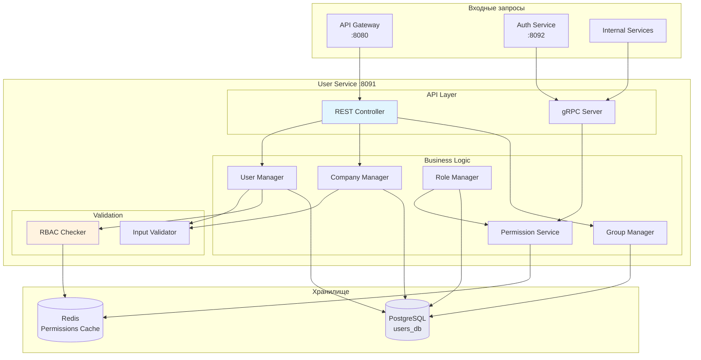
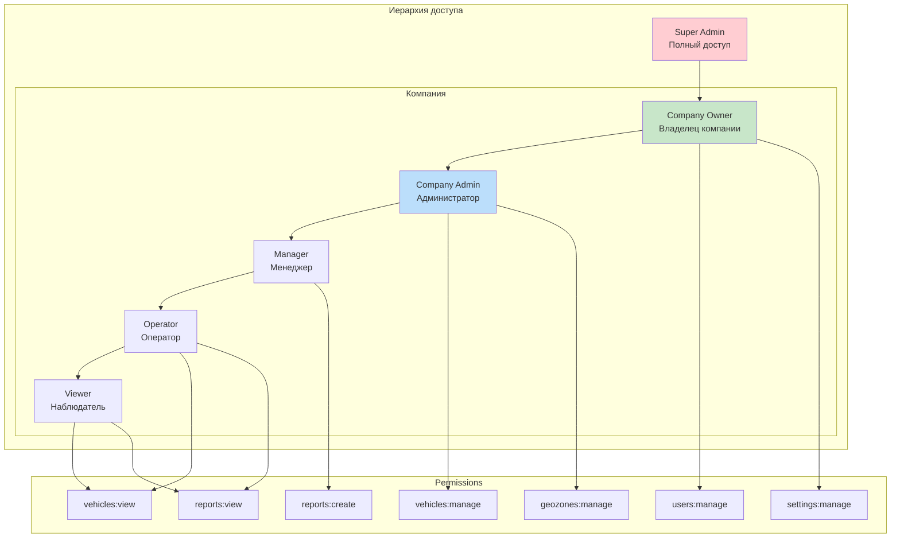

# User Service (Сервис пользователей)

> Блок 3 | Презентация | Приоритет: MVP

## Обзор

Сервис управления пользователями, компаниями и правами доступа (RBAC). Профили, роли, разрешения, группы транспорта.

## Характеристики

| Параметр | Значение |
|----------|----------|
| Порт | 8091 |
| Язык | Scala 3 + ZIO |
| База данных | PostgreSQL |
| Кэш | Redis |
| API | REST |

---

## 1. Архитектура

### 1.1 Mermaid Диаграмма - Общая архитектура



### 1.2 Mermaid - RBAC модель



### 1.3 UML Sequence - Создание пользователя

```
┌─────────┐  ┌──────────┐  ┌─────────┐  ┌──────────┐  ┌───────────┐  ┌─────────┐
│   API   │  │   User   │  │  Input  │  │   RBAC   │  │ PostgreSQL│  │  Redis  │
│ Gateway │  │ Manager  │  │Validator│  │ Checker  │  │           │  │         │
└────┬────┘  └────┬─────┘  └────┬────┘  └────┬─────┘  └─────┬─────┘  └────┬────┘
     │            │             │            │              │              │
     │ POST /users│             │            │              │              │
     │ {email, role, ...}       │            │              │              │
     │───────────>│             │            │              │              │
     │            │             │            │              │              │
     │            │ validate(request)        │              │              │
     │            │────────────>│            │              │              │
     │            │             │            │              │              │
     │            │             │ checkEmailFormat()        │              │
     │            │             │──────┐    │              │              │
     │            │             │      │    │              │              │
     │            │             │<─────┘    │              │              │
     │            │             │            │              │              │
     │            │  valid      │            │              │              │
     │            │<────────────│            │              │              │
     │            │             │            │              │              │
     │            │ canCreateUser(actorId, targetRole)     │              │
     │            │──────────────────────────>│              │              │
     │            │             │            │              │              │
     │            │             │            │ GET perms:{actorId}         │
     │            │             │            │─────────────────────────────>│
     │            │             │            │              │              │
     │            │             │            │ permissions  │              │
     │            │             │            │<─────────────────────────────│
     │            │             │            │              │              │
     │            │             │ allowed    │              │              │
     │            │<──────────────────────────│              │              │
     │            │             │            │              │              │
     │            │ checkEmailUnique(email)  │              │              │
     │            │──────────────────────────────────────────>│              │
     │            │             │            │              │              │
     │            │             │  unique    │              │              │
     │            │<──────────────────────────────────────────│              │
     │            │             │            │              │              │
     │            │ hashPassword(password)   │              │              │
     │            │──────┐     │            │              │              │
     │            │      │     │            │              │              │
     │            │<─────┘     │            │              │              │
     │            │             │            │              │              │
     │            │ INSERT users             │              │              │
     │            │──────────────────────────────────────────>│              │
     │            │             │            │              │              │
     │            │             │  userId    │              │              │
     │            │<──────────────────────────────────────────│              │
     │            │             │            │              │              │
     │            │ INSERT user_roles        │              │              │
     │            │──────────────────────────────────────────>│              │
     │            │             │            │              │              │
     │            │ cachePermissions(userId) │              │              │
     │            │────────────────────────────────────────────────────────>│
     │            │             │            │              │              │
     │  201 User  │             │            │              │              │
     │<───────────│             │            │              │              │
     │            │             │            │              │              │
```

### 1.4 UML Sequence - Проверка прав доступа

```
┌───────────┐  ┌──────────┐  ┌─────────┐  ┌───────────┐
│  Service  │  │Permission│  │  Redis  │  │ PostgreSQL│
│ (caller)  │  │ Service  │  │  Cache  │  │           │
└─────┬─────┘  └────┬─────┘  └────┬────┘  └─────┬─────┘
      │             │             │              │
      │ hasPermission(userId, "vehicles:manage", vehicleId)
      │────────────>│             │              │
      │             │             │              │
      │             │ GET perms:{userId}        │
      │             │────────────>│              │
      │             │             │              │
      │             │             │              │
      ├─────────────┼─────────── Cache HIT ─────┤
      │             │             │              │
      │             │ permissions │              │
      │             │<────────────│              │
      │             │             │              │
      ├─────────────┼─────────── Cache MISS ────┤
      │             │             │              │
      │             │ null        │              │
      │             │<────────────│              │
      │             │             │              │
      │             │ loadPermissions(userId)   │
      │             │───────────────────────────>│
      │             │             │              │
      │             │             │ permissions  │
      │             │<───────────────────────────│
      │             │             │              │
      │             │ SET perms:{userId}        │
      │             │────────────>│              │
      │             │             │              │
      ├─────────────┼─────────────┼──────────────┤
      │             │             │              │
      │             │ checkVehicleAccess(userId, vehicleId)
      │             │──────┐     │              │
      │             │      │     │              │
      │             │<─────┘     │              │
      │             │             │              │
      │ true/false  │             │              │
      │<────────────│             │              │
      │             │             │              │
```

### 1.5 UML Sequence - Назначение роли

```
┌─────────┐  ┌──────────┐  ┌──────────┐  ┌───────────┐  ┌─────────┐
│   API   │  │   Role   │  │   RBAC   │  │ PostgreSQL│  │  Redis  │
│         │  │ Manager  │  │ Checker  │  │           │  │         │
└────┬────┘  └────┬─────┘  └────┬─────┘  └─────┬─────┘  └────┬────┘
     │            │             │              │              │
     │ PUT /users/{id}/role     │              │              │
     │ {role: "admin"}          │              │              │
     │───────────>│             │              │              │
     │            │             │              │              │
     │            │ canAssignRole(actorId, targetRole)       │
     │            │────────────>│              │              │
     │            │             │              │              │
     │            │             │ Проверка: actor.role > target.role
     │            │             │──────┐      │              │
     │            │             │      │      │              │
     │            │             │<─────┘      │              │
     │            │             │              │              │
     │            │  allowed    │              │              │
     │            │<────────────│              │              │
     │            │             │              │              │
     │            │ BEGIN TRANSACTION         │              │
     │            │───────────────────────────>│              │
     │            │             │              │              │
     │            │ DELETE FROM user_roles WHERE user_id = ? │
     │            │───────────────────────────>│              │
     │            │             │              │              │
     │            │ INSERT INTO user_roles (user_id, role_id)│
     │            │───────────────────────────>│              │
     │            │             │              │              │
     │            │ INSERT INTO audit_log     │              │
     │            │───────────────────────────>│              │
     │            │             │              │              │
     │            │ COMMIT      │              │              │
     │            │───────────────────────────>│              │
     │            │             │              │              │
     │            │ DEL perms:{userId}        │              │
     │            │────────────────────────────────────────>│
     │            │             │              │              │
     │ 200 OK     │             │              │              │
     │<───────────│             │              │              │
     │            │             │              │              │
```

---

## 2. Модели данных

### 2.1 Scala модели

```scala
package tracker.user.domain

import java.time.{Instant, LocalDate}
import java.util.UUID

// ============================================
// Пользователи
// ============================================

/** Пользователь системы */
final case class User(
  id: UUID,
  companyId: UUID,
  email: String,
  passwordHash: String,
  firstName: String,
  lastName: String,
  phone: Option[String],
  position: Option[String],              // должность
  avatarUrl: Option[String],
  language: String,                      // "ru", "en"
  timezone: String,                      // "Europe/Moscow"
  isActive: Boolean,
  isEmailVerified: Boolean,
  lastLoginAt: Option[Instant],
  createdAt: Instant,
  updatedAt: Instant
)

/** Профиль пользователя (публичная часть) */
final case class UserProfile(
  id: UUID,
  companyId: UUID,
  email: String,
  firstName: String,
  lastName: String,
  phone: Option[String],
  position: Option[String],
  avatarUrl: Option[String],
  language: String,
  timezone: String,
  roles: List[String],
  permissions: Set[String]
)

/** Настройки пользователя */
final case class UserSettings(
  userId: UUID,
  notificationEmail: Boolean,
  notificationPush: Boolean,
  notificationSms: Boolean,
  dashboardLayout: Option[String],       // JSON конфигурация
  mapDefaults: MapDefaults,
  createdAt: Instant,
  updatedAt: Instant
)

final case class MapDefaults(
  centerLat: Double,
  centerLon: Double,
  zoom: Int,
  mapType: String                        // "roadmap", "satellite", "hybrid"
)

// ============================================
// Компании
// ============================================

/** Компания (тенант) */
final case class Company(
  id: UUID,
  name: String,
  inn: Option[String],                   // ИНН
  address: Option[String],
  phone: Option[String],
  email: Option[String],
  website: Option[String],
  logoUrl: Option[String],
  timezone: String,
  locale: String,                        // "ru_RU"
  isActive: Boolean,
  subscription: SubscriptionInfo,
  createdAt: Instant,
  updatedAt: Instant
)

/** Информация о подписке */
final case class SubscriptionInfo(
  plan: String,                          // "free", "basic", "pro", "enterprise"
  maxVehicles: Int,
  maxUsers: Int,
  features: Set[String],                 // включённые функции
  expiresAt: Option[Instant]
)

// ============================================
// Роли и права
// ============================================

/** Роль пользователя */
final case class Role(
  id: UUID,
  companyId: Option[UUID],               // None = системная роль
  name: String,                          // "admin", "manager", "operator"
  displayName: String,                   // "Администратор"
  description: Option[String],
  permissions: Set[String],              // разрешения роли
  isSystem: Boolean,                     // системная роль (нельзя удалить)
  level: Int,                            // иерархический уровень (меньше = выше)
  createdAt: Instant
)

/** Предустановленные системные роли */
object SystemRoles:
  val SuperAdmin = "super_admin"         // level 0
  val CompanyOwner = "company_owner"     // level 10
  val CompanyAdmin = "company_admin"     // level 20
  val Manager = "manager"                // level 30
  val Operator = "operator"              // level 40
  val Viewer = "viewer"                  // level 50

/** Разрешение */
enum Permission(val value: String):
  // Пользователи
  case UsersView extends Permission("users:view")
  case UsersCreate extends Permission("users:create")
  case UsersEdit extends Permission("users:edit")
  case UsersDelete extends Permission("users:delete")
  case UsersManageRoles extends Permission("users:manage_roles")
  
  // Транспорт
  case VehiclesView extends Permission("vehicles:view")
  case VehiclesCreate extends Permission("vehicles:create")
  case VehiclesEdit extends Permission("vehicles:edit")
  case VehiclesDelete extends Permission("vehicles:delete")
  case VehiclesCommands extends Permission("vehicles:commands")
  
  // Геозоны
  case GeozonesView extends Permission("geozones:view")
  case GeozonesCreate extends Permission("geozones:create")
  case GeozonesEdit extends Permission("geozones:edit")
  case GeozonesDelete extends Permission("geozones:delete")
  
  // Отчёты
  case ReportsView extends Permission("reports:view")
  case ReportsCreate extends Permission("reports:create")
  case ReportsExport extends Permission("reports:export")
  
  // ТО
  case MaintenanceView extends Permission("maintenance:view")
  case MaintenanceManage extends Permission("maintenance:manage")
  
  // Уведомления
  case NotificationsView extends Permission("notifications:view")
  case NotificationsManage extends Permission("notifications:manage")
  
  // Настройки
  case SettingsView extends Permission("settings:view")
  case SettingsManage extends Permission("settings:manage")
  
  // Интеграции
  case IntegrationsView extends Permission("integrations:view")
  case IntegrationsManage extends Permission("integrations:manage")

/** Связь пользователь-роль */
final case class UserRole(
  userId: UUID,
  roleId: UUID,
  assignedBy: UUID,
  assignedAt: Instant
)

// ============================================
// Группы транспорта
// ============================================

/** Группа транспорта */
final case class VehicleGroup(
  id: UUID,
  companyId: UUID,
  name: String,
  description: Option[String],
  color: Option[String],                 // "#FF5733"
  icon: Option[String],                  // "truck", "car", "bus"
  parentId: Option[UUID],                // для иерархии
  vehicleCount: Int,                     // кэшированное количество
  createdAt: Instant,
  updatedAt: Instant
)

/** Доступ пользователя к группе */
final case class UserGroupAccess(
  userId: UUID,
  groupId: UUID,
  accessLevel: AccessLevel,
  grantedBy: UUID,
  grantedAt: Instant
)

enum AccessLevel:
  case View                              // только просмотр
  case Operate                           // просмотр + команды
  case Manage                            // полное управление

// ============================================
// API модели
// ============================================

/** Запрос создания пользователя */
final case class CreateUserRequest(
  email: String,
  password: String,
  firstName: String,
  lastName: String,
  phone: Option[String],
  position: Option[String],
  roleId: UUID,
  groupIds: List[UUID]                   // группы для доступа
)

/** Запрос обновления профиля */
final case class UpdateProfileRequest(
  firstName: Option[String],
  lastName: Option[String],
  phone: Option[String],
  position: Option[String],
  language: Option[String],
  timezone: Option[String]
)

/** Запрос изменения пароля */
final case class ChangePasswordRequest(
  currentPassword: String,
  newPassword: String
)

/** Запрос создания компании */
final case class CreateCompanyRequest(
  name: String,
  inn: Option[String],
  address: Option[String],
  phone: Option[String],
  email: Option[String],
  timezone: String,
  ownerEmail: String,
  ownerPassword: String,
  ownerFirstName: String,
  ownerLastName: String
)

/** Ответ со списком пользователей */
final case class UsersListResponse(
  total: Int,
  page: Int,
  pageSize: Int,
  users: List[UserSummary]
)

final case class UserSummary(
  id: UUID,
  email: String,
  firstName: String,
  lastName: String,
  roles: List[String],
  isActive: Boolean,
  lastLoginAt: Option[Instant]
)

// ============================================
// Аудит
// ============================================

/** Запись аудита */
final case class AuditLogEntry(
  id: UUID,
  companyId: UUID,
  userId: UUID,
  action: String,                        // "user.created", "role.assigned"
  entityType: String,                    // "user", "vehicle", "geozone"
  entityId: Option[UUID],
  details: Map[String, String],
  ipAddress: String,
  userAgent: String,
  createdAt: Instant
)

// ============================================
// Ошибки
// ============================================

enum UserError:
  case UserNotFound(id: UUID)
  case EmailAlreadyExists(email: String)
  case InvalidPassword(reason: String)
  case PermissionDenied(action: String, reason: String)
  case RoleNotFound(id: UUID)
  case CannotAssignRole(role: String, reason: String)
  case CompanyNotFound(id: UUID)
  case GroupNotFound(id: UUID)
  case InvalidInput(errors: List[String])
```

---

## 3. Схема базы данных (PostgreSQL)

```sql
-- ============================================
-- Схема: users
-- ============================================

CREATE SCHEMA IF NOT EXISTS users;

-- ============================================
-- Таблица: companies (Компании)
-- ============================================

CREATE TABLE users.companies (
    id              UUID PRIMARY KEY DEFAULT gen_random_uuid(),
    name            VARCHAR(255) NOT NULL,
    inn             VARCHAR(20) UNIQUE,
    address         TEXT,
    phone           VARCHAR(50),
    email           VARCHAR(255),
    website         VARCHAR(255),
    logo_url        VARCHAR(500),
    timezone        VARCHAR(50) NOT NULL DEFAULT 'Europe/Moscow',
    locale          VARCHAR(10) NOT NULL DEFAULT 'ru_RU',
    is_active       BOOLEAN NOT NULL DEFAULT true,
    
    -- Подписка
    subscription_plan VARCHAR(50) NOT NULL DEFAULT 'free',
    max_vehicles    INTEGER NOT NULL DEFAULT 5,
    max_users       INTEGER NOT NULL DEFAULT 3,
    features        TEXT[] NOT NULL DEFAULT '{}',
    subscription_expires_at TIMESTAMPTZ,
    
    created_at      TIMESTAMPTZ NOT NULL DEFAULT NOW(),
    updated_at      TIMESTAMPTZ NOT NULL DEFAULT NOW()
);

CREATE INDEX idx_companies_active ON users.companies(is_active) WHERE is_active = true;

-- ============================================
-- Таблица: users (Пользователи)
-- ============================================

CREATE TABLE users.users (
    id              UUID PRIMARY KEY DEFAULT gen_random_uuid(),
    company_id      UUID NOT NULL REFERENCES users.companies(id),
    email           VARCHAR(255) NOT NULL,
    password_hash   VARCHAR(255) NOT NULL,
    first_name      VARCHAR(100) NOT NULL,
    last_name       VARCHAR(100) NOT NULL,
    phone           VARCHAR(50),
    position        VARCHAR(100),
    avatar_url      VARCHAR(500),
    language        VARCHAR(10) NOT NULL DEFAULT 'ru',
    timezone        VARCHAR(50) NOT NULL DEFAULT 'Europe/Moscow',
    is_active       BOOLEAN NOT NULL DEFAULT true,
    is_email_verified BOOLEAN NOT NULL DEFAULT false,
    last_login_at   TIMESTAMPTZ,
    created_at      TIMESTAMPTZ NOT NULL DEFAULT NOW(),
    updated_at      TIMESTAMPTZ NOT NULL DEFAULT NOW(),
    
    CONSTRAINT users_email_unique UNIQUE (email)
);

CREATE INDEX idx_users_company ON users.users(company_id);
CREATE INDEX idx_users_email ON users.users(email);
CREATE INDEX idx_users_active ON users.users(company_id, is_active) WHERE is_active = true;

-- ============================================
-- Таблица: roles (Роли)
-- ============================================

CREATE TABLE users.roles (
    id              UUID PRIMARY KEY DEFAULT gen_random_uuid(),
    company_id      UUID REFERENCES users.companies(id),  -- NULL = системная роль
    name            VARCHAR(50) NOT NULL,
    display_name    VARCHAR(100) NOT NULL,
    description     TEXT,
    permissions     TEXT[] NOT NULL DEFAULT '{}',
    is_system       BOOLEAN NOT NULL DEFAULT false,
    level           INTEGER NOT NULL DEFAULT 50,
    created_at      TIMESTAMPTZ NOT NULL DEFAULT NOW(),
    
    CONSTRAINT roles_name_unique UNIQUE (company_id, name)
);

CREATE INDEX idx_roles_company ON users.roles(company_id);

-- Системные роли (вставляются при инициализации)
INSERT INTO users.roles (id, company_id, name, display_name, permissions, is_system, level) VALUES
    ('00000000-0000-0000-0000-000000000001', NULL, 'super_admin', 'Суперадмин', 
     ARRAY['*'], true, 0),
    ('00000000-0000-0000-0000-000000000002', NULL, 'company_owner', 'Владелец компании', 
     ARRAY['users:*', 'vehicles:*', 'geozones:*', 'reports:*', 'maintenance:*', 'notifications:*', 'settings:*', 'integrations:*'], 
     true, 10),
    ('00000000-0000-0000-0000-000000000003', NULL, 'company_admin', 'Администратор', 
     ARRAY['users:view', 'users:create', 'users:edit', 'vehicles:*', 'geozones:*', 'reports:*', 'maintenance:*', 'notifications:*', 'settings:view'], 
     true, 20),
    ('00000000-0000-0000-0000-000000000004', NULL, 'manager', 'Менеджер', 
     ARRAY['vehicles:view', 'vehicles:edit', 'geozones:view', 'geozones:create', 'reports:*', 'maintenance:view', 'notifications:view'], 
     true, 30),
    ('00000000-0000-0000-0000-000000000005', NULL, 'operator', 'Оператор', 
     ARRAY['vehicles:view', 'vehicles:commands', 'geozones:view', 'reports:view', 'maintenance:view', 'notifications:view'], 
     true, 40),
    ('00000000-0000-0000-0000-000000000006', NULL, 'viewer', 'Наблюдатель', 
     ARRAY['vehicles:view', 'geozones:view', 'reports:view'], 
     true, 50);

-- ============================================
-- Таблица: user_roles (Связь пользователь-роль)
-- ============================================

CREATE TABLE users.user_roles (
    user_id         UUID NOT NULL REFERENCES users.users(id) ON DELETE CASCADE,
    role_id         UUID NOT NULL REFERENCES users.roles(id),
    assigned_by     UUID REFERENCES users.users(id),
    assigned_at     TIMESTAMPTZ NOT NULL DEFAULT NOW(),
    
    PRIMARY KEY (user_id, role_id)
);

CREATE INDEX idx_user_roles_role ON users.user_roles(role_id);

-- ============================================
-- Таблица: user_settings (Настройки пользователя)
-- ============================================

CREATE TABLE users.user_settings (
    user_id         UUID PRIMARY KEY REFERENCES users.users(id) ON DELETE CASCADE,
    notification_email BOOLEAN NOT NULL DEFAULT true,
    notification_push  BOOLEAN NOT NULL DEFAULT true,
    notification_sms   BOOLEAN NOT NULL DEFAULT false,
    dashboard_layout   JSONB,
    map_center_lat     DOUBLE PRECISION NOT NULL DEFAULT 55.7558,
    map_center_lon     DOUBLE PRECISION NOT NULL DEFAULT 37.6173,
    map_zoom           INTEGER NOT NULL DEFAULT 10,
    map_type           VARCHAR(20) NOT NULL DEFAULT 'roadmap',
    created_at      TIMESTAMPTZ NOT NULL DEFAULT NOW(),
    updated_at      TIMESTAMPTZ NOT NULL DEFAULT NOW()
);

-- ============================================
-- Таблица: vehicle_groups (Группы транспорта)
-- ============================================

CREATE TABLE users.vehicle_groups (
    id              UUID PRIMARY KEY DEFAULT gen_random_uuid(),
    company_id      UUID NOT NULL REFERENCES users.companies(id),
    name            VARCHAR(100) NOT NULL,
    description     TEXT,
    color           VARCHAR(7),          -- #RRGGBB
    icon            VARCHAR(50),
    parent_id       UUID REFERENCES users.vehicle_groups(id),
    vehicle_count   INTEGER NOT NULL DEFAULT 0,
    created_at      TIMESTAMPTZ NOT NULL DEFAULT NOW(),
    updated_at      TIMESTAMPTZ NOT NULL DEFAULT NOW(),
    
    CONSTRAINT groups_name_unique UNIQUE (company_id, name)
);

CREATE INDEX idx_groups_company ON users.vehicle_groups(company_id);
CREATE INDEX idx_groups_parent ON users.vehicle_groups(parent_id);

-- ============================================
-- Таблица: user_group_access (Доступ к группам)
-- ============================================

CREATE TYPE users.access_level AS ENUM ('view', 'operate', 'manage');

CREATE TABLE users.user_group_access (
    user_id         UUID NOT NULL REFERENCES users.users(id) ON DELETE CASCADE,
    group_id        UUID NOT NULL REFERENCES users.vehicle_groups(id) ON DELETE CASCADE,
    access_level    users.access_level NOT NULL DEFAULT 'view',
    granted_by      UUID REFERENCES users.users(id),
    granted_at      TIMESTAMPTZ NOT NULL DEFAULT NOW(),
    
    PRIMARY KEY (user_id, group_id)
);

CREATE INDEX idx_group_access_group ON users.user_group_access(group_id);

-- ============================================
-- Таблица: audit_log (Аудит)
-- ============================================

CREATE TABLE users.audit_log (
    id              UUID PRIMARY KEY DEFAULT gen_random_uuid(),
    company_id      UUID NOT NULL REFERENCES users.companies(id),
    user_id         UUID REFERENCES users.users(id),
    action          VARCHAR(100) NOT NULL,
    entity_type     VARCHAR(50) NOT NULL,
    entity_id       UUID,
    details         JSONB NOT NULL DEFAULT '{}',
    ip_address      INET,
    user_agent      TEXT,
    created_at      TIMESTAMPTZ NOT NULL DEFAULT NOW()
);

CREATE INDEX idx_audit_company_time ON users.audit_log(company_id, created_at DESC);
CREATE INDEX idx_audit_user ON users.audit_log(user_id, created_at DESC);
CREATE INDEX idx_audit_entity ON users.audit_log(entity_type, entity_id);

-- Партиционирование по месяцам
-- CREATE TABLE users.audit_log_y2025m01 PARTITION OF users.audit_log
--     FOR VALUES FROM ('2025-01-01') TO ('2025-02-01');

-- ============================================
-- Представления
-- ============================================

-- Полный профиль пользователя с ролями
CREATE VIEW users.user_profiles AS
SELECT 
    u.id,
    u.company_id,
    u.email,
    u.first_name,
    u.last_name,
    u.phone,
    u.position,
    u.avatar_url,
    u.language,
    u.timezone,
    u.is_active,
    u.is_email_verified,
    u.last_login_at,
    u.created_at,
    array_agg(DISTINCT r.name) as roles,
    array_agg(DISTINCT unnest(r.permissions)) as permissions
FROM users.users u
LEFT JOIN users.user_roles ur ON ur.user_id = u.id
LEFT JOIN users.roles r ON r.id = ur.role_id
GROUP BY u.id;

-- ============================================
-- Функции
-- ============================================

-- Проверка разрешения
CREATE OR REPLACE FUNCTION users.has_permission(
    p_user_id UUID,
    p_permission TEXT
)
RETURNS BOOLEAN AS $$
DECLARE
    v_has_permission BOOLEAN;
BEGIN
    SELECT EXISTS (
        SELECT 1
        FROM users.user_roles ur
        JOIN users.roles r ON r.id = ur.role_id
        WHERE ur.user_id = p_user_id
        AND (
            '*' = ANY(r.permissions)
            OR p_permission = ANY(r.permissions)
            OR split_part(p_permission, ':', 1) || ':*' = ANY(r.permissions)
        )
    ) INTO v_has_permission;
    
    RETURN v_has_permission;
END;
$$ LANGUAGE plpgsql;

-- Получение уровня роли пользователя
CREATE OR REPLACE FUNCTION users.get_user_role_level(p_user_id UUID)
RETURNS INTEGER AS $$
DECLARE
    v_level INTEGER;
BEGIN
    SELECT MIN(r.level) INTO v_level
    FROM users.user_roles ur
    JOIN users.roles r ON r.id = ur.role_id
    WHERE ur.user_id = p_user_id;
    
    RETURN COALESCE(v_level, 100);
END;
$$ LANGUAGE plpgsql;
```

---

## 4. Redis кэширование

```yaml
# ==========================================
# Права доступа (кэш)
# ==========================================

# Разрешения пользователя
key: "user:perms:{userId}"
value: |
  {
    "roles": ["admin", "manager"],
    "permissions": ["vehicles:view", "vehicles:edit", "reports:*"],
    "level": 20
  }
ttl: 3600s  # 1 час

# Профиль пользователя
key: "user:profile:{userId}"
value: |
  {
    "id": "uuid",
    "companyId": "uuid",
    "email": "user@example.com",
    "firstName": "Иван",
    "lastName": "Иванов",
    "roles": ["admin"]
  }
ttl: 300s  # 5 минут

# ==========================================
# Группы и доступ к транспорту
# ==========================================

# Группы пользователя
key: "user:groups:{userId}"
value: |
  [
    {"groupId": "uuid1", "accessLevel": "manage"},
    {"groupId": "uuid2", "accessLevel": "view"}
  ]
ttl: 3600s

# Транспорт в группе (для быстрой проверки доступа)
key: "group:vehicles:{groupId}"
value: ["vehicleId1", "vehicleId2", "vehicleId3"]
ttl: 3600s

# Доступный пользователю транспорт (агрегированный)
key: "user:vehicles:{userId}"
value: |
  {
    "manage": ["vehicleId1", "vehicleId2"],
    "operate": ["vehicleId3"],
    "view": ["vehicleId4", "vehicleId5"]
  }
ttl: 3600s

# ==========================================
# Инвалидация
# ==========================================

# При изменении роли пользователя:
DEL user:perms:{userId}
DEL user:profile:{userId}
DEL user:vehicles:{userId}

# При изменении группы:
DEL group:vehicles:{groupId}
# + для всех пользователей с доступом к группе:
DEL user:vehicles:{userId}
```

---

## 5. REST API

```yaml
# ==========================================
# Профиль текущего пользователя
# ==========================================

# Получить свой профиль
GET /api/v1/users/me
Response: 200 OK
  {
    "id": "uuid",
    "email": "user@example.com",
    "firstName": "Иван",
    "lastName": "Иванов",
    "phone": "+7 900 123-45-67",
    "position": "Менеджер",
    "language": "ru",
    "timezone": "Europe/Moscow",
    "roles": ["manager"],
    "permissions": ["vehicles:view", "reports:*"]
  }

# Обновить профиль
PUT /api/v1/users/me
Body: UpdateProfileRequest
Response: 200 OK

# Изменить пароль
PUT /api/v1/users/me/password
Body: ChangePasswordRequest
Response: 204 No Content

# Настройки пользователя
GET /api/v1/users/me/settings
Response: 200 OK
  {
    "notificationEmail": true,
    "notificationPush": true,
    "notificationSms": false,
    "mapDefaults": {
      "centerLat": 55.7558,
      "centerLon": 37.6173,
      "zoom": 10,
      "mapType": "roadmap"
    }
  }

PUT /api/v1/users/me/settings
Body: UserSettings
Response: 200 OK

# ==========================================
# Управление пользователями (admin)
# ==========================================

# Список пользователей компании
GET /api/v1/users
Parameters:
  - page: number (default 1)
  - pageSize: number (default 20)
  - search: string (optional)
  - role: string (optional)
  - isActive: boolean (optional)
Response: 200 OK
  UsersListResponse

# Создать пользователя
POST /api/v1/users
Body: CreateUserRequest
Response: 201 Created
  { "id": "uuid", "email": "..." }

# Получить пользователя
GET /api/v1/users/{userId}
Response: 200 OK
  UserProfile

# Обновить пользователя
PUT /api/v1/users/{userId}
Body: UpdateUserRequest
Response: 200 OK

# Деактивировать пользователя
DELETE /api/v1/users/{userId}
Response: 204 No Content

# Назначить роль
PUT /api/v1/users/{userId}/role
Body: { "roleId": "uuid" }
Response: 200 OK

# Сбросить пароль (отправить ссылку)
POST /api/v1/users/{userId}/reset-password
Response: 204 No Content

# ==========================================
# Роли
# ==========================================

# Список ролей
GET /api/v1/roles
Response: 200 OK
  {
    "roles": [
      {
        "id": "uuid",
        "name": "manager",
        "displayName": "Менеджер",
        "permissions": ["vehicles:view", "reports:*"],
        "isSystem": true,
        "level": 30
      }
    ]
  }

# Создать кастомную роль
POST /api/v1/roles
Body: { "name": "dispatcher", "displayName": "Диспетчер", "permissions": [...] }
Response: 201 Created

# ==========================================
# Группы транспорта
# ==========================================

# Список групп
GET /api/v1/groups
Response: 200 OK
  {
    "groups": [
      {
        "id": "uuid",
        "name": "Грузовики",
        "color": "#4CAF50",
        "icon": "truck",
        "vehicleCount": 15,
        "children": [
          { "id": "uuid2", "name": "Самосвалы", "vehicleCount": 5 }
        ]
      }
    ]
  }

# Создать группу
POST /api/v1/groups
Body: { "name": "Легковые", "color": "#2196F3", "parentId": null }
Response: 201 Created

# Назначить доступ к группе
POST /api/v1/groups/{groupId}/access
Body: { "userId": "uuid", "accessLevel": "operate" }
Response: 200 OK

# ==========================================
# Компания
# ==========================================

# Информация о компании
GET /api/v1/company
Response: 200 OK
  Company

# Обновить информацию
PUT /api/v1/company
Body: UpdateCompanyRequest
Response: 200 OK

# ==========================================
# Аудит
# ==========================================

# Лог аудита
GET /api/v1/audit
Parameters:
  - userId: uuid (optional)
  - action: string (optional)
  - entityType: string (optional)
  - fromDate: date
  - toDate: date
  - page: number
  - pageSize: number
Response: 200 OK
  {
    "total": 500,
    "entries": [
      {
        "id": "uuid",
        "userId": "uuid",
        "userName": "Иван Иванов",
        "action": "user.created",
        "entityType": "user",
        "entityId": "uuid",
        "details": { "email": "new@example.com" },
        "ipAddress": "192.168.1.100",
        "createdAt": "2025-01-20T10:00:00Z"
      }
    ]
  }
```

---

## 6. Метрики и мониторинг

```yaml
# Prometheus метрики

# Счётчики
user_registrations_total{company}
user_logins_total{company, success}
permission_checks_total{permission, result}
role_assignments_total{role}

# Gauge
active_users_count{company}
users_online_count                        # по WebSocket сессиям

# Гистограммы
permission_check_duration_seconds
user_query_duration_seconds{operation}

# Алерты
- alert: HighPermissionDenials
  expr: rate(permission_checks_total{result="denied"}[5m]) > 10
  for: 5m
  annotations:
    summary: "Много отказов в доступе"
```

---

## 7. AI Промпт для реализации сервиса

### Контекст и задача

```markdown
# Задача: Реализовать User Service для GPS трекинг системы

## Контекст
Сервис управления пользователями, компаниями и правами доступа (RBAC).
Часть Блока 3 (Презентация). Мультитенантность по компаниям, иерархическая модель ролей.

## Технический стек (ОБЯЗАТЕЛЬНО)
- Scala 3.4.0
- ZIO 2.0.20 (эффекты)
- zio-http (REST API)
- Quill (PostgreSQL)
- zio-redis (кэширование прав)
- zio-json (сериализация)
- BCrypt (хэширование паролей)
- zio-config (конфигурация)

## Архитектурные компоненты

### 1. Слой домена (domain/)
```scala
// models.scala - Все case classes из раздела 2.1
// Включая: User, UserProfile, Company, Role, Permission, VehicleGroup

// errors.scala
enum UserError:
  case UserNotFound(id: UUID)
  case EmailAlreadyExists(email: String)
  case PermissionDenied(action: String, reason: String)
  // ...
```

### 2. Репозитории (repository/)
```scala
// UserRepository.scala
trait UserRepository:
  def create(user: User): Task[UUID]
  def findById(id: UUID): Task[Option[User]]
  def findByEmail(email: String): Task[Option[User]]
  def findByCompany(companyId: UUID, page: Int, pageSize: Int): Task[List[User]]
  def update(user: User): Task[Unit]
  def delete(id: UUID): Task[Unit]

// RoleRepository.scala
trait RoleRepository:
  def findById(id: UUID): Task[Option[Role]]
  def findByName(companyId: Option[UUID], name: String): Task[Option[Role]]
  def findAll(companyId: Option[UUID]): Task[List[Role]]
  def assignRole(userId: UUID, roleId: UUID, assignedBy: UUID): Task[Unit]
  def removeRole(userId: UUID, roleId: UUID): Task[Unit]

// CompanyRepository.scala
trait CompanyRepository:
  def create(company: Company): Task[UUID]
  def findById(id: UUID): Task[Option[Company]]
  def update(company: Company): Task[Unit]

// VehicleGroupRepository.scala
trait VehicleGroupRepository:
  def create(group: VehicleGroup): Task[UUID]
  def findByCompany(companyId: UUID): Task[List[VehicleGroup]]
  def grantAccess(userId: UUID, groupId: UUID, level: AccessLevel): Task[Unit]
  def revokeAccess(userId: UUID, groupId: UUID): Task[Unit]
```

### 3. Сервисы (service/)
```scala
// PermissionService.scala - Проверка прав
trait PermissionService:
  def hasPermission(userId: UUID, permission: Permission): Task[Boolean]
  def hasPermissionForVehicle(userId: UUID, vehicleId: UUID, permission: Permission): Task[Boolean]
  def getUserPermissions(userId: UUID): Task[Set[String]]
  def canAssignRole(actorId: UUID, targetRole: Role): Task[Boolean]

// UserService.scala - Управление пользователями
trait UserService:
  def createUser(actorId: UUID, request: CreateUserRequest): Task[User]
  def getProfile(userId: UUID): Task[UserProfile]
  def updateProfile(userId: UUID, request: UpdateProfileRequest): Task[Unit]
  def changePassword(userId: UUID, request: ChangePasswordRequest): Task[Unit]
  def assignRole(actorId: UUID, userId: UUID, roleId: UUID): Task[Unit]
  def deactivateUser(actorId: UUID, userId: UUID): Task[Unit]

// CompanyService.scala - Управление компаниями
trait CompanyService:
  def createCompany(request: CreateCompanyRequest): Task[Company]
  def getCompany(id: UUID): Task[Company]
  def updateCompany(actorId: UUID, request: UpdateCompanyRequest): Task[Unit]

// GroupService.scala - Управление группами
trait GroupService:
  def createGroup(actorId: UUID, request: CreateGroupRequest): Task[VehicleGroup]
  def grantAccess(actorId: UUID, userId: UUID, groupId: UUID, level: AccessLevel): Task[Unit]
  def getUserAccessibleVehicles(userId: UUID): Task[Map[AccessLevel, Set[UUID]]]

// AuditService.scala - Аудит
trait AuditService:
  def log(entry: AuditLogEntry): Task[Unit]
  def getLog(companyId: UUID, filters: AuditFilters): Task[List[AuditLogEntry]]
```

### 4. Кэширование (cache/)
```scala
// PermissionCache.scala
trait PermissionCache:
  def getPermissions(userId: UUID): UIO[Option[CachedPermissions]]
  def setPermissions(userId: UUID, perms: CachedPermissions): UIO[Unit]
  def invalidate(userId: UUID): UIO[Unit]
  def invalidateCompany(companyId: UUID): UIO[Unit]

// UserCache.scala
trait UserCache:
  def getProfile(userId: UUID): UIO[Option[UserProfile]]
  def setProfile(userId: UUID, profile: UserProfile): UIO[Unit]
  def invalidate(userId: UUID): UIO[Unit]
```

### 5. REST API (api/)
```scala
// UserRoutes.scala - Все endpoints из раздела 5
// Валидация входных данных
// Проверка прав перед операциями
// Аудит действий
```

## Требования к реализации

### Функциональные требования
1. CRUD пользователей с валидацией email
2. Иерархическая модель ролей (нельзя назначить роль выше своей)
3. Кэширование прав в Redis для быстрой проверки
4. Группы транспорта с иерархией
5. Аудит всех действий с сущностями
6. Мультитенантность (изоляция данных по компаниям)

### Нефункциональные требования
1. Проверка прав < 5ms (из кэша)
2. Инвалидация кэша при изменении ролей
3. Хэширование паролей BCrypt
4. Транзакционность при назначении ролей

### Критерии приёмки
1. Пользователь не может назначить роль выше своей
2. Права кэшируются и проверяются быстро
3. При изменении роли кэш инвалидируется
4. Все действия логируются в аудит
5. Данные изолированы между компаниями
6. Пароли хэшируются BCrypt

## Структура проекта
```
services/user-service/
├── src/main/scala/tracker/user/
│   ├── Main.scala
│   ├── UserApp.scala
│   ├── domain/
│   │   ├── models.scala
│   │   └── errors.scala
│   ├── repository/
│   │   ├── UserRepository.scala
│   │   ├── RoleRepository.scala
│   │   ├── CompanyRepository.scala
│   │   ├── VehicleGroupRepository.scala
│   │   └── impl/
│   │       └── PostgresUserRepository.scala
│   ├── service/
│   │   ├── PermissionService.scala
│   │   ├── UserService.scala
│   │   ├── CompanyService.scala
│   │   ├── GroupService.scala
│   │   └── AuditService.scala
│   ├── cache/
│   │   ├── PermissionCache.scala
│   │   └── UserCache.scala
│   ├── api/
│   │   └── UserRoutes.scala
│   └── config/
│       └── UserConfig.scala
├── src/main/resources/
│   ├── application.conf
│   └── db/migration/
│       └── V1__users_schema.sql
└── src/test/scala/tracker/user/
    ├── service/
    │   └── PermissionServiceSpec.scala
    └── api/
        └── UserRoutesSpec.scala
```

## SQL Schema
Использовать схему из раздела 3 документации.
```

---

## Связанные документы

- [ARCHITECTURE_BLOCK3.md](../ARCHITECTURE_BLOCK3.md) - Обзор блока презентации
- [AUTH_SERVICE.md](./AUTH_SERVICE.md) - Аутентификация и JWT
- [API_GATEWAY.md](./API_GATEWAY.md) - Точка входа API
