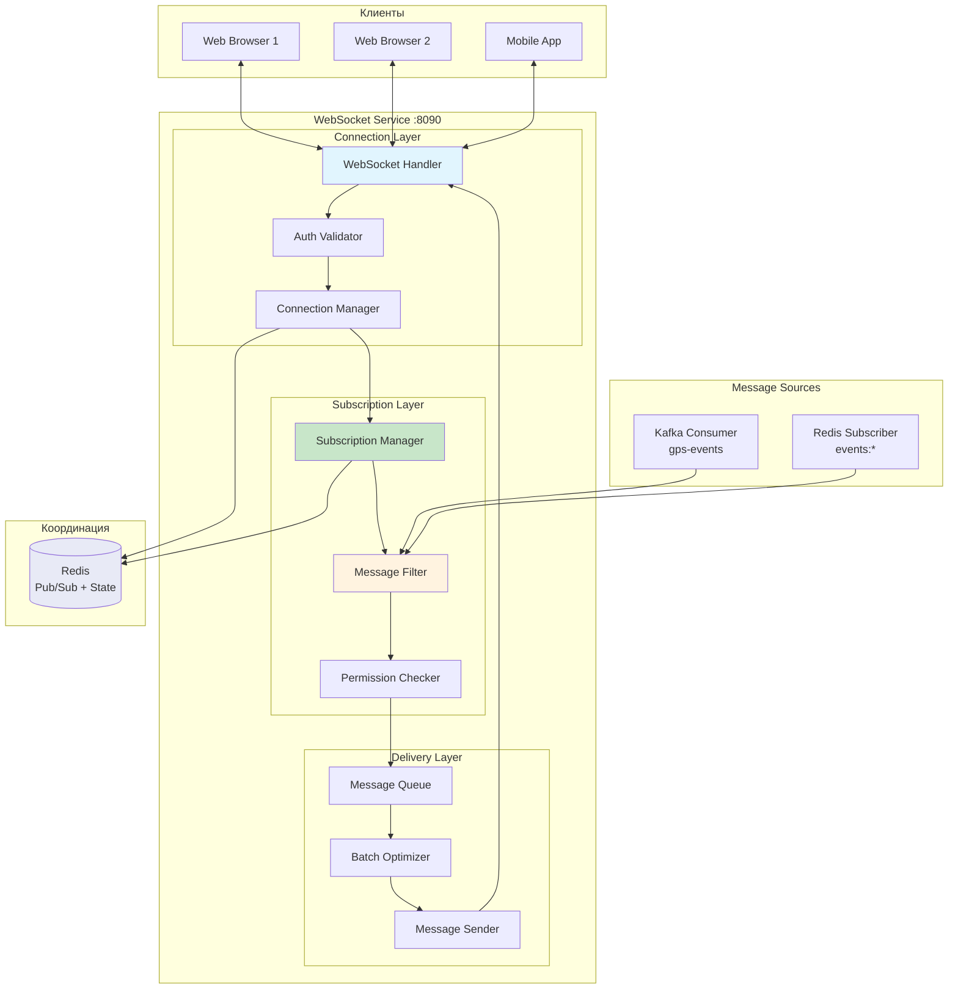
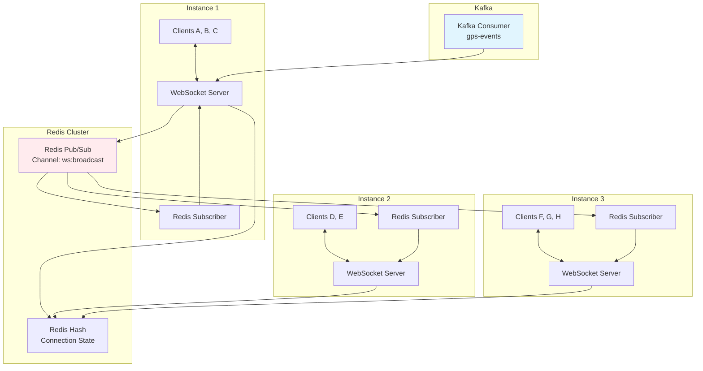

# WebSocket Service (Сервис WebSocket)

> Блок 3 | Презентация | Приоритет: MVP

## Обзор

Сервис real-time коммуникации через WebSocket. Трансляция позиций транспорта, событий геозон, уведомлений в реальном времени на клиенты.

## Характеристики

| Параметр | Значение |
|----------|----------|
| Порт | 8090 (WS), 8091 (WSS) |
| Язык | Scala 3 + ZIO |
| Протокол | WebSocket + JSON |
| Pub/Sub | Redis Pub/Sub |
| Масштабирование | Горизонтальное через Redis |

---

## 1. Архитектура

### 1.1 Mermaid Диаграмма - Общая архитектура



### 1.2 Mermaid - Масштабирование через Redis Pub/Sub



### 1.3 UML Sequence - Подключение и подписка

```
┌────────┐  ┌──────────┐  ┌──────────┐  ┌─────────────┐  ┌───────────┐  ┌─────────┐
│ Client │  │WebSocket │  │   Auth   │  │ Connection  │  │Subscription│  │  Redis  │
│        │  │ Handler  │  │ Validator│  │  Manager    │  │  Manager   │  │         │
└───┬────┘  └────┬─────┘  └────┬─────┘  └──────┬──────┘  └─────┬─────┘  └────┬────┘
    │            │             │               │               │              │
    │ WS Connect │             │               │               │              │
    │ /ws?token=xxx            │               │               │              │
    │───────────>│             │               │               │              │
    │            │             │               │               │              │
    │            │ validateToken(xxx)          │               │              │
    │            │────────────>│               │               │              │
    │            │             │               │               │              │
    │            │             │ GET session:{token}           │              │
    │            │             │────────────────────────────────────────────>│
    │            │             │               │               │              │
    │            │             │ UserContext   │               │              │
    │            │             │<────────────────────────────────────────────│
    │            │             │               │               │              │
    │            │ UserContext │               │               │              │
    │            │<────────────│               │               │              │
    │            │             │               │               │              │
    │            │ registerConnection(userId, connId)          │              │
    │            │───────────────────────────>│               │              │
    │            │             │               │               │              │
    │            │             │               │ HSET ws:conn:{userId} {connId} {instanceId}
    │            │             │               │────────────────────────────>│
    │            │             │               │               │              │
    │ Connected  │             │               │               │              │
    │<───────────│             │               │               │              │
    │            │             │               │               │              │
    │ Subscribe  │             │               │               │              │
    │ {vehicles:[id1,id2]}     │               │               │              │
    │───────────>│             │               │               │              │
    │            │             │               │               │              │
    │            │ checkPermissions(userId, vehicleIds)        │              │
    │            │───────────────────────────────────────────>│              │
    │            │             │               │               │              │
    │            │             │  [id1: ok, id2: ok]           │              │
    │            │             │<─────────────────────────────│              │
    │            │             │               │               │              │
    │            │             │ addSubscriptions(connId, [id1,id2])         │
    │            │             │───────────────────────────────>│              │
    │            │             │               │               │              │
    │            │             │               │ SADD ws:sub:{id1} {connId}  │
    │            │             │               │────────────────────────────>│
    │            │             │               │               │              │
    │ Subscribed │             │               │               │              │
    │<───────────│             │               │               │              │
    │            │             │               │               │              │
```

### 1.4 UML Sequence - Доставка GPS позиции

```
┌───────────┐  ┌───────────┐  ┌─────────────┐  ┌──────────┐  ┌──────────┐  ┌─────────┐
│   Kafka   │  │  Message  │  │ Subscription│  │  Message │  │WebSocket │  │ Clients │
│  Consumer │  │  Filter   │  │   Manager   │  │  Sender  │  │  Server  │  │         │
└─────┬─────┘  └─────┬─────┘  └──────┬──────┘  └────┬─────┘  └────┬─────┘  └────┬────┘
      │              │               │              │              │              │
      │ GPSEvent     │               │              │              │              │
      │─────────────>│               │              │              │              │
      │              │               │              │              │              │
      │              │ filterByVehicle(vehicleId)   │              │              │
      │              │───────┐      │              │              │              │
      │              │       │      │              │              │              │
      │              │<──────┘      │              │              │              │
      │              │               │              │              │              │
      │              │ getSubscribers(vehicleId)   │              │              │
      │              │──────────────>│              │              │              │
      │              │               │              │              │              │
      │              │               │ SMEMBERS ws:sub:{vehicleId} │              │
      │              │               │─────────────────────────────────────────>│
      │              │               │              │              │              │
      │              │               │ [connId1, connId2, connId3] │              │
      │              │               │<─────────────────────────────────────────│
      │              │               │              │              │              │
      │              │ [connId1, connId2, connId3] │              │              │
      │              │<──────────────│              │              │              │
      │              │               │              │              │              │
      │              │ sendToConnections(connIds, message)        │              │
      │              │─────────────────────────────>│              │              │
      │              │               │              │              │              │
      │              │               │              │ filterLocalConnections()   │
      │              │               │              │──────────────>│              │
      │              │               │              │              │              │
      │              │               │              │ localConns   │              │
      │              │               │              │<──────────────│              │
      │              │               │              │              │              │
      │              │               │              │ WS.send(message)           │
      │              │               │              │──────────────────────────>│
      │              │               │              │              │              │
      │              │               │              │ publishToRedis(remoteConns)│
      │              │               │              │──────────────>│              │
      │              │               │              │              │              │
```

### 1.5 UML Sequence - Heartbeat и reconnect

```
┌────────┐  ┌──────────┐  ┌──────────┐  ┌─────────┐
│ Client │  │WebSocket │  │Connection│  │  Redis  │
│        │  │ Handler  │  │ Manager  │  │         │
└───┬────┘  └────┬─────┘  └────┬─────┘  └────┬────┘
    │            │             │              │
    │            │             │              │
    ├────────────── Every 30 seconds ─────────┤
    │            │             │              │
    │ Ping       │             │              │
    │───────────>│             │              │
    │            │             │              │
    │ Pong       │             │              │
    │<───────────│             │              │
    │            │             │              │
    │            │ updateLastSeen(connId)     │
    │            │────────────>│              │
    │            │             │              │
    │            │             │ HSET ws:conn:{userId} lastSeen {now}
    │            │             │─────────────>│
    │            │             │              │
    ├────────────── Connection Lost ──────────┤
    │            │             │              │
    │ [timeout]  │             │              │
    │            │             │              │
    │            │ onDisconnect(connId)       │
    │            │────────────>│              │
    │            │             │              │
    │            │             │ HDEL ws:conn:{userId} {connId}
    │            │             │─────────────>│
    │            │             │              │
    │            │             │ cleanupSubscriptions(connId)
    │            │             │──────┐       │
    │            │             │      │       │
    │            │             │<─────┘       │
    │            │             │              │
    ├────────────── Reconnect ────────────────┤
    │            │             │              │
    │ WS Connect │             │              │
    │ /ws?token=xxx&lastEventId=123           │
    │───────────>│             │              │
    │            │             │              │
    │            │ restoreSubscriptions(userId)│
    │            │────────────>│              │
    │            │             │              │
    │            │             │ GET ws:state:{userId}
    │            │             │─────────────>│
    │            │             │              │
    │            │             │ savedState   │
    │            │             │<─────────────│
    │            │             │              │
    │ Restored + │             │              │
    │ missedEvents             │              │
    │<───────────│             │              │
    │            │             │              │
```

---

## 2. Модели данных

### 2.1 Scala модели

```scala
package tracker.websocket.domain

import java.time.Instant
import java.util.UUID

// ============================================
// Соединения
// ============================================

/** WebSocket соединение */
final case class WsConnection(
  id: UUID,                              // уникальный ID соединения
  userId: UUID,
  companyId: UUID,
  instanceId: String,                    // ID инстанса сервера
  connectedAt: Instant,
  lastSeen: Instant,
  clientInfo: ClientInfo,
  subscriptions: Set[Subscription]
)

/** Информация о клиенте */
final case class ClientInfo(
  userAgent: String,
  ip: String,
  platform: String,                      // "web", "mobile", "desktop"
  version: Option[String]                // версия приложения
)

// ============================================
// Подписки
// ============================================

/** Тип подписки */
enum SubscriptionType:
  case Vehicles                          // позиции транспорта
  case GeoEvents                         // события геозон
  case Notifications                     // уведомления
  case Maintenance                       // события ТО
  case SystemAlerts                      // системные алерты

/** Подписка */
final case class Subscription(
  subscriptionType: SubscriptionType,
  filter: SubscriptionFilter,
  createdAt: Instant
)

/** Фильтр подписки */
sealed trait SubscriptionFilter

object SubscriptionFilter:
  /** Все сущности компании */
  case object All extends SubscriptionFilter
  
  /** Конкретные ID */
  final case class ByIds(ids: Set[UUID]) extends SubscriptionFilter
  
  /** По группе */
  final case class ByGroup(groupId: UUID) extends SubscriptionFilter
  
  /** По геозоне */
  final case class ByGeozone(geozoneId: UUID) extends SubscriptionFilter

// ============================================
// Сообщения клиент -> сервер
// ============================================

/** Входящее сообщение от клиента */
sealed trait ClientMessage

object ClientMessage:
  /** Подписка на обновления */
  final case class Subscribe(
    subscriptionType: SubscriptionType,
    filter: SubscriptionFilter
  ) extends ClientMessage
  
  /** Отписка */
  final case class Unsubscribe(
    subscriptionType: SubscriptionType,
    filter: Option[SubscriptionFilter]   // None = отписаться от всего типа
  ) extends ClientMessage
  
  /** Запрос текущего состояния */
  final case class GetState(
    vehicleIds: Option[Set[UUID]]        // None = все доступные
  ) extends ClientMessage
  
  /** Ping для heartbeat */
  case object Ping extends ClientMessage
  
  /** Подтверждение получения */
  final case class Ack(eventId: Long) extends ClientMessage

// ============================================
// Сообщения сервер -> клиент
// ============================================

/** Исходящее сообщение к клиенту */
sealed trait ServerMessage:
  def eventId: Long                      // для отслеживания доставки
  def timestamp: Instant

object ServerMessage:
  /** Подтверждение подключения */
  final case class Connected(
    eventId: Long,
    timestamp: Instant,
    connectionId: UUID,
    serverTime: Instant
  ) extends ServerMessage
  
  /** Подтверждение подписки */
  final case class Subscribed(
    eventId: Long,
    timestamp: Instant,
    subscriptionType: SubscriptionType,
    count: Int                           // кол-во объектов в подписке
  ) extends ServerMessage
  
  /** Обновление позиции */
  final case class PositionUpdate(
    eventId: Long,
    timestamp: Instant,
    vehicleId: UUID,
    position: Position
  ) extends ServerMessage
  
  /** Пакетное обновление позиций */
  final case class PositionBatch(
    eventId: Long,
    timestamp: Instant,
    positions: List[VehiclePosition]
  ) extends ServerMessage
  
  /** Событие геозоны */
  final case class GeoEvent(
    eventId: Long,
    timestamp: Instant,
    event: GeozoneEvent
  ) extends ServerMessage
  
  /** Уведомление */
  final case class Notification(
    eventId: Long,
    timestamp: Instant,
    notification: NotificationPayload
  ) extends ServerMessage
  
  /** Системное сообщение */
  final case class SystemAlert(
    eventId: Long,
    timestamp: Instant,
    level: AlertLevel,
    message: String
  ) extends ServerMessage
  
  /** Pong ответ */
  final case class Pong(
    eventId: Long,
    timestamp: Instant
  ) extends ServerMessage
  
  /** Ошибка */
  final case class Error(
    eventId: Long,
    timestamp: Instant,
    code: String,
    message: String
  ) extends ServerMessage

/** Позиция транспорта */
final case class Position(
  lat: Double,
  lon: Double,
  speed: Double,                         // км/ч
  course: Int,                           // градусы
  altitude: Option[Int],
  satellites: Option[Int],
  timestamp: Instant
)

final case class VehiclePosition(
  vehicleId: UUID,
  vehicleName: String,
  position: Position,
  status: VehicleStatus,
  sensors: Option[SensorData]
)

enum VehicleStatus:
  case Moving
  case Stopped
  case Parking
  case Offline
  case NoGps

final case class SensorData(
  fuel: Option[Double],                  // литры
  temperature: Option[Double],           // °C
  ignition: Option[Boolean],
  doors: Option[Boolean]
)

/** Событие геозоны */
final case class GeozoneEvent(
  vehicleId: UUID,
  vehicleName: String,
  geozoneId: UUID,
  geozoneName: String,
  eventType: GeoEventType,
  position: Position,
  timestamp: Instant
)

enum GeoEventType:
  case Entered
  case Exited

/** Уведомление */
final case class NotificationPayload(
  id: UUID,
  title: String,
  body: String,
  category: String,
  priority: String,
  data: Map[String, String]
)

enum AlertLevel:
  case Info
  case Warning
  case Critical

// ============================================
// Состояние
// ============================================

/** Состояние подключения для восстановления */
final case class ConnectionState(
  userId: UUID,
  subscriptions: List[Subscription],
  lastEventId: Long,
  savedAt: Instant
)

/** Статистика соединения */
final case class ConnectionStats(
  connectionId: UUID,
  messagesReceived: Long,
  messagesSent: Long,
  bytesReceived: Long,
  bytesSent: Long,
  connectedAt: Instant,
  lastActivity: Instant
)

// ============================================
// Ошибки
// ============================================

enum WsError:
  case AuthenticationFailed(reason: String)
  case SubscriptionDenied(subscriptionType: SubscriptionType, reason: String)
  case RateLimitExceeded(retryAfter: Duration)
  case InvalidMessage(details: String)
  case ConnectionClosed(reason: String)
```

---

## 3. WebSocket протокол

### 3.1 Формат сообщений (JSON)

```json
// ========================================
// Клиент -> Сервер
// ========================================

// Подписка на позиции конкретных ТС
{
  "type": "subscribe",
  "subscriptionType": "vehicles",
  "filter": {
    "type": "byIds",
    "ids": ["uuid1", "uuid2", "uuid3"]
  }
}

// Подписка на все события геозон
{
  "type": "subscribe",
  "subscriptionType": "geoEvents",
  "filter": { "type": "all" }
}

// Отписка
{
  "type": "unsubscribe",
  "subscriptionType": "vehicles",
  "filter": {
    "type": "byIds",
    "ids": ["uuid1"]
  }
}

// Запрос текущего состояния
{
  "type": "getState",
  "vehicleIds": ["uuid1", "uuid2"]
}

// Ping
{
  "type": "ping"
}

// Подтверждение
{
  "type": "ack",
  "eventId": 12345
}

// ========================================
// Сервер -> Клиент
// ========================================

// Подключение установлено
{
  "type": "connected",
  "eventId": 1,
  "timestamp": "2025-01-20T10:00:00Z",
  "connectionId": "uuid",
  "serverTime": "2025-01-20T10:00:00Z"
}

// Подписка подтверждена
{
  "type": "subscribed",
  "eventId": 2,
  "timestamp": "2025-01-20T10:00:00Z",
  "subscriptionType": "vehicles",
  "count": 3
}

// Обновление позиции (одиночное)
{
  "type": "position",
  "eventId": 100,
  "timestamp": "2025-01-20T10:00:05Z",
  "vehicleId": "uuid",
  "position": {
    "lat": 55.7558,
    "lon": 37.6173,
    "speed": 45.5,
    "course": 180,
    "altitude": 150,
    "satellites": 12,
    "timestamp": "2025-01-20T10:00:04Z"
  }
}

// Пакет позиций (оптимизация)
{
  "type": "positionBatch",
  "eventId": 200,
  "timestamp": "2025-01-20T10:00:10Z",
  "positions": [
    {
      "vehicleId": "uuid1",
      "vehicleName": "А123BC",
      "position": {...},
      "status": "moving",
      "sensors": {
        "fuel": 45.5,
        "ignition": true
      }
    },
    {
      "vehicleId": "uuid2",
      "vehicleName": "В456DE",
      "position": {...},
      "status": "stopped"
    }
  ]
}

// Событие геозоны
{
  "type": "geoEvent",
  "eventId": 300,
  "timestamp": "2025-01-20T10:00:15Z",
  "event": {
    "vehicleId": "uuid",
    "vehicleName": "А123BC",
    "geozoneId": "uuid",
    "geozoneName": "Офис",
    "eventType": "entered",
    "position": {...},
    "timestamp": "2025-01-20T10:00:14Z"
  }
}

// Уведомление
{
  "type": "notification",
  "eventId": 400,
  "timestamp": "2025-01-20T10:00:20Z",
  "notification": {
    "id": "uuid",
    "title": "Превышение скорости",
    "body": "Транспорт А123BC превысил скорость: 95 км/ч",
    "category": "speed",
    "priority": "high",
    "data": {
      "vehicleId": "uuid",
      "speed": "95"
    }
  }
}

// Системный алерт
{
  "type": "systemAlert",
  "eventId": 500,
  "timestamp": "2025-01-20T10:00:25Z",
  "level": "warning",
  "message": "Плановое обслуживание через 30 минут"
}

// Pong
{
  "type": "pong",
  "eventId": 0,
  "timestamp": "2025-01-20T10:00:30Z"
}

// Ошибка
{
  "type": "error",
  "eventId": 0,
  "timestamp": "2025-01-20T10:00:35Z",
  "code": "SUBSCRIPTION_DENIED",
  "message": "Нет доступа к транспорту uuid"
}
```

---

## 4. Redis структуры

```yaml
# ==========================================
# Соединения
# ==========================================

# Активные соединения пользователя
key: "ws:conn:user:{userId}"
type: HASH
fields:
  {connId1}: "{instanceId}:{connectedAt}:{lastSeen}"
  {connId2}: "{instanceId}:{connectedAt}:{lastSeen}"
ttl: -  # управляется явно

# Все соединения на инстансе
key: "ws:instance:{instanceId}:connections"
type: SET
members: [connId1, connId2, connId3]
ttl: -

# Общее количество соединений
key: "ws:stats:connections"
type: STRING
value: "1500"
ttl: -

# ==========================================
# Подписки
# ==========================================

# Подписчики на конкретный vehicleId
key: "ws:sub:vehicle:{vehicleId}"
type: SET
members: [connId1, connId2]
ttl: -

# Подписчики на события геозон
key: "ws:sub:geo:{companyId}"
type: SET
members: [connId1, connId3]
ttl: -

# Подписчики на уведомления
key: "ws:sub:notif:{userId}"
type: SET
members: [connId1]
ttl: -

# Подписки соединения (для cleanup)
key: "ws:conn:subs:{connId}"
type: SET
members: ["vehicle:uuid1", "vehicle:uuid2", "geo:companyId"]
ttl: -

# ==========================================
# Состояние для reconnect
# ==========================================

# Сохранённое состояние пользователя
key: "ws:state:{userId}"
type: STRING
value: |
  {
    "subscriptions": [...],
    "lastEventId": 12345,
    "savedAt": "2025-01-20T10:00:00Z"
  }
ttl: 300s  # 5 минут для reconnect

# ==========================================
# Pub/Sub каналы
# ==========================================

# Broadcast позиций
channel: "ws:broadcast:positions"
message: |
  {
    "vehicleId": "uuid",
    "position": {...}
  }

# Broadcast событий геозон
channel: "ws:broadcast:geo"
message: |
  {
    "companyId": "uuid",
    "event": {...}
  }

# Broadcast уведомлений
channel: "ws:broadcast:notif:{userId}"
message: |
  {
    "notification": {...}
  }

# Команды управления (disconnect, etc.)
channel: "ws:control:{instanceId}"
message: |
  {
    "command": "disconnect",
    "connId": "uuid",
    "reason": "session_expired"
  }

# ==========================================
# Rate Limiting
# ==========================================

# Лимит сообщений от клиента
key: "ws:rate:{connId}"
type: STRING
value: "count"
ttl: 1s  # sliding window
```

---

## 5. Kafka интеграция

### 5.1 Consumer конфигурация

```yaml
# Kafka consumer для GPS событий
topic: gps-events
consumer_group: websocket-service-broadcast
partitions: 12

# Настройки consumer
config:
  auto.offset.reset: latest
  enable.auto.commit: true
  max.poll.records: 500
  max.poll.interval.ms: 300000
```

### 5.2 Обработка событий

```scala
// Обработчик GPS событий для broadcast
object GpsEventProcessor:
  
  def process(event: GpsEvent): ZIO[Env, Nothing, Unit] =
    for
      // Получить подписчиков на этот vehicleId
      subscribers <- subscriptionManager.getSubscribers(
        SubscriptionType.Vehicles, 
        event.vehicleId
      )
      
      // Если есть подписчики - формируем сообщение
      _ <- ZIO.when(subscribers.nonEmpty) {
        val message = ServerMessage.PositionUpdate(
          eventId = eventIdGenerator.next,
          timestamp = Instant.now(),
          vehicleId = event.vehicleId,
          position = Position(
            lat = event.latitude,
            lon = event.longitude,
            speed = event.speed,
            course = event.course,
            altitude = event.altitude,
            satellites = event.satellites,
            timestamp = event.timestamp
          )
        )
        
        // Отправка локальным и удалённым подписчикам
        messageSender.sendToConnections(subscribers, message)
      }
    yield ()
```

---

## 6. REST API (для управления)

```yaml
# ==========================================
# Health & Stats
# ==========================================

# Health check
GET /health
Response: 200 OK
  {
    "status": "healthy",
    "connections": 1500,
    "subscriptions": 4500,
    "messagesPerSecond": 12000
  }

# Статистика
GET /api/v1/ws/stats
Response: 200 OK
  {
    "totalConnections": 1500,
    "connectionsByPlatform": {
      "web": 1200,
      "mobile": 280,
      "desktop": 20
    },
    "activeSubscriptions": {
      "vehicles": 3500,
      "geoEvents": 800,
      "notifications": 200
    },
    "messagesPerSecond": {
      "inbound": 500,
      "outbound": 12000
    },
    "instanceStats": [
      {"instanceId": "ws-1", "connections": 500},
      {"instanceId": "ws-2", "connections": 500},
      {"instanceId": "ws-3", "connections": 500}
    ]
  }

# ==========================================
# Управление соединениями (admin)
# ==========================================

# Список соединений пользователя
GET /api/v1/ws/users/{userId}/connections
Response: 200 OK
  {
    "connections": [
      {
        "id": "uuid",
        "instanceId": "ws-1",
        "connectedAt": "2025-01-20T08:00:00Z",
        "lastSeen": "2025-01-20T10:00:00Z",
        "clientInfo": {
          "platform": "web",
          "userAgent": "Mozilla/5.0...",
          "ip": "192.168.1.100"
        },
        "subscriptions": [
          {"type": "vehicles", "count": 5}
        ]
      }
    ]
  }

# Отключить соединение
DELETE /api/v1/ws/connections/{connectionId}
Response: 204 No Content

# Broadcast сообщение (admin)
POST /api/v1/ws/broadcast
Body:
  {
    "level": "info",
    "message": "Плановое обслуживание через 30 минут",
    "targetCompanyIds": ["uuid"]  // optional, null = всем
  }
Response: 200 OK
  { "delivered": 1200 }
```

---

## 7. Метрики и мониторинг

```yaml
# Prometheus метрики

# Gauge - текущее состояние
ws_active_connections{instance, platform}
ws_active_subscriptions{instance, subscription_type}

# Counter - события
ws_connections_total{instance, status}  # opened, closed, rejected
ws_messages_received_total{instance, message_type}
ws_messages_sent_total{instance, message_type}
ws_errors_total{instance, error_type}

# Histogram
ws_message_processing_duration_seconds{message_type}
ws_message_delivery_duration_seconds{subscription_type}

# Примеры PromQL

# Общее количество соединений
sum(ws_active_connections)

# RPS исходящих сообщений
sum(rate(ws_messages_sent_total[1m]))

# Средняя задержка доставки
histogram_quantile(0.95, rate(ws_message_delivery_duration_seconds_bucket[5m]))

# Алерты
- alert: TooManyConnections
  expr: sum(ws_active_connections) > 10000
  for: 5m
  annotations:
    summary: "Слишком много WebSocket соединений"

- alert: HighMessageLatency
  expr: histogram_quantile(0.95, rate(ws_message_delivery_duration_seconds_bucket[5m])) > 0.5
  for: 5m
  annotations:
    summary: "Высокая задержка доставки сообщений"
```

---

## 8. Примеры клиентского кода

### JavaScript (Web)

```javascript
class TrackerWebSocket {
  constructor(token) {
    this.token = token;
    this.ws = null;
    this.lastEventId = 0;
    this.subscriptions = new Map();
    this.reconnectAttempts = 0;
    this.maxReconnectAttempts = 5;
    this.heartbeatInterval = null;
  }

  connect() {
    const url = `wss://tracker.example.com/ws?token=${this.token}&lastEventId=${this.lastEventId}`;
    this.ws = new WebSocket(url);

    this.ws.onopen = () => {
      console.log('WebSocket connected');
      this.reconnectAttempts = 0;
      this.startHeartbeat();
      this.restoreSubscriptions();
    };

    this.ws.onmessage = (event) => {
      const message = JSON.parse(event.data);
      this.handleMessage(message);
    };

    this.ws.onclose = (event) => {
      console.log('WebSocket closed', event.code, event.reason);
      this.stopHeartbeat();
      this.scheduleReconnect();
    };

    this.ws.onerror = (error) => {
      console.error('WebSocket error', error);
    };
  }

  handleMessage(message) {
    // Обновляем lastEventId для восстановления
    if (message.eventId) {
      this.lastEventId = Math.max(this.lastEventId, message.eventId);
    }

    switch (message.type) {
      case 'connected':
        console.log('Connection established:', message.connectionId);
        break;

      case 'subscribed':
        console.log(`Subscribed to ${message.subscriptionType}: ${message.count} items`);
        break;

      case 'position':
        this.onPositionUpdate?.(message.vehicleId, message.position);
        break;

      case 'positionBatch':
        message.positions.forEach(p => {
          this.onPositionUpdate?.(p.vehicleId, p.position, p.status, p.sensors);
        });
        break;

      case 'geoEvent':
        this.onGeoEvent?.(message.event);
        break;

      case 'notification':
        this.onNotification?.(message.notification);
        break;

      case 'systemAlert':
        this.onSystemAlert?.(message.level, message.message);
        break;

      case 'pong':
        // Heartbeat response
        break;

      case 'error':
        console.error('Server error:', message.code, message.message);
        break;
    }
  }

  subscribe(subscriptionType, filter) {
    const message = {
      type: 'subscribe',
      subscriptionType,
      filter
    };
    this.subscriptions.set(`${subscriptionType}:${JSON.stringify(filter)}`, message);
    this.send(message);
  }

  unsubscribe(subscriptionType, filter = null) {
    const message = {
      type: 'unsubscribe',
      subscriptionType,
      filter
    };
    this.subscriptions.delete(`${subscriptionType}:${JSON.stringify(filter)}`);
    this.send(message);
  }

  getState(vehicleIds = null) {
    this.send({
      type: 'getState',
      vehicleIds
    });
  }

  send(message) {
    if (this.ws?.readyState === WebSocket.OPEN) {
      this.ws.send(JSON.stringify(message));
    }
  }

  startHeartbeat() {
    this.heartbeatInterval = setInterval(() => {
      this.send({ type: 'ping' });
    }, 30000);
  }

  stopHeartbeat() {
    if (this.heartbeatInterval) {
      clearInterval(this.heartbeatInterval);
      this.heartbeatInterval = null;
    }
  }

  restoreSubscriptions() {
    this.subscriptions.forEach(message => {
      this.send(message);
    });
  }

  scheduleReconnect() {
    if (this.reconnectAttempts < this.maxReconnectAttempts) {
      const delay = Math.min(1000 * Math.pow(2, this.reconnectAttempts), 30000);
      console.log(`Reconnecting in ${delay}ms...`);
      setTimeout(() => {
        this.reconnectAttempts++;
        this.connect();
      }, delay);
    } else {
      console.error('Max reconnect attempts reached');
      this.onMaxReconnectReached?.();
    }
  }

  disconnect() {
    this.stopHeartbeat();
    this.ws?.close(1000, 'Client disconnect');
  }
}

// Использование
const ws = new TrackerWebSocket('jwt-token-here');

ws.onPositionUpdate = (vehicleId, position, status, sensors) => {
  console.log(`Vehicle ${vehicleId}:`, position, status);
  updateMapMarker(vehicleId, position);
};

ws.onGeoEvent = (event) => {
  console.log(`Geo event: ${event.vehicleName} ${event.eventType} ${event.geozoneName}`);
  showNotification(event);
};

ws.onNotification = (notification) => {
  showToast(notification.title, notification.body);
};

ws.connect();

// Подписка на конкретные ТС
ws.subscribe('vehicles', { type: 'byIds', ids: ['uuid1', 'uuid2', 'uuid3'] });

// Подписка на все события геозон
ws.subscribe('geoEvents', { type: 'all' });
```

---

## 9. AI Промпт для реализации сервиса

### Контекст и задача

```markdown
# Задача: Реализовать WebSocket Service для GPS трекинг системы

## Контекст
Real-time сервис трансляции позиций транспорта и событий через WebSocket.
Часть Блока 3 (Презентация). Поддержка тысяч одновременных соединений, 
горизонтальное масштабирование через Redis Pub/Sub.

## Технический стек (ОБЯЗАТЕЛЬНО)
- Scala 3.4.0
- ZIO 2.0.20 (эффекты, стримы, конкурентность)
- zio-http (WebSocket сервер)
- zio-kafka (получение GPS событий)
- zio-redis (Pub/Sub, состояние соединений)
- zio-json (сериализация сообщений)
- zio-config (конфигурация)
- zio-logging (логирование)

## Архитектурные компоненты

### 1. Слой домена (domain/)
```scala
// models.scala - Все case classes из раздела 2.1
// Включая: WsConnection, Subscription, ClientMessage, ServerMessage,
// Position, VehiclePosition, GeozoneEvent, NotificationPayload

// protocol.scala - JSON кодеки для WebSocket протокола
// Использовать zio-json derives
```

### 2. Connection Management (connection/)
```scala
// ConnectionManager.scala
trait ConnectionManager:
  def registerConnection(userId: UUID, conn: WsConnection): UIO[UUID]
  def removeConnection(connId: UUID): UIO[Unit]
  def getConnection(connId: UUID): UIO[Option[WsConnection]]
  def getUserConnections(userId: UUID): UIO[List[WsConnection]]
  def updateLastSeen(connId: UUID): UIO[Unit]
  def getLocalConnections: UIO[Set[UUID]]

// AuthValidator.scala
trait AuthValidator:
  def validateToken(token: String): IO[WsError, UserContext]
  def validateConnection(userId: UUID, companyId: UUID): IO[WsError, Unit]
```

### 3. Subscription Management (subscription/)
```scala
// SubscriptionManager.scala
trait SubscriptionManager:
  def addSubscription(connId: UUID, sub: Subscription): IO[WsError, Int]
  def removeSubscription(connId: UUID, subType: SubscriptionType, filter: Option[SubscriptionFilter]): UIO[Unit]
  def getSubscribers(subType: SubscriptionType, entityId: UUID): UIO[Set[UUID]]
  def cleanupConnection(connId: UUID): UIO[Unit]

// PermissionChecker.scala
trait PermissionChecker:
  def checkVehicleAccess(userId: UUID, companyId: UUID, vehicleIds: Set[UUID]): IO[WsError, Set[UUID]]
  def checkGeozoneAccess(userId: UUID, companyId: UUID): IO[WsError, Boolean]
```

### 4. Message Delivery (delivery/)
```scala
// MessageSender.scala
trait MessageSender:
  def sendToConnection(connId: UUID, message: ServerMessage): UIO[Boolean]
  def sendToConnections(connIds: Set[UUID], message: ServerMessage): UIO[Int]
  def broadcastToCompany(companyId: UUID, message: ServerMessage): UIO[Int]

// MessageQueue.scala - Буферизация и batching
trait MessageQueue:
  def enqueue(connId: UUID, message: ServerMessage): UIO[Unit]
  def flush(connId: UUID): UIO[List[ServerMessage]]

// BatchOptimizer.scala - Объединение позиций в batch
trait BatchOptimizer:
  def shouldBatch(connId: UUID): UIO[Boolean]
  def addToBatch(connId: UUID, position: PositionUpdate): UIO[Unit]
  def flushBatch(connId: UUID): UIO[Option[PositionBatch]]
```

### 5. Kafka Integration (kafka/)
```scala
// GpsEventConsumer.scala
// - Consumer group: websocket-service-broadcast
// - Topic: gps-events
// - Обработка событий и распределение по подписчикам

// Потоковая обработка с zio-streams
// Parallel processing по vehicleId
```

### 6. Redis Integration (redis/)
```scala
// RedisPubSub.scala
trait RedisPubSub:
  def publish(channel: String, message: String): UIO[Unit]
  def subscribe(channel: String): Stream[Nothing, String]

// ConnectionStateStore.scala
trait ConnectionStateStore:
  def saveState(userId: UUID, state: ConnectionState): UIO[Unit]
  def getState(userId: UUID): UIO[Option[ConnectionState]]
  def deleteState(userId: UUID): UIO[Unit]
```

### 7. WebSocket Handler (handler/)
```scala
// WebSocketHandler.scala
// - Обработка подключения с валидацией токена
// - Парсинг входящих сообщений
// - Отправка исходящих сообщений
// - Heartbeat (ping/pong)
// - Graceful disconnect
```

### 8. Health & Metrics (health/)
```scala
// HealthChecker.scala
trait HealthChecker:
  def check: UIO[HealthStatus]
  def getStats: UIO[WsStats]
```

## Требования к реализации

### Функциональные требования
1. WebSocket подключение с JWT аутентификацией
2. Подписки на: позиции ТС, события геозон, уведомления
3. Фильтрация по конкретным ID или группам
4. Проверка прав доступа при подписке
5. Batching позиций для оптимизации трафика
6. Heartbeat каждые 30 секунд
7. Reconnect с восстановлением подписок
8. Горизонтальное масштабирование через Redis Pub/Sub

### Нефункциональные требования
1. Поддержка 10,000+ соединений на инстанс
2. Задержка доставки < 100ms
3. Graceful shutdown с уведомлением клиентов
4. Rate limiting входящих сообщений (10/sec)
5. Сохранение состояния для reconnect (5 минут)

### Критерии приёмки
1. Подключение устанавливается только с валидным JWT
2. Позиции доставляются подписчикам в реальном времени
3. При обрыве соединения клиент может восстановить подписки
4. Сообщения доставляются даже если клиент на другом инстансе
5. Метрики соединений и сообщений экспортируются
6. Health endpoint показывает статус сервиса

## Структура проекта
```
services/websocket-service/
├── src/main/scala/tracker/websocket/
│   ├── Main.scala
│   ├── WebSocketApp.scala
│   ├── domain/
│   │   ├── models.scala
│   │   ├── protocol.scala
│   │   └── errors.scala
│   ├── connection/
│   │   ├── ConnectionManager.scala
│   │   ├── AuthValidator.scala
│   │   └── impl/
│   │       └── RedisConnectionManager.scala
│   ├── subscription/
│   │   ├── SubscriptionManager.scala
│   │   ├── PermissionChecker.scala
│   │   └── impl/
│   │       └── RedisSubscriptionManager.scala
│   ├── delivery/
│   │   ├── MessageSender.scala
│   │   ├── MessageQueue.scala
│   │   └── BatchOptimizer.scala
│   ├── kafka/
│   │   └── GpsEventConsumer.scala
│   ├── redis/
│   │   ├── RedisPubSub.scala
│   │   └── ConnectionStateStore.scala
│   ├── handler/
│   │   └── WebSocketHandler.scala
│   ├── health/
│   │   └── HealthChecker.scala
│   └── config/
│       └── WebSocketConfig.scala
├── src/main/resources/
│   └── application.conf
└── src/test/scala/tracker/websocket/
    ├── handler/
    │   └── WebSocketHandlerSpec.scala
    └── subscription/
        └── SubscriptionManagerSpec.scala
```

## Примеры клиентского кода
Использовать JavaScript пример из раздела 8 для тестирования.
```

---

## Связанные документы

- [ARCHITECTURE_BLOCK3.md](../ARCHITECTURE_BLOCK3.md) - Обзор блока презентации
- [API_GATEWAY.md](./API_GATEWAY.md) - REST API точка входа
- [CONNECTION_MANAGER.md](./CONNECTION_MANAGER.md) - Источник GPS событий
- [GEOZONES_SERVICE.md](./GEOZONES_SERVICE.md) - События геозон
- [NOTIFICATIONS_SERVICE.md](./NOTIFICATIONS_SERVICE.md) - Уведомления
