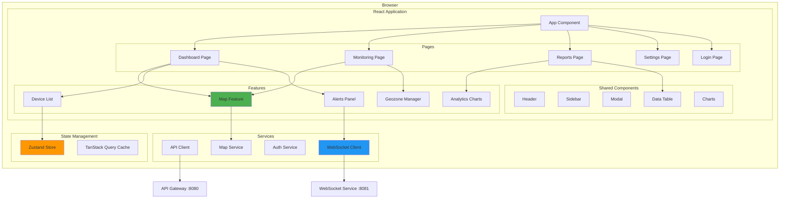
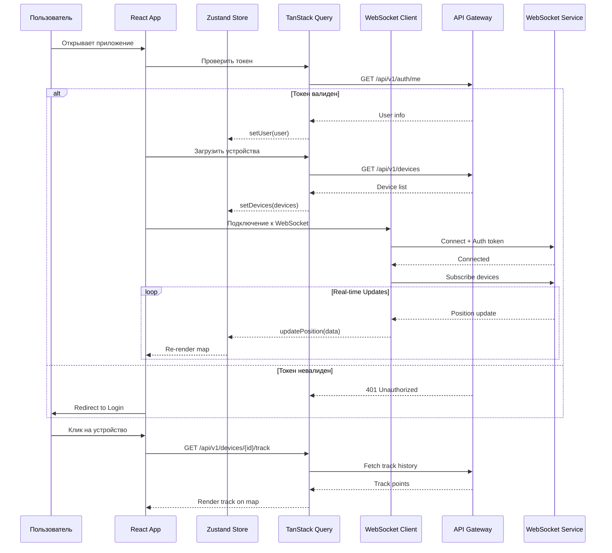
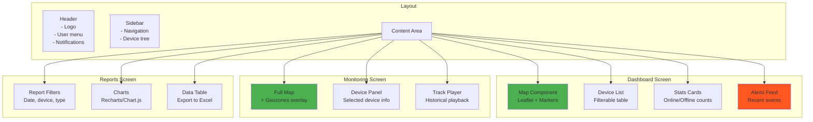
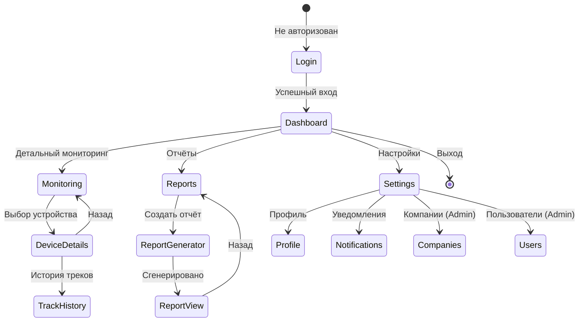

# Web Frontend - Блок 3: Представление

## Обзор

**Web Frontend** — веб-приложение для мониторинга транспорта в реальном времени. React + TypeScript + Leaflet.

**Приоритет:** MVP  
**Порт:** 3000 (dev), статика через nginx (prod)

---

## Архитектура приложения



---

## UML: Поток данных в приложении



---

## Структура проекта

```
frontend/
├── public/
│   ├── index.html
│   ├── favicon.ico
│   └── manifest.json
├── src/
│   ├── app/
│   │   ├── App.tsx
│   │   ├── Router.tsx
│   │   └── providers/
│   │       ├── AuthProvider.tsx
│   │       ├── QueryProvider.tsx
│   │       └── WebSocketProvider.tsx
│   ├── pages/
│   │   ├── Dashboard/
│   │   │   ├── Dashboard.tsx
│   │   │   ├── Dashboard.module.css
│   │   │   └── index.ts
│   │   ├── Monitoring/
│   │   ├── Reports/
│   │   ├── Settings/
│   │   └── Login/
│   ├── features/
│   │   ├── map/
│   │   │   ├── components/
│   │   │   │   ├── Map.tsx
│   │   │   │   ├── DeviceMarker.tsx
│   │   │   │   ├── GeozoneLayer.tsx
│   │   │   │   └── TrackLine.tsx
│   │   │   ├── hooks/
│   │   │   │   ├── useMap.ts
│   │   │   │   └── useGeozones.ts
│   │   │   └── index.ts
│   │   ├── devices/
│   │   │   ├── components/
│   │   │   │   ├── DeviceList.tsx
│   │   │   │   ├── DeviceCard.tsx
│   │   │   │   └── DeviceDetails.tsx
│   │   │   ├── hooks/
│   │   │   │   └── useDevices.ts
│   │   │   └── api/
│   │   │       └── devicesApi.ts
│   │   ├── alerts/
│   │   ├── analytics/
│   │   └── geozones/
│   ├── shared/
│   │   ├── components/
│   │   │   ├── Header/
│   │   │   ├── Sidebar/
│   │   │   ├── Modal/
│   │   │   ├── DataTable/
│   │   │   ├── Button/
│   │   │   └── Input/
│   │   ├── hooks/
│   │   │   ├── useAuth.ts
│   │   │   ├── useWebSocket.ts
│   │   │   └── useLocalStorage.ts
│   │   └── utils/
│   │       ├── api.ts
│   │       ├── formatters.ts
│   │       └── validators.ts
│   ├── store/
│   │   ├── index.ts
│   │   ├── authStore.ts
│   │   ├── devicesStore.ts
│   │   ├── mapStore.ts
│   │   └── alertsStore.ts
│   ├── services/
│   │   ├── apiClient.ts
│   │   ├── wsClient.ts
│   │   └── authService.ts
│   ├── types/
│   │   ├── api.ts
│   │   ├── device.ts
│   │   ├── geozone.ts
│   │   └── user.ts
│   └── styles/
│       ├── global.css
│       ├── variables.css
│       └── themes/
├── package.json
├── tsconfig.json
├── vite.config.ts
└── .env.example
```

---

## Компоненты и экраны

### Диаграмма компонентов



---

## State Management (Zustand)

```typescript
// store/devicesStore.ts
interface DevicePosition {
  deviceId: string;
  lat: number;
  lon: number;
  speed: number;
  course: number;
  timestamp: Date;
}

interface Device {
  id: string;
  imei: string;
  name: string;
  vehicleNumber: string;
  status: 'online' | 'offline' | 'alarm';
  lastPosition?: DevicePosition;
  companyId: string;
}

interface DevicesState {
  devices: Map<string, Device>;
  selectedDeviceId: string | null;
  filter: {
    search: string;
    status: string[];
    companyId: string | null;
  };
  
  // Действия
  setDevices: (devices: Device[]) => void;
  updatePosition: (position: DevicePosition) => void;
  selectDevice: (id: string | null) => void;
  setFilter: (filter: Partial<DevicesState['filter']>) => void;
}

// store/mapStore.ts
interface MapState {
  center: [number, number];
  zoom: number;
  visibleLayers: {
    devices: boolean;
    geozones: boolean;
    tracks: boolean;
    heatmap: boolean;
  };
  trackHistory: Map<string, DevicePosition[]>;
  
  // Действия
  setCenter: (lat: number, lon: number) => void;
  setZoom: (zoom: number) => void;
  toggleLayer: (layer: keyof MapState['visibleLayers']) => void;
  setTrackHistory: (deviceId: string, points: DevicePosition[]) => void;
}

// store/alertsStore.ts
interface Alert {
  id: string;
  type: 'geozone_enter' | 'geozone_exit' | 'speed' | 'connection' | 'sos';
  deviceId: string;
  deviceName: string;
  message: string;
  timestamp: Date;
  read: boolean;
}

interface AlertsState {
  alerts: Alert[];
  unreadCount: number;
  
  // Действия
  addAlert: (alert: Alert) => void;
  markAsRead: (id: string) => void;
  markAllAsRead: () => void;
  clearAlerts: () => void;
}
```

---

## API Client (TanStack Query)

```typescript
// services/apiClient.ts
import axios from 'axios';

const apiClient = axios.create({
  baseURL: import.meta.env.VITE_API_URL || 'http://localhost:8080/api/v1',
  timeout: 10000,
});

// Интерцептор для добавления токена
apiClient.interceptors.request.use((config) => {
  const token = localStorage.getItem('accessToken');
  if (token) {
    config.headers.Authorization = `Bearer ${token}`;
  }
  return config;
});

// Интерцептор для обновления токена
apiClient.interceptors.response.use(
  (response) => response,
  async (error) => {
    if (error.response?.status === 401) {
      const refreshToken = localStorage.getItem('refreshToken');
      if (refreshToken) {
        try {
          const { data } = await axios.post('/auth/refresh', { refreshToken });
          localStorage.setItem('accessToken', data.accessToken);
          error.config.headers.Authorization = `Bearer ${data.accessToken}`;
          return apiClient(error.config);
        } catch {
          // Redirect to login
          window.location.href = '/login';
        }
      }
    }
    return Promise.reject(error);
  }
);

// features/devices/api/devicesApi.ts
export const devicesApi = {
  getAll: () => apiClient.get<Device[]>('/devices'),
  getById: (id: string) => apiClient.get<Device>(`/devices/${id}`),
  getTrack: (id: string, from: Date, to: Date) => 
    apiClient.get<DevicePosition[]>(`/devices/${id}/track`, {
      params: { from: from.toISOString(), to: to.toISOString() }
    }),
};

// features/devices/hooks/useDevices.ts
import { useQuery, useMutation, useQueryClient } from '@tanstack/react-query';

export const useDevices = () => {
  return useQuery({
    queryKey: ['devices'],
    queryFn: () => devicesApi.getAll().then(r => r.data),
    staleTime: 30000, // 30 секунд
    refetchInterval: 60000, // Обновлять каждую минуту
  });
};

export const useDeviceTrack = (deviceId: string, from: Date, to: Date) => {
  return useQuery({
    queryKey: ['deviceTrack', deviceId, from, to],
    queryFn: () => devicesApi.getTrack(deviceId, from, to).then(r => r.data),
    enabled: !!deviceId,
  });
};
```

---

## WebSocket Client

```typescript
// services/wsClient.ts
interface WebSocketMessage {
  type: 'position' | 'alert' | 'device_status' | 'ping';
  payload: unknown;
}

class WebSocketClient {
  private ws: WebSocket | null = null;
  private reconnectAttempts = 0;
  private maxReconnectAttempts = 5;
  private reconnectDelay = 1000;
  private listeners: Map<string, Set<(data: unknown) => void>> = new Map();
  
  connect(token: string): Promise<void> {
    return new Promise((resolve, reject) => {
      const url = `${import.meta.env.VITE_WS_URL}?token=${token}`;
      this.ws = new WebSocket(url);
      
      this.ws.onopen = () => {
        console.log('WebSocket connected');
        this.reconnectAttempts = 0;
        resolve();
      };
      
      this.ws.onmessage = (event) => {
        const message: WebSocketMessage = JSON.parse(event.data);
        this.notifyListeners(message.type, message.payload);
      };
      
      this.ws.onclose = () => {
        console.log('WebSocket disconnected');
        this.attemptReconnect(token);
      };
      
      this.ws.onerror = (error) => {
        console.error('WebSocket error:', error);
        reject(error);
      };
    });
  }
  
  subscribe(deviceIds: string[]): void {
    this.send({
      type: 'subscribe',
      payload: { deviceIds }
    });
  }
  
  on(event: string, callback: (data: unknown) => void): () => void {
    if (!this.listeners.has(event)) {
      this.listeners.set(event, new Set());
    }
    this.listeners.get(event)!.add(callback);
    
    // Возвращаем функцию отписки
    return () => {
      this.listeners.get(event)?.delete(callback);
    };
  }
  
  private send(message: object): void {
    if (this.ws?.readyState === WebSocket.OPEN) {
      this.ws.send(JSON.stringify(message));
    }
  }
  
  private notifyListeners(event: string, data: unknown): void {
    this.listeners.get(event)?.forEach(callback => callback(data));
  }
  
  private attemptReconnect(token: string): void {
    if (this.reconnectAttempts < this.maxReconnectAttempts) {
      this.reconnectAttempts++;
      const delay = this.reconnectDelay * Math.pow(2, this.reconnectAttempts - 1);
      setTimeout(() => this.connect(token), delay);
    }
  }
  
  disconnect(): void {
    this.ws?.close();
    this.ws = null;
  }
}

export const wsClient = new WebSocketClient();

// shared/hooks/useWebSocket.ts
import { useEffect } from 'react';
import { useDevicesStore } from '@/store/devicesStore';
import { useAlertsStore } from '@/store/alertsStore';

export const useWebSocket = () => {
  const updatePosition = useDevicesStore(s => s.updatePosition);
  const addAlert = useAlertsStore(s => s.addAlert);
  
  useEffect(() => {
    const unsubPosition = wsClient.on('position', (data) => {
      updatePosition(data as DevicePosition);
    });
    
    const unsubAlert = wsClient.on('alert', (data) => {
      addAlert(data as Alert);
    });
    
    return () => {
      unsubPosition();
      unsubAlert();
    };
  }, [updatePosition, addAlert]);
};
```

---

## Map Component (Leaflet)

```typescript
// features/map/components/Map.tsx
import { useEffect, useRef } from 'react';
import L from 'leaflet';
import 'leaflet/dist/leaflet.css';
import { useDevicesStore } from '@/store/devicesStore';
import { useMapStore } from '@/store/mapStore';

export const Map: React.FC = () => {
  const mapRef = useRef<L.Map | null>(null);
  const markersRef = useRef<Map<string, L.Marker>>(new Map());
  
  const devices = useDevicesStore(s => s.devices);
  const selectedDeviceId = useDevicesStore(s => s.selectedDeviceId);
  const { center, zoom, visibleLayers } = useMapStore();
  
  // Инициализация карты
  useEffect(() => {
    if (!mapRef.current) {
      mapRef.current = L.map('map', {
        center: center,
        zoom: zoom,
        zoomControl: true,
      });
      
      // OSM тайлы
      L.tileLayer('https://{s}.tile.openstreetmap.org/{z}/{x}/{y}.png', {
        attribution: '© OpenStreetMap contributors'
      }).addTo(mapRef.current);
    }
    
    return () => {
      mapRef.current?.remove();
      mapRef.current = null;
    };
  }, []);
  
  // Обновление маркеров устройств
  useEffect(() => {
    if (!mapRef.current || !visibleLayers.devices) return;
    
    devices.forEach((device, deviceId) => {
      const pos = device.lastPosition;
      if (!pos) return;
      
      const existingMarker = markersRef.current.get(deviceId);
      
      if (existingMarker) {
        // Обновляем позицию с анимацией
        existingMarker.setLatLng([pos.lat, pos.lon]);
        (existingMarker as any).setRotationAngle(pos.course);
      } else {
        // Создаём новый маркер
        const marker = L.marker([pos.lat, pos.lon], {
          icon: createDeviceIcon(device.status),
          rotationAngle: pos.course,
        });
        
        marker.bindPopup(createPopupContent(device));
        marker.on('click', () => {
          useDevicesStore.getState().selectDevice(deviceId);
        });
        
        marker.addTo(mapRef.current!);
        markersRef.current.set(deviceId, marker);
      }
    });
  }, [devices, visibleLayers.devices]);
  
  // Центрирование на выбранном устройстве
  useEffect(() => {
    if (selectedDeviceId && mapRef.current) {
      const device = devices.get(selectedDeviceId);
      if (device?.lastPosition) {
        mapRef.current.setView(
          [device.lastPosition.lat, device.lastPosition.lon],
          16,
          { animate: true }
        );
      }
    }
  }, [selectedDeviceId, devices]);
  
  return <div id="map" className="w-full h-full" />;
};

// Хелпер для создания иконки устройства
const createDeviceIcon = (status: Device['status']) => {
  const colors = {
    online: '#4CAF50',
    offline: '#9E9E9E',
    alarm: '#F44336',
  };
  
  return L.divIcon({
    className: 'device-marker',
    html: `
      <div style="
        width: 32px;
        height: 32px;
        background: ${colors[status]};
        border-radius: 50% 50% 50% 0;
        transform: rotate(-45deg);
        border: 2px solid white;
        box-shadow: 0 2px 5px rgba(0,0,0,0.3);
      "></div>
    `,
  });
};
```

---

## Диаграмма навигации



---

## Технологический стек

| Категория | Технология | Версия | Назначение |
|-----------|------------|--------|------------|
| Framework | React | 18.x | UI библиотека |
| Language | TypeScript | 5.x | Типизация |
| Build | Vite | 5.x | Сборка и dev server |
| Routing | React Router | 6.x | SPA навигация |
| State | Zustand | 4.x | Глобальное состояние |
| Data Fetching | TanStack Query | 5.x | Серверное состояние |
| HTTP | Axios | 1.x | HTTP клиент |
| Maps | Leaflet | 1.9.x | Карты |
| Charts | Recharts | 2.x | Графики |
| UI Kit | Shadcn/ui | latest | UI компоненты |
| Styling | Tailwind CSS | 3.x | Стили |
| Forms | React Hook Form | 7.x | Формы |
| Validation | Zod | 3.x | Валидация схем |
| Icons | Lucide React | latest | Иконки |
| Date | date-fns | 3.x | Работа с датами |
| Export | xlsx | latest | Экспорт в Excel |

---

## Environment Variables

```bash
# .env.example
VITE_API_URL=http://localhost:8080/api/v1
VITE_WS_URL=ws://localhost:8081/ws
VITE_MAP_DEFAULT_CENTER=55.7558,37.6173
VITE_MAP_DEFAULT_ZOOM=10
VITE_SENTRY_DSN=
VITE_ENABLE_ANALYTICS=false
```

---

## Build & Deploy

```bash
# Разработка
npm install
npm run dev

# Сборка
npm run build
npm run preview

# Линтинг
npm run lint
npm run type-check

# Тесты
npm run test
npm run test:coverage
```

### Docker

```dockerfile
# Dockerfile
FROM node:20-alpine AS builder
WORKDIR /app
COPY package*.json ./
RUN npm ci
COPY . .
RUN npm run build

FROM nginx:alpine
COPY --from=builder /app/dist /usr/share/nginx/html
COPY nginx.conf /etc/nginx/nginx.conf
EXPOSE 80
CMD ["nginx", "-g", "daemon off;"]
```

---

## Метрики и мониторинг

- **Sentry** — отслеживание ошибок
- **Web Vitals** — LCP, FID, CLS
- **Analytics** — пользовательские действия

---

## Связь с другими сервисами

| Сервис | Протокол | Назначение |
|--------|----------|------------|
| API Gateway | REST/HTTP | Все API запросы |
| WebSocket Service | WebSocket | Real-time позиции и алерты |
| Auth Service | через API GW | Аутентификация |

---

## Промпт для ИИ-агента

### Задача: Реализация Web Frontend для TrackerGPS

**Контекст проекта:**
Ты создаёшь веб-приложение для системы мониторинга транспорта TrackerGPS. Приложение отображает позиции устройств на карте в реальном времени, управляет геозонами, показывает уведомления и генерирует отчёты.

**Технологический стек:**
- React 18 + TypeScript 5
- Vite 5 (сборщик)
- Zustand (состояние)
- TanStack Query v5 (серверные данные)
- React Router v6 (навигация)
- Leaflet 1.9 (карты)
- Tailwind CSS + Shadcn/ui (стили)
- Axios (HTTP клиент)
- Zod (валидация)

**Архитектура приложения:**

```
src/
├── app/              # Точка входа, провайдеры
├── pages/            # Страницы (роуты)
├── features/         # Фичи (map, devices, alerts, etc.)
│   └── feature/
│       ├── components/
│       ├── hooks/
│       └── api/
├── shared/           # Переиспользуемые компоненты и утилиты
├── store/            # Zustand stores
├── services/         # API client, WebSocket client
└── types/            # TypeScript типы
```

**Основные TypeScript типы:**

```typescript
// types/device.ts
interface DevicePosition {
  deviceId: string;
  lat: number;
  lon: number;
  speed: number;
  course: number;
  timestamp: Date;
  altitude?: number;
  satellites?: number;
}

interface Device {
  id: string;
  imei: string;
  name: string;
  vehicleNumber: string;
  status: 'online' | 'offline' | 'alarm';
  lastPosition?: DevicePosition;
  companyId: string;
  createdAt: Date;
}

// types/geozone.ts
interface Geozone {
  id: string;
  name: string;
  type: 'polygon' | 'circle';
  geometry: GeoJSON.Geometry;
  color: string;
  companyId: string;
}

// types/alert.ts
interface Alert {
  id: string;
  type: 'geozone_enter' | 'geozone_exit' | 'speed' | 'connection_lost' | 'sos';
  deviceId: string;
  deviceName: string;
  message: string;
  timestamp: Date;
  read: boolean;
  metadata?: Record<string, unknown>;
}

// types/user.ts
interface User {
  id: string;
  email: string;
  name: string;
  role: 'admin' | 'manager' | 'operator' | 'viewer';
  companyId: string;
  permissions: string[];
}
```

**Zustand Store (пример):**

```typescript
// store/devicesStore.ts
import { create } from 'zustand';
import { immer } from 'zustand/middleware/immer';

interface DevicesState {
  devices: Map<string, Device>;
  selectedDeviceId: string | null;
  filter: { search: string; status: string[] };
  
  setDevices: (devices: Device[]) => void;
  updatePosition: (position: DevicePosition) => void;
  selectDevice: (id: string | null) => void;
}

export const useDevicesStore = create<DevicesState>()(
  immer((set) => ({
    devices: new Map(),
    selectedDeviceId: null,
    filter: { search: '', status: [] },
    
    setDevices: (devices) => set((state) => {
      state.devices = new Map(devices.map(d => [d.id, d]));
    }),
    
    updatePosition: (position) => set((state) => {
      const device = state.devices.get(position.deviceId);
      if (device) {
        device.lastPosition = position;
        device.status = 'online';
      }
    }),
    
    selectDevice: (id) => set((state) => {
      state.selectedDeviceId = id;
    }),
  }))
);
```

**TanStack Query hooks:**

```typescript
// features/devices/hooks/useDevices.ts
import { useQuery } from '@tanstack/react-query';
import { apiClient } from '@/services/apiClient';

export const useDevices = () => {
  return useQuery({
    queryKey: ['devices'],
    queryFn: async () => {
      const { data } = await apiClient.get<Device[]>('/devices');
      return data;
    },
    staleTime: 30_000,
  });
};

export const useDeviceTrack = (deviceId: string, from: Date, to: Date) => {
  return useQuery({
    queryKey: ['deviceTrack', deviceId, from.toISOString(), to.toISOString()],
    queryFn: async () => {
      const { data } = await apiClient.get<DevicePosition[]>(
        `/devices/${deviceId}/track`,
        { params: { from: from.toISOString(), to: to.toISOString() } }
      );
      return data;
    },
    enabled: !!deviceId,
  });
};
```

**WebSocket integration:**

```typescript
// services/wsClient.ts
class WebSocketClient {
  private ws: WebSocket | null = null;
  private listeners = new Map<string, Set<(data: unknown) => void>>();
  
  connect(token: string): void {
    this.ws = new WebSocket(`${import.meta.env.VITE_WS_URL}?token=${token}`);
    this.ws.onmessage = (event) => {
      const { type, payload } = JSON.parse(event.data);
      this.listeners.get(type)?.forEach(cb => cb(payload));
    };
  }
  
  subscribe(deviceIds: string[]): void {
    this.ws?.send(JSON.stringify({ type: 'subscribe', payload: { deviceIds } }));
  }
  
  on(event: string, callback: (data: unknown) => void): () => void {
    if (!this.listeners.has(event)) {
      this.listeners.set(event, new Set());
    }
    this.listeners.get(event)!.add(callback);
    return () => this.listeners.get(event)?.delete(callback);
  }
}

export const wsClient = new WebSocketClient();

// shared/hooks/useWebSocket.ts
import { useEffect } from 'react';
import { wsClient } from '@/services/wsClient';
import { useDevicesStore } from '@/store/devicesStore';

export const useWebSocket = () => {
  const updatePosition = useDevicesStore(s => s.updatePosition);
  
  useEffect(() => {
    return wsClient.on('position', (data) => {
      updatePosition(data as DevicePosition);
    });
  }, [updatePosition]);
};
```

**Map Component с Leaflet:**

```typescript
// features/map/components/Map.tsx
import { useEffect, useRef } from 'react';
import L from 'leaflet';
import { useDevicesStore } from '@/store/devicesStore';

export const Map: React.FC = () => {
  const mapRef = useRef<L.Map | null>(null);
  const devices = useDevicesStore(s => s.devices);
  
  useEffect(() => {
    if (!mapRef.current) {
      mapRef.current = L.map('map').setView([55.75, 37.62], 10);
      L.tileLayer('https://{s}.tile.openstreetmap.org/{z}/{x}/{y}.png').addTo(mapRef.current);
    }
  }, []);
  
  useEffect(() => {
    // Обновление маркеров при изменении позиций
    devices.forEach((device) => {
      if (device.lastPosition) {
        // Создать или обновить маркер
      }
    });
  }, [devices]);
  
  return <div id="map" className="w-full h-full" />;
};
```

**Задачи для реализации:**

1. **Настройка проекта:**
   - Создать Vite проект с React + TypeScript
   - Настроить Tailwind CSS и Shadcn/ui
   - Настроить пути импорта (alias @/)
   - Настроить ESLint и Prettier

2. **Аутентификация:**
   - Страница логина с формой
   - Хранение токенов в localStorage
   - Protected routes
   - Auto-refresh токена

3. **Dashboard:**
   - Карта с маркерами устройств
   - Список устройств с поиском и фильтрацией
   - Панель статистики (онлайн/оффлайн)
   - Лента последних алертов

4. **Мониторинг:**
   - Полноэкранная карта
   - Слой геозон
   - Детали выбранного устройства
   - Просмотр истории треков

5. **Отчёты:**
   - Фильтры (период, устройства, тип)
   - Графики (пробег, скорость, топливо)
   - Таблица с экспортом в Excel

6. **Real-time:**
   - WebSocket подключение
   - Обновление позиций на карте
   - Push уведомления
   - Индикатор соединения

**Критерии приёмки:**

- [ ] Приложение корректно работает в современных браузерах
- [ ] Responsive дизайн для desktop и tablet
- [ ] Карта обновляется в реальном времени без перезагрузки
- [ ] Формы валидируются с понятными сообщениями об ошибках
- [ ] Graceful degradation при потере соединения
- [ ] Загрузка < 3с на первичном открытии (LCP)
- [ ] TypeScript strict mode без ошибок
- [ ] ESLint без warnings
- [ ] Unit тесты для критичных компонентов
- [ ] Документация компонентов в Storybook (опционально)

**Важно:**
- Комментарии в коде на русском языке
- Использовать функциональные компоненты с hooks
- Разделять логику и представление
- Использовать Error Boundaries для обработки ошибок
- Мемоизировать тяжёлые вычисления (useMemo, useCallback)
- Lazy loading для страниц и тяжёлых компонентов

---

*Документ создан для проекта TrackerGPS MVP*
